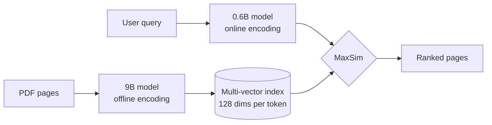

> 🌏 [中文版](/posts/ai/2026-10-09-pplx-embed-v2-late-multimodal-late-interaction)

If your knowledge base is full of PDFs with tables and charts, there is now another self-hostable option: skip OCR and index each page as an image. On October 7, 2026, Perplexity released [`pplx-embed-v2-late`](https://www.perplexity.ai/hub/blog/multimodal-embeddings-beyond-a-single-vector), two models (0.6B and 9B) on Hugging Face under the MIT license. This post answers two questions: what actually changed, and whether it justifies reworking your RAG pipeline.

Short answer: **worth running an evaluation on your own documents, not worth a rewrite yet.** The reasons follow.

## What it is

`pplx-embed-v2-late` is a ColBERT-style (late-interaction) retriever built on Qwen3.5 with bidirectional attention. The [model card](https://huggingface.co/perplexity-ai/pplx-embed-v2-late-0.6b) says each token gets a 128-dimensional vector and query–document similarity is computed with MaxSim.

How that differs from the usual options:

- **Single-vector models** squeeze a whole page into one vector and compare with an inner product. Fast and compact, but detail gets lost as documents grow longer and cover more topics.
- **Cross-encoders** read query and document together. Most accurate, but one forward pass per candidate, so they are used to rerank a short list.
- **Late interaction** encodes documents offline and keeps a vector per token. At query time each query token finds its best-matching document token and the maxima are summed. Perplexity's blog places it between cheap dense models and expressive cross-encoders.

Documents can be text or page images. Per the blog, the models can "directly search rendered PDF pages without requiring OCR or parsed text." If you read our [ColPali walkthrough](/en/posts/ai/2026-09-03-colpali-visual-document-retrieval-en), this is the same line of work; the difference is that text and images share one model, and two sizes interoperate.



## Key design: two sizes, one embedding space

This is the most interesting part of the release. Perplexity trains an 18B teacher contrastively, then distills it separately into a 9B and a 0.6B student using LEAF-style representation distillation: for each input token, the student's output vector is aligned to the teacher's. Both students therefore live in the same space, so **you can build the index with the 9B and encode queries with the 0.6B**.

Why it matters: indexing is a one-time cost, while query encoding sits on the latency-critical path of every request. The four deployment modes Perplexity lists:

| Setup | How | Fits |
|---|---|---|
| Max quality | 9B for index and queries | Low query volume, GPU available |
| Max efficiency | 0.6B for both | Fully local inference |
| Low latency | 9B index, 0.6B queries | Cloud index, live service |
| Local + cloud | 0.6B on-device, merged with a cloud 9B index | Private documents stay local |

Read the conditions on the numbers. With 0.6B queries over a 9B index, the 72 domain text tasks average 1.6 points higher than 0.6B on both sides, and ViDoRe v3 image retrieval reaches 63.5% versus 62.3%. Perplexity's own reading is that the asymmetric setup recovers "roughly half of the quality difference" between the two models on text, at the same query cost. It does not match the 9B; it gets you about half the gap.

The 0.6B is cheap because the base Qwen3.5-0.8B text tower was pruned from 24 to 12 layers. Total parameters are 594M, but 254M sit in the token-embedding table (little effect on runtime), so the effective compute is about 240M for text and 340M for images. The post's "340M active parameters" holds for image inputs only; text queries are about 240M.

## Benchmarks: the conditions behind 92.4%

The headline number is MADQA 92.4%. Perplexity's setup: 800 real-world PDFs, over 18,000 pages, 500 human-written questions that cannot be answered from general knowledge. An agent (Gemini 3.5 Flash) searches with the retriever under test and is scored on answer accuracy and page-level F1.

What to keep in mind:

- It measures retriever-plus-agent answer accuracy, not retrieval recall alone.
- The 9B is 3.5 points above the same agent with Mixedbread's retriever (88.9%) but below Mixedbread Agentic Search (93.4%). Perplexity says the gap is within its confidence interval and notes the latter uses a sub-agent that plans and runs several searches, so it is a different kind of system.
- The 0.6B scores 90.1% on the same test.
- Every figure is self-reported; the technical report is due "later this year" and there is no third-party replication yet.

Other results, with conditions:

| Item | 0.6B | 9B | Condition |
|---|---|---|---|
| ViDoRe v3 image (nDCG@10) | 62.3% | 65.2% | 9B trails only Tencent's EVIE |
| ViDoRe v3 Markdown (nDCG@10) | 61.2% | 64.7% | Pages OCR'd to Markdown first |
| Domain text retrieval (72 tasks) | 78.0% | 81.3% | 9B leads next best by 1.6 pts |
| Q2D-Web (Recall@1000) | 73.6% | 74.8% | Previous best 69.3%; 190M web docs |
| BrowseComp+ (accuracy) | — | 64.0% | 4.9 pts above next ColBERT model |

## Checking the original post's claims

| Claim | Result |
|---|---|
| MIT license | ✅ Both models |
| 128 dims per token, MaxSim | ✅ Model card wording |
| MADQA 92.4% | ✅ but 9B + Gemini 3.5 Flash agent, self-run, and not first place (Mixedbread Agentic Search 93.4%) |
| 9B index + 0.6B queries | ✅ Officially listed deployment |
| 340M active parameters | ⚠️ Image inputs only; text is about 240M |
| "Proper nouns no longer missed" | ❌ Not claimed by the source; the post's own inference |
| No text-extraction pipeline | ⚠️ True for page images, but you still need rendering, vector storage and MaxSim search |

## Limits: three costs to price before a rewrite

**1. Storage.** Perplexity states it plainly: cost grows with document length. One vector per token means the index scales with content. A rough estimate of mine, not an official figure: assume about 1,000 vectors per page (ColPali uses 1,030 patches per page; Perplexity does not publish this model's count), fp16 at 2 bytes per dimension, so about 250 KB per page and roughly 25 GB for 100,000 pages before index overhead. A single-vector model needs one vector per page. The 128-dim width is a real advantage over other multi-vector models (the blog compares against 4,096 dims for EVIE-8B and Nemotron ColEmbed V2), but it does not remove the problem.

**2. Not the best at image retrieval.** It trails EVIE on ViDoRe v3 image; the 9B trails `gemini-embedding-2` on MIRACL-Vision and by about 2 points on Perplexity's own PPLX-Q2I. If your corpus is natural images rather than page renders, evaluate separately.

**3. Other constraints.** A single input cannot mix text and images; the hosted API is only "progressively" rolling out; you need `sentence-transformers >= 6.0.0` and `transformers >= 5.4.0`; the model card example uses CUDA.

## When to try it, when to wait

Worth trying if:

- Your documents are scans, slides, or PDFs with dense tables and charts, and OCR errors are the main bottleneck.
- Agents query the same collection repeatedly, so shifting compute to offline indexing pays off.
- Documents must stay on-device and you want a 0.6B local query encoder.

Wait if:

- The corpus is clean text and single-vector plus BM25 already works; multi-vector adds storage and operations cost.
- Storage is tight, or your vector database lacks multi-vector and MaxSim support.

Recommended approach, following our [RAG evaluation notes](/en/posts/ai/2026-03-12-rag-evaluation-frameworks-en): leave the current pipeline alone, run it side by side with this model on 200 real pages and 50 real questions, measure recall and latency, then decide. What you can do tonight:

```bash
pip install 'sentence-transformers>=6.0.0' 'transformers>=5.4.0'
```

```python
from PIL import Image
from sentence_transformers import MultiVectorEncoder

model = MultiVectorEncoder("perplexity-ai/pplx-embed-v2-late-0.6b", device="cuda")
queries = model.encode_query(["what statute governs limitations?"])
pages = model.encode_document([Image.open("page.png").convert("RGB")])
scores = model.similarity(queries, pages)  # MaxSim
```

Usage follows the [model card](https://huggingface.co/perplexity-ai/pplx-embed-v2-late-0.6b). Encode text and images in separate `encode_document` calls; mixed batches are unsupported.

## Bottom line

The real novelty is not another ColPali-style model. It is the "9B builds the index, 0.6B answers queries" split of indexing and query cost, plus 128-dim vectors that keep storage more manageable than other multi-vector models. Discount the 92.4%: it is a self-run test with a specific agent, and it does not beat the Agentic Search system in the same table. Until the technical report and third-party replications arrive, treat this as a candidate worth evaluating, not a proven upgrade.

## References

- [Multimodal embeddings beyond a single vector — Perplexity blog](https://www.perplexity.ai/hub/blog/multimodal-embeddings-beyond-a-single-vector)
- [perplexity-ai/pplx-embed-v2-late-0.6b — Hugging Face](https://huggingface.co/perplexity-ai/pplx-embed-v2-late-0.6b)
- [perplexity-ai/pplx-embed-v2-late-9b — Hugging Face](https://huggingface.co/perplexity-ai/pplx-embed-v2-late-9b)
- [Perplexity AI Releases pplx-embed-v2-late — MarkTechPost (2026-10-08, secondary)](https://www.marktechpost.com/2026/10/07/perplexity-ai-releases-pplx-embed-v2-late-a-0-6b-edge-model-and-a-9b-model-scoring-92-4-on-madqa)
- [LEAF distillation paper — arXiv:2509.12539](https://arxiv.org/abs/2509.12539)
- [BrowseComp+ — arXiv:2508.06600](https://arxiv.org/abs/2508.06600)
- [ViDoRe V3 — arXiv:2601.08620](https://arxiv.org/abs/2601.08620)
- [ColPali: skip OCR, retrieve documents as images — on this site](/en/posts/ai/2026-09-03-colpali-visual-document-retrieval-en)
- [ColBERT late interaction — on this site](/en/posts/ai/2026-03-12-colbert-late-interaction-en)
