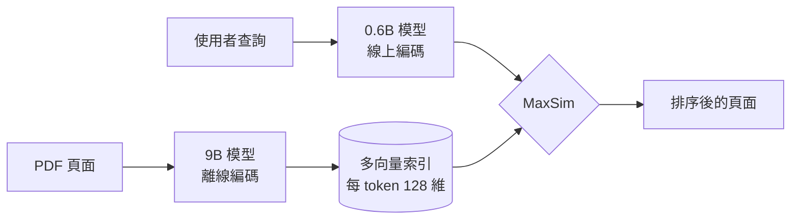

> 🌏 [English version](/en/posts/ai/2026-10-09-pplx-embed-v2-late-multimodal-late-interaction-en)

如果你的知識庫有一堆帶表格和圖表的 PDF，現在多了一個可以自己架的選項：不跑 OCR，直接把整頁當圖片建索引。Perplexity 在 2026 年 10 月 7 日發表 [`pplx-embed-v2-late`](https://www.perplexity.ai/hub/blog/multimodal-embeddings-beyond-a-single-vector)，兩個模型（0.6B、9B）權重都放在 Hugging Face，授權是 MIT。這篇回答兩個問題：它到底改了什麼、值不值得為它動現有的 RAG 管線。

先講結論：**值得拿你自己的文件跑一次評測，不值得直接重構。** 理由在後面，先看它是什麼。

## 它是什麼

`pplx-embed-v2-late` 是 ColBERT 式（late interaction）的檢索模型，基底是 Qwen3.5，用雙向注意力。[模型卡](https://huggingface.co/perplexity-ai/pplx-embed-v2-late-0.6b)寫得很明白：每個 token 輸出一個 128 維向量，查詢與文件的相似度用 MaxSim 計算。

跟一般嵌入模型的差別：

- **單向量模型**：整頁壓成一個向量，用內積比對，快、省空間，但文件越長、主題越多，越容易丟細節。
- **cross-encoder**：查詢與文件一起過模型，最準，但每個候選都要跑一次，只能拿來重排少量結果。
- **late interaction**：文件離線編碼、每個 token 留一個向量；查詢時每個查詢 token 去找最相似的文件 token，再把這些最大值加總。官方部落格的描述是「介於便宜的 dense 模型與表現力更強的 cross-encoder 之間」。

它的文件輸入可以是文字，也可以是頁面圖片。官方說明新模型能「直接搜尋渲染後的 PDF 頁面，不需要 OCR 或解析後的文字」。如果你讀過站上的 [ColPali 導讀](/posts/ai/2026-09-03-colpali-visual-document-retrieval)，這是同一條路線，差別在於 Perplexity 把文字與圖片放進同一個模型，還做了兩種尺寸互通。



## 關鍵設計：兩個尺寸共用同一個向量空間

這是整個發表裡最值得看的設計。Perplexity 的做法是先用對比學習訓練一個 18B 的 teacher，再分別蒸餾成 9B 與 0.6B。蒸餾用的是 LEAF 式的表徵蒸餾：對每個輸入 token，讓學生的輸出向量去對齊 teacher 的向量。結果是兩個模型的向量落在同一個空間，**用 9B 建索引、用 0.6B 編碼查詢是可行的**。

為什麼這有用？索引是一次性成本，查詢卻在每次請求的關鍵路徑上。官方列出的四種部署方式：

| 配置 | 做法 | 適合 |
|---|---|---|
| 最高品質 | 建索引與查詢都用 9B | 查詢量小、有 GPU |
| 最高效率 | 兩邊都用 0.6B | 全本機推論 |
| 低延遲 | 9B 建索引、0.6B 查詢 | 雲端索引、線上服務 |
| 本機＋雲端 | 本機文件用 0.6B，與雲端 9B 索引合併結果 | 私有文件不出機器 |

跑分條件要看清楚。官方實驗中，0.6B 查詢搭配 9B 索引，在 72 個領域文字任務上平均比兩邊都用 0.6B 高 1.6 個百分點，在 ViDoRe v3 圖片檢索上是 63.5%，對比 62.3%。官方的解讀是這個配置「追回了兩個模型在文字上品質差距的大約一半」，查詢成本不變。換句話說，不是追平 9B，而是拿到一半的好處。

0.6B 之所以便宜，是因為把基底 Qwen3.5-0.8B 的 24 層文字塔剪到 12 層。部落格說明總參數 594M，但其中 254M 在 token 嵌入表（對執行速度影響很小），所以實際運算量約 240M（文字）與 340M（圖片）。貼文寫的「340M 激活參數」只對圖片輸入成立，純文字查詢是約 240M。

## 跑分：92.4% 是在什麼條件下量的

貼文最醒目的數字是 MADQA 92.4%。官方部落格的測試設定是：800 份真實 PDF、超過 18,000 頁、500 題人工撰寫且無法靠常識回答的問題；由一個 agent（Gemini 3.5 Flash）用待測的檢索器去搜，評分看答案準確率與頁面層級的 F1。

幾個讀這個數字時不能漏掉的條件：

- 它量的是「檢索器＋agent 的整體答題準確率」，不是檢索本身的召回率。
- 9B 比同一個 agent 搭配 Mixedbread 檢索器（88.9%）高 3.5 個百分點，但低於 Mixedbread Agentic Search（93.4%）。官方的說法是兩者差距在信賴區間內，因為後者用了會規劃並連續執行多次搜尋的子 agent，兩者不是同一種東西。
- 0.6B 在同一個測試是 90.1%。
- 所有數字都是 Perplexity 自己公布的，技術報告「預計今年稍後發表」，目前沒有第三方復現。

其他數字，同樣標註條件：

| 項目 | 0.6B | 9B | 條件 |
|---|---|---|---|
| ViDoRe v3 圖片（nDCG@10） | 62.3% | 65.2% | 9B 僅次於騰訊 EVIE |
| ViDoRe v3 Markdown（nDCG@10） | 61.2% | 64.7% | 先 OCR 轉 Markdown 再檢索 |
| 領域文字檢索（72 任務） | 78.0% | 81.3% | 9B 領先次佳 1.6 個百分點 |
| Q2D-Web（Recall@1000） | 73.6% | 74.8% | 前一名 69.3%，語料 1.9 億份網頁 |
| BrowseComp+（準確率） | — | 64.0% | 比次佳 ColBERT 模型高 4.9 個百分點 |

## 對原貼文說法的查證

| 貼文說法 | 查證結果 |
|---|---|
| MIT 協議開源 | ✅ 兩個模型皆為 MIT |
| 每 token 128 維、MaxSim | ✅ 模型卡原文 |
| MADQA 92.4% | ✅ 但是 9B＋Gemini 3.5 Flash agent 的自家測試，且不是榜首（Mixedbread Agentic Search 93.4%） |
| 9B 建庫＋0.6B 查詢 | ✅ 官方明列的部署方式 |
| 340M 激活參數 | ⚠️ 僅圖片輸入；文字約 240M |
| 專有名詞不再漏檢 | ❌ 來源沒有這個主張，這是貼文自己的推論 |
| 不用寫文字提取管線 | ⚠️ 對頁面圖片成立，但仍要有渲染、向量儲存與 MaxSim 檢索的基礎建設 |

## 限制：重構前先算這三筆帳

**1. 儲存。** 官方明說這是代價：「成本隨文件長度成長」。每個 token 一個向量，索引大小跟頁面內容量成正比。以下是我自己的粗估，不是官方數字：假設每頁約 1,000 個向量（ColPali 每頁是 1,030 個 patch，本模型每頁數量官方沒公布）、每個維度用 fp16 存 2 位元組，每頁約 250 KB，10 萬頁約 25 GB，還不含索引結構。相比之下，單向量模型每頁只要一個向量。128 維是它相對於其他多向量模型的優勢（官方對照：EVIE-8B 與 Nemotron ColEmbed V2 是 4,096 維），但沒有把問題消掉。

**2. 圖片檢索不是最強。** 它在 ViDoRe v3 圖片上輸給 EVIE；在 MIRACL-Vision 上 9B 輸給 `gemini-embedding-2`，在自家的 PPLX-Q2I 上也落後約 2 個百分點。如果你的文件不是頁面渲染而是自然圖片，要另外評估。

**3. 其他限制。** 單次輸入不能混合文字與圖片；目前只能自架，Perplexity API 上線時間官方只說「陸續推出」；需要 `sentence-transformers >= 6.0.0` 與 `transformers >= 5.4.0`；模型卡的範例寫的是 CUDA。

## 什麼情況該動，什麼情況不該

適合試的情境：

- 文件是掃描檔、簡報、含複雜表格或圖表的 PDF，現有 OCR 管線的錯誤率已經是主要瓶頸。
- 你有 agent 反覆查詢同一批文件，查詢量大，值得把運算挪到離線建索引。
- 文件需要留在本機，想用 0.6B 做本機查詢。

不用急的情境：

- 語料幾乎都是乾淨的純文字，單向量加 BM25 已經夠用，換成多向量只會增加儲存與維運。
- 儲存預算有限，或你的向量資料庫不支援多向量與 MaxSim。

建議的做法是比照站上 [RAG 評估](/posts/ai/2026-03-12-rag-evaluation-frameworks)的流程，不要動現有管線，先拿 200 頁真實文件、50 個真實問題，並排跑現有管線與這個模型，量召回與延遲，再決定要不要換。今晚能做的動作：

```bash
pip install 'sentence-transformers>=6.0.0' 'transformers>=5.4.0'
```

```python
from PIL import Image
from sentence_transformers import MultiVectorEncoder

model = MultiVectorEncoder("perplexity-ai/pplx-embed-v2-late-0.6b", device="cuda")
queries = model.encode_query(["what statute governs limitations?"])
pages = model.encode_document([Image.open("page.png").convert("RGB")])
scores = model.similarity(queries, pages)  # MaxSim
```

用法來自[模型卡](https://huggingface.co/perplexity-ai/pplx-embed-v2-late-0.6b)。文字與圖片要分開呼叫 `encode_document`，不能放在同一批。

## 整體來說

這次發表的真正新意不是又一個 ColPali 式模型，而是「9B 建庫、0.6B 查詢」這個把索引成本與查詢成本拆開的設計，加上 128 維讓儲存比其他多向量模型好控制。92.4% 這個數字的可信度要打折：它是自家測試、搭配特定 agent，且沒有勝過同場的 Agentic Search 系統。等技術報告與第三方復現出來之前，把它當成值得評測的候選，不是已經證明的升級。

## 參考資料

- [Multimodal embeddings beyond a single vector — Perplexity 官方部落格](https://www.perplexity.ai/hub/blog/multimodal-embeddings-beyond-a-single-vector)
- [perplexity-ai/pplx-embed-v2-late-0.6b — Hugging Face](https://huggingface.co/perplexity-ai/pplx-embed-v2-late-0.6b)
- [perplexity-ai/pplx-embed-v2-late-9b — Hugging Face](https://huggingface.co/perplexity-ai/pplx-embed-v2-late-9b)
- [Perplexity AI Releases pplx-embed-v2-late — MarkTechPost（2026-10-08，二手整理）](https://www.marktechpost.com/2026/10/07/perplexity-ai-releases-pplx-embed-v2-late-a-0-6b-edge-model-and-a-9b-model-scoring-92-4-on-madqa)
- [LEAF 蒸餾論文 — arXiv:2509.12539](https://arxiv.org/abs/2509.12539)
- [BrowseComp+ — arXiv:2508.06600](https://arxiv.org/abs/2508.06600)
- [ViDoRe V3 — arXiv:2601.08620](https://arxiv.org/abs/2601.08620)
- [ColPali：跳過 OCR，直接用圖片做文件檢索 — 站內](/posts/ai/2026-09-03-colpali-visual-document-retrieval)
- [ColBERT late interaction — 站內](/posts/ai/2026-03-12-colbert-late-interaction)
