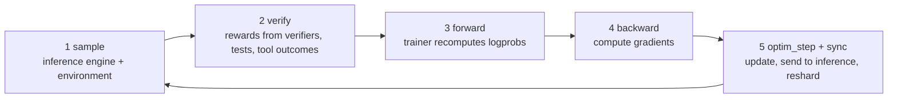

> 🌏 [中文版](/posts/ai/2026-10-10-cmu-11768-lecture-12-rl-systems)

**Video status: the official public page lists no recording.** [Video sources and notes](#course-video-sources)

> **This post is written from the slides; I'll add the video when it's published.** As of 2026-10-10, the [official schedule](https://www.cmu-agents.com/#/schedule) lists only [slides](https://www.cmu-agents.com/slides/lecture-12-rl-systems.pdf) for Lecture 12 (Oct 1), with no recording. Everything below comes from the slides, not from what the lecturer said; where the slides are silent and I'm interpreting, I say so.

Lecture 12 of [CMU 11-768 AI Agents](https://www.cmu-agents.com/), given by [Apurva Gandhi](https://apga.github.io/), closes the training module. The previous two lectures ([9](/en/posts/ai/2026-09-29-cmu-11768-lecture-09-rl-basics-en), [11](/en/posts/ai/2026-09-29-cmu-11768-lecture-11-advanced-rl-en)) covered algorithms: how to compute advantages, how to clip ratios. This one asks a different question: **an algorithm is one line of math on paper, so what does the system look like when it runs on hundreds of GPUs?**

If you only want a small RL experiment, the first half (two workloads, optimizations on each side) is enough. If you are building a training platform, the design choices in the second half are the point.

## Course video sources

This post is written from the slides. I checked the official schedule: Lecture 12 lists slides only, with no recording link. That means the public page has none, not that none exists internally.

Official source:

- [cmu-11-768-ai-agents — official course materials and recording index](https://www.cmu-agents.com/#/schedule)

Checked: 2026-10-10.

## Why not hand-roll it in PyTorch

The slides open by breaking a policy-gradient update into operations: the environment provides state and verification, the agent harness produces actions, then `forward`, `backward`, `optim_step`. A few dozen lines of PyTorch seem enough.

But those operations are really **two workloads with opposite profiles**:

| | Sampling | Training (forward_backward) |
|---|---|---|
| Engine | Inference engine, e.g. [vLLM](/en/posts/ai/2026-03-14-vllm-inference-engine-en), SGLang | Trainer engine, e.g. Megatron, FSDP2 |
| Shape of compute | Decode-heavy, one token after another | Prefill-style, whole sequence in parallel |
| Gradients | None | Autograd |
| Typical optimizations | KV cache, prefix cache, continuous batching, speculative decoding | Activation checkpointing, prefix sharing, sample packing |

Each side is already a complex system. The RL framework's job is to join them: the inference engine produces rollouts, the trainer updates weights, and the new weights go back to the inference engine.

A training step has five stages on the slides:

Stage 3 is easy to overlook: the trainer recomputes logprobs itself, with gradients tracked, rather than reusing the numbers the inference engine returned. Why that matters shows up with R3 below.

## Inference side: four optimizations, all especially good for agents

**KV caching.** Each past token keeps its K and V; a new token computes only its own q, k, v and attends over the whole cache. The cost is memory. The slides work it out for Llama-3-8B in bf16: about 128 KB per token, roughly 4 GB for one 32k-token trace, 256 GB for 64 of them. KV caching trades recomputation for memory.

**Prefix caching.** Agent trajectories share long prefixes: in a GRPO group, rollouts of the same task share the prompt; later steps of one rollout share the earlier history. Caching across requests reuses that work, and the slides say agentic RL benefits especially.

**Continuous batching.** Static batching waits for the longest request while other slots idle. Continuous batching schedules per decode step, so finished sequences leave and queued ones fill in. The slides add that it is usually paired with chunked prefill so long prompts don't cause decode latency spikes; the alternative is to disaggregate prefill and decode.

**Speculative decoding.** A cheap drafter guesses k tokens and the policy checks them in one parallel pass; rejection sampling keeps the policy's exact distribution. RL adds a catch: the policy changes every training step, so a frozen drafter's acceptance rate decays. Train the drafter online with an auxiliary objective such as SFT or distillation.

## Trainer side: don't store or compute duplicates

**Activation checkpointing.** Keep only each layer's input in the forward pass and recompute the internals when the backward pass reaches that layer. Memory drops from every layer's activations to one input per layer plus one layer's activations at a time. The cost is about one extra forward pass, roughly +33% compute; selective recompute of attention alone is much cheaper.

**Prefix sharing.** RL batches repeat prefixes: a GRPO group shares its prompt, multi-turn rollouts share history. Use a tree attention mask (no attention across branches), position IDs as in each standalone sequence, and accumulate every branch's gradient into the shared prefix. The prefix is then computed once, forward and backward. Two numbers from the slides:

- Snowflake's ZoRRo: in long-prompt GRPO batches, 80–95% of tokens are duplicate prompt tokens; deduplicating gives up to 6× faster actor updates.
- [AReaL](https://arxiv.org/abs/2505.24298)'s DTA: multi-turn τ²-bench rollouts compress 9.43× as a prefix tree, and a depth-first walk gives up to 8.31× over dense training.

These are results as relayed on the slides; I did not check them against the original papers.

**Parallelism.** The slides sketch tensor parallelism (split MLP weights), expert parallelism (MoE experts on different GPUs) and context parallelism (Q stays, KV blocks rotate), without going into detail.

## Between the two: weight sync and MoE routing

**Weight sync.** A full broadcast to every inference rank is about 2 TB for a 1T-parameter model. The slides say about 99% of parameters are unchanged between RL updates in bf16, so you can sync only the delta. After syncing, the weights must be resharded to the inference engine's parallelism layout.

**Rollout Routing Replay (R3).** MoE models have a subtle problem: tiny numerical differences between inference and training can select different experts, so the trainer's logprobs no longer belong to the policy that sampled. R3 records the experts chosen during rollout and replays the same selection in training. The cost is that the inference engine has to return its routing decisions.

## The sharp bits of agentic RL

The slides give a section to places where agent trajectories break the assumptions above.

### Sequence extension: can the history keep growing?

The slides compare two harnesses. Harness A appends to the history every turn. Harness B compacts the earlier interaction into a summary S after every two observations.

For training, A's whole trajectory is **one** example: task, actions and observations concatenated, loss mask 1 only on action tokens, the same trajectory advantage on every action token. B's trajectory must be split into two examples, and the second starts with the task plus summary S, so the task tokens are processed in both. Repeated tokens carry no direct loss but still cost compute.

The slides' conclusion: **preserve exact prefixes and concatenate for as long as practical.** My reading: the context-compaction strategy you pick affects not only agent quality but also training cost directly.

### Chat templates can quietly rewrite history

The property also constrains chat templates. The slides name the default templates of Qwen 3 / Qwen 3.5, which strip reasoning from past turns: turn 1 is generated with thinking, but when turn 2's prompt is rebuilt the thinking is gone, so the tokens don't match. Many RL training frameworks ship their own template or "renderer" to keep the property; the slides cite Tinker and PrimeRL.

### Token-in, token-out (TITO)

Should rollouts go from the inference engine to the trainer as strings or as tokens? The slides say tokens. Tokenization is one-to-one but detokenization is many-to-one: the same text can be split into different token sequences, so a round trip through strings may give the trainer different tokens than the ones actually sampled. Even a chat template adding one whitespace can cause a mismatch.

### Async RL

Long trajectories leave GPUs idle in synchronous training. Async RL splits GPUs into training and inference groups and overlaps rollouts with weight updates. The slides note agentic RL is often rollout-bound, so you can give inference more GPUs, e.g. 3:1. Two costs: data goes stale and needs off-policy correction (the importance sampling from [Lecture 11](/en/posts/ai/2026-09-29-cmu-11768-lecture-11-advanced-rl-en)), and the inference engine must support continuous batching and **in-flight weight updates**.

For the latter, SGLang's pause modes are the example: `abort` drops in-flight requests, `retract` pulls them back, and `in_place` pauses without changing request state, though a later cache flush fails because running requests still rely on those KV entries. Inference frameworks are evolving to meet RL's needs.

One last slide flags that complex harnesses (sub-agents, context compaction) make every point above harder; it doesn't expand.

## System design: decouple the harness from training

### Don't write a rollout loop per harness

Codex, Claude Code, OpenHands, Pi and Hermes each have their own harness. The anti-pattern the slides name is custom rollout and environment code for each. The recommended pattern is a middleman service that emulates inference APIs (chat completions, responses, Anthropic). The harness calls it as if it were a real model; the proxy writes tokens, logprobs and routing info to a rollout store for the trainer. Adding a harness needs zero code changes.

### One program vs. everything as a service

Two ends of the spectrum:

| | SPMD (single program, multiple data) | Everything-as-a-service + single controller |
|---|---|---|
| Shape | One Python program on every rank; rank decides training or inference | Environment/reward, agent, trainer, inference and weight-sync are separate services coordinated by a light controller |
| Pros | Direct control, easy to write | Separation of concerns; services upgrade or swap independently; researchers prototype algorithms in a CPU-side controller |
| Cons | Less flexible | Needs protocols between services |
| Example | AReaL before 1.0 | Linked by protocols such as Tinker's training API, MCP/ACP, Open Reward Standard |

The SPMD pseudocode is short: ranks 0–3 form the training group and loop over batch, `forward_backward`, `optimizer.step()`, async weight publish; the other ranks form the inference group and loop over refreshing weights, taking prompts, rolling out, and enqueueing trajectories.

Once services are split, several hard things get easier (these are directions the slides list, not results I tested):

- **Elastic scale-up:** the inference service has its own controller and adds workers as needed.
- **Heterogeneous, cross-region compute:** the slides show AstraFlow (Zheng et al., 2026) pooling 8×H100 and 4×MI350 machines across continents.
- **Multi-policy training:** e.g. different models for different roles in multi-agent rollouts.
- **Online RL after deployment:** an agent service (such as Hermes Agent) routes inference calls through a gateway into the training system; the slides say Cursor Tab and Composer run this way in production, with Composer producing a new checkpoint from real user interactions about every 5 hours.
- **Multi-tenant, multi-LoRA training:** pioneered by Tinker. The slides' example has 8 concurrent LoRA runs beating 8 serial runs on throughput, at a longer end-to-end time per run, and it needs special kernels such as Grouped-GEMM/SGMV.

## Debugging: eight things to watch

The slides end with a table, which I've reorganized as "what you see → what to check":

| Metric | Warning sign |
|---|---|
| reward / pass@1 | Flat for many steps, or rising while held-out evals fall (reward hacking) |
| pass@k | pass@1 rises while pass@k falls: diversity is collapsing |
| entropy | Sudden collapse toward 0, or a jump (degenerate text) |
| importance_weight_max | Spikes: train/rollout mismatch or stale data; a few tokens dominate the update |
| grad norm | Spikes ahead of divergence, or steady upward drift |
| average staleness | Creeping up: rollouts can't keep pace with training |
| trainer MFU | Drops from padding, imbalance or small microbatches |
| rollout / update / stall / total timing | Stall > 0: the trainer is waiting on rollouts |

## What you can do tonight

- **Measure your rollouts' prefix overlap.** Compare trajectories in a batch pairwise for longest common prefix and compute the share of duplicate tokens. If it's over half, prefix caching and prefix sharing are the first optimizations to check.
- **Rebuild an old trajectory with your chat template.** Take turn 2's prompt and check whether it extends turn 1's prompt plus generation. If not, sequence extension is broken.
- **Put all the metrics above on one dashboard.** At minimum: reward, a held-out eval, entropy and stall time. When something breaks, which one moved first tells you where to look.

## Going deeper

- Inference side on this site: [vLLM inference engine](/en/posts/ai/2026-03-14-vllm-inference-engine-en), [CMU 11-868: serving at scale and KV cache](/en/posts/ai/2026-09-30-cmu11868-serving-at-scale-kv-cache-en)
- Algorithm side: [Lecture 11: advanced RL algorithms](/en/posts/ai/2026-09-29-cmu-11768-lecture-11-advanced-rl-en)
- Async RL system: [AReaL](https://arxiv.org/abs/2505.24298)

## Changelog

- 2026-10-10: Added this post, written from the Lecture 12 slides; no recording on the official public page yet.

## References

- [CMU 11-768 AI Agents course site](https://www.cmu-agents.com/)
- [Lecture 12 slides: Reinforcement Learning Systems](https://www.cmu-agents.com/slides/lecture-12-rl-systems.pdf)
- [Apurva Gandhi's website](https://apga.github.io/)
- [Fu et al., 2025. AReaL: A Large-Scale Asynchronous Reinforcement Learning System for Language Reasoning](https://arxiv.org/abs/2505.24298)
- [Lecture 9: RL basics](/en/posts/ai/2026-09-29-cmu-11768-lecture-09-rl-basics-en)
- [Lecture 11: advanced RL algorithms](/en/posts/ai/2026-09-29-cmu-11768-lecture-11-advanced-rl-en)
