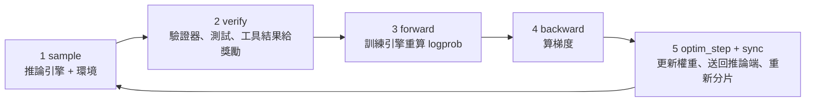

> 🌏 [English version](/en/posts/ai/2026-10-10-cmu-11768-lecture-12-rl-systems-en)

**影片狀態：官方公開頁未列錄影。** [影片來源與說明](#課程影片來源)

> **本篇依投影片撰寫，影片上架後補充。** 截至 2026-10-10，[官方課表](https://www.cmu-agents.com/#/schedule)上第 12 講（10/1）只有[投影片](https://www.cmu-agents.com/slides/lecture-12-rl-systems.pdf)，沒有錄影。下文的說明只根據投影片，沒有講者口述；投影片沒寫的，我會標成我的解讀。

[CMU 11-768 AI Agents](https://www.cmu-agents.com/) 的第 12 講是訓練模組的最後一講，由 [Apurva Gandhi](https://apga.github.io/) 主講。前面兩講（[第 9 講](/posts/ai/2026-09-29-cmu-11768-lecture-09-rl-basics)、[第 11 講](/posts/ai/2026-09-29-cmu-11768-lecture-11-advanced-rl)）講的是演算法：advantage 怎麼算、ratio 怎麼 clip。這一講換一個問題：**演算法寫在紙上只有一行公式，要在幾百張 GPU 上跑起來，系統要長什麼樣子？**

如果你只想做一次小規模的 RL 實驗，這篇的前半（兩種負載、兩端優化）就夠用；要自己架訓練平台的人，後半的設計選擇才是重點。

## 課程影片來源

本篇依投影片撰寫。已查官方課表，第 12 講只列投影片，未列錄影連結；這只代表公開頁沒有，不代表校內沒有錄影。

官方來源：

- [cmu-11-768-ai-agents — official course materials and recording index](https://www.cmu-agents.com/#/schedule)

查核日期：2026-10-10。

## 為什麼不直接用 PyTorch 手刻

投影片開頭把 policy gradient 更新拆成一串操作：環境給狀態和驗證、agent harness 跑出動作，然後是 `forward`、`backward`、`optim_step`。看起來手寫幾十行 PyTorch 就能湊出來。

但這一串操作其實是**兩種性質相反的工作負載**：

| | 取樣（sample） | 訓練（forward_backward） |
|---|---|---|
| 引擎 | 推論引擎，例如 [vLLM](/posts/ai/2026-03-14-vllm-inference-engine)、SGLang | 訓練引擎，例如 Megatron、FSDP2 |
| 計算形狀 | decode 為主，一個 token 接一個 token | prefill 式，整段序列可以平行算 |
| 梯度 | 不算 | autograd |
| 常用優化 | KV 快取、prefix 快取、continuous batching、speculative decoding | activation checkpointing、prefix sharing、sample packing |

兩邊各自已經是複雜的系統，RL 框架的工作是把它們接起來：推論引擎產出 rollout，訓練引擎更新權重，再把新權重送回推論引擎。

一個訓練步驟在投影片上是五個階段：

第 3 步是容易漏掉的一環：訓練引擎要自己重算一次 logprob（同時保留梯度），不能直接用推論引擎吐出來的數字。為什麼這件事會出問題，後面講 R3 時會看到。

## 推論端：四個優化，agent 都特別受惠

**KV 快取。** 每個過去的 token 都存一份 K、V，新 token 只算自己的 q、k、v，再對全部快取做 attention。代價是記憶體：投影片算 Llama-3-8B 用 bf16，每個 token 約 128 KB，一條 32k token 的軌跡約 4 GB，64 條就是 256 GB。KV 快取是拿記憶體換重算。

**Prefix 快取。** agent 軌跡有大量共同前綴：同一題的 GRPO 群組裡，多條 rollout 共用任務提示；同一條 rollout 的後續步驟共用前面的歷史。快取跨請求重用，投影片的說法是 agentic RL 特別受惠。

**Continuous batching。** 靜態批次要等最長的請求，其他 slot 閒置；連續批次以單一 decode 步為單位，跑完的離開、排隊的補位。投影片提到通常搭配 chunked prefill，避免長提示拖慢 decode 延遲，另一條路是把 prefill 和 decode 拆到不同機器。

**Speculative decoding。** 便宜的 drafter 一次猜 k 個 token，policy 用一次平行運算檢查，rejection sampling 保證分布仍是 policy 的。RL 有個特殊問題：policy 每個訓練步都在變，凍結的 drafter 命中率會一路下滑，所以要用輔助目標（例如 SFT、蒸餾）線上訓練它。

## 訓練端：少存、少算重複的東西

**Activation checkpointing。** 前向只留每層的輸入，反向走到那層時再重算內部。記憶體從「每層全部 activation」降到「每層一份輸入加上當下一層」，代價是多一次前向，約多 33% 計算；只重算 attention 的選擇性版本便宜很多。

**Prefix sharing。** RL 的 batch 重複很多前綴：GRPO 一組共用 prompt，多輪軌跡共用歷史。做法是用樹狀的 attention mask（分支之間互相看不到）、位置編碼照各自獨立序列給、所有分支的梯度累積回共用前綴，這樣前綴前向反向各算一次。投影片附兩個數字：

- Snowflake 的 ZoRRo：長提示的 GRPO batch 裡，80–95% 的 token 是重複的提示，去重後 actor 更新最多快 6 倍。
- [AReaL](https://arxiv.org/abs/2505.24298) 的 DTA：多輪 τ²-bench rollout 當成 prefix tree 可以壓縮 9.43 倍，沿樹深度優先走，最多比密集訓練快 8.31 倍。

這兩個數字是投影片轉述的研究結果，我沒有逐一回查原論文。

**平行化。** 投影片放了 tensor parallelism（切 MLP 權重）、expert parallelism（MoE 的專家分到不同 GPU）、context parallelism（Q 留在原卡、KV 區塊輪流傳）的示意圖，沒有展開細節。

## 兩端之間：權重同步與 MoE 路由

**權重同步。** 完整廣播給每個推論 rank，1T 參數的模型大約是 2 TB。投影片說兩次 RL 更新之間約 99% 的參數在 bf16 下沒有變，所以可以只同步差異。同步後還要照推論端的平行配置重新分片。

**Rollout Routing Replay（R3）。** MoE 模型有一個隱蔽的問題：推論和訓練的數值有微小差異，就可能選到不同的專家，訓練端算出來的 logprob 就不再是同一個 policy 的。R3 的做法是記下 rollout 時的專家選擇，訓練時照樣重播。代價是推論引擎得把路由決策一起吐出來。

## Agentic RL 的幾個坑

投影片用一節講 agent 軌跡讓上面這些假設失效的地方。

### Sequence extension：歷史能不能一直接下去

投影片比較兩種 harness。Harness A 每輪都在既有歷史後面追加；Harness B 每兩個 observation 就把前面的互動壓縮成摘要 S。

對訓練來說，A 的整條軌跡是**一筆**資料：任務、動作、observation 連成一串，只有動作 token 的 loss mask 是 1，每個動作 token 共用同一個軌跡 advantage。B 的軌跡得拆成兩筆，第二筆的開頭是任務加摘要 S，任務 token 在兩筆裡各算一次。重複的 token 雖然沒有直接的 loss，仍然要花計算。

投影片的結論是：**盡量保留精確的前綴，盡可能久地串接。** 我的解讀是：選 harness 時，上下文壓縮策略不只影響 agent 的表現，也直接決定訓練成本。

### Chat template 可能偷偷改掉歷史

這個性質對 chat template 也有要求。投影片點名 Qwen 3／Qwen 3.5 的預設模板會把過去回合的 thinking 從歷史裡移除：第 1 輪生成時帶著 thinking，第 2 輪重組 prompt 時卻沒有，兩邊的 token 對不起來。許多 RL 訓練框架因此自己附模板或 renderer 來保證這個性質，投影片舉的例子是 Tinker 和 PrimeRL。

### Token 進、token 出（TITO）

rollout 從推論端送到訓練端，要傳字串還是 token？投影片的答案是傳 token。理由是分詞是一對一，還原成字串卻是多對一：同一串文字可以被切成不同的 token 組合，經過字串轉一圈，訓練端看到的 token 可能和推論端實際取樣的不一樣；chat template 多加一個空白也會造成不一致。

### 非同步 RL

長軌跡讓同步訓練的 GPU 大量空轉。非同步 RL 把 GPU 分成訓練和推論兩群，rollout 和權重更新重疊進行。投影片說 agentic RL 常常是 rollout 受限，所以可以把更多 GPU 分給推論，例如 3:1。代價有兩個：資料會過期，要有 off-policy 修正（這就是[第 11 講](/posts/ai/2026-09-29-cmu-11768-lecture-11-advanced-rl)的 importance sampling）；推論引擎要支援 continuous batching 和**飛行中的權重更新**。

後者的例子是 SGLang 的暫停模式：`abort` 丟掉進行中的請求，`retract` 收回，`in_place` 保留請求狀態暫停，但之後清快取會失敗，因為進行中的請求還在用那些 KV。推論框架正在為 RL 的需求演化。

投影片最後還留了一頁提醒：子 agent、context 壓縮這類複雜的 harness 會讓以上每一條更難處理，沒有展開。

## 系統設計：把 harness 和訓練切開

### 不要為每個 harness 寫一套 rollout 程式

Codex、Claude Code、OpenHands、Pi、Hermes 各有自己的 harness。投影片指出的反模式是為每個 harness 寫客製的 rollout 和環境程式碼；它推薦的做法是中間放一個代理服務，模擬各種推論 API（chat completions、responses、Anthropic），harness 打過來就像打真的模型，代理再把 token、logprob、路由資訊寫進 rollout store 交給訓練器。新增一個 harness 不用改任何程式碼。

### 單一程式 vs. 全部服務化

兩種極端的架構：

| | SPMD（單一程式多資料） | 全部服務化＋單一控制器 |
|---|---|---|
| 形狀 | 同一支 Python 程式跑在每個 rank 上，用 rank 判斷自己是訓練或推論 | 環境／獎勵、agent、訓練、推論、權重同步各是獨立服務，由輕量控制器協調 |
| 優點 | 直接控制一切，容易寫 | 關注點分離；服務可以各自升級、替換；研究者可以在 CPU 上的控制器裡試新演算法 |
| 缺點 | 彈性差 | 要定義服務之間的協定 |
| 例子 | AReaL 1.0 之前的版本 | 以 Tinker 的訓練 API、MCP／ACP、Open Reward Standard 等協定連接 |

SPMD 版本的偽碼很短：前四個 rank 組成訓練群組，持續取 batch、`forward_backward`、`optimizer.step()`、非同步發布權重；其餘 rank 是推論群組，持續刷新權重、取題目、跑 rollout、把軌跡放進佇列。

服務化之後，幾件原本很難做的事變簡單了（以下是投影片列的方向，不是我實測的結論）：

- **彈性擴縮**：推論服務前面放自己的控制器，要多少 worker 就起多少。
- **異質算力、跨區域**：投影片舉 AstraFlow（Zheng 等人，2026），把 8×H100 和 4×MI350 這類不同機器、橫跨多個洲的資源放進同一個訓練池。
- **多個 policy 同時訓練**：例如多 agent rollout 裡不同角色用不同模型。
- **部署後線上 RL**：agent 服務（例如 Hermes Agent）把推論請求導到訓練系統的閘道；投影片寫 Cursor 的 Tab 和 Composer 已在正式環境這樣做，Composer 約每 5 小時從真實使用者互動產出一個新 checkpoint。
- **多租戶、多 LoRA 訓練**：Tinker 開了這條路，投影片的例子是 8 條同時進行的 LoRA 訓練吞吐量勝過 8 條串行，每條的端到端時間會變長；需要 Grouped-GEMM／SGMV 這類特殊 kernel。

## 除錯：九個要盯的指標

投影片收尾放了一張表，我把它整理成「看到什麼就該去查什麼」：

| 指標 | 警訊 |
|---|---|
| reward／pass@1 | 長時間持平，或訓練獎勵上升但留出評測下降（reward hacking） |
| pass@k | pass@1 上升但 pass@k 下降：多樣性在崩塌 |
| entropy | 突然掉到接近 0，或突然暴增（生成退化成亂碼） |
| importance_weight_max | 出現尖峰：推論和訓練不一致，或資料過期，少數 token 主宰更新 |
| grad norm | 發散前的尖峰，或持續上漂 |
| 平均 staleness | 緩慢上升：rollout 追不上訓練 |
| 訓練端 MFU | 掉下來：padding、不平衡、microbatch 太小 |
| rollout／update／stall／total 計時 | stall 大於 0：訓練器在等 rollout |

## 今晚能做的事

- **量你的 rollout 前綴重複率。** 把一個 batch 的軌跡兩兩比最長共同前綴，算出重複 token 的比例。如果超過一半，prefix 快取和 prefix sharing 是第一個要查的優化。
- **用你的 chat template 重新組一次舊軌跡。** 拿第 2 輪的 prompt，檢查它是不是第 1 輪「prompt 加生成」的延伸。對不上，就是 sequence extension 破了。
- **訓練時把表上的指標都寫進同一張儀表板。** 至少要有 reward、留出評測、entropy 和 stall 時間；出問題時，第一個看的是哪個指標先動。

## 想深入

- 推論端：本站的 [vLLM 推論引擎](/posts/ai/2026-03-14-vllm-inference-engine)、[CMU 11-868：Serving at Scale 與 KV cache](/posts/ai/2026-09-30-cmu11868-serving-at-scale-kv-cache)
- 演算法端：[第 11 講：進階 RL 演算法](/posts/ai/2026-09-29-cmu-11768-lecture-11-advanced-rl)
- 非同步 RL 系統：[AReaL](https://arxiv.org/abs/2505.24298)

## 更新紀錄

- 2026-10-10：新增本篇。依第 12 講投影片撰寫，官方公開頁尚未列錄影。

## 參考資料

- [CMU 11-768 AI Agents 課程官網](https://www.cmu-agents.com/)
- [Lecture 12 投影片：Reinforcement Learning Systems](https://www.cmu-agents.com/slides/lecture-12-rl-systems.pdf)
- [Apurva Gandhi 個人網站](https://apga.github.io/)
- [Fu et al., 2025. AReaL: A Large-Scale Asynchronous Reinforcement Learning System for Language Reasoning](https://arxiv.org/abs/2505.24298)
- [第 9 講：RL 基礎](/posts/ai/2026-09-29-cmu-11768-lecture-09-rl-basics)
- [第 11 講：進階 RL 演算法](/posts/ai/2026-09-29-cmu-11768-lecture-11-advanced-rl)
