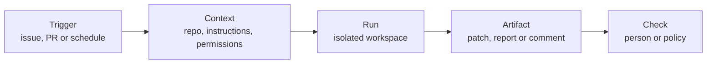

> 🌏 [中文版](/posts/ai/2026-10-10-cmu-11768-lecture-14-openhands)

**Video status: the official public page lists no recording.** [Video sources and notes](#course-video-sources)

> **This post is written from the slides; I'll add the video when it's published.** As of 2026-10-10, the [official schedule](https://www.cmu-agents.com/#/schedule) lists only [slides](https://www.cmu-agents.com/slides/lecture-14-openhands.pdf) for Lecture 14 (Oct 8), with no recording. Everything below comes from the slides, not from what the lecturer said; where I'm interpreting, I say so.

The framework module of [CMU 11-768 AI Agents](https://www.cmu-agents.com/) has two lectures. The first is [Graham Neubig](https://www.phontron.com/) on [OpenHands](https://github.com/OpenHands/OpenHands), which he leads; the second (Oct 20) is LangGraph. Neubig said in [Lecture 1](/en/posts/ai/2026-09-29-cmu-11768-lecture-01-what-is-an-agent-en) that he works on OpenHands, so this is the author explaining a framework's design.

If you're choosing a framework or writing your own harness, the interesting part isn't what the API looks like but why each part exists: **each design answers a problem a coding agent hit in real use.**

## Course video sources

This post is written from the slides. I checked the official schedule: Lecture 14 lists slides only, with no recording link. That means the public page has none, not that none exists internally.

Official source:

- [cmu-11-768-ai-agents — official course materials and recording index](https://www.cmu-agents.com/#/schedule)

Checked: 2026-10-10.

## Evolution: from code completion to automations that run daily

The slides open with a demo of OpenHands' frontend (Agent Canvas: a conversation list, recurring PR reports, automations) and then go back through history.

| When | Form | Division of labor |
|---|---|---|
| Through 2023 | Copilot and early Cursor completions; evaluation was single functions with unit tests, as in [HumanEval](https://arxiv.org/abs/2107.03374) | Humans lead editing, execution and checking |
| Oct 2023 | [SWE-bench](https://arxiv.org/abs/2310.06770v1): a real issue plus a repository snapshot, a patch as output, verified by the repo's tests; early results were poor | The unit of evaluation moves from function to repo |
| Early 2024 | Devin's launch; on Mar 26, OpenDevin, an open-source frontend + agent + Docker sandbox | Agents get a terminal, editor and browser |
| Apr–May 2024 | [SWE-agent](https://arxiv.org/abs/2405.15793) (file search, edits, fix verification), OpenDevin CodeAct 1.0 (code execution, terminal commands, feedback) | Agent–computer interfaces become a research topic |
| 2025 | Benchmark scores rise from better models (reasoning, code editing, tool use) plus better agent systems (tools, test environments, context, recovery) | The score is model plus agent system |
| 2026 | Longer runs, interruptions, parallel tasks; visible progress and inspectable results; repeatable workflows, scoped access, verification | The focus shifts from benchmarks to deployment |

The last column is the lecture's thread: before 2025 the question was "can it solve it," in 2026 it is "can I trust it to run unattended." The second half of the lecture (confirmation policy, cloud execution, automations, verification) belongs to the latter.

## The parts of the OpenHands Software Agent SDK

OpenHands factored its shared core into an SDK ([paper](https://arxiv.org/abs/2511.03690v1)), and the GUI, CLI and integrations sit on the same foundation. The slides walk through eight code snippets, which I've turned into a parts table:

| Part | What it does | Problem it answers |
|---|---|---|
| `LLM` | Model and key, configured from environment variables | Swap models without code changes |
| `Agent` + `Tool` | A tool list, e.g. terminal, file editor, task tracker | Reusable agent configuration |
| `Conversation` | Binds an agent to a workspace; `send_message()` then `run()` drives the action–observation loop | The full state of one task |
| Custom tools | Three pieces: `Action` (typed input), `Executor` (implementation), `Observation` (model-readable result) | Add a tool without touching the framework |
| Persistence | Set `persistence_dir` and `conversation_id`; events and state are saved and the same ID restores them | Resume long tasks after interruption; workspace persistence is a separate concern |
| Context management | `LLMSummarizingCondenser`: past a size limit, older events become a summary while the original instructions and recent work are kept | Conversations outgrow the context; the slides warn the summary may lose detail, so use files and tests as evidence |
| Remote execution | `DockerWorkspace` runs an Agent Server in a container; same conversation API, remote task and events | Isolation and reproducibility |
| Confirmation policy | `set_confirmation_policy(AlwaysConfirm())`: pause before an action, wait for a human decision, a rejection leads to a revised plan | Human approval for risky actions |

The last row ties directly to [the previous lecture](/en/posts/ai/2026-10-10-cmu-11768-lecture-13-agent-safety-en): a confirmation policy is exactly the pre-execution check. My reading: the SDK makes safety a setting on the conversation instead of something each tool implements itself.

[Lecture 3 on context management](/en/posts/ai/2026-09-29-cmu-11768-lecture-03-context-management-en) and [Lecture 4 on skills](/en/posts/ai/2026-09-29-cmu-11768-lecture-04-skills-memory-en) both have counterparts in this SDK, worth reading side by side.

## One agent or several

### Early multi-agent: split by role

The slides cite [CodeR](https://arxiv.org/abs/2406.01304) and [MetaGPT](https://arxiv.org/abs/2308.00352): a manager plans the issue, a reproducer reproduces the bug, a fault localizer finds it, an editor changes code, a verifier checks the fix.

### A single agent as the baseline

One agent reproduces, locates, edits and tests, sharing context across all of it. Splitting into roles costs handoffs and maintenance, so extra agents should have a clear purpose.

What supports this stance is **general-purpose tools**: a small set with many combinations. Edit files (source, configuration, docs), run commands (search, install dependencies, tests), and browse (documentation, visual inspection).

OpenHands extends the same agent with two mechanisms rather than spawning more agents:

- **Skills:** extra instructions for the same agent, holding project conventions and recurring procedures, loaded on demand. The slides note the earlier name was microagents.
- **MCP tools:** external tools via the Model Context Protocol. The slide's code launches a `repomix` MCP server so built-in and external tools coexist, and it reminds you to consider server access and trust requirements.

### Evidence for the generalist

[OpenHands-Versa](https://arxiv.org/abs/2506.03011v1) puts coding, visual browsing, search and file access on one agent. The slide's table (resolve rate, %):

| Benchmark | OpenHands-Versa | OpenHands | Published SOTA |
|---|---|---|---|
| GAIA | 51.16 | 37.21 | 49.83 |
| The Agent Company | 33.14 | 26.29 | 24 |
| SWE-Bench Multimodal | 34.43 | 31.72 | 25.34 |

These are paper numbers as relayed on the slides; I didn't check them against the original. The slides' takeaway is that shared tools work across coding, research and office tasks.

### When to split

The slides close with reasons for division of labor: parallel work on independent issues or repos; independent review (patch checking with separate task and permissions); cost control (cheaper models for suitable tasks). Each carries a cost: task boundaries, shared context, coordination.

This echoes [Lecture 5](/en/posts/ai/2026-09-29-cmu-11768-lecture-05-planning-en): multi-agent is not the default, it's an option for when you have a reason.

## Where agents run and which interface

### Local vs. cloud

| | Local | Cloud |
|---|---|---|
| Upside | Existing files, services and context | Work continues with the laptop off; remote repo, dependencies and credentials are there |
| Cost | The machine must stay available during execution | You hand the repo, dependencies and credentials to the cloud |

### Execution location × interaction interface

| | Local execution | Cloud execution |
|---|---|---|
| IDE | Editor workspace | Remote workspace |
| GUI | Desktop application | Browser application |
| CLI | Local terminal | Remote session |
| Integration | Local service | Hosted worker |

Each interface has its strengths. The IDE is a familiar environment with files, diffs and tests. A custom GUI is organized around agent tasks, with progress, parallel runs, previews, approvals and setup. The CLI is consistent across environments and runs shell commands and scripts. Integrations put the agent into existing channels: issues carry task context, PRs carry diffs and review, chat carries requests and results.

### Does it reduce human effort?

The slides include a user study ([Code with Me or for Me?](https://arxiv.org/abs/2507.08149v1)): 20 regular Copilot users did Python tasks, comparing Copilot with OpenHands.

| | Copilot | OpenHands (agent) |
|---|---|---|
| Task correctness | 0.25 | 0.60 |
| User effort (minutes) | 25.1 | 12.5 |

The slide's note: lower active effort, but understanding and oversight are still needed. My reading: what shrinks is hands-on time; review work remains, which is why the GUI invests in previews, diffs and approvals. It is a 20-person study, so treat the numbers as directional.

## Automations: wiring agents to events

### What one automation is

The slides describe "event → bounded task → inspectable result":

As a demo the slides show OpenHands' own automation dashboard: 19 active automations, including a GitHub PR reviewer, issue triage, fixing failing dependabot version bumps and Slack channel monitoring. A few numbers from the screenshot: the PR reviewer ran 1,299 times at 100% recent success, 19 s average; the multi-repo PR reviewer ran 1,231 times at 95%; issue triage ran 1,515 times at 100%; a stale-CI cleanup ran 321 times at 0% recent success and shows as failed.

The dashboard is honest in a useful way: not every automation succeeds, and the failing one is on screen.

### Software factory

Chain the recurring tasks, with explicit handoffs and a check at each:

| Stage | Handoff |
|---|---|
| Issue triage | Request and acceptance criteria |
| Implementation | Patch, tests, pull request |
| Code review | Independent verification |
| Merge check | Passing checks and approval on the current commit |

Note the design of rows three and four: the reviewer is **independent**, and the merge check looks at the *current* commit, not results from an earlier one. It is the same principle as the previous lecture: keep checks where the agent can't reach them.

## Learning from past runs: SkillRefiner

The last section is a research preview: automations accumulate trajectories every day, so can they be used to improve skills? The SkillRefiner method on the slides (Khatry et al.) has five steps:

1. Score and summarize each trace, successes and failures separately.
2. Embed the summaries and cluster within each outcome partition.
3. Generate candidate edits from each cluster, with outcome-specific instructions.
4. Verify failure-derived proposals against supporting evidence (evidence gating).
5. Merge the positive proposals and the validated negative ones into a revised skill.

The results table (held-out tasks; accuracy %, F1 for PR review) shows SkillRefiner above the initial skill on both agent models, for example SpreadsheetBench (LLM-initialized skill, GPT-5.4-mini) from 77.5 to 84.0 and DAPO-Math (MiniMax-M2.7) from 53.5 to 64.0; a few cells are flat against baselines. The slides cite Table 1 of the paper and compare against GEPA and T2S.

I couldn't check this paper against public sources: the link on the slides is an alphaxiv page that looks like an early preprint. Treat this section as the course's research preview, not a verified conclusion. [Lecture 4 on skills and memory](/en/posts/ai/2026-09-29-cmu-11768-lecture-04-skills-memory-en) is good background for what is being edited here.

## What you can do tonight

- **Check whether your harness has a "confirm before execute" switch.** If not, add one at least for delete, pay and release actions.
- **Automate one recurring small task and have it leave an inspectable artifact.** For example, read open PRs each morning and produce a report; start with the report only, no write access.
- **Track each automation's success rate.** OpenHands' dashboard has one at 0%; you won't notice numbers like that unless you look.

## Going deeper

- Papers: [OpenHands Software Agent SDK](https://arxiv.org/abs/2511.03690v1), [SWE-agent](https://arxiv.org/abs/2405.15793), [OpenHands-Versa](https://arxiv.org/abs/2506.03011v1), [Code with Me or for Me?](https://arxiv.org/abs/2507.08149v1)
- Source: [OpenHands](https://github.com/OpenHands/OpenHands), [software-agent-sdk](https://github.com/OpenHands/software-agent-sdk/tree/69e26889401fe69157fff536e6a69049e6644cb3)
- Article: [Don't Sleep on Single-agent Systems](https://hub.openhands.dev/blog/dont-sleep-on-single-agent-systems)

## Changelog

- 2026-10-10: Added this post, written from the Lecture 14 slides; no recording on the official public page yet.

## References

- [CMU 11-768 AI Agents course site](https://www.cmu-agents.com/)
- [Lecture 14 slides: OpenHands](https://www.cmu-agents.com/slides/lecture-14-openhands.pdf)
- [Wang et al., 2025. The OpenHands Software Agent SDK](https://arxiv.org/abs/2511.03690v1)
- [OpenHands (GitHub)](https://github.com/OpenHands/OpenHands)
- [OpenHands software-agent-sdk (GitHub, revision pinned on the slides)](https://github.com/OpenHands/software-agent-sdk/tree/69e26889401fe69157fff536e6a69049e6644cb3)
- [Chen et al., 2021. Evaluating Large Language Models Trained on Code (HumanEval)](https://arxiv.org/abs/2107.03374)
- [Jimenez et al., 2023. SWE-bench](https://arxiv.org/abs/2310.06770v1)
- [Yang et al., 2024. SWE-agent](https://arxiv.org/abs/2405.15793)
- [Chen et al., 2024. CodeR](https://arxiv.org/abs/2406.01304)
- [Hong et al., 2023. MetaGPT](https://arxiv.org/abs/2308.00352)
- [Soni et al., 2025. Coding Agents with Multimodal Browsing are Generalist Problem Solvers (OpenHands-Versa)](https://arxiv.org/abs/2506.03011v1)
- [Chen et al., 2025. Code with Me or for Me?](https://arxiv.org/abs/2507.08149v1)
- [OpenHands. Don't Sleep on Single-agent Systems](https://hub.openhands.dev/blog/dont-sleep-on-single-agent-systems)
- [Khatry et al. SkillRefiner (alphaxiv, cited on the slides, not verified)](https://www.alphaxiv.org/abs/2610.skillrefiner-offline-skill-refinement)
