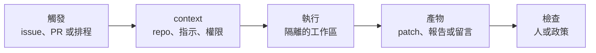

> 🌏 [English version](/en/posts/ai/2026-10-10-cmu-11768-lecture-14-openhands-en)

**影片狀態：官方公開頁未列錄影。** [影片來源與說明](#課程影片來源)

> **本篇依投影片撰寫，影片上架後補充。** 截至 2026-10-10，[官方課表](https://www.cmu-agents.com/#/schedule)上第 14 講（10/8）只有[投影片](https://www.cmu-agents.com/slides/lecture-14-openhands.pdf)，沒有錄影。下文只根據投影片，沒有講者口述；投影片沒寫的，我會標成我的解讀。

[CMU 11-768 AI Agents](https://www.cmu-agents.com/) 的框架模組有兩堂，第一堂是 [Graham Neubig](https://www.phontron.com/) 講他自己主導的 [OpenHands](https://github.com/OpenHands/OpenHands)，第二堂（10/20）是 LangGraph。Neubig 在[第 1 講](/posts/ai/2026-09-29-cmu-11768-lecture-01-what-is-an-agent)自介時就說他在做 OpenHands；這一講等於是作者本人講框架的設計理由。

讀這篇的人如果自己在選框架或自己寫 harness，值得關注的不是 API 長什麼樣子，而是每個零件為什麼存在：**每一個設計都對應一個 coding agent 在真實使用裡撞到的問題。**

## 課程影片來源

本篇依投影片撰寫。已查官方課表，第 14 講只列投影片，未列錄影連結；這只代表公開頁沒有，不代表校內沒有錄影。

官方來源：

- [cmu-11-768-ai-agents — official course materials and recording index](https://www.cmu-agents.com/#/schedule)

查核日期：2026-10-10。

## 演進：從補完函式到每天跑自動化

投影片先放一段 OpenHands 前端的示範（Agent Canvas：對話清單、定期的 PR 報告、自動化），然後回頭講歷史。

| 時間 | 形態 | 人和 agent 的分工 |
|---|---|---|
| 到 2023 年 | Copilot 與早期 Cursor 的程式碼補完；評測是 [HumanEval](https://arxiv.org/abs/2107.03374) 這類單一函式加單元測試 | 人主導編輯、執行與檢查 |
| 2023 年 10 月 | [SWE-bench](https://arxiv.org/abs/2310.06770v1)：真實 issue 加整個 repo 快照，產出 patch，用 repo 的測試驗證；早期成績很難看 | 評測單位從函式變成 repo |
| 2024 年初 | Devin 的發表；3 月 26 日 OpenDevin 做出前端、agent 和 Docker 沙盒的開源版 | agent 能開終端機、編輯器、瀏覽器 |
| 2024 年 4–5 月 | [SWE-agent](https://arxiv.org/abs/2405.15793)（檔案搜尋、編輯、驗證修正）、OpenDevin CodeAct 1.0（執行程式碼、終端指令、回饋） | agent–電腦介面成為研究題目 |
| 2025 年 | 基準成績上升，原因是更好的模型（推理、程式編輯、工具使用）加上更好的 agent 系統（工具、測試環境、context、錯誤復原） | 成績是模型加 agent 系統的合計 |
| 2026 年 | 長時間執行、可中斷、平行任務；要看得到進度、能檢視結果；可重複的流程、有範圍的權限、驗證 | 重點從跑分變成部署 |

投影片最後一欄的轉變，是整堂課的線索：2025 年以前的問題是「能不能解對」，2026 年的問題是「能不能放心交給它跑」。後半堂講的東西（確認政策、雲端執行、自動化、驗證）都屬於後者。

## OpenHands Software Agent SDK 的零件

OpenHands 把共用的核心抽成 SDK（[論文](https://arxiv.org/abs/2511.03690v1)），GUI、CLI 和各種整合都建在同一個地基上。投影片用八段程式碼逐一介紹，我把它整理成零件表：

| 零件 | 做什麼 | 對應的問題 |
|---|---|---|
| `LLM` | 模型與金鑰，由環境變數設定 | 換模型不改程式 |
| `Agent` + `Tool` | 工具清單，例如終端機、檔案編輯器、任務追蹤器 | 可重複使用的 agent 設定 |
| `Conversation` | 綁定 agent 與工作區，`send_message()` 之後 `run()` 跑 action–observation 迴圈 | 一次任務的完整狀態 |
| 自訂工具 | 用 `Action`（型別化輸入）、`Executor`（實作）、`Observation`（模型可讀的結果）三件組成 | 加工具不必改框架 |
| 持久化 | 指定 `persistence_dir` 與 `conversation_id`，事件與狀態存檔，同一個 ID 可還原 | 長任務被中斷後能續跑；工作區的持久化是另一件事 |
| context 管理 | `LLMSummarizingCondenser`：事件超過上限時，把舊事件換成摘要，保留最前面的指令和最近的工作 | 對話超出 context；投影片提醒摘要可能遺漏細節，所以要用檔案和測試當證據 |
| 遠端執行 | `DockerWorkspace` 在容器裡跑 Agent Server，對話 API 不變，任務與事件走遠端 | 隔離與可重現 |
| 確認政策 | `set_confirmation_policy(AlwaysConfirm())`：動作執行前暫停，等人決定，拒絕後 agent 修改計畫 | 高風險動作的人工核准 |

最後一列和[上一講](/posts/ai/2026-10-10-cmu-11768-lecture-13-agent-safety)直接相關：確認政策就是「執行前」的那道檢查。我的解讀是：SDK 把「安全」做成對話層的一個設定，而不是每個工具各寫各的。

[第 3 講的 context 管理](/posts/ai/2026-09-29-cmu-11768-lecture-03-context-management)和[第 4 講的 skills](/posts/ai/2026-09-29-cmu-11768-lecture-04-skills-memory)在這個 SDK 裡都有對應的實作，可以對照著看。

## 單一 agent 還是多個

### 早期的多 agent：照角色分工

投影片引用 [CodeR](https://arxiv.org/abs/2406.01304) 與 [MetaGPT](https://arxiv.org/abs/2308.00352)：manager 擬定 issue 計畫、reproducer 重現 bug、fault localizer 找出位置、editor 改程式、verifier 驗證修正。

### 單一 agent 當基線

同一個 agent 負責重現、定位、編輯、測試，共享整段 context。拆成多個角色要付交接和維護的成本，所以多加 agent 要有明確的目的。

支撐這個立場的是**通用工具**：一組小工具，組合出很多用法。編輯檔案（原始碼、設定、文件）、執行指令（搜尋、安裝相依、跑測試）、瀏覽（讀文件、視覺檢查）。

OpenHands 用兩個機制擴充同一個 agent，而不是另外開 agent：

- **Skills**：給同一個 agent 的額外指令，放專案慣例和重複流程，按需載入相關的部分。投影片註記早期叫 microagents。
- **MCP 工具**：用 Model Context Protocol 接外部工具。投影片的程式碼啟動一個 `repomix` 的 MCP server，內建和外部工具並存；它也提醒要考慮伺服器的存取和信任需求。

### 通才的證據

[OpenHands-Versa](https://arxiv.org/abs/2506.03011v1) 把寫程式、視覺瀏覽、搜尋和檔案存取放在同一個 agent 上。投影片的表（解決率，%）：

| 基準 | OpenHands-Versa | OpenHands | 已發表最佳 |
|---|---|---|---|
| GAIA | 51.16 | 37.21 | 49.83 |
| The Agent Company | 33.14 | 26.29 | 24 |
| SWE-Bench Multimodal | 34.43 | 31.72 | 25.34 |

這是投影片轉述的論文數字，我沒有回查原文。投影片的結論是共享的工具能同時用在寫程式、研究和辦公類任務。

### 什麼時候才拆

投影片最後列了分工的理由：平行處理互相獨立的 issue 或 repo；獨立審查（檢查 patch，用另外的任務和權限）；成本控制（合適的任務用便宜的模型）。每一條都附帶代價：任務邊界、共享 context、協調成本。

這與[第 5 講](/posts/ai/2026-09-29-cmu-11768-lecture-05-planning)的結論相呼應：多 agent 不是預設，是有理由時才開的選項。

## Agent 該在哪裡跑、用什麼介面

### 本機與雲端

| | 本機 | 雲端 |
|---|---|---|
| 好處 | 有現成的檔案、服務和 context | 筆電關機也能繼續做；遠端 repo、相依和憑證都在那 |
| 代價 | 執行期間機器要開著 | 需要把 repo、相依與憑證交給雲端 |

### 執行位置 × 互動介面

| | 本機執行 | 雲端執行 |
|---|---|---|
| IDE | 編輯器工作區 | 遠端工作區 |
| GUI | 桌面應用 | 瀏覽器應用 |
| CLI | 本機終端機 | 遠端 session |
| 整合 | 本機服務 | 託管的 worker |

四種介面各有擅長：IDE 是熟悉的環境，看檔案、diff 和測試；自訂 GUI 圍繞 agent 任務組織，看進度、平行執行、預覽、審核與設定；CLI 在不同環境下一致，能跑 shell 指令和腳本；整合把 agent 放進既有的溝通管道，issue 帶任務脈絡、PR 帶 diff 與審查、聊天室收請求和結果。

### 人的負擔有沒有減少

投影片放了一份使用者研究（[Code with Me or for Me?](https://arxiv.org/abs/2507.08149v1)）：20 位常用 Copilot 的使用者做 Python 任務，比較 Copilot 與 OpenHands。

| | Copilot | OpenHands（agent） |
|---|---|---|
| 任務正確率 | 0.25 | 0.60 |
| 使用者花的時間（分鐘） | 25.1 | 12.5 |

投影片的註解是：主動花費的力氣減少，但仍需要理解與監督。我的解讀是：「減少」的是動手的時間，審查的工作還在，這也是為什麼 GUI 要特別設計預覽、diff 與核准。這是一個 20 人的研究，數字只能當方向參考。

## 自動化：把 agent 接到事件上

### 一次自動化是什麼

投影片用「事件 → 有界限的任務 → 可檢視的結果」描述：

投影片放了 OpenHands 自己的自動化儀表板作為示範：19 個啟用中的自動化，包括 GitHub PR reviewer、issue 分流、修復失敗的版本升級（dependabot）、Slack 頻道監控等。部分數字（截圖當下）：PR reviewer 跑了 1,299 次，成功率 100%，平均 19 秒；多 repo 的 PR reviewer 跑了 1,231 次，成功率 95%；issue 分流跑了 1,515 次，100%；有一個清理過期 CI 的自動化跑了 321 次，近期成功率 0%，狀態是失敗。

這個儀表板也示範了誠實的地方：不是每個自動化都成功，失敗的也放在螢幕上。

### Software factory

把重複的任務串起來，每段有明確交接和檢查：

| 階段 | 交接物 |
|---|---|
| Issue 分流 | 需求與驗收條件 |
| 實作 | patch、測試、PR |
| Code review | 獨立驗證 |
| Merge 檢查 | 現行 commit 上的檢查通過與核准 |

注意第三、四列的設計：審查者是**獨立的**，合併檢查看的是「現行 commit」，不是舊 commit 上的結果。這與上一講「檢查放在 agent 控制不到的地方」是同一個原則。

## 從過去的軌跡學：SkillRefiner

最後一段是研究預告：自動化每天累積軌跡，能不能拿來改進 skill？投影片介紹的 SkillRefiner（Khatry 等人）有五個步驟：

1. 為每條軌跡評分並摘要，成功和失敗的分開。
2. 嵌入摘要，在各自的結果分群內聚類。
3. 針對每個群，依結果類型用不同指示產生修改提案。
4. 失敗衍生的提案要用佐證驗證（evidence gating）。
5. 合併正向提案與通過驗證的負向提案，得到修訂後的 skill。

結果表（留出任務；準確率 %，PR review 為 F1）顯示相較初始 skill，SkillRefiner 在兩個 agent 模型上都較高，例如 SpreadsheetBench（LLM 產生的初始 skill、GPT-5.4-mini）從 77.5 到 84.0，DAPO-Math（MiniMax-M2.7）從 53.5 到 64.0；也有幾格與基線持平。投影片標的是論文 Table 1，用的比較對象是 GEPA 與 T2S。

我沒能從公開來源核對這篇論文：投影片附的連結是 alphaxiv 上一個看起來還在預印本階段的頁面，所以這段請當作課程的研究預告，不是已驗證的結論。第 4 講講過的 [skill 與記憶](/posts/ai/2026-09-29-cmu-11768-lecture-04-skills-memory)可以先看，會比較容易理解這裡在改什麼。

## 今晚能做的事

- **檢查你的 harness 有沒有「執行前確認」這個開關。** 沒有的話，至少替刪除、付款、發版這類動作加一個。
- **把一個重複的小任務自動化，並讓它留下可檢視的產物。** 例如每天早上讀 open PR 產生報告；先只產生報告，不給寫入權限。
- **記錄每次自動化的成功率。** OpenHands 的儀表板有一個 0% 的自動化，這種數字不看就不會發現。

## 想深入

- 論文：[OpenHands Software Agent SDK](https://arxiv.org/abs/2511.03690v1)、[SWE-agent](https://arxiv.org/abs/2405.15793)、[OpenHands-Versa](https://arxiv.org/abs/2506.03011v1)、[Code with Me or for Me?](https://arxiv.org/abs/2507.08149v1)
- 原始碼：[OpenHands](https://github.com/OpenHands/OpenHands)、[software-agent-sdk](https://github.com/OpenHands/software-agent-sdk/tree/69e26889401fe69157fff536e6a69049e6644cb3)
- 文章：[Don't Sleep on Single-agent Systems](https://hub.openhands.dev/blog/dont-sleep-on-single-agent-systems)

## 更新紀錄

- 2026-10-10：新增本篇。依第 14 講投影片撰寫，官方公開頁尚未列錄影。

## 參考資料

- [CMU 11-768 AI Agents 課程官網](https://www.cmu-agents.com/)
- [Lecture 14 投影片：OpenHands](https://www.cmu-agents.com/slides/lecture-14-openhands.pdf)
- [Wang et al., 2025. The OpenHands Software Agent SDK](https://arxiv.org/abs/2511.03690v1)
- [OpenHands（GitHub）](https://github.com/OpenHands/OpenHands)
- [OpenHands software-agent-sdk（GitHub，投影片引用的固定版本）](https://github.com/OpenHands/software-agent-sdk/tree/69e26889401fe69157fff536e6a69049e6644cb3)
- [Chen et al., 2021. Evaluating Large Language Models Trained on Code（HumanEval）](https://arxiv.org/abs/2107.03374)
- [Jimenez et al., 2023. SWE-bench](https://arxiv.org/abs/2310.06770v1)
- [Yang et al., 2024. SWE-agent](https://arxiv.org/abs/2405.15793)
- [Chen et al., 2024. CodeR](https://arxiv.org/abs/2406.01304)
- [Hong et al., 2023. MetaGPT](https://arxiv.org/abs/2308.00352)
- [Soni et al., 2025. Coding Agents with Multimodal Browsing are Generalist Problem Solvers（OpenHands-Versa）](https://arxiv.org/abs/2506.03011v1)
- [Chen et al., 2025. Code with Me or for Me?](https://arxiv.org/abs/2507.08149v1)
- [OpenHands. Don't Sleep on Single-agent Systems](https://hub.openhands.dev/blog/dont-sleep-on-single-agent-systems)
- [Khatry et al. SkillRefiner（alphaxiv，投影片引用，未核對）](https://www.alphaxiv.org/abs/2610.skillrefiner-offline-skill-refinement)
