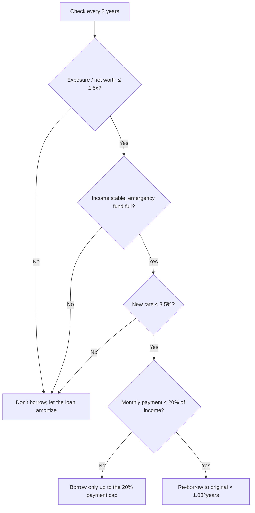

> 🌏 [中文版](/posts/investing/2026-10-02-debt-leverage-personal-loan)

There's an argument making the rounds in Taiwanese investing forums: hold US stocks, US dollars, and Taiwan stocks on the asset side, and borrow in Taiwan dollars and Japanese yen on the liability side. Assets grow 8% a year, debt costs 3%, and you pay the interest by borrowing more against your assets. Start with NT$10M in assets and NT$5M in debt; a year later assets are NT$10.8M and debt is NT$5.15M. The debt got bigger, yet LTV fell from 50% to 47.7%. The conclusion: "Inflation always pays the debt — don't rush to pick up the bill."

This post has two halves. The first takes the argument apart: where the math holds, what it actually earns, and which assumptions go unstated. The second brings it to Taiwan: how an employee earning NT$80k a month can build the same debt path in the September 2026 lending environment — without ever facing a margin call.

## What the argument is calculating

Run the original numbers forward and LTV does fall steadily:

| Year | Assets | Debt | LTV |
|---|---|---|---|
| 0 | 1,000 | 500 | 50.0% |
| 1 | 1,080 | 515 | 47.7% |
| 5 | 1,469 | 580 | 39.4% |
| 10 | 2,159 | 672 | 31.1% |
| 20 | 4,661 | 903 | 19.4% |

The formula is LTV = 50% × (1.03 / 1.08)^years. As long as assets grow faster than the debt's interest rate, the ratio drifts down.

Macroeconomists call this r < g. Former IMF chief economist Olivier Blanchard's 2019 [AEA presidential address, "Public Debt and Low Interest Rates"](https://www.aeaweb.org/articles?id=10.1257/aer.109.4.1197), is about exactly this: when interest rates sit below nominal growth, government debt-to-GDP can fall on its own. The original post's line — "isn't this exactly what the US does with Treasuries?" — is right about the mechanism.

## The profit is the spread, not "not paying interest"

Compare it with the alternative: sell assets each year to pay the interest.

- After year one, net worth is identical either way: NT$5.65M (1,080 − 515 = 1,065 − 500).
- After 20 years, capitalizing the interest leaves about NT$37.58M versus NT$34.75M for selling — a NT$2.83M gap.

That gap exists because each year's interest stays invested earning 8% instead of saving 3%. Paying interest out of salary is the same comparison: invest the salary, or use it to retire 3% debt.

So the whole thing reduces to one line: **keep the leverage as long as expected returns exceed the borrowing cost.** That's sound finance. Every problem lives in the word "expected."

## Three assumptions it never states

### Assumption 1: 8% happens every year

8% is a long-run average, not a yearly return. I ran a 20-year monthly Monte Carlo (normal returns, 8% annualized), triggering on Taiwan's 130% stock-pledge maintenance ratio — an LTV of roughly 77%:

| Starting LTV | 16% annual volatility | 20% annual volatility |
|---|---|---|
| 30% | 3.6% chance of a margin call within 20 years | 12.6% |
| 50% | **23.6%** | **41.2%** |

Real markets have fat tails, so the true odds are higher. At 50% LTV a 35% drawdown hits the line — 2008 and March 2020 both got there.

The original says paying interest "breaks the compounding." But paying interest only costs you the 3% spread. A margin call that forces you to sell at the bottom breaks the compounding on the entire principal, with no second chance.

How much leverage makes sense is worked out with the Kelly criterion and simulations in the "How much leverage" section below.

### Assumption 2: the debt side is a fixed 3%

Borrowing in Taiwan dollars and yen is effectively shorting both currencies — and both tend to rise exactly when you'd least want them to:

- **The yen is a safe haven and usually strengthens in a crash.** From July to August 5, 2024, USD/JPY fell from 161.95 to 144.18 ([BOCOM Hong Kong monthly, in Chinese](https://www.hk.bankcomm.com/hk/uploadhk/infos/202409/03/5049404/20240903143314_Monthly202408.pdf)). Yen borrowers saw their debt swell by more than 10% in weeks while stocks fell.
- **The Taiwan dollar can spike too.** On May 2, 2025, the TWD rose 3.07% in a single day ([Central Bank of the ROC press release, in Chinese](https://www.cbc.gov.tw/tw/cp-302-181423-cc30d-1.html)), and more than 6% over two trading days ([Bloomberg via Yahoo Finance, in Chinese](https://hk.finance.yahoo.com/news/%E5%8F%B0%E5%B9%A3%E7%9B%A4%E5%88%9D%E5%B9%B3%E7%9B%A4%E6%8B%89%E9%8B%B8-%E5%8B%A2%E5%B0%87%E4%BB%A5%E4%BA%94%E5%B9%B4%E4%BE%86%E6%9C%80%E5%A4%A7%E5%B9%B4%E6%BC%B2%E5%B9%85%E7%B5%90%E6%9D%9F%E6%88%B2%E5%8A%87%E5%8C%96%E7%9A%842025%E5%B9%B4-015101218.html)). USD assets lost value overnight in TWD terms.
- **USD cash isn't a risk-free defense either.** The US dollar usually strengthens against the TWD in global sell-offs, which gives Taiwanese investors a hedge — but in that same TWD spike, US dollar cash lost more than 6% in two days.

Rates won't stay at 3% either. Most Taiwanese personal and stock-pledge loans float, and Japan has left zero rates behind.

### Assumption 3: individuals borrow like the US government or companies

The US government can do this because of things no individual has: its debt is in a currency it issues, its central bank is the lender of last resort, and nobody can make a margin call on it.

Companies don't do it either. They roll over principal, but pay interest from operating cash flow, and lenders underwrite on interest coverage. Economist Hyman Minsky's [Financial Instability Hypothesis](https://www.levyinstitute.org/pubs/wp74.pdf) sorts borrowers into three types:

| Type | Cash flow covers | Depends on |
|---|---|---|
| Hedge | Interest + principal | Own cash flow |
| Speculative | Interest only | Rolling over principal |
| Ponzi | Not even interest | Asset prices rising, or always being able to borrow more |

By definition, "borrow against your assets to pay the interest" is Ponzi finance. That's an academic term, not an accusation of fraud. It means the structure only works if assets keep rising and lenders keep lending.

As for "no debt, no money": modern money is indeed created mainly by bank lending, as the [Bank of England's 2014 Quarterly Bulletin](https://www.bankofengland.co.uk/quarterly-bulletin/2014/q1/money-creation-in-the-modern-economy) explains. But that describes the system as a whole; it doesn't imply every individual should borrow as much as possible.

"Inflation pays the debt" is only half true. Under the [Fisher equation](https://en.wikipedia.org/wiki/Fisher_equation), nominal rates already include expected inflation, so inflation only repays the *unexpected* part. With a floating rate, rising inflation brings rate hikes — in 2022, inflation billed borrowers instead.

## How much leverage: Kelly, P10, and maximum drawdown

Everything so far has been about expected values. Picking a leverage multiple also takes three other numbers: long-run geometric growth, the bad-luck outcome (P10), and the deepest drawdown along the way.

I ran a 20-year monthly simulation: 8% annual return, 3% borrowing cost, leverage reset daily to a fixed multiple (like a leveraged ETF), no margin calls, normally distributed returns. Real markets have fat tails, so reality is worse.

**Market volatility 16% a year:**

| Leverage | Geometric growth | 20-year wealth multiple (median) | 20-year wealth multiple (P10) | Max drawdown (median) |
|---|---|---|---|---|
| 1x | 6.7% | 3.8x | 1.5x | −36% |
| 1.5x | 7.6% | 4.6x | 1.2x | −52% |
| 2x | 7.9% | 4.8x | 0.8x | −66% |
| 3x | 6.5% | 3.6x | 0.2x | −85% |
| 4x | 2.5% | 1.6x | 0.04x | −94% |

**Market volatility 20% a year:**

| Leverage | Geometric growth | 20-year wealth multiple (median) | 20-year wealth multiple (P10) | Max drawdown (median) |
|---|---|---|---|---|
| 1x | 6.0% | 3.3x | 1.1x | −47% |
| 1.5x | 6.0% | 3.3x | 0.6x | −66% |
| 2x | 5.0% | 2.7x | 0.3x | −79% |
| 3x | 0% | 1.0x | 0.03x | −94% |

Three things stand out.

**Past the Kelly multiple, more borrowing earns less.** The [Kelly criterion](https://en.wikipedia.org/wiki/Kelly_criterion) puts optimal leverage at roughly excess return ÷ volatility squared — about 1.95x at 16% volatility. Beyond that point, geometric growth falls. At 20% volatility, 3x leverage has zero long-run growth: all of the risk, none of the average reward. A personal loan plus a 2x ETF plus a stock pledge easily stacks past 3x.

**The Kelly multiple is extremely sensitive to its inputs.** Raise volatility from 16% to 20% and optimal leverage drops from 1.95x to 1.25x. Nobody knows future volatility and returns in advance, which is why practitioners tend to use half-Kelly — about 0.6x to 1x under these assumptions. The rational range for leverage is narrower than most people think.

**A good median doesn't mean you'll get it.** At 2x the median outcome is 4.8x, yet there's a 10% chance of losing money over 20 years, and the median max drawdown is −66% — roughly even odds of watching two-thirds of your balance disappear at some point. Real returns also have to absorb the cost of panicking and selling at the bottom, which no simulation captures.

### The problem is leverage, not liability

Borrowing itself isn't the risk; the risk is how much the borrowed money multiplies your market exposure. That's why debt with no maintenance ratio — personal loans, interest-only mortgages — suits long-term holding better than positions marked to market like stock pledges or options: however far prices fall, nobody can force you to sell at the bottom.

But **no maintenance ratio doesn't mean no risk** — the risk just moves:

- **Cash flow:** monthly payments keep coming, and an income gap means dipping into savings or selling stock.
- **Rollover:** "never repay" depends on being able to refinance every time. Banks look at your income, your [DBR22](https://law.fsc.gov.tw/LawContentSearch.aspx?id=FE052046) headroom, and the cross-industry credit query, and they tighten in downturns.

Inflation also erodes debt more slowly than people imagine: at 2% inflation, NT$800k of debt still has a real value of about NT$650k after 10 years. What really sustains "never repay" is the ongoing ability to borrow; inflation is only a small part of it.

### The conditions for borrowing like this

A strategy that works beautifully for some people doesn't fit everyone. Before you start, check yourself against these four:

1. **High, stable income:** monthly payments and every refinancing approval depend on it.
2. **A job that doesn't move with the market:** if you work in tech and your stocks are concentrated in Taiwan, a crash and a layoff can arrive together.
3. **A real cash buffer:** at least six months of living costs plus loan payments, so you never have to sell in a crash.
4. **Proven drawdown tolerance:** recall your largest paper loss — did you carry on normally and not sell? If you've never been through one, stay at 1.5x or below at first.

If any one of the four doesn't hold, lower the leverage instead of telling yourself "it always comes back in the long run."

## Bringing it to Taiwan: three debt tools as of September 2026

To copy the strategy, a debt tool needs three things: no pressure to repay principal, the ability to borrow more to cover interest, and no margin calls. Here's what an ordinary Taiwanese employee could choose from when checked on September 28, 2026:

| | Personal loan | Broker stock pledge (unrestricted-purpose lending) | Bank stock pledge |
|---|---|---|---|
| Rate | Credit-based; 3.08% in this post's case | About 3.5–3.92% for 0050-type ETFs | From 2.95%, plus fees |
| Margin calls | **None** | Yes, at 130% maintenance | Yes |
| Principal | Amortizes monthly | Interest-only, max 18 months | 1-year renewable |
| Credit-line risk | Capped by [DBR22](https://law.fsc.gov.tw/LawContentSearch.aspx?id=FE052046) | Subject to brokers' 4x-net-worth cap | Not subject to the broker cap |

### Broker pledges: from "cheap and easy" to "ask first whether you can borrow at all"

The TWSE's [rules for broker unrestricted-purpose lending (in Chinese)](https://twse-regulation.twse.com.tw/m/LawContent.aspx?FID=FL080086) allow up to 60% LTV for marginable stocks and 40% for non-marginable ones; if maintenance drops below 130% you have 2 business days to restore 166%; each loan runs 6 months, extendable to a maximum of 18.

The same rules cap a broker's margin lending, securities-business lending, and unrestricted-purpose lending combined at 4x its net worth. After Taiwan stocks surged and borrowing demand exploded, many brokers tightened from late April 2026:

- **Fubon Securities** suspended new unrestricted-purpose loans from May 13 ([Fubon announcement, in Chinese](https://www.fbs.com.tw/wcm/new_web/trade/trade_20260512_549095.html)).
- **Yuanta Securities Finance** briefly capped borrowing at NT$100k per person per day and lifted the cap on July 8, but raised its promotional rate from 2.89% to 3.92% from July 1 and dropped leveraged ETFs from the promotion ([Economic Daily News, in Chinese](https://money.udn.com/money/story/5613/9583922); [Yuanta promo page, in Chinese](https://www.yuantafinance.com.tw/SF_event_page/)).
- **Mega Securities** moved 0050 and its constituents from 3% to 3.5% on June 25 ([Mega promo page, in Chinese](https://project.emega.com.tw/megastockloan/)).
- **SinoPac Securities** charged ordinary clients 3.5% on preferred ETFs for July–September (per a [rate sheet published by a SinoPac broker, in Chinese](https://www.spf010166.com/news/34) — not an official source; the official calculator is in [SinoPac's lending zone, in Chinese](https://www.sinotrade.com.tw/newweb/loan-zone/)).

On August 27 the FSC confirmed it would not relax the 4x cap; the industry stood at about 162% of net worth at end-July ([Economic Daily News, in Chinese](https://money.udn.com/money/story/5612/9718813)). Two newer rules matter too. From September 4, brokers must notify clients before changing rates or fees ([Economic Daily News, in Chinese](https://money.udn.com/money/story/5607/9704312)). And a cross-industry credit query platform is expected to launch at the end of October 2026: with the client's consent, brokers will see bank borrowing and banks will see broker financing ([Economic Daily News, in Chinese](https://udn.com/news/story/7251/9771424)).

One more thing to remember: broker loans last at most 18 months before you must refinance, and some brokers refused refinancing this year. For a "never repay" strategy, a broker pledge is not permanent debt.

If you do use a pledge, let LTV decide where the interest comes from, instead of capitalizing it unconditionally every year:

| LTV this quarter | How to pay interest |
|---|---|
| < 25% | Borrow more to pay it (the original approach) |
| 25–35% | Pay from dividends or salary; no new debt |
| > 35% | Pay from salary and repay some principal |

### Bank pledges: lower rates, but fixed fees wipe out the advantage on small loans

| Bank | Rate | Fees |
|---|---|---|
| [Cathay United Bank (in Chinese)](https://www.cathaybk.com.tw/cathaybk/personal/loan/product/stock-collateral-loan/) | From 2.95% | NT$20,000 account fee |
| [Yuanta Bank (in Chinese)](https://www.yuantabank.com.tw/bank/loan/stock/list.do) | 2.98%–5.40% | NT$3,000–20,000 |
| [Bank SinoPac (in Chinese)](https://bank.sinopac.com/sinopacBT/personal/loan/other-personal-loan/stock.html) | From 3.41% | NT$15,000 |

Borrow NT$300k for a year at Cathay's 2.95% plus the NT$20k fee and the real cost is about 9.6%; a broker at 3.5% with no fees costs 3.5%. Bank pledges only pay off at several million NT dollars.

## Case study: Employee A's balance sheet

Suppose Employee A looks like this:

- Monthly income NT$80k
- Personal loan NT$800k at 3.08%, 7-year term
- Individual stocks NT$400k and a 2x Taiwan 50 ETF (00631L) worth NT$600k
- The NT$800k loan proceeds are still sitting in cash

| Item | Amount | Market exposure |
|---|---|---|
| Individual stocks | 400k | 400k |
| 2x ETF | 600k | 1.2M |
| Cash | 800k | 0 |
| Personal loan | −800k | — |
| Net worth | 1.0M | 1.6M (1.6x) |

A's loan costs 3.08% — cheaper than a broker pledge and immune to margin calls. **At A's scale, the personal loan is the best leverage tool available, and stock pledging can wait.**

The open question is how to deploy the NT$800k in cash:

| Option | Exposure / net worth | Net worth if market −30% | Net worth if market +20% |
|---|---|---|---|
| Keep it all in cash | 1.6x | 550k | 1.32M |
| **300k cash, 500k into a market-cap ETF** | **2.1x** | **400k** | **1.42M** |
| All into a market-cap ETF | 2.4x | 310k | 1.48M |
| All into the 2x ETF | 3.2x | ~110k | 1.64M |

The table includes the daily-reset decay a 2x ETF suffers in a sharp fall. Going all-in on the 2x ETF earns only NT$220k more than option two in a rally, but leaves about a tenth of net worth after a crash.

Option two's 2.1x sits inside the roughly 2x that [Lifecycle Investing](/en/posts/investing/2026-06-19-2x-etf-system-three-books-en) suggests for young investors. That's higher than the half-Kelly figure above because the lifecycle approach counts future salary as part of total wealth: A has only NT$1M in financial assets, but decades of future income far exceed that, so on a total-wealth basis the real leverage is well under 2x. The argument only holds if the four conditions in "The conditions for borrowing like this" are met — above all, stable income.

New money is better placed in US or global indexes, since A's individual stocks and 2x ETF are already all in Taiwan.

## Replicating the original debt path with a personal loan

A personal loan amortizes, so interest can't roll into the balance. The workaround: **every 3 years, top up or refinance back to "original × 1.03^years."**

First, how A's loan shrinks (about NT$10,600 a month, 13% of income):

| Point in time | Remaining principal | Principal repaid |
|---|---|---|
| After 1 year | ~700k | ~100k |
| After 2 years | ~590k | ~210k |
| After 3 years | ~480k | ~320k |
| After 5 years | ~250k | ~550k |

Then, the target at each re-borrow:

| Time | Original strategy's debt (interest capitalized) | A re-borrows to |
|---|---|---|
| Now | 800k | 800k |
| Year 3 | 870k | 870k |
| Year 6 | 960k | 960k |
| Year 9 | 1.04M | 1.04M |

Take year 3: A has paid about NT$380k from salary over three years. The remaining principal is about NT$480k; topping up to NT$870k returns about NT$400k in cash. That's slightly more than A paid in, so the salary payments in between were only a temporary advance. The net effect approximates "borrow to pay interest, never repay principal" — with no margin-call risk at any point.

Check conditions before borrowing, not market prices:

The 20%-of-income payment line is my conservative suggestion, not a regulation. The legal ceiling is [DBR22](https://law.fsc.gov.tw/LawContentSearch.aspx?id=FE052046), which puts A at about NT$1.76M — but at that size the monthly payment exceeds NT$23k, which A couldn't sustain through a job loss.

This version adds a safety net the original lacks: if a re-borrow is ever unavailable, or rates are too high to want one, the loan simply keeps amortizing and leverage falls. Nothing breaks. The original requires being able to borrow every single year — the one thing an individual can least guarantee.

## Top-up loan vs. refinancing vs. revolving credit

All three "get the money back." They differ in who lends, how funds are disbursed, and where the costs sit:

| | Top-up at your current bank | Refinancing (debt takeover) | Revolving credit line |
|---|---|---|---|
| How it works | Your current bank adds to the loan or approves a new one | A new bank grants a larger loan, pays off the old one directly, and disburses the rest to you | A credit line; you pay interest only on what you draw |
| Closeness to the original strategy | Medium | Medium | **Closest** — you can draw on the line to pay interest |
| Approval | Usually easier; the bank has your payment history | Full re-underwriting and a fresh credit-bureau check | Full re-underwriting |
| Cost | Setup fee; rate depends on conditions then | New setup fee, plus an early-repayment penalty on the old loan if still in lock-in | Rates usually above standard personal loans |
| Risk | Your bank's offer may not be the best | Applying to too many banks at once lowers your credit score | The bank can cut or freeze the line |
| Best for | First choice | Backup when your bank's terms are poor | Only if you find a rate close to a standard loan |

### Top-up steps

1. Make sure you've paid on time for at least 12 months.
2. Check your bank's app or online banking for top-up offers, rates, and fees.
3. Prepare proof of income: payroll deposits, withholding statements, bank balances.
4. Apply, get approved, receive funds — state the purpose honestly.

### Refinancing steps

1. Read the old contract's lock-in period and penalty, and **refinance only after lock-in ends** to avoid the penalty.
2. One to three months before applying: pay cards in full, never late, no new cards or loans.
3. Compare rates and fees using banks' online calculators; formally apply to only one or two.
4. Once approved, the new bank pays off the old loan directly and sends you the remainder.
5. Get a **payoff certificate** from the old bank confirming the loan is closed.

### After either one

- Deploy the new money per your existing allocation — don't jump to a higher-leverage product just because you have fresh cash.
- Your monthly payment may rise, so top the emergency fund back up to six months of living costs plus loan payments.
- Once the cross-industry query platform is live, banks will see broker financing too. Holding both a personal loan and a pledge may affect approval terms.

## What you can do tonight

1. Open your loan contract or banking app and note three things: whether the rate is fixed for the full term, how long the lock-in lasts, and the early-repayment penalty.
2. Calculate your exposure multiple: stock value plus 2x ETF value × 2, divided by assets minus debt. Above 2x, don't borrow more.
3. Set a calendar reminder three years out titled "Loan re-borrow check," and paste in the four conditions from the flowchart above.

## References

- [Olivier Blanchard, Public Debt and Low Interest Rates (American Economic Review, 2019)](https://www.aeaweb.org/articles?id=10.1257/aer.109.4.1197)
- [Hyman Minsky, The Financial Instability Hypothesis (Levy Institute Working Paper No. 74)](https://www.levyinstitute.org/pubs/wp74.pdf)
- [Bank of England, Money creation in the modern economy (2014 Q1)](https://www.bankofengland.co.uk/quarterly-bulletin/2014/q1/money-creation-in-the-modern-economy)
- [Kelly criterion (Wikipedia)](https://en.wikipedia.org/wiki/Kelly_criterion)
- [Fisher equation (Wikipedia)](https://en.wikipedia.org/wiki/Fisher_equation)
- [BOCOM Hong Kong: Recent yen exchange-rate trends, August 2024 (in Chinese)](https://www.hk.bankcomm.com/hk/uploadhk/infos/202409/03/5049404/20240903143314_Monthly202408.pdf)
- [Central Bank of the ROC: Explanation of the TWD appreciation on May 2 (in Chinese)](https://www.cbc.gov.tw/tw/cp-302-181423-cc30d-1.html)
- [Bloomberg via Yahoo Finance: TWD ends 2025 with its biggest annual gain in five years (in Chinese)](https://hk.finance.yahoo.com/news/%E5%8F%B0%E5%B9%A3%E7%9B%A4%E5%88%9D%E5%B9%B3%E7%9B%A4%E6%8B%89%E9%8B%B8-%E5%8B%A2%E5%B0%87%E4%BB%A5%E4%BA%94%E5%B9%B4%E4%BE%86%E6%9C%80%E5%A4%A7%E5%B9%B4%E6%BC%B2%E5%B9%85%E7%B5%90%E6%9D%9F%E6%88%B2%E5%8A%87%E5%8C%96%E7%9A%842025%E5%B9%B4-015101218.html)
- [TWSE: Rules for broker unrestricted-purpose lending (in Chinese)](https://twse-regulation.twse.com.tw/m/LawContent.aspx?FID=FL080086)
- [FSC: DBR22 personal unsecured loan guidance (in Chinese)](https://law.fsc.gov.tw/LawContentSearch.aspx?id=FE052046)
- [Economic Daily News: FSC keeps brokers' 4x net-worth lending cap (2026-08-28, in Chinese)](https://money.udn.com/money/story/5612/9718813)
- [Economic Daily News: FSC targets stacked borrowing and settlement defaults (2026-09-22, in Chinese)](https://udn.com/news/story/7251/9771424)
- [Economic Daily News: Brokers must give advance notice of rate changes (2026-08-20, in Chinese)](https://money.udn.com/money/story/5607/9704312)
- [Economic Daily News: Yuanta Securities Finance adjusts pledge promo rates (2026-06-23, in Chinese)](https://money.udn.com/money/story/5613/9583922)
- [Fubon Securities: Suspension of unrestricted-purpose lending (2026-05-12, in Chinese)](https://www.fbs.com.tw/wcm/new_web/trade/trade_20260512_549095.html)
- [Yuanta Securities Finance: Stock pledge promotion (in Chinese)](https://www.yuantafinance.com.tw/SF_event_page/)
- [Mega Securities: Stock lending promotion (in Chinese)](https://project.emega.com.tw/megastockloan/)
- [SinoPac Securities: Lending zone (in Chinese)](https://www.sinotrade.com.tw/newweb/loan-zone/)
- [SinoPac broker site: Unrestricted-purpose lending rate sheet (unofficial, in Chinese)](https://www.spf010166.com/news/34)
- [Cathay United Bank: Stock collateral loan (in Chinese)](https://www.cathaybk.com.tw/cathaybk/personal/loan/product/stock-collateral-loan/)
- [Yuanta Bank: Stock-secured loan (in Chinese)](https://www.yuantabank.com.tw/bank/loan/stock/list.do)
- [Bank SinoPac: Stock collateral loan (in Chinese)](https://bank.sinopac.com/sinopacBT/personal/loan/other-personal-loan/stock.html)
- [I Saw This 2x ETF System on Threads — It Comes From 3 Books](/en/posts/investing/2026-06-19-2x-etf-system-three-books-en)
