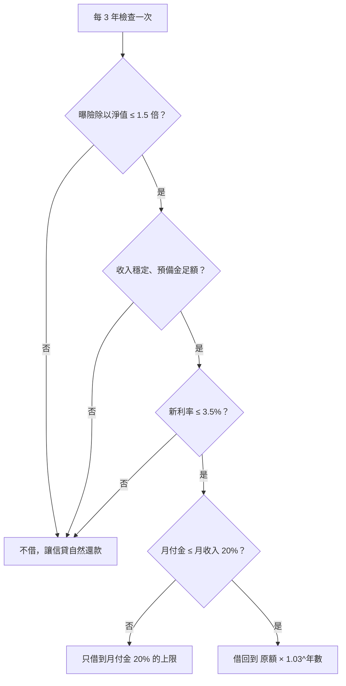

> 🌏 [English version](/en/posts/investing/2026-10-02-debt-leverage-personal-loan-en)

網路上流傳一種說法：資產端是美股、美元、台股，負債端是台幣、日圓。資產每年長 8%，負債利率 3%，利息就從資產端再借出來付。1,000 萬資產配 500 萬負債，一年後資產變 1,080 萬、負債變 515 萬，負債總額變大了，LTV 卻從 50% 降到 47.7%。結論是「債務永遠是通膨在還，你我千萬不要搶著買單」。

這篇分兩半。前半拆這套說法：數學哪裡對、真正在賺什麼、沒說出口的前提是什麼。後半落地到台灣：一個月收入 8 萬的上班族，在 2026 年 9 月的借貸環境下，可以怎麼做出同一條負債路徑，而且不會被斷頭。

## 這套說法在算什麼

照原文條件算下去，LTV 確實一路下降：

| 年 | 資產 | 負債 | LTV |
|---|---|---|---|
| 0 | 1,000 | 500 | 50.0% |
| 1 | 1,080 | 515 | 47.7% |
| 5 | 1,469 | 580 | 39.4% |
| 10 | 2,159 | 672 | 31.1% |
| 20 | 4,661 | 903 | 19.4% |

公式是 LTV = 50% ×（1.03 / 1.08）^年數。只要資產成長率高於負債利率，比例就會往下走。

總體經濟學裡這叫 r < g。前 IMF 首席經濟學家 Olivier Blanchard 在 2019 年的 [AEA 會長演說〈Public Debt and Low Interest Rates〉](https://www.aeaweb.org/articles?id=10.1257/aer.109.4.1197)裡討論的就是同一件事：利率低於名目成長率時，政府債務占 GDP 的比例可以自然下降。原文說「這不就是美國與美債一直在做的事」，在機制上沒說錯。

## 真正賺的是利差，不是「不付息」

拿另一種做法來比：每年賣資產付息。

- 第一年結束，兩種做法的淨值一模一樣，都是 565 萬（1,080 − 515 = 1,065 − 500）。
- 20 年後，滾息的淨值約 3,758 萬，賣資產付息的約 3,475 萬，差 283 萬。

這 283 萬的來源，是每年那筆利息拿去賺 8%，而不是用來省 3%。用薪水付息也是同樣的比較：薪水投入市場，或是拿去還 3% 的債。

所以整套邏輯濃縮成一句：**預期報酬大於借款成本，就維持槓桿。**這是正確的財務邏輯，問題全部出在「預期」兩個字。

## 它沒說出口的三個前提

### 前提一：8% 每年都會發生

8% 是長期平均，不是每一年的報酬。我用月頻蒙地卡羅跑了 20 年（假設常態分布、年化報酬 8%），觸發條件設在台灣股票質押的維持率 130%，也就是 LTV 約 77%：

| 起始 LTV | 資產年化波動 16% | 資產年化波動 20% |
|---|---|---|
| 30% | 20 年內被追繳機率 3.6% | 12.6% |
| 50% | **23.6%** | **41.2%** |

真實市場有肥尾，實際機率只會更高。LTV 50% 時，資產跌 35% 就碰線，2008 年和 2020 年 3 月都碰得到。

原文說付息會「打斷複利」，但付息打斷的只是 3% 的利差。被追繳、在低點賣掉，打斷的是整個本金，而且沒有第二次機會。

槓桿該開到幾倍，後面「槓桿要開多大」一節會用凱利準則和模擬來算。

### 前提二：負債端是固定的 3%

原文的負債是台幣和日圓，這等於同時放空這兩種貨幣，而它們都會在你最不希望的時候升值：

- **日圓是避險貨幣，股災時通常升值。**2024 年 7 月到 8 月 5 日，美元兌日圓從 161.95 跌到 144.18（[交通銀行香港月報](https://www.hk.bankcomm.com/hk/uploadhk/infos/202409/03/5049404/20240903143314_Monthly202408.pdf)），借日圓的人負債在幾週內膨脹一成以上，同時股市在跌。
- **台幣也會急升。**2025 年 5 月 2 日，新台幣一天升值 3.07%（[中央銀行新聞稿](https://www.cbc.gov.tw/tw/cp-302-181423-cc30d-1.html)），兩個交易日合計升幅超過 6%（[彭博報導](https://hk.finance.yahoo.com/news/%E5%8F%B0%E5%B9%A3%E7%9B%A4%E5%88%9D%E5%B9%B3%E7%9B%A4%E6%8B%89%E9%8B%B8-%E5%8B%A2%E5%B0%87%E4%BB%A5%E4%BA%94%E5%B9%B4%E4%BE%86%E6%9C%80%E5%A4%A7%E5%B9%B4%E6%BC%B2%E5%B9%85%E7%B5%90%E6%9D%9F%E6%88%B2%E5%8A%87%E5%8C%96%E7%9A%842025%E5%B9%B4-015101218.html)）。美元資產換算回台幣，瞬間縮水。
- **美元現金也不是零風險的防守。**全球股災時美元通常走強，對台灣投資人有避險效果；但上面那次台幣急升，放在手上的美元現金兩天就少了 6% 以上。

利率也不會一直是 3%。台灣的信貸和質借多半是機動利率，日本也已經結束零利率。

### 前提三：個人和美國政府、企業是同一種借款人

美國政府這樣做，靠的是個人沒有的條件：負債用自己發行的貨幣計價、自己的央行是最後貸款人、沒有維持率這回事。

企業也不是這樣做的。企業通常會展延本金，但利息由營業現金流支付，銀行授信看的是利息保障倍數。經濟學家 Hyman Minsky 在[金融不穩定假說](https://www.levyinstitute.org/pubs/wp74.pdf)中，把借款人分成三種：

| 類型 | 現金流能支付 | 依賴 |
|---|---|---|
| 避險型（hedge） | 利息 + 本金 | 自身現金流 |
| 投機型（speculative） | 只有利息 | 本金要能展延 |
| Ponzi 型 | 連利息都付不出 | 資產價格持續上漲，或能一直借到錢 |

照字面定義，「從資產端再借出來付利息」落在 Ponzi 型。這是學術用語，不是說誰在詐騙；它的意思是，這個結構成立與否，取決於資產一直漲，而且金融機構一直願意借你。

至於「沒有負債就沒有貨幣」：現代貨幣確實主要由銀行放款創造，[英格蘭銀行 2014 年的季報](https://www.bankofengland.co.uk/quarterly-bulletin/2014/q1/money-creation-in-the-modern-economy)寫得很清楚。但這是總體描述，推不出「每個人都該借越多越好」。

「債務是通膨在還」也只對了一部分。根據[費雪方程式](https://en.wikipedia.org/wiki/Fisher_equation)，名目利率已經包含預期通膨，通膨只會替你還掉「超出預期」的那一段。如果是機動利率，通膨一升、央行升息，2022 年就是通膨反過來向借款人收錢。

## 槓桿要開多大：凱利、P10 與最大回撤

前面算的都是期望值。決定槓桿倍數，還要看三個數字：長期的幾何成長率、壞運氣時的結果（P10），以及途中最深的回撤。

我用模型跑了 20 年的月頻模擬：年化報酬 8%、借款成本 3%、每天重設成固定槓桿（類似槓桿 ETF）、不會被追繳、報酬呈常態分布。真實市場有肥尾，結果只會更差。

**大盤年化波動 16%：**

| 槓桿 | 幾何成長率 | 20 年資產倍數（中位數） | 20 年資產倍數（P10） | 最大回撤（中位數） |
|---|---|---|---|---|
| 1 倍 | 6.7% | 3.8 倍 | 1.5 倍 | −36% |
| 1.5 倍 | 7.6% | 4.6 倍 | 1.2 倍 | −52% |
| 2 倍 | 7.9% | 4.8 倍 | 0.8 倍 | −66% |
| 3 倍 | 6.5% | 3.6 倍 | 0.2 倍 | −85% |
| 4 倍 | 2.5% | 1.6 倍 | 0.04 倍 | −94% |

**大盤年化波動 20%：**

| 槓桿 | 幾何成長率 | 20 年資產倍數（中位數） | 20 年資產倍數（P10） | 最大回撤（中位數） |
|---|---|---|---|---|
| 1 倍 | 6.0% | 3.3 倍 | 1.1 倍 | −47% |
| 1.5 倍 | 6.0% | 3.3 倍 | 0.6 倍 | −66% |
| 2 倍 | 5.0% | 2.7 倍 | 0.3 倍 | −79% |
| 3 倍 | 0% | 1.0 倍 | 0.03 倍 | −94% |

從這兩張表看得出三件事。

**超過凱利倍數，借越多賺越少。**[凱利準則](https://en.wikipedia.org/wiki/Kelly_criterion)的最佳槓桿約等於「超額報酬 ÷ 波動的平方」，波動 16% 時約 1.95 倍。過了這個點，幾何成長率開始往下掉。在波動 20% 的假設下，3 倍槓桿的長期成長率是 0：承擔了所有風險，平均什麼都沒賺到。信貸加正 2 再加質押，很容易就疊到 3 倍以上。

**凱利倍數對參數非常敏感。**波動從 16% 變成 20%，最佳槓桿就從 1.95 倍掉到 1.25 倍。沒有人事前知道未來的波動和報酬，所以實務上多半用半凱利；照上面的假設，半凱利大約落在 0.6 到 1 倍之間。理性的槓桿空間，比多數人以為的小。

**中位數好看，不代表你拿得到。**2 倍槓桿的中位數是 4.8 倍，但有 10% 的機會 20 年後是虧錢的；最大回撤的中位數是 −66%，也就是大約一半的機率，要看著帳面少掉三分之二。真實報酬還要扣掉「撐不住、賣在低點」的心理成本，這部分模擬算不出來。

### 有問題的是 leverage，不是 liability

借錢本身不是風險，風險來自借來的錢讓你的市場曝險放大了幾倍。這也是為什麼沒有維持率的負債，像信貸、只繳息的房貸，比股票質押、選擇權這類會被市價追繳的部位更適合長期持有：股價跌再深，也沒有人能強迫你在低點賣出。

但**沒有維持率不等於沒有風險**，風險只是換了地方：

- **現金流**：每個月的月付金照繳，收入一中斷就要動用存款或賣股。
- **借新還舊**：「債永遠不還」靠的是每次到期都借得到。銀行會看你的收入、[DBR22](https://law.fsc.gov.tw/LawContentSearch.aspx?id=FE052046) 額度、四貸同堂的查詢結果，景氣差時也會收緊。

通膨稀釋債務的速度也比想像中慢：通膨 2% 時，80 萬的負債 10 年後實質價值大約還有 65 萬。撐起「永遠不還」的主要是持續借得到錢的能力，通膨只佔一小部分。

### 能這樣借的條件

這套做法在某些人身上運作得很好，不代表每個人都適用。動手前先拿自己對照這四項：

1. **收入高而且穩定**：月付金和每次借新還舊的審核，靠的都是收入。
2. **工作和股市的相關性低**：股災時工作不會跟著出問題。在科技業上班、持股又集中在台股的人，股災和裁員可能同時發生。
3. **有足夠的現金緩衝**：至少 6 個月的「生活費 + 月付金」，讓你股災時不用賣股。
4. **撐得住回撤**：回想自己經歷過最大的帳面虧損，當時有沒有照常生活、沒有賣出。沒經歷過的話，先用 1.5 倍以內試。

四項裡有任何一項不符合，就把槓桿往下調，而不是靠「長期會漲回來」說服自己。

## 落地台灣：三種負債工具的 2026 年 9 月現況

要複製這套做法，負債工具要符合三個條件：可以不急著還本金、可以借新錢付利息、不會被追繳。台灣一般上班族手上的選項，在 2026 年 9 月 28 日查證時長這樣：

| 項目 | 信用貸款 | 券商股票質押（不限用途借貸） | 銀行股票質押 |
|---|---|---|---|
| 利率 | 依個人信用，本文案例 3.08% | 0050 類約 3.5～3.92% | 2.95% 起，另收費用 |
| 會被追繳嗎 | **不會** | 會，維持率 130% | 會 |
| 本金 | 每月攤還 | 只繳息，最長 18 個月 | 1 年續約 |
| 額度風險 | 受 [DBR22](https://law.fsc.gov.tw/LawContentSearch.aspx?id=FE052046) 限制 | 受券商「淨值 4 倍」上限影響 | 不受券商上限影響 |

### 券商質押：今年從「便宜好借」變成「要先問借不借得到」

[證券商辦理不限用途款項借貸業務操作辦法](https://twse-regulation.twse.com.tw/m/LawContent.aspx?FID=FL080086)規定：可融資融券的股票最高借 60%，不可融資融券的借 40%；維持率低於 130% 要在 2 個營業日內補到 166%；每筆 6 個月，最長展延到 18 個月。

同一份辦法也規定，券商的融資、借貸款項、不限用途借貸三項加總不得超過淨值 4 倍。台股大漲、借款需求暴增後，今年 4 月底起多家券商限縮：

- **富邦證券** 5 月 13 日起全面暫停不限用途借貸新案（[富邦官方公告](https://www.fbs.com.tw/wcm/new_web/trade/trade_20260512_549095.html)）。
- **元大證金** 一度限每人每日 10 萬，7 月 8 日解除限額，但專案利率從 7 月 1 日起由 2.89% 調到 3.92%，並剔除槓桿型 ETF（[經濟日報](https://money.udn.com/money/story/5613/9583922)、[元大證金專案頁](https://www.yuantafinance.com.tw/SF_event_page/)）。
- **兆豐證券** 0050 與成分股 6 月 25 日起由 3% 調為 3.5%（[兆豐專案頁](https://project.emega.com.tw/megastockloan/)）。
- **永豐金證券** 7 到 9 月一般客戶優選 ETF 為 3.5%（營業員公布的[費率表](https://www.spf010166.com/news/34)，非官方來源；官方試算見[永豐借貸專區](https://www.sinotrade.com.tw/newweb/loan-zone/)）。

金管會 8 月 27 日確定不放寬 4 倍上限，7 月底業界水位約為淨值的 162%（[經濟日報](https://money.udn.com/money/story/5612/9718813)）。另外兩項新制：9 月 4 日起，券商調整利率或費用前要事先通知客戶（[經濟日報](https://money.udn.com/money/story/5607/9704312)）；「四貸同堂」跨業查詢平台預計 10 月底上線，經客戶同意後，券商看得到你在銀行的借款，銀行也看得到你在券商的融資（[經濟日報](https://udn.com/news/story/7251/9771424)）。

還有一點要記得：券商借款最長 18 個月，之後要借新還舊，而今年已經有券商拒絕借新還舊。對「債永遠不還」的策略來說，券商質押並不是永久負債。

如果真的要用質押，建議用 LTV 決定利息從哪裡出，而不是每年無條件滾息：

| 當季 LTV | 利息怎麼付 |
|---|---|
| < 25% | 可以借新錢付息（照原文做法） |
| 25～35% | 用股息或薪水付，不再增加負債 |
| > 35% | 用薪水付，並另外還一部分本金 |

### 銀行質押：利率低，但固定費用會吃掉小額借款的優勢

| 銀行 | 利率 | 費用 |
|---|---|---|
| [國泰世華](https://www.cathaybk.com.tw/cathaybk/personal/loan/product/stock-collateral-loan/) | 2.95% 起 | 帳務管理費 2 萬元 |
| [元大銀行](https://www.yuantabank.com.tw/bank/loan/stock/list.do) | 2.98%～5.40% | 3,000～20,000 元 |
| [永豐銀行](https://bank.sinopac.com/sinopacBT/personal/loan/other-personal-loan/stock.html) | 3.41% 起 | 15,000 元 |

借 30 萬、借一年，國泰世華 2.95% 加 2 萬帳管費，實際成本約 9.6%；券商 3.5% 免手續費就是 3.5%。銀行質押要借到幾百萬才划算。

## 案例：上班族 A 的負債表

假設上班族 A 的狀況如下：

- 月收入 8 萬
- 信貸 80 萬，年利率 3.08%，7 年期
- 個股 40 萬、正 2（00631L）60 萬
- 信貸撥下來的 80 萬還是現金

| 項目 | 金額 | 市場曝險 |
|---|---|---|
| 個股 | 40 萬 | 40 萬 |
| 正 2 | 60 萬 | 120 萬 |
| 現金 | 80 萬 | 0 |
| 信貸 | −80 萬 | — |
| 淨值 | 100 萬 | 160 萬（1.6 倍） |

A 的信貸 3.08%，比券商質押便宜，而且不會被追繳。**以 A 的規模，信貸就是最好的槓桿工具，股票質押這一步可以先不做。**

接下來的問題是 80 萬現金怎麼投入：

| 方案 | 曝險／淨值 | 大盤 −30% 時淨值 | 大盤 +20% 時淨值 |
|---|---|---|---|
| 全部留現金 | 1.6 倍 | 55 萬 | 132 萬 |
| **30 萬現金，50 萬買市值型 ETF** | **2.1 倍** | **40 萬** | **142 萬** |
| 全部買市值型 ETF | 2.4 倍 | 31 萬 | 148 萬 |
| 全部買正 2 | 3.2 倍 | 約 11 萬 | 164 萬 |

正 2 在大跌時因為每日重設會有耗損，表中已經估進去。全部押正 2，上漲時只比第二案多 22 萬，下跌時淨值剩約十分之一。

第二案的 2.1 倍，落在[《生命週期投資法》](/posts/investing/2026-06-19-2x-etf-system-three-books)建議年輕人約 2 倍的範圍內。這比前面算出的半凱利高，是因為生命週期的算法把未來的薪水也算進總財富：A 的金融資產只有 100 萬，但未來二三十年的收入遠大於此，以總財富計算，實際槓桿並沒有 2 倍。這個說法要成立，前提是前面「能這樣借的條件」那四項都符合，尤其是收入穩定。

新投入的錢建議放美股或全球指數，因為個股和正 2 已經全部押在台股上。

## 用信貸複製原文的負債路徑

信貸每月還本金，沒辦法讓利息滾進負債。替代做法是：**每 3 年增貸或轉貸一次，借回到「原額 × 1.03^年數」。**

先看 A 的信貸怎麼縮小（每月還款約 10,600 元，占收入 13%）：

| 時間點 | 剩餘本金 | 已還本金 |
|---|---|---|
| 1 年後 | 約 70 萬 | 約 10 萬 |
| 2 年後 | 約 59 萬 | 約 21 萬 |
| 3 年後 | 約 48 萬 | 約 32 萬 |
| 5 年後 | 約 25 萬 | 約 55 萬 |

再看每次要借回到多少：

| 時間 | 原文的負債（利息滾入） | A 每次借回到 |
|---|---|---|
| 現在 | 80 萬 | 80 萬 |
| 第 3 年 | 87 萬 | 87 萬 |
| 第 6 年 | 96 萬 | 96 萬 |
| 第 9 年 | 104 萬 | 104 萬 |

以第 3 年為例：這 3 年 A 用薪水繳了約 38 萬；第 3 年剩餘本金約 48 萬，增貸回 87 萬，拿回約 40 萬現金。拿回的錢比繳出去的多一點，所以中間用薪水繳款，只是暫時墊付。淨效果接近原文的「借新錢付利息、本金不還」，而且全程不會被追繳。

借之前用條件檢查，不要看行情：

月付金占收入 20% 是我建議的保守線，不是法規。法規上限是 [DBR22](https://law.fsc.gov.tw/LawContentSearch.aspx?id=FE052046)，A 的上限約 176 萬，但借到那裡月付金會超過 2.3 萬，一旦收入中斷就撐不住。

這個做法比原文多一層保險：就算哪一次借不到、或利率太高不想借，信貸也只是繼續自然還款，槓桿下降，不會出事。原文的做法要求每年都借得到錢，這是個人最難保證的一件事。

## 增貸、轉貸、循環型信貸差在哪

三種都能「把錢借回來」，差別在跟誰借、怎麼撥款、成本在哪：

| 項目 | 原銀行增貸 | 轉貸（代償） | 循環型信貸 |
|---|---|---|---|
| 做法 | 向原本的銀行在現有貸款上加借，或另外核一筆新信貸 | 向新銀行申請較大的信貸，由新銀行直接還清舊貸款，剩餘金額撥給你 | 核一個額度，用多少算多少的利息 |
| 跟原文的接近程度 | 中 | 中 | **最接近**，可以動用額度付利息 |
| 審核 | 原銀行有你的繳款紀錄，通常較容易 | 重新審核，要再跑一次聯徵 | 重新審核 |
| 成本 | 開辦費，利率看當時條件 | 新開辦費；在綁約期內還要付舊貸款違約金 | 利率通常比一般信貸高 |
| 風險 | 原銀行條件不一定最好 | 短時間內申請太多家，信用評分會下降 | 銀行可以調降或凍結額度 |
| 適合 | 優先選項 | 原銀行條件差時的備案 | 找到利率接近一般信貸的方案時 |

### 原銀行增貸的流程

1. 確認已正常繳款至少 12 個月。
2. 在原銀行的 App 或網銀查「增貸」「再借」方案，看利率與開辦費。
3. 準備財力證明：薪轉紀錄、扣繳憑單、存款證明。
4. 送件、核貸、撥款，用途照實填寫。

### 轉貸（代償）的流程

1. 看舊合約的綁約期與違約金，**過了綁約期再轉**，省下違約金。
2. 申請前 1 到 3 個月：信用卡全額繳清、不遲繳、不申請新卡或新貸款。
3. 用各銀行的線上試算比較利率與開辦費，正式送件只挑 1 到 2 家。
4. 核貸後，新銀行直接把錢撥去還舊貸款，剩餘金額撥進你的帳戶。
5. 跟舊銀行要**清償證明**，確認舊貸款已經結清。

### 不管哪一種，借完都要做

- 新增資金照原本的配置投入，不要因為剛借到錢就換成更高槓桿的標的。
- 月付金可能變高，緊急預備金要跟著補足到 6 個月的「生活費 + 月付金」。
- 四貸同堂平台上線後，銀行會一起看你在券商的融資，如果同時有信貸和質押，核貸條件可能受影響。

## 今晚可以做的事

1. 打開信貸合約或銀行 App，記下三件事：利率是不是全期固定、綁約期多久、提前清償違約金幾 %。
2. 算你的曝險倍數：股票市值 + 槓桿 ETF 市值 × 2，除以「資產 − 負債」。超過 2 倍，先不要再借。
3. 在行事曆上設一個 3 年後的提醒，標題寫「信貸借回檢查」，內容貼上面那張流程圖的四個條件。

## 參考資料

- [Olivier Blanchard, Public Debt and Low Interest Rates（American Economic Review, 2019）](https://www.aeaweb.org/articles?id=10.1257/aer.109.4.1197)
- [Hyman Minsky, The Financial Instability Hypothesis（Levy Institute Working Paper No. 74）](https://www.levyinstitute.org/pubs/wp74.pdf)
- [Bank of England, Money creation in the modern economy（2014 Q1）](https://www.bankofengland.co.uk/quarterly-bulletin/2014/q1/money-creation-in-the-modern-economy)
- [Kelly criterion（Wikipedia）](https://en.wikipedia.org/wiki/Kelly_criterion)
- [Fisher equation（Wikipedia）](https://en.wikipedia.org/wiki/Fisher_equation)
- [交通銀行（香港）：近期日圓匯率走勢探析，2024 年 8 月號](https://www.hk.bankcomm.com/hk/uploadhk/infos/202409/03/5049404/20240903143314_Monthly202408.pdf)
- [中央銀行：本（5/2）日新台幣匯率升值之說明](https://www.cbc.gov.tw/tw/cp-302-181423-cc30d-1.html)
- [彭博（Yahoo 財經轉載）：台幣以五年來最大年漲幅結束 2025 年](https://hk.finance.yahoo.com/news/%E5%8F%B0%E5%B9%A3%E7%9B%A4%E5%88%9D%E5%B9%B3%E7%9B%A4%E6%8B%89%E9%8B%B8-%E5%8B%A2%E5%B0%87%E4%BB%A5%E4%BA%94%E5%B9%B4%E4%BE%86%E6%9C%80%E5%A4%A7%E5%B9%B4%E6%BC%B2%E5%B9%85%E7%B5%90%E6%9D%9F%E6%88%B2%E5%8A%87%E5%8C%96%E7%9A%842025%E5%B9%B4-015101218.html)
- [臺灣證券交易所：證券商辦理不限用途款項借貸業務操作辦法](https://twse-regulation.twse.com.tw/m/LawContent.aspx?FID=FL080086)
- [金管會：DBR22 之個人無擔保貸款項目說明](https://law.fsc.gov.tw/LawContentSearch.aspx?id=FE052046)
- [經濟日報：券商爭取放寬融通額度落空，金管會維持淨值四倍上限（2026-08-28）](https://money.udn.com/money/story/5612/9718813)
- [經濟日報：台股槓桿升溫，金管會雙線出手：四貸同堂、違約交割一起管（2026-09-22）](https://udn.com/news/story/7251/9771424)
- [經濟日報：減少券商不限用途借貸爭議，利率調整須事前通知（2026-08-20）](https://money.udn.com/money/story/5607/9704312)
- [經濟日報：元大證金調整質押專案利率（2026-06-23）](https://money.udn.com/money/story/5613/9583922)
- [富邦證券：不限用途款項借貸暫停受理公告（2026-05-12）](https://www.fbs.com.tw/wcm/new_web/trade/trade_20260512_549095.html)
- [元大證金：股票質押專案](https://www.yuantafinance.com.tw/SF_event_page/)
- [兆豐證券：股票借貸專案](https://project.emega.com.tw/megastockloan/)
- [永豐金證券：借貸專區](https://www.sinotrade.com.tw/newweb/loan-zone/)
- [永豐金證券營業員網站：不限用途借貸費率表（非官方）](https://www.spf010166.com/news/34)
- [國泰世華銀行：股票質押貸款](https://www.cathaybk.com.tw/cathaybk/personal/loan/product/stock-collateral-loan/)
- [元大銀行：股票質借](https://www.yuantabank.com.tw/bank/loan/stock/list.do)
- [永豐銀行：股票質押貸款](https://bank.sinopac.com/sinopacBT/personal/loan/other-personal-loan/stock.html)
- [在 Threads 看到這套正2系統，背後是這三本書](/posts/investing/2026-06-19-2x-etf-system-three-books)
