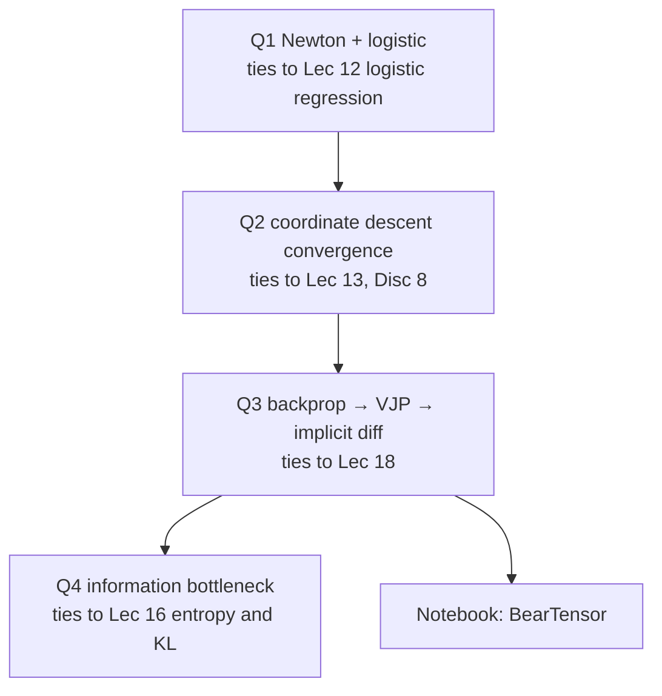

> 🌏 [中文版](/posts/learning/2026-09-29-berkeley-cs189-sp26-hw3-autograd-optimizers)

This guide is based on the [official HW3 folder](https://drive.google.com/drive/folders/1M6ii2VAJR63485TaDK0yKhcfT1bHdRIO) of [CS189 Spring 2026](https://eecs189.org/sp26/) (Jennifer Listgarten / Alex Dimakis). It holds three files: the written problems [hw3.pdf](https://drive.google.com/file/d/18EVIcfx9eH3XG7w_S1XEn3QthMNdRTCt/view) (16 pages), the LaTeX template `hw3_student.tex`, and the coding assignment [hw3.ipynb](https://drive.google.com/file/d/17GdkCG486LIoROrwYg-3w0OxP12Azb1d/view). The schedule gives the deadline as **Sunday 4/12, 11:59 PM PT**, and lists HW3 in week 9, the week of the midterm (3/17).

It follows directly from [Lec 17–18 (neural networks and backprop)](/en/posts/learning/2026-09-29-berkeley-cs189-sp26-lectures-17-18-neural-networks-backprop-en). In lecture you watched the chain rule run on a computation graph; HW3 has you turn it into a small working PyTorch. In the notebook's own words, you extend the single-variable autograd from lecture to general tensors, mimicking how `torch`'s autograd is implemented.

## Course video sources

No dedicated public lecture recording was verified for this article. Use the official course entry for recordings and materials.

Course and recording entries:

- [Official course and recording entry](https://eecs189.org/sp26/)

## First: what you can and cannot get

| Item | Status |
|---|---|
| Written PDF, LaTeX template, notebook | Downloadable without a login |
| Public tests in the notebook (`grader.check("q1")` etc., via otter-grader) | Run locally |
| Hidden tests | Not public. The notebook says the public tests are "NOT fully-comprehensive and often very simple"; hidden tests check full correctness |
| Official solutions | None published for HW3 |
| Gradescope submission | Berkeley students only |

So outside learners need their own checks; those are in the last section. This post **does not give solutions**. It only says what each problem practices and where it connects to lecture.

## Written problems: four problems, each tied to different lectures

### Problem 1: Newton Might Have Been a Logistics Expert

Given the unregularized logistic regression cost `J(w) = −y·log s − (1−y)·log(1−s)`, you:

- (a) derive the gradient in matrix-vector form, with every intermediate derivative also in matrix form, and **no** component-wise expressions;
- (b) derive the Hessian;
- (c) write one Newton's-method update.

The problem supplies matrix-calculus identities and introduces `diag()` notation, for example `s = diag(sᵢ)1`. The point is to get used to differentiating whole vectors at once, so the indices don't swallow you when you derive backprop later.

### Problem 2: A Coordinated Leap of Faith

The topic is coordinate descent, framed as a special case of SGD: each step picks a random coordinate i and moves only along `d⟨∇f(w), eᵢ⟩eᵢ`.

- (a) show it is an unbiased stochastic gradient;
- (b) use the bound Lᵢ on the Hessian diagonal to prove a quadratic upper bound along one coordinate;
- (c) with step size `1/(L_max·d)`, derive the expected decrease, then add a PL-type condition to get a linear convergence rate;
- (d)–(f) switch to the quadratic `½wᵀAw − wᵀb`: write the update, compare per-iteration cost, prove `L_max ≤ λ_max(A)`, and compare the total cost of coordinate descent and full GD to reach ε accuracy.

It uses the same toolkit as the GD convergence proof in [Discussion 8](/en/posts/learning/2026-09-29-berkeley-cs189-sp26-lectures-17-18-neural-networks-backprop-en): bound the per-step decrease, then get geometric convergence.

### Problem 3: Differentiating the Differentiator

This is the backbone of HW3. The problem says it is inspired by Blondel et al., [Efficient and Modular Implicit Differentiation](https://arxiv.org/abs/2105.15183) (2022). It has three parts:

1. **Backprop from scratch** (a–c): a one-hidden-layer network `z = W₁x + b₁`, `h = σ(z)`, `ŷ = w₂ᵀh + b₂`, `L = ½(ŷ−y)²`. Work backward from ∂L/∂ŷ to ∂L/∂W₁. Part (c) asks: with d = 1000 and m = 500, how many forward passes would you need if you propagated forward once per parameter, and why is the backward approach so much faster when the output is a scalar?
2. **Autodiff and VJPs** (d–e): compare how many passes forward mode (JVPs, multiplying right to left) and reverse mode (VJPs, left to right) need for the full gradient, and relate that to (c). Then match each step of (a)–(b) to a VJP.
3. **Implicit differentiation** (f–h): for ridge regression `x*(λ)`, write the optimality condition, use the implicit function theorem to get ∂x*/∂λ, and check it against differentiating the closed form directly. Then compare the memory cost of unrolling T steps of GD versus implicit differentiation, with a given scenario of d = 10,000 and T = 1,000. Finally: why does implicit differentiation fail when the Hessian at the minimizer is zero, and why does poor conditioning worsen the Jacobian error bound?

This problem deepens Lec 18's claim that backprop is linear in the number of parameters: the reason is that the loss is a scalar, so one reverse pass suffices.

### Problem 4: I Can't Believe It's Not Distortion!

The problem cites Tishby et al., [The information bottleneck method](https://arxiv.org/abs/physics/0004057), and Shwartz-Ziv and Tishby, [Opening the Black Box of Deep Neural Networks via Information](https://arxiv.org/abs/1703.00810). It opens with a review of entropy, KL, and mutual information from Lec 16, then has four parts:

- **Surprise!** (a–b): prove Gibbs' inequality `D_KL(p‖q) ≥ 0`, use it to show `H(X) ≤ log m`, and use the Kraft inequality to show expected code length is at least the entropy.
- **The Right Measure of Distortion** (c–d): rate-distortion theory needs a distortion function chosen in advance; the information bottleneck instead specifies a relevance variable Y. The example is a hospital compressing test results X ∈ {0,1,2,3} into two categories; you compare how much information about disease status Y is kept by grouping on risk versus on parity. Then you prove that `I(X;Y) − I(X̃;Y)` equals an expected KL, showing the bottleneck "discovers" the right distortion measure on its own.
- **Okay, But Can We Get to Neural Networks Already?** (e–f): treat the layers as a Markov chain `Y ↔ X → T₁ → … → Ŷ`. Why can't an invertible layer compress, and which component of a layer makes it non-invertible? Does a sufficient statistic stay sufficient in the next layer? If every layer can only lose information, what is depth good for (open-ended)?
- **(g)**: against the backdrop of the "fitting phase → compression phase" that Shwartz-Ziv and Tishby describe, use a binary representation with bit-flip noise to show why noise compresses a representation, and why irrelevant information is more "fragile" than relevant information.

## Notebook: build your own small PyTorch

The notebook is titled "Homework 3 – Optimizers and Backpropagation" and lists two learning objectives: understand how libraries like PyTorch implement backprop, and understand how optimizers are implemented and what Adam's advantages are. The grading table:

| Question | Content | Points |
|---|---|---|
| Q1 | Build the computation graph: implement `+ − * ** @`, `dot`, `sum`, `mean`, `relu`, `sigmoid` on `BearTensor` | 10 |
| Q2 | Backprop: `topological_sort`, `reset_children`, `backward` | 20 |
| Q3 | Optimizers: SGD, Momentum, Adam | 10 |
| Q4 | Train a Wine Quality regressor with your own engine | 10 |
| Q5 (optional) | Simplified Muon optimizer | 4 extra credit |

Everything is autograded, 50 points in total.

### BearTensor's three classes

- `BearTensor`: a node in the computation graph, holding `value` (computed in the forward pass), `parents` (who to send gradients to), and `adjoint` (the gradient computed in the backward pass, Lec 18's v̄).
- `BearParent`: records one parent and its `BearGrad`.
- `BearGrad`: stores a function `fn` that takes the upstream gradient and returns the gradient to pass downstream, i.e. one application of the chain rule at this node.

The reminders in Q1 are worth reading first: every op must return a **new** BearTensor without modifying the existing one; the new tensor's parents are the two source tensors; and watch the shape changes caused by NumPy broadcasting. The notebook also provides a tool to draw your computation graph for debugging.

### Why topological sort

Q2's explanation states the core problem plainly: **a node can only pass its gradient back after it has received gradients from all of its children.** That is the implementation of Lec 18's rule that gradients from multiple paths add. The lecture version takes two passes: a reset pass that sets up counters, then a recursive backward pass. The notebook suggests doing both at once with a topological sort, and warns that the recursive version can overflow the stack on deep networks; an iterative method such as Kahn's algorithm avoids that.

### Optimizers and the training task

Q3's skeleton already provides the `Optimizer` base class and `zero_grad()`; Adam's defaults are `beta1 = 0.9`, `beta2 = 0.999`, `eps = 1e-8`. The notebook recommends finishing the written part first, and afterward you can compare the three optimizers' convergence with `compare_optimizers`.

Q4 uses OpenML's `wine-quality-red` (1599 red wines, 11 chemical features, predicting a 0–10 quality score), and the preprocessing code must not be changed. Requirements:

- at least one hidden layer, with an activation function on hidden layers;
- MSE ≤ 2.0 on the dataset for full credit, ≤ 3.0 for half;
- training longer than 30 seconds may crash the autograder. The notebook says the staff solution trains in under a second, so slowness usually means an inefficient graph.

With no "layer" abstraction, you compose BearTensors by hand for the forward pass, which shows you what `nn.Linear` has been saving you.

The optional Q5 is a simplified Muon: approximate the orthogonalization `UVᵀ` of the gradient matrix with the Newton–Schulz iteration `X ← 1.5X − 0.5(XXᵀ)X`, then scale by `√(fan_out/fan_in)`. The notebook recommends reading Jeremy Bernstein's [Deriving Muon](https://jeremybernste.in/writing/deriving-muon) and Keller Jordan's [Muon post](https://kellerjordan.github.io/posts/muon/) first, and notes that Muon's advantage in the NanoGPT speedrun does not necessarily carry over to every network.

## How outside learners can check their work

1. **Finite-difference check every op.** Lec 18 and Lec 19 both mention checking backprop against finite differences. For each op, generate random inputs and compare `(f(x+ε) − f(x−ε)) / 2ε` with your adjoint.
2. **Use PyTorch as an oracle.** Build the same graph in `torch` and compare each leaf's `.grad`. Be sure to test a graph that uses one tensor twice (for example `x * x`); that is where a broken multi-path sum shows up.
3. **Written problem 3(f) checks itself**: it asks you to differentiate the closed form too, and both routes must agree. Problem 4(d)(ii) likewise asks you to verify your identity numerically.
4. **Discussion 9** (see [order 13](/en/posts/learning/2026-09-29-berkeley-cs189-sp26-lectures-19-20-cnn-generalization-en)) walks through backprop on `f = (x+y)z` with solutions, which makes a good minimal test case for Q2.

## Further reading and navigation

- Fall 2026 equivalent: on the [CS189 Fall 2026](https://eecs189.org/fa26/) schedule, Homework 3 comes after Lec 13 (backpropagation). Its problems are not linked from the home page, so the contents cannot be compared.
- Related guides on this site: [CMU 11-785 Lecture 5: backpropagation](/en/posts/ai/2026-08-22-cmu-11785-05-backpropagation-en), [CMU 11-785 Lecture 8: optimizers and regularization](/en/posts/ai/2026-08-22-cmu-11785-08-optimizers-regularization-en), [Stanford CS109 Lecture 18: information theory](/en/posts/learning/2026-08-22-stanford-cs109-lecture-18-information-theory-en).
- Series navigation: previous, [Lec 17–18](/en/posts/learning/2026-09-29-berkeley-cs189-sp26-lectures-17-18-neural-networks-backprop-en); next, [Lec 19–20: initialization, BatchNorm, CNNs, and generalization](/en/posts/learning/2026-09-29-berkeley-cs189-sp26-lectures-19-20-cnn-generalization-en); series entry, [CS189 overview](/en/posts/learning/2026-08-22-berkeley-cs189-spring-2025-overview-en).

**Something to do tonight**: download `hw3.ipynb`, implement only `__add__` and `__mul__` from Q1, build the graph `z = x * y + x`, work out ∂z/∂x = y + 1 by hand, and confirm your graph adds the gradients from both paths.

## Update Log

- 2026-10-10: Added course video sources and recording access notes.

## References

- [CS189 Spring 2026 home page and schedule (HW3 due 4/12)](https://eecs189.org/sp26/)
- [CS189 Spring 2026 syllabus](https://eecs189.org/sp26/syllabus/)
- [Official HW3 folder (hw3.pdf, hw3.ipynb, hw3_student.tex)](https://drive.google.com/drive/folders/1M6ii2VAJR63485TaDK0yKhcfT1bHdRIO)
- [hw3.pdf](https://drive.google.com/file/d/18EVIcfx9eH3XG7w_S1XEn3QthMNdRTCt/view)
- [hw3.ipynb](https://drive.google.com/file/d/17GdkCG486LIoROrwYg-3w0OxP12Azb1d/view)
- [Blondel et al., Efficient and Modular Implicit Differentiation (arXiv:2105.15183)](https://arxiv.org/abs/2105.15183)
- [Tishby, Pereira, Bialek, The information bottleneck method (arXiv:physics/0004057)](https://arxiv.org/abs/physics/0004057)
- [Shwartz-Ziv & Tishby, Opening the Black Box of Deep Neural Networks via Information (arXiv:1703.00810)](https://arxiv.org/abs/1703.00810)
- [Jeremy Bernstein, Deriving Muon](https://jeremybernste.in/writing/deriving-muon)
- [Keller Jordan, Muon](https://kellerjordan.github.io/posts/muon/)
- [CS189 Fall 2026 schedule](https://eecs189.org/fa26/)
