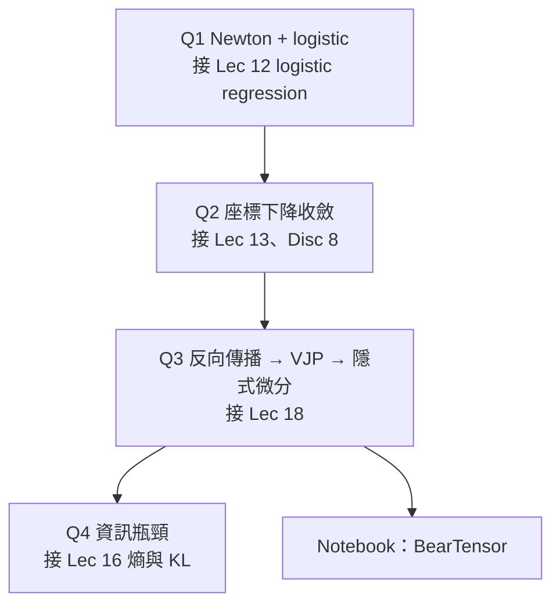

> 🌏 [English version](/en/posts/learning/2026-09-29-berkeley-cs189-sp26-hw3-autograd-optimizers-en)

**影片狀態：僅附官方入口或錄影清單。** [影片來源與說明](#課程影片來源)

本文依 [CS189 Spring 2026](https://eecs189.org/sp26/)（Jennifer Listgarten／Alex Dimakis）的 [HW3 官方資料夾](https://drive.google.com/drive/folders/1M6ii2VAJR63485TaDK0yKhcfT1bHdRIO)寫成，裡面有三個檔案：書面題 [hw3.pdf](https://drive.google.com/file/d/18EVIcfx9eH3XG7w_S1XEn3QthMNdRTCt/view)（16 頁）、LaTeX 模板 `hw3_student.tex`，以及程式作業 [hw3.ipynb](https://drive.google.com/file/d/17GdkCG486LIoROrwYg-3w0OxP12Azb1d/view)。排程頁寫的截止時間是 **4/12（日）晚上 11:59 PT**；排程把 HW3 列在第 9 週，也就是期中考（3/17）那一週。

它緊接在 [Lec 17–18（神經網路與反向傳播）](/posts/learning/2026-09-29-berkeley-cs189-sp26-lectures-17-18-neural-networks-backprop)之後。講課時你看過 chain rule 怎麼在計算圖上跑；HW3 要你把它寫成一個能用的小型 PyTorch。notebook 開頭這樣寫：把課堂上的單變數 autograd 推廣到一般張量，模仿 `torch` 的 autograd 實作方式。

## 課程影片來源

未核對到本文專屬的公開講次影片。2026-10-10 即時核對官方 Spring 2026 課表與講課播放清單（25 支）：只有講課錄影，沒有這份作業的講解影片；請從官方課程入口查找錄影與教材。

課程與錄影入口：

- [官方課程與錄影入口](https://eecs189.org/sp26/)
- [CS189 Spring 2026 Lectures — official YouTube playlist (25 videos)](https://www.youtube.com/playlist?list=PLuHtd0SzXhx4B8oOmp9PBEroMuV5n0MWE)

查核日期：2026-10-10。

## 先說清楚：拿得到什麼、拿不到什麼

| 項目 | 狀態 |
|---|---|
| 書面題 PDF、LaTeX 模板、notebook | 匿名可下載 |
| notebook 裡的 public tests（`grader.check("q1")` 等，用 otter-grader） | 可在本機跑 |
| hidden tests | 不公開。notebook 明講 public tests「不完整、而且常常很簡單」，hidden tests 會檢查完整正確性 |
| 官方解答 | HW3 沒有公開解答 |
| Gradescope 提交 | 校內限定 |

所以校外讀者要自己補驗證，做法放在最後一節。本文**不寫解法**，只說每題在練什麼、和講課哪裡接上。

## 書面題：四題，各自接上不同的講次

### 第 1 題：Newton Might Have Been a Logistics Expert

給定未正則化的 logistic regression 成本 `J(w) = −y·log s − (1−y)·log(1−s)`，要你：

- (a) 用矩陣–向量形式推出梯度，中間導數也一律寫成矩陣形式，**不准**拆成分量；
- (b) 推出 Hessian；
- (c) 寫出一次 Newton 法的更新式。

題目附了一組矩陣微積分恆等式，並介紹 `diag()` 記號，例如 `s = diag(sᵢ)1`。這題的目的是讓你習慣「整個向量一起微分」，之後推反向傳播時才不會迷失在下標裡。

### 第 2 題：A Coordinated Leap of Faith

主題是座標下降，題目把它當成 SGD 的特例：每一步隨機挑一個座標 i，只沿 `d⟨∇f(w), eᵢ⟩eᵢ` 方向走。

- (a) 證明它是不偏的隨機梯度；
- (b) 用 Hessian 對角線的上界 Lᵢ 證明單座標方向的二次上界；
- (c) 取步長 `1/(L_max·d)`，推出期望下降量，再加上 PL 型條件推出線性收斂率；
- (d)–(f) 換成二次函數 `½wᵀAw − wᵀb`，寫出更新式、比較單步計算成本，證明 `L_max ≤ λ_max(A)`，最後比較座標下降和完整 GD 達到 ε 誤差的總成本。

它和 [Discussion 8](/posts/learning/2026-09-29-berkeley-cs189-sp26-lectures-17-18-neural-networks-backprop) 的 GD 收斂證明是同一套工具：先找每步的下降量，再推出幾何級數的收斂。

### 第 3 題：Differentiating the Differentiator

這是 HW3 的主軸，題目說靈感來自 Blondel 等人的 [Efficient and Modular Implicit Differentiation](https://arxiv.org/abs/2105.15183)（2022）。它分三段：

1. **從零推反向傳播**（a–c）：一層隱藏層網路 `z = W₁x + b₁`、`h = σ(z)`、`ŷ = w₂ᵀh + b₂`、`L = ½(ŷ−y)²`。從 ∂L/∂ŷ 往回推到 ∂L/∂W₁。(c) 問：d = 1000、m = 500 時，如果改成每個參數各做一次 forward 傳播，要做幾次？為什麼輸出是純量時，反向做法快這麼多？
2. **自動微分與 VJP**（d–e）：比較 forward mode（JVP，由右往左乘）和 reverse mode（VJP，由左往右乘）算完整梯度要幾次，連回 (c)；再把 (a)–(b) 的每一步對應到一次 VJP。
3. **隱式微分**（f–h）：用 ridge regression `x*(λ)`，先寫出最佳性條件，用隱函數定理求 ∂x*/∂λ，再和閉式解直接微分的結果比對；接著比較「展開 T 步 GD 再反向傳播」和隱式微分的記憶體成本，題目給了 d = 10,000、T = 1,000 的情境；最後問 Hessian 在極小值處為 0 時隱式微分為何失效，以及條件數差時 Jacobian 誤差界為何變差。

這題把 Lec 18 的「反向傳播成本和參數數量成線性」講得更深：原因是 loss 是純量，所以 reverse mode 一趟就夠。

### 第 4 題：I Can't Believe It's Not Distortion!

題目說靈感來自 Tishby 等人的 [The information bottleneck method](https://arxiv.org/abs/physics/0004057) 與 Shwartz-Ziv、Tishby 的 [Opening the Black Box of Deep Neural Networks via Information](https://arxiv.org/abs/1703.00810)。開頭先複習 Lec 16 的熵、KL、互資訊，再分四段：

- **Surprise!**（a–b）：證明 Gibbs 不等式 `D_KL(p‖q) ≥ 0`，用它推出 `H(X) ≤ log m`，再用 Kraft 不等式證明期望碼長不小於熵。
- **The Right Measure of Distortion**（c–d）：rate-distortion 理論要先選定失真函數；資訊瓶頸改成指定「相關變數」Y。題目用一家醫院的例子：把檢驗結果 X ∈ {0,1,2,3} 壓成兩類，比較「依風險分組」和「依奇偶分組」各保留多少關於疾病 Y 的資訊。接著證明 `I(X;Y) − I(X̃;Y)` 等於期望 KL，說明資訊瓶頸會自己「發現」該用的失真度量。
- **Okay, But Can We Get to Neural Networks Already?**（e–f）：把網路各層看成 Markov chain `Y ↔ X → T₁ → … → Ŷ`，問可逆層為何無法壓縮、哪個元件負責讓層變成不可逆；sufficient statistic 能不能傳到下一層；如果每層只會丟資訊，深度的好處到底在哪（開放題）。
- **(g)**：以 Shwartz-Ziv 與 Tishby 描述的「fitting 階段 → compression 階段」為背景，用一個二元表徵加翻轉雜訊的例子，說明雜訊為何能壓縮表徵，以及為何無關資訊比相關資訊更「脆弱」。

## Notebook：自己寫一個小 PyTorch

notebook 標題是「Homework 3 – Optimizers and Backpropagation」，列了兩個學習目標：理解 PyTorch 這類框架怎麼實作反向傳播，以及理解 optimizer 怎麼實作、Adam 的優勢在哪。配分表：

| 題目 | 內容 | 配分 |
|---|---|---|
| Q1 | 建計算圖：替 `BearTensor` 實作 `+ − * ** @`、`dot`、`sum`、`mean`、`relu`、`sigmoid` | 10 |
| Q2 | 反向傳播：`topological_sort`、`reset_children`、`backward` | 20 |
| Q3 | Optimizer：SGD、Momentum、Adam | 10 |
| Q4 | 用自己的引擎訓練 Wine Quality 回歸 | 10 |
| Q5（選做） | 簡化版 Muon optimizer | 額外 4 分 |

全部自動評分，合計 50 分。

### BearTensor 的三個類別

- `BearTensor`：計算圖上的一個節點，存 `value`（forward 算出的值）、`parents`（要把梯度傳給誰）、`adjoint`（backward 算出的梯度，也就是 Lec 18 的 v̄）。
- `BearParent`：記錄某個父節點，以及對應的 `BearGrad`。
- `BearGrad`：存一個函數 `fn`，輸入上游梯度，輸出要往下游傳的梯度，也就是在這個節點上套用一次 chain rule。

Q1 的提醒值得先讀：每個運算都要回傳**新的** BearTensor，不能改動原本的；新張量的 parents 要設成兩個來源張量；要特別注意 NumPy broadcasting 造成的形狀變化。notebook 也提供把計算圖畫出來的工具，方便除錯。

### 為什麼要拓撲排序

Q2 的說明把核心問題講得很清楚：**一個節點要等所有子節點的梯度都送到了，才能往回傳。** 這正是 Lec 18 多路徑 chain rule「梯度相加」的實作版。課堂上的版本是兩趟：先一趟 reset、設好計數器，再遞迴往回傳。notebook 建議改用拓撲排序一次做完，並提醒遞迴版在深網路上可能 stack overflow，可以改用 Kahn's algorithm 這種迭代寫法。

### Optimizer 與訓練任務

Q3 的骨架已經給好 `Optimizer` 基底類別和 `zero_grad()`；Adam 的預設值是 `beta1 = 0.9`、`beta2 = 0.999`、`eps = 1e-8`。notebook 建議先做完書面題再寫這題，寫完可以用 `compare_optimizers` 比較三者的收斂曲線。

Q4 用 OpenML 的 `wine-quality-red`（1599 筆紅酒、11 個化學特徵，預測 0–10 分的品質），前處理程式碼不能改。要求：

- 至少一層隱藏層，隱藏層要有激活函數；
- 整份資料的 MSE ≤ 2.0 拿全分，≤ 3.0 拿一半；
- 訓練超過 30 秒可能讓 autograder 當掉。notebook 說官方解不到 1 秒就訓練完，太慢通常代表計算圖建得沒效率。

因為沒有「層」的抽象，你得手動組合 BearTensor 做 forward，順便體會 `nn.Linear` 替你省掉了什麼。

選做的 Q5 要實作簡化版 Muon：用 Newton–Schulz 迭代 `X ← 1.5X − 0.5(XXᵀ)X` 近似梯度矩陣的正交化 `UVᵀ`，再乘上 `√(fan_out/fan_in)`。notebook 推薦先讀 Jeremy Bernstein 的 [Deriving Muon](https://jeremybernste.in/writing/deriving-muon) 和 Keller Jordan 的 [Muon 介紹](https://kellerjordan.github.io/posts/muon/)，也提醒 Muon 在 NanoGPT speedrun 上的優勢不一定適用於所有網路。

## 校外讀者怎麼自己驗證

1. **每個 op 都做有限差分檢查。** Lec 18 和 Lec 19 都提過「用有限差分檢查反向傳播」。對每個 op 隨機產生輸入，比對 `(f(x+ε) − f(x−ε)) / 2ε` 和你的 adjoint。
2. **用 PyTorch 當 oracle。** 同一張計算圖用 `torch` 再建一次，比對每個葉節點的 `.grad`。特別要測同一個張量被用兩次的圖（例如 `x * x`），多路徑相加寫錯時這裡最容易露餡。
3. **書面題第 3(f) 自帶驗證**：題目本身就要你用閉式解再微分一次，兩條路結果要一致。第 4(d)(ii) 也要你用數值驗證自己證出的恆等式。
4. **Discussion 9**（見 [order 13](/posts/learning/2026-09-29-berkeley-cs189-sp26-lectures-19-20-cnn-generalization)）有 `f = (x+y)z` 的逐步反向傳播與解答，可以當 Q2 的最小測試案例。

## 延伸與導覽

- Fall 2026 對應：[CS189 Fall 2026](https://eecs189.org/fa26/) 的 Homework 3 在排程上位於 Lec 13（Backpropagation）之後；題目在首頁沒有公開連結，內容無法比對。
- 站內延伸：[CMU 11-785 第 5 講：反向傳播](/posts/ai/2026-08-22-cmu-11785-05-backpropagation)、[CMU 11-785 第 8 講：optimizer 與正則化](/posts/ai/2026-08-22-cmu-11785-08-optimizers-regularization)、[Stanford CS109 第 18 講：資訊理論](/posts/learning/2026-08-22-stanford-cs109-lecture-18-information-theory)。
- 系列導覽：上一篇 [Lec 17–18](/posts/learning/2026-09-29-berkeley-cs189-sp26-lectures-17-18-neural-networks-backprop)；下一篇 [Lec 19–20：初始化、BatchNorm、CNN 與泛化](/posts/learning/2026-09-29-berkeley-cs189-sp26-lectures-19-20-cnn-generalization)；系列入口 [CS189 總覽](/posts/learning/2026-08-22-berkeley-cs189-spring-2025-overview)。

**今晚能做的事**：下載 `hw3.ipynb`，只做 Q1 的 `__add__` 和 `__mul__`，建一張 `z = x * y + x` 的圖，手算 ∂z/∂x = y + 1，確認你的圖會把兩條路徑的梯度相加。

## 更新紀錄

- 2026-10-10：標註影片狀態，核對錄影來源與取得方式。
- 2026-10-10：重查影片狀態。即時核對官方課表與播放清單，沒有這份作業的專屬錄影，狀態維持僅附官方入口。

## 參考資料

- [CS189 Spring 2026 課程首頁與排程（HW3 截止 4/12）](https://eecs189.org/sp26/)
- [CS189 Spring 2026 Syllabus](https://eecs189.org/sp26/syllabus/)
- [HW3 官方資料夾（hw3.pdf、hw3.ipynb、hw3_student.tex）](https://drive.google.com/drive/folders/1M6ii2VAJR63485TaDK0yKhcfT1bHdRIO)
- [hw3.pdf](https://drive.google.com/file/d/18EVIcfx9eH3XG7w_S1XEn3QthMNdRTCt/view)
- [hw3.ipynb](https://drive.google.com/file/d/17GdkCG486LIoROrwYg-3w0OxP12Azb1d/view)
- [Blondel et al., Efficient and Modular Implicit Differentiation (arXiv:2105.15183)](https://arxiv.org/abs/2105.15183)
- [Tishby, Pereira, Bialek, The information bottleneck method (arXiv:physics/0004057)](https://arxiv.org/abs/physics/0004057)
- [Shwartz-Ziv & Tishby, Opening the Black Box of Deep Neural Networks via Information (arXiv:1703.00810)](https://arxiv.org/abs/1703.00810)
- [Jeremy Bernstein, Deriving Muon](https://jeremybernste.in/writing/deriving-muon)
- [Keller Jordan, Muon](https://kellerjordan.github.io/posts/muon/)
- [CS189 Fall 2026 排程](https://eecs189.org/fa26/)
