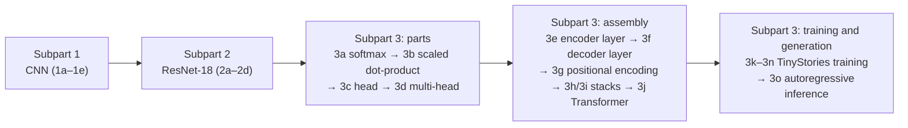

> 🌏 [中文版](/posts/learning/2026-09-29-berkeley-cs189-sp26-hw4-resnet-transformer-dnabert)

**Video status: Official entry or recording index only.** [Source details](#course-video-sources)

This guide is based on the [official HW4 folder](https://drive.google.com/drive/folders/1yDuUklNkvyfHm6mhhHFI0KzK93_StWVz) of [CS189 Spring 2026](https://eecs189.org/sp26/) (Jennifer Listgarten / Alex Dimakis). Anyone can list the folder, which holds four files: `hw4_written.pdf`, `hw4_written_student.tex`, `hw4_part1.ipynb`, and `hw4_part2.ipynb`. On the schedule, HW4 is released in the 4/14 row (Lec 22) and is **due Friday 5/1 at 11:59 PM PT**.

It follows [Lec 21–22: Transformers](/en/posts/learning/2026-09-29-berkeley-cs189-sp26-lectures-21-22-transformers-en). The slides cover only the core of attention; positional encodings, the encoder/decoder, and the details of training and inference are things you build yourself in this assignment.

**This post does not give solutions.** HW1–4 have no public official solutions. I describe only what each question asks, why it is designed that way, and what to watch out for.

## Course video sources

No public lecture video dedicated to this post was found. The official Spring 2026 schedule and the lecture playlist (25 videos) were checked live on 2026-10-10 and contain lecture recordings only, no walkthrough of this homework; use the official course entry for recordings and materials.

Course and recording entries:

- [Official course and recording entry](https://eecs189.org/sp26/)
- [CS189 Spring 2026 Lectures — official YouTube playlist (25 videos)](https://www.youtube.com/playlist?list=PLuHtd0SzXhx4B8oOmp9PBEroMuV5n0MWE)

Checked: 2026-10-10.

## What outside readers can get

| Item | Status |
|---|---|
| Written-part PDF and LaTeX template | Available |
| Problems, instructions, and point values for both notebooks | Available |
| Data used in 4.1 (`timm/mini-imagenet`, `roneneldan/TinyStories`) | Available: the notebook loads them straight from Hugging Face |
| DNABERT pretrained model (`zhihan1996/DNA_bert_6`) | Available: public Hugging Face model |
| The course's DNA training files, `dna_test.txt`, UrbanSound8K fold archives and test set | **Not available**: the notebook's setup cell clones `github.com/BerkeleyML/sp26-student`, which returned 404 anonymously on 2026-09-30 |
| otter public tests (`tests/`) | **Not available**: same reason |
| The two Kaggle competitions | The assignment gives invite links; I did not test whether an outside account can submit |
| Gradescope, hidden tests, official solutions | Not available |

Substitute sources: the notebook credits the DNA data to Şükrü Ozan's paper "[DNA Sequence Classification with Compressors](https://arxiv.org/abs/2401.14025)," whose [GitHub repo](https://github.com/sukruozan/DNA-Sequence-Classification) publishes `chimpanzee.txt`, `dog.txt`, and `human.txt`. For UrbanSound8K, the notebook links a [public Kaggle dataset](https://www.kaggle.com/datasets/chrisfilo/urbansound8k). You can make your own train/validation split; you just can't compare scores with the course leaderboard.

So 4.1 can be redone almost completely. For 4.2 you need to prepare the data yourself, and there are no public tests to check against.

## Written part: practicing an order for reading papers

`hw4_written.pdf` is titled "Paper Questions: ResNets and Transformers" and has 21 questions, submitted to Gradescope. The assignment states its purpose up front: it is not about memorizing details but about reading papers in a structured way. Most papers follow the same order: the problem → existing approaches and their limits → the proposal and its key insight → the method → limitations. The questions follow that order, and each notes which section to read. The staff also point out that most answers need only one to three sentences.

### Part 1: ResNet (Q1–Q7)

The paper is "[Deep Residual Learning for Image Recognition](https://arxiv.org/abs/1512.03385)" (arXiv:1512.03385).

| Section | What the questions ask |
|---|---|
| Problem | What kind of task ResNet was designed for; what problem the authors set out to solve. A hint asks you to distinguish degradation from overfitting |
| Current works | How to construct a deep network whose output exactly matches a shallow one; why that fails in practice |
| Proposed solution | Why learn F(x) + x instead of H(x) directly |
| Method details | Two ways to handle x and F(x) having different dimensions; comparing the parameter counts of three shortcut options and their effect on memory and training time |
| Key insight | Which experiments show that ResNet does not degrade (pointing to Figure 4 and Table 2) |

### Part 2: Attention Is All You Need (Q8–Q21)

The paper is "[Attention Is All You Need](https://arxiv.org/abs/1706.03762)" (arXiv:1706.03762). A preamble first explains transduction (seq2seq), plus teacher forcing during decoder training (the input is the correct output shifted right by one) and autoregressive generation at inference.

In order, the questions cover: the task the paper solves; what BLEU and perplexity measure and their limits (outside sources allowed); the drawbacks of RNN and convolutional sequence models; defining attention in your own words; what the encoder and decoder each do; why decoder self-attention needs a mask; **why divide by √d_k** (Q14); two benefits of multiple heads; where Q, K, and V come from in encoder self-attention, decoder self-attention, and cross-attention; how the decoder's inputs and outputs differ between training and inference; why there is no order information without positional encodings; and what self-attention does better than RNNs and CNNs.

The last two questions are extensions: how to apply a transformer to images (how to cut an image into tokens), and, given a new 1024×512 image, how a ResNet and a Vision Transformer would each handle it.

The staff also list a few supporting resources, including chapters 5–7 of 3Blue1Brown's deep learning series, StatQuest, and the [Transformer chapter of Dive into Deep Learning](https://d2l.ai/chapter_attention-mechanisms-and-transformers/transformer.html).

**Suggested order**: Q14 asks the same thing as [Discussion 10](https://drive.google.com/file/d/16H_chNl76tHPrRUkf6T1G0pQaM1W0eKm/view), problem 2, and Q13 (masking) and Q18 (positional encoding) match the first two problems of Discussion 11. Finish the discussions and check the solutions before writing; it goes much more smoothly.

## HW 4.1: from a CNN to a transformer that tells stories

`hw4_part1.ipynb` is worth 46 points; you submit the notebook's exported zip to "HW 4.1 Coding" on Gradescope. The staff list six learning goals: write your own networks in PyTorch; write your own Dataset, DataLoader, and training loop; implement an architecture from a paper; get to know ResNet; implement a transformer block; and understand how the transformer's pieces fit together.

### Subpart 1: CNN (1a–1e, 11 points)

1a builds a small CNN to spec: two convolution layers (16 channels, 3×3, stride 2; then 16 channels, 7×7, stride 2), each followed by ReLU, and a final linear classifier. A hint suggests computing the flattened dimension yourself, or just printing it.

The data is `timm/mini-imagenet` on Hugging Face (100 classes drawn from ImageNet-1k). To keep things fast, the notebook uses only 10 classes and a `balanced_split` helper to draw 1000 training, 200 validation, and 200 test images. 1b–1c write the `Dataset` and `DataLoader`, 1d writes the training loop, and 1e plots the training curves.

### Subpart 2: ResNet-18 (2a–2d, 7 points)

2a writes a residual block and 2b uses it to build ResNet-18. The notebook lists the architecture layer by layer: a 7×7 convolution (64 channels, stride 2, padding 3) + BatchNorm + ReLU + 3×3 max pooling, then four stages of two residual blocks each, with 64, 128, 256, and 512 channels, and finally a classification head. 2c trains it and 2d plots the curves for comparison with the small CNN from Subpart 1.

This maps directly onto written questions Q5–Q6 (shortcuts when dimensions don't match): when you write 2a, you have to decide how the shortcut connects when the stride or channel count changes.

### Subpart 3: Transformer (3a–3o, 28 points)

This part carries more than half of 4.1's points, and it is the full version of what the slides only sketch as "the core of attention." The order is:

1. **Parts**: 3a softmax, 3b scaled dot-product attention, 3c a single attention head, 3d multi-head attention.
2. **Assembly**: 3e is the encoder layer (self-attention + FFN + residual + LayerNorm; the notebook notes that the FFN's hidden width is usually `4 * d_model`). 3f, the decoder layer, adds two things: masked self-attention with a look-ahead mask, and cross-attention over the encoder output. 3g implements the original paper's sinusoidal positional encoding. 3h and 3i stack layers into `TransformerEncoder` and `TransformerDecoder`. 3j assembles the full `Transformer` and adds a `decoder_only` parameter so the same model can serve as a decoder-only text generator.
3. **Training and generation**: the data is [TinyStories](https://huggingface.co/datasets/roneneldan/TinyStories) on Hugging Face, a collection of synthetic short stories. 3k has you build the inputs and targets for next-token prediction, which are the same sequence offset by one. The notebook's example: if the first 5 input tokens are [189, 42, 23, 10, 5], the targets are [42, 23, 10, 5, 2025]. 3l builds the DataLoader, 3m trains, 3n plots curves, and 3o generates new stories autoregressively with argmax. The notebook warns ahead of time that this small model won't write fluent prose, but you should see some coherence.

The slides treat "positional encoding" and "encoder/decoder" only as concepts. You don't really confront the shape of the mask, where the positional encoding gets added, or how decoder-only differs from encoder-decoder until 3f, 3g, and 3j.

## HW 4.2: turning DNA and audio into numbers a model can eat

`hw4_part2.ipynb` is worth 45 points. Besides the notebook zip, you submit screenshots of your scores in **two Kaggle competitions** plus your Kaggle username. The notebook warns at the top that Kaggle limits daily submissions, so start early. The two subparts are independent and can be done separately.

The assignment's one-line message: models like numbers, and if you can represent data as vectors, matrices, or tensors, a model has a chance to learn from it. Subpart 1 is titled "Tokens are All You Need," Subpart 2 "Matrices are All You Need."

### Subpart 1: DNABERT species classification (4a–4i, 20 points)

The data is DNA sequences from three species: chimpanzee, dog, and human. The raw files' `class` column is the gene family, but this assignment **doesn't use it**. Instead you build your own target: which species the sequence came from. The three files have different sizes, so 4a has you sample down to the smallest species to make a balanced three-class dataset.

4b cuts DNA into overlapping 6-mers. The notebook demonstrates with `ATGCGTACTAAG`, which yields 7 pieces, `ATGCGT TGCGTA … ACTAAG`. You then load the pretrained [DNABERT-6](https://huggingface.co/zhihan1996/DNA_bert_6) and inspect what the tokenizer outputs and what the model's hidden states look like.

4c is the key step: BERT-style models output only embeddings by default, with no classification head, so you attach your own classification layer on top of the backbone (the notebook explains how to use the `[CLS]` token embedding). 4d–4h build the Dataset, DataLoader, training loop, training run, and plots. 4i predicts on 1377 test sequences and submits to Kaggle.

This connects to Lec 22's "class token" and Lec 23's "classify from the last token's representation": the same idea, moved to an encoder-only BERT.

### Subpart 2: ConvNeXt audio classification (5a–5j, 25 points)

The data is UrbanSound8K: 8,732 city-sound clips of up to 4 seconds each, in 10 classes (air conditioner, car horn, children playing, dog bark, drilling, engine idling, gun shot, jackhammer, siren, street music). The approach is to "turn sound into images": 5a writes a Dataset that reads a `.wav`, converts it to mono, computes a spectrogram with torchaudio, resizes it to 224×224, and copies it into three channels. 5b builds the DataLoader and 5c the training loop.

The model is torchvision's `convnext_base` (from "[A ConvNet for the 2020s](https://arxiv.org/abs/2201.03545)"). 5d replaces the 1000-class ImageNet output layer with a 10-class one. Then comes the comparison that makes this assignment worth doing:

| Cell | Approach | Initial weights | Which layers train |
|---|---|---|---|
| 5e | Train from scratch | Random | All |
| 5f | Frozen backbone | ImageNet pretrained (`IMAGENET1K_V1`) | Only the new classification layer |
| 5g | Unfreeze everything | ImageNet pretrained | All |

5h asks: which works best, and why? What are its drawbacks? When should you pick one of the other two? 5i lets you listen to the model's predictions, and 5j predicts on 175 test clips and submits to Kaggle.

5e–5g are the same pair of ideas the [Lec 24](/en/posts/learning/2026-09-29-berkeley-cs189-sp26-lectures-23-24-llm-training-ssl-en) slides describe as "freeze the feature extractor and retrain only the classifier" and "initialize from pretrained weights and fine-tune with a small learning rate." You can do the homework before that lecture or after; either order works.

## How to budget your time

1. Do Discussions 10 and 11 first, then the written part. The written part needs no code, so it fits into spare moments.
2. Do 4.1 in order. The Subpart 3 parts (3a–3d) are small; the assembly (3e–3j) is where mistakes happen: the shape of the mask, and whether the residual goes before or after LayerNorm, both need to be checked against the notebook's step list.
3. Each 4.2 subpart has its own Kaggle competition. The notebook includes Colab setup cells. Since `convnext_base` has to be trained three times, my suggestion is to use an environment with a GPU, run a short version of each of 5e–5g first to confirm the pipeline works, and only then train longer.

## Going further

- Fall 2026 counterpart: on the [CS189 Fall 2026](https://eecs189.org/fa26/) schedule, Homework 4 is released 10/30, with Part 1 due 11/13 and Part 2 due 11/20. The problems are not public yet, and this post has not checked their content.
- Guides to other courses on this site that cover the same topic (extensions only; they do not replace this course's content): [CMU 11-785 Lecture 19: Transformer Architectures](/en/posts/ai/2026-08-22-cmu-11785-19-transformer-architectures-en), [Stanford CME295: Transformer](/en/posts/ai/2026-09-29-cme295-transformer-en).
- Series navigation: previous, [Lec 21–22: Transformers](/en/posts/learning/2026-09-29-berkeley-cs189-sp26-lectures-21-22-transformers-en); next, [Lec 23–24: LLM training and self-supervised learning](/en/posts/learning/2026-09-29-berkeley-cs189-sp26-lectures-23-24-llm-training-ssl-en); series entry, [CS189 overview](/en/posts/learning/2026-08-22-berkeley-cs189-spring-2025-overview-en).

**Something you can do tonight**: download `hw4_part1.ipynb`, run only up to the "Load the Data" cell to confirm `timm/mini-imagenet` loads, then write 1a's CNN and print the output shape of the last convolution layer.

## Update Log

- 2026-10-10: Added explicit video status and checked recording sources and access notes.
- 2026-10-10: Rechecked video status. Checked the official schedule and playlist live; there is no recording dedicated to this homework, so the status stays official entry only.

## References

- [CS189 Spring 2026 home page and schedule](https://eecs189.org/sp26/)
- [CS189 Spring 2026 syllabus](https://eecs189.org/sp26/syllabus/)
- [Official HW4 folder (hw4_written.pdf, hw4_part1.ipynb, hw4_part2.ipynb, LaTeX template)](https://drive.google.com/drive/folders/1yDuUklNkvyfHm6mhhHFI0KzK93_StWVz)
- [Discussion 10 problems](https://drive.google.com/file/d/16H_chNl76tHPrRUkf6T1G0pQaM1W0eKm/view), [Discussion 11 problems](https://drive.google.com/file/d/11WJr0gQUuMON1ub34DSUhSMsDl8GuM06/view)
- [He et al., Deep Residual Learning for Image Recognition (arXiv:1512.03385)](https://arxiv.org/abs/1512.03385)
- [Vaswani et al., Attention Is All You Need (arXiv:1706.03762)](https://arxiv.org/abs/1706.03762)
- [Liu et al., A ConvNet for the 2020s (arXiv:2201.03545)](https://arxiv.org/abs/2201.03545)
- [Eldan & Li, TinyStories (arXiv:2305.07759)](https://arxiv.org/abs/2305.07759) and the [Hugging Face dataset](https://huggingface.co/datasets/roneneldan/TinyStories)
- [timm/mini-imagenet (Hugging Face)](https://huggingface.co/datasets/timm/mini-imagenet)
- [DNABERT-6 pretrained model (Hugging Face)](https://huggingface.co/zhihan1996/DNA_bert_6)
- [Ozan, DNA Sequence Classification with Compressors (arXiv:2401.14025)](https://arxiv.org/abs/2401.14025) and the [data repo](https://github.com/sukruozan/DNA-Sequence-Classification)
- [UrbanSound8K (public Kaggle dataset)](https://www.kaggle.com/datasets/chrisfilo/urbansound8k)
- [Dive into Deep Learning: The Transformer Architecture](https://d2l.ai/chapter_attention-mechanisms-and-transformers/transformer.html)
- [CS189 Fall 2026 schedule](https://eecs189.org/fa26/)
