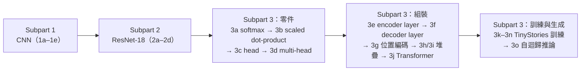

> 🌏 [English version](/en/posts/learning/2026-09-29-berkeley-cs189-sp26-hw4-resnet-transformer-dnabert-en)

**影片狀態：僅附官方入口或錄影清單。** [影片來源與說明](#課程影片來源)

本文依 [CS189 Spring 2026](https://eecs189.org/sp26/)（Jennifer Listgarten／Alex Dimakis）的 [HW4 官方資料夾](https://drive.google.com/drive/folders/1yDuUklNkvyfHm6mhhHFI0KzK93_StWVz)寫成。資料夾匿名可以列出四個檔案：`hw4_written.pdf`、`hw4_written_student.tex`、`hw4_part1.ipynb`、`hw4_part2.ipynb`。排程上 HW4 在 4/14（Lec 22）那一列發布，**5/1（週五）晚上 11:59 PT 截止**。

它接在 [Lec 21–22：Transformers](/posts/learning/2026-09-29-berkeley-cs189-sp26-lectures-21-22-transformers) 之後。講義只講到 attention 的主幹，位置編碼、encoder／decoder、訓練與推論的細節，都在這份作業裡自己動手做。

**這篇不寫解法**。HW1–4 沒有公開的官方解答；我只描述每題在問什麼、為什麼這樣設計、要注意哪裡。

## 課程影片來源

未核對到本文專屬的公開講次影片；請從官方課程入口查找錄影與教材。

課程與錄影入口：

- [官方課程與錄影入口](https://eecs189.org/sp26/)

## 校外讀者拿得到什麼

| 項目 | 狀態 |
|---|---|
| 書面題 PDF 與 LaTeX 模板 | 拿得到 |
| 兩份 notebook 的題目、說明、配分 | 拿得到 |
| 4.1 用到的資料（`timm/mini-imagenet`、`roneneldan/TinyStories`） | 拿得到：notebook 直接從 Hugging Face 載入 |
| DNABERT 預訓練模型（`zhihan1996/DNA_bert_6`） | 拿得到：Hugging Face 公開模型 |
| 課程版 DNA 訓練檔、`dna_test.txt`、UrbanSound8K 的 fold 壓縮檔與測試集 | **拿不到**：notebook 的 setup cell 會 clone `github.com/BerkeleyML/sp26-student`，這個 repo 在 2026-09-30 匿名開啟是 404 |
| otter 公開測試（`tests/`） | **拿不到**：同上 |
| 兩個 Kaggle 競賽 | 題目給的是邀請連結；我沒有測試校外帳號能不能提交 |
| Gradescope、hidden tests、官方解答 | 拿不到 |

替代來源：notebook 標注 DNA 資料取自 Şükrü Ozan 的論文〈[DNA Sequence Classification with Compressors](https://arxiv.org/abs/2401.14025)〉，它的 [GitHub repo](https://github.com/sukruozan/DNA-Sequence-Classification) 公開了 `chimpanzee.txt`、`dog.txt`、`human.txt`；UrbanSound8K 則連到 [Kaggle 上的公開資料集](https://www.kaggle.com/datasets/chrisfilo/urbansound8k)。你可以自己切訓練集和驗證集，只是分數沒辦法跟課程的 leaderboard 比。

所以 4.1 幾乎能完整重做；4.2 要自己準備資料，也沒有公開測試能對答案。

## 書面題：練習讀論文的順序

`hw4_written.pdf` 的標題是「Paper Questions: ResNets and Transformers」，共 21 題，交到 Gradescope。作業開頭講明用意：這份作業不是要你背細節，而是練習有條理地讀論文。多數論文照同一個順序寫：提出問題 → 現有做法與限制 → 提案與關鍵洞見 → 方法 → 限制。題目也照這個順序排，每題旁邊標出該看哪一節。官方還提醒，多數回答 1 到 3 句就夠。

### Part 1：ResNet（Q1–Q7）

讀的是〈[Deep Residual Learning for Image Recognition](https://arxiv.org/abs/1512.03385)〉（arXiv:1512.03385）。

| 段落 | 題目在問 |
|---|---|
| Problem | ResNet 為哪類任務設計；作者要解決什麼問題。提示要你分清楚 degradation 和 overfitting |
| Current works | 怎麼造一個「輸出跟淺網路完全一樣」的深網路；為什麼實務上做不到 |
| Proposed solution | 為什麼要學 F(x) + x，而不是直接學 H(x) |
| Method details | x 和 F(x) 維度不同時的兩種處理；三種 shortcut 做法的參數量比較，以及對記憶體和訓練時間的影響 |
| Key insight | 作者用哪些實驗證明 ResNet 沒有 degradation（指向 Figure 4 與 Table 2） |

### Part 2：Attention Is All You Need（Q8–Q21）

讀的是〈[Attention Is All You Need](https://arxiv.org/abs/1706.03762)〉（arXiv:1706.03762）。題目前面有一段前言，先解釋 transduction（seq2seq），以及 decoder 訓練時的 teacher forcing（輸入是向右位移一格的正確答案）和推論時的自迴歸生成。

題目依序涵蓋：論文要解的任務；BLEU 與 perplexity 各在量什麼、有什麼限制（可以查外部資料）；RNN 與卷積序列模型的缺點；用自己的話定義 attention；encoder 與 decoder 各做什麼；decoder self-attention 為什麼要 mask；**為什麼要除以 √d_k**（Q14）；多頭的兩個好處；encoder self-attention、decoder self-attention、cross-attention 裡 Q、K、V 各從哪來；訓練和推論時 decoder 的輸入輸出差在哪；為什麼沒有位置編碼就沒有順序資訊；self-attention 比 RNN 和 CNN 好在哪。

最後兩題是延伸：怎麼把 transformer 用在影像上（怎麼把圖切成 token）；以及給一張 1024×512 的新圖，ResNet 和 Vision Transformer 各要怎麼處理。

官方另外列了幾個輔助資源，包括 3Blue1Brown 深度學習系列第 5–7 章、StatQuest，以及 [Dive into Deep Learning 的 Transformer 章節](https://d2l.ai/chapter_attention-mechanisms-and-transformers/transformer.html)。

**順序建議**：Q14 和 [Discussion 10](https://drive.google.com/file/d/16H_chNl76tHPrRUkf6T1G0pQaM1W0eKm/view) 第 2 題問的是同一件事，Q13（masking）和 Q18（位置編碼）則對應 Discussion 11 的前兩題。先把 discussion 做完、對過解答再寫，會順很多。

## HW 4.1：從 CNN 寫到能說故事的 Transformer

`hw4_part1.ipynb` 共 46 分，交 notebook 匯出的 zip 到 Gradescope 的「HW 4.1 Coding」。官方列的學習目標有六個：用 PyTorch 寫自己的網路、自己寫 Dataset／DataLoader／訓練迴圈、照論文實作一個架構、認識 ResNet、實作 transformer block、理解 transformer 各部件怎麼拼起來。

### Subpart 1：CNN（1a–1e，11 分）

1a 照規格寫一個小 CNN：兩層卷積（16 通道、3×3 stride 2，接著 16 通道、7×7 stride 2），各接 ReLU，最後一層線性分類。提示要你自己算展平後的維度，或者直接印出來看。

資料是 Hugging Face 上 `timm/mini-imagenet`（原 ImageNet-1k 中的 100 類）。為了跑得快，notebook 只取 10 類，用一個 `balanced_split` 輔助函式抽出 1000 張訓練、200 張驗證、200 張測試。1b–1c 寫 `Dataset` 和 `DataLoader`，1d 寫訓練迴圈，1e 畫訓練曲線。

### Subpart 2：ResNet-18（2a–2d，7 分）

2a 寫一個殘差區塊，2b 用它拼出 ResNet-18。notebook 把架構一層層列出來：7×7 卷積（64 通道、stride 2、padding 3）+ BatchNorm + ReLU + 3×3 max pooling，接四個 stage，每個 stage 兩個殘差區塊，通道數依序是 64、128、256、512，最後接分類頭。2c 訓練，2d 畫曲線，拿來跟 Subpart 1 的小 CNN 比較。

這一段和書面題 Q5–Q6（維度不合時的 shortcut）直接對應：你寫 2a 時，一定得決定 stride 或通道數改變時 shortcut 要怎麼接。

### Subpart 3：Transformer（3a–3o，28 分）

這一段佔了 4.1 超過一半的分數，也是講義「attention 主幹」之後的完整版。順序是：

1. **零件**：3a softmax、3b scaled dot-product attention、3c 單一 attention head、3d multi-head attention。
2. **組裝**：3e encoder layer（self-attention + FFN + 殘差 + LayerNorm；notebook 說明 FFN 的隱藏寬度通常設成 `4 * d_model`）。3f decoder layer 多了兩件事：用 look-ahead mask 做 masked self-attention，以及對 encoder 輸出做 cross-attention。3g 實作原始論文的正弦位置編碼。3h、3i 把多層疊成 `TransformerEncoder` 和 `TransformerDecoder`。3j 組成完整的 `Transformer`，並加一個 `decoder_only` 參數，讓同一個模型也能當 decoder-only 的文字生成器。
3. **訓練與生成**：資料是 Hugging Face 上的 [TinyStories](https://huggingface.co/datasets/roneneldan/TinyStories)，一批合成的短篇故事。3k 要你自己做 next-token prediction 的輸入和目標，兩者是同一段序列錯開一格。notebook 的例子是：輸入前 5 個 token 是 [189, 42, 23, 10, 5]，目標就是 [42, 23, 10, 5, 2025]。3l 做 DataLoader，3m 訓練，3n 畫曲線，3o 用 argmax 自迴歸生成新故事。notebook 事先提醒，這個小模型寫不出很流暢的句子，但應該看得出一點連貫。

講義裡「位置編碼」「encoder／decoder」只講概念，要到 3f、3g、3j 才會真正碰到 mask 的形狀、位置編碼加在哪裡、decoder-only 和 encoder-decoder 差在哪。

## HW 4.2：把 DNA 和聲音變成模型吃得下的數字

`hw4_part2.ipynb` 共 45 分。除了 notebook 的 zip，還要交**兩個 Kaggle 競賽**的分數截圖和 Kaggle 帳號名稱。notebook 開頭就提醒：Kaggle 每天的提交次數有限，要早點開始。兩個 subpart 互相獨立，可以分開做。

作業想傳達的一句話是：模型喜歡數字，只要能把資料表示成向量、矩陣或張量，就有機會學到東西。Subpart 1 標題叫「Tokens are All You Need」，Subpart 2 叫「Matrices are All You Need」。

### Subpart 1：DNABERT 分物種（4a–4i，20 分）

資料是黑猩猩、狗、人類三個物種的 DNA 序列。原始檔的 `class` 欄是基因家族，但這份作業**不用它**，而是自己建一個 target：這段 DNA 來自哪個物種。三個檔案的筆數不同，4a 要你依筆數最少的物種抽樣，做出三類平衡的資料集。

4b 把 DNA 切成重疊的 6-mer，notebook 用 `ATGCGTACTAAG` 示範，切出 `ATGCGT TGCGTA … ACTAAG` 共 7 段。接著載入預訓練的 [DNABERT-6](https://huggingface.co/zhihan1996/DNA_bert_6)，看 tokenizer 的輸出和模型的 hidden state 長什麼樣。

4c 是關鍵的一步：BERT 類模型預設只輸出 embedding，沒有分類頭；你要在 backbone 上接自己的分類層（notebook 說明了 `[CLS]` token embedding 的用法）。4d–4h 做 Dataset、DataLoader、訓練迴圈、訓練與畫圖。4i 對 1377 筆測試序列產生預測，提交到 Kaggle。

這一段接的是 Lec 22 的「class token」和 Lec 23 的「用最後一個 token 的表徵做分類」：同一個想法換到 encoder-only 的 BERT 上。

### Subpart 2：ConvNeXt 聲音分類（5a–5j，25 分）

資料是 UrbanSound8K：8732 段最長 4 秒的城市聲音，分成 10 類（冷氣、喇叭、小孩玩耍、狗叫、鑽孔、引擎怠速、槍聲、電鑽、警笛、街頭音樂）。作法是把聲音「變成影像」：5a 寫一個 Dataset，讀 `.wav`、轉單聲道、用 torchaudio 算頻譜圖、縮放成 224×224、複製成三個通道。5b 做 DataLoader，5c 寫訓練迴圈。

模型是 torchvision 的 `convnext_base`（出自〈[A ConvNet for the 2020s](https://arxiv.org/abs/2201.03545)〉）。5d 把 ImageNet 的 1000 類輸出層換成 10 類。接下來是這份作業最值得做的比較：

| 題號 | 做法 | 初始權重 | 訓練哪些層 |
|---|---|---|---|
| 5e | 從零訓練 | 隨機 | 全部 |
| 5f | 凍結 backbone | ImageNet 預訓練（`IMAGENET1K_V1`） | 只訓練新的分類層 |
| 5g | 全部解凍 | ImageNet 預訓練 | 全部 |

5h 要你回答：哪一種最有效？為什麼？它有什麼缺點？什麼情況下該選另外兩種？5i 讓你聽模型的預測結果，5j 對 175 段測試音檔預測並提交 Kaggle。

5e–5g 和 [Lec 24](/posts/learning/2026-09-29-berkeley-cs189-sp26-lectures-23-24-llm-training-ssl) 講義裡「凍結特徵抽取器、只重訓分類器」與「用預訓練權重初始化、小學習率微調」是同一組概念。先做作業再聽那一講也可以，順序反過來也行。

## 怎麼安排時間

1. 先做 Discussion 10、11，再寫書面題。書面題不用程式，適合零碎時間。
2. 4.1 照順序做。Subpart 3 的零件（3a–3d）很小，組裝（3e–3j）才是容易出錯的地方：mask 的形狀、殘差加在 LayerNorm 前面還是後面，都要對照 notebook 的步驟清單。
3. 4.2 的兩個 subpart 各自有 Kaggle。notebook 附了 Colab 的設定格；`convnext_base` 要訓練三次，我的建議是用有 GPU 的環境，先把 5e–5g 各跑一個短的版本確認 pipeline 沒問題，再拉長訓練。

## 想深入

- Fall 2026 對應：[CS189 Fall 2026](https://eecs189.org/fa26/) 排程上的 Homework 4 在 10/30 發布，Part 1 在 11/13 截止、Part 2 在 11/20 截止；題目尚未公開，本文沒有核對內容。
- 站內同主題的其他課導讀（只是延伸，不重複本課內容）：[CMU 11-785 第 19 講：Transformer 架構](/posts/ai/2026-08-22-cmu-11785-19-transformer-architectures)、[Stanford CME295：Transformer](/posts/ai/2026-09-29-cme295-transformer)。
- 系列導覽：上一篇 [Lec 21–22：Transformers](/posts/learning/2026-09-29-berkeley-cs189-sp26-lectures-21-22-transformers)；下一篇 [Lec 23–24：LLM 訓練與自監督學習](/posts/learning/2026-09-29-berkeley-cs189-sp26-lectures-23-24-llm-training-ssl)；系列入口 [CS189 總覽](/posts/learning/2026-08-22-berkeley-cs189-spring-2025-overview)。

**今晚能做的事**：下載 `hw4_part1.ipynb`，只跑到「Load the Data」那一格，確認 `timm/mini-imagenet` 能載入，再動手寫 1a 的 CNN，把最後一層卷積輸出的形狀印出來。

## 更新紀錄

- 2026-10-10：標註影片狀態，核對錄影來源與取得方式。

## 參考資料

- [CS189 Spring 2026 課程首頁與排程](https://eecs189.org/sp26/)
- [CS189 Spring 2026 Syllabus](https://eecs189.org/sp26/syllabus/)
- [HW4 官方資料夾（hw4_written.pdf、hw4_part1.ipynb、hw4_part2.ipynb、LaTeX 模板）](https://drive.google.com/drive/folders/1yDuUklNkvyfHm6mhhHFI0KzK93_StWVz)
- [Discussion 10 題目](https://drive.google.com/file/d/16H_chNl76tHPrRUkf6T1G0pQaM1W0eKm/view)、[Discussion 11 題目](https://drive.google.com/file/d/11WJr0gQUuMON1ub34DSUhSMsDl8GuM06/view)
- [He et al., Deep Residual Learning for Image Recognition (arXiv:1512.03385)](https://arxiv.org/abs/1512.03385)
- [Vaswani et al., Attention Is All You Need (arXiv:1706.03762)](https://arxiv.org/abs/1706.03762)
- [Liu et al., A ConvNet for the 2020s (arXiv:2201.03545)](https://arxiv.org/abs/2201.03545)
- [Eldan & Li, TinyStories (arXiv:2305.07759)](https://arxiv.org/abs/2305.07759) 與 [Hugging Face 資料集](https://huggingface.co/datasets/roneneldan/TinyStories)
- [timm/mini-imagenet（Hugging Face）](https://huggingface.co/datasets/timm/mini-imagenet)
- [DNABERT-6 預訓練模型（Hugging Face）](https://huggingface.co/zhihan1996/DNA_bert_6)
- [Ozan, DNA Sequence Classification with Compressors (arXiv:2401.14025)](https://arxiv.org/abs/2401.14025) 與 [資料 repo](https://github.com/sukruozan/DNA-Sequence-Classification)
- [UrbanSound8K（Kaggle 公開資料集）](https://www.kaggle.com/datasets/chrisfilo/urbansound8k)
- [Dive into Deep Learning：The Transformer Architecture](https://d2l.ai/chapter_attention-mechanisms-and-transformers/transformer.html)
- [CS189 Fall 2026 排程](https://eecs189.org/fa26/)
