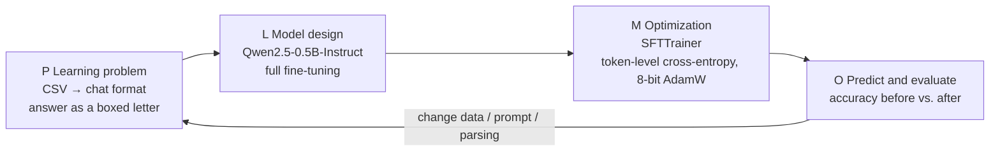

> 🌏 [中文版](/posts/learning/2026-09-29-berkeley-cs189-sp26-hw5-ssl-diffusion-finetuning)

This guide is based on the official HW5 files of [CS189 Spring 2026](https://eecs189.org/sp26/) (Jennifer Listgarten / Alex Dimakis) in the [HW5 folder](https://drive.google.com/drive/folders/1h4PNbX1thl4IL99JsdG4ymiahxd0uWXj): `hw5.pdf` (5 pages), `hw5_student.tex`, `hw5_finetuning_student.ipynb`, `hw5_sample_eval.csv`, `kaggle_test.csv`, and `solutions/hw5-sol.pdf` (11 pages). All of them download anonymously; the course as a whole rates A3 (defined in the [global AI/CS course map](/en/posts/learning/2026-08-21-global-ai-cs-course-map-en)). What you can't get: Gradescope submission, the hidden Kaggle labels, and official solutions for the notebook.

The schedule marks HW5 as "Optional", due Monday 5/11 at 11:59 PM PT, the same day as the final. The syllabus also says all homeworks are weighted equally and the lowest-scoring one is dropped automatically.

HW5 exercises each of three threads from [the previous post on Lec 25–27](/en/posts/learning/2026-09-29-berkeley-cs189-sp26-lectures-25-27-protein-agents-closing-en) and [Lec 23–24](/en/posts/learning/2026-09-29-berkeley-cs189-sp26-lectures-23-24-llm-training-ssl-en): self-supervised learning (on biological data), the math of generative models (diffusion and flow matching), and LLM post-training (fine-tuning a small model yourself).

| Part | Content | Deliverable |
|---|---|---|
| Written 1 | Self-Supervised Learning for Biology: InfoNCE (a–e) | PDF to Gradescope "HW5 Write-Up" |
| Written 2 | Diffusion Model Theory (a–c) | Same |
| Written 3 | Flow Matching with General Interpolation Paths (a–b) | Same |
| Notebook | LLM Fine-tuning with Transformers | Prediction CSV for the [Kaggle competition](https://www.kaggle.com/competitions/cs-189-hw-5-sp-26) |

The Deliverables line in `hw5.pdf` mentions only the written PDF. The notebook says test-set details are "provided in the accompanying PDF", but `hw5.pdf` contains no such section; treat the last cells of the notebook as the actual rules.

## Course video sources

No dedicated public lecture recording was verified for this article. Use the official course entry for recordings and materials.

Course and recording entries:

- [Official course and recording entry](https://eecs189.org/sp26/)

## Written 1: self-supervised learning on biological data

The setting is single-cell RNA sequencing (scRNA-seq): each cell is a d-dimensional gene expression vector xᵢ, where d is the number of measured genes. Cell-type labels are expensive, so the model has to build its own supervision signal. The problem uses a contrastive objective inspired by CPC, SimCLR, and CLIP.

The setup:

- an encoder maps each cell to zᵢ = g_enc(xᵢ);
- a **positive** zᵢ⁺ is a biologically similar view of the same cell, such as a version with random gene dropout, or a nearby cell from the same local neighborhood;
- **negatives** are the other N−1 unrelated cells in the minibatch;
- the score is f(z, cᵢ) = exp(zᵀ W cᵢ), with learnable W and a context cᵢ built from zᵢ.

InfoNCE is the negative log of "positive score ÷ (positive score + all negative scores)". The five parts:

| Part | Question |
|---|---|
| (a) | Why can minimizing InfoNCE be read as N-way classification? What are the "classes"? |
| (b) | With sⱼ = zⱼᵀ W cᵢ, compute ∂Lᵢ/∂sⱼ for the positive and for a negative, and explain how these gradients shape useful representations |
| (c) | Why does increasing the number of negatives N substantially often improve representations? What does it cost during training? |
| (d) | Why might contrastive learning in latent space beat training an autoencoder to reconstruct the full xᵢ? |
| (e) | After pretraining, freeze the encoder and train a small classifier on few labels. Why can this beat a fully supervised model trained from scratch? |

**Back to lecture**: the gradients in (a)(b) have the same shape as the cross-entropy gradient of logistic regression from [Lec 11–12](/en/posts/learning/2026-09-29-berkeley-cs189-sp26-lectures-11-12-classification-logistic-en), just in a new setting; (d)(e) are [Lec 24](/en/posts/learning/2026-09-29-berkeley-cs189-sp26-lectures-23-24-llm-training-ssl-en)'s generative vs. discriminative pretext tasks and its transfer-learning argument. The "representation learning on millions of proteins" from Lec 25 follows the same logic.

## Written 2: diffusion model theory

The model is x_σ = x₀ + σε with ε ~ N(0, I). Three parts climb from statistics to a differential equation:

1. **(a)** Show that the function minimizing E‖f(Y) − X‖² is the conditional expectation E[X | Y = y]. This is the classic squared-loss regression result: under squared error, the best prediction is the conditional mean.
2. **(b)** Use (a) to derive the optimal denoiser ε*_σ(x_σ), expressed in terms of the data density and the observed noisy input.
3. **(c)** With a time-varying noise schedule xₜ = x₀ + σ(t)ε, define the vector field v(x, t) as the expected time derivative of the noise term given xₜ = x, and show that pₜ and v satisfy the continuity equation.

Part (c) is the most math-heavy problem in the assignment. It answers why the noising process can be viewed as a density flowing along a vector field, and why learning that field lets you run the process backward to generate.

## Written 3: flow matching with general interpolation paths

[HW2](/en/posts/learning/2026-09-29-berkeley-cs189-sp26-hw2-regression-gmm-flow-matching-en)'s "Watch Me Flow Dat" already covered flow matching. This problem generalizes the straight path xₜ = t·x₁ + (1−t)·x₀:

- **(a)** For xₜ = α(t)x₁ + β(t)x₀ (with α(0)=0, β(0)=1, α(1)=1, β(1)=0), write the velocity in terms of α′ and β′, and check that the linear case reduces to the constant velocity x₁ − x₀.
- **(b)** Rewrite the path with a single function h(t): show the velocity is h′(t)(x₁ − x₀); explain how h controls the speed along the path; compare h(t) = t, t², and sin(πt/2) in terms of whether the trajectory moves faster near t = 0 or t = 1.

Part (b)(iii) needs little computation: sketch the three h′(t) curves and the answer is visible.

## Notebook: LLM fine-tuning + Kaggle

The notebook is titled "LLM Fine-tuning with Transformers". The goal is stated plainly: fine-tune a small instruction-tuned model to do well on past CS189 exam problems **while keeping its general knowledge**. The hidden test set mixes CS189 exam problems with general-knowledge questions, all multiple choice.

### Rules

| You can change | You cannot change |
|---|---|
| Answer parsing (`parse_choice_from_boxed`) | The model: you must train `Qwen/Qwen2.5-0.5B-Instruct` |
| Training and test data: mix in other datasets, build your own eval sets | |
| Test-time techniques: different decoding, majority voting | |
| Prompts: chain-of-thought, different system prompts | |

The notebook singles out **catastrophic forgetting**: fine-tuning on a narrow set like CS189 multiple-choice questions can make the model forget how to answer general questions. It recommends building your own test set mixing domain and general questions to monitor this, and mixing in general data or using early stopping ([Lec 20](/en/posts/learning/2026-09-29-berkeley-cs189-sp26-lectures-19-20-cnn-generalization-en)).

With only 0.5B parameters, the notebook uses **full fine-tuning** and notes that LoRA is also allowed.

### The pipeline: P / L / M / O

The notebook maps fine-tuning onto the four-step ML lifecycle from lecture:

What each part does:

| Part | What it does |
|---|---|
| 0 Setup | Installs `transformers==4.57.2`, `accelerate`, `datasets`, `trl`, `bitsandbytes`; can mount Drive in Colab |
| 1 Config and loading | All settings in one cell: batch size 1, gradient accumulation 4, 5 warmup steps, `MAX_STEPS = 20`, learning rate 1e-5, weight decay 0.01, linear scheduler, `adamw_8bit`, seed 189 |
| 2 Data | Reads the CSV (question, A–E, answer), builds the prompt, and uses `tokenizer.apply_chat_template()` to produce the model's format (adding the im_start / im_end special tokens and user / assistant roles) |
| 2 Training data | Loads the `machine_learning` subset of `cais/mmlu` from Hugging Face in the same chat format as the training set; notes you can mix in your own data |
| 3 Baseline | Greedy-decoding accuracy on the 25-question `hw5_sample_eval.csv` before training |
| 4 Training | Configure `SFTConfig` (`dataset_text_field="text"` etc.), then `trainer.train()` |
| 5 Post-training eval | Same eval set again, compared with the baseline |
| Save | `save_pretrained` for model and tokenizer |

The chat-format cell is worth reading closely: each example is a list of `{"role": ..., "content": ...}` messages, where the user turn is "choose exactly one correct option and return your answer inside a LaTeX box" plus the question and options, and the assistant turn is `\boxed{A}`. This is the SFT from [Lec 23](/en/posts/learning/2026-09-29-berkeley-cs189-sp26-lectures-23-24-llm-training-ssl-en), and Discussion 12 problem 1's VLM alignment is the multimodal version of the same idea.

### Kaggle submission

The final "YOUR TURN" section asks you to run the whole lifecycle:

1. fine-tune on training data of your choice (adapting the provided version is fine);
2. adapt the same pipeline to run inference on `kaggle_test.csv`, which has **169 questions** with columns `id`, `question`, `A`–`E` and no answers;
3. output **exactly one** letter A–E per row;
4. save a CSV with exactly two columns, `id` and `prediction`, and a single header row, then upload it. Kaggle rejects malformed submissions.

The metric is accuracy. The leaderboard is split into public (50% of the test data) and private (the other 50%, used for final ranking and grading). The last cell builds an "all A" dummy submission you can use to check the format.

## How to use the official solutions

`hw5-sol.pdf` is the problem PDF with a Solution block under each part: written 1 (a)–(e), written 2 (a)–(c), and written 3 (a)–(b). **There is no reference implementation for the notebook.** This guide doesn't reproduce the answers. Finish each problem before checking, especially written 2(c): the solution uses a test-function argument, so think about how you would prove it first, then see how it avoids differentiating the density directly.

## Further reading and navigation

- Fall 2026 counterparts: [CS189 Fall 2026](https://eecs189.org/fa26/) Lec 25 (Post-training: fine-tuning, LoRA, PEFT, distillation) and Lec 26 (Diffusion). Fall 2026's HW5 is split into Part 1 and Part 2 deadlines, and its contents aren't public on the home page.
- Related guides on this site (extensions only, not replacements): [CMU 11-785: diffusion](/en/posts/ai/2026-08-22-cmu-11785-23-diffusion-en), [CMU 11-768: SFT](/en/posts/ai/2026-09-29-cmu-11768-lecture-08-sft-en), [RAG vs. fine-tuning](/en/posts/ai/2026-03-12-rag-vs-fine-tuning-en).
- Series navigation: previous, [Lec 25–27: proteins, agents, and closing](/en/posts/learning/2026-09-29-berkeley-cs189-sp26-lectures-25-27-protein-agents-closing-en); this is the last post in the series; series entry, [CS189 overview](/en/posts/learning/2026-08-22-berkeley-cs189-spring-2025-overview-en).

**Something to do tonight**: don't train yet. Run the notebook through Part 3 and note the baseline accuracy; then pull a few dozen general questions from MMLU outside machine learning and make your own "forgetting monitor" set. After every config change, check both numbers, and you'll quickly see what catastrophic forgetting looks like.

## Update Log

- 2026-10-10: Added course video sources and recording access notes.

## References

- [CS189 Spring 2026 home page and schedule](https://eecs189.org/sp26/)
- [CS189 Spring 2026 syllabus](https://eecs189.org/sp26/syllabus/)
- [HW5 folder (hw5.pdf, notebook, CSVs, tex)](https://drive.google.com/drive/folders/1h4PNbX1thl4IL99JsdG4ymiahxd0uWXj)
- [hw5.pdf](https://drive.google.com/file/d/1SykbSPDQuuKaBgMrg27SaCy0NPMl6-dq/view)
- [hw5_finetuning_student.ipynb](https://drive.google.com/file/d/1-7dgU47YkVAlR1PO45aS4G0CUew4ccA5/view)
- [Official HW5 solutions: hw5-sol.pdf](https://drive.google.com/file/d/1YBQRNVPGZ_-2sa7GNHN8IeyhVpzsjAL9/view)
- [Kaggle: CS 189 HW 5 SP 26](https://www.kaggle.com/competitions/cs-189-hw-5-sp-26)
- [Qwen/Qwen2.5-0.5B-Instruct (Hugging Face)](https://huggingface.co/Qwen/Qwen2.5-0.5B-Instruct)
- [cais/mmlu dataset (Hugging Face)](https://huggingface.co/datasets/cais/mmlu)
- [CS189 Fall 2026 schedule](https://eecs189.org/fa26/)
