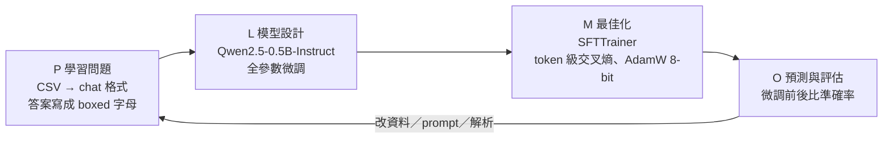

> 🌏 [English version](/en/posts/learning/2026-09-29-berkeley-cs189-sp26-hw5-ssl-diffusion-finetuning-en)

**影片狀態：僅附官方入口或錄影清單。** [影片來源與說明](#課程影片來源)

本文依 [CS189 Spring 2026](https://eecs189.org/sp26/)（Jennifer Listgarten／Alex Dimakis）HW5 的官方檔案寫成：[HW5 資料夾](https://drive.google.com/drive/folders/1h4PNbX1thl4IL99JsdG4ymiahxd0uWXj)裡的 `hw5.pdf`（5 頁）、`hw5_student.tex`、`hw5_finetuning_student.ipynb`、`hw5_sample_eval.csv`、`kaggle_test.csv`，以及 `solutions/hw5-sol.pdf`（11 頁）。以上都能匿名下載；整門課判 A3（定義見[全球 AI／CS 課程地圖](/posts/learning/2026-08-21-global-ai-cs-course-map)）。拿不到的是 Gradescope 提交、Kaggle 的隱藏答案，以及 notebook 部分的官方解答。

排程頁把 HW5 標成「Optional」，到期日是 5/11（一）晚上 11:59（PT），和期末考同一天。Syllabus 另外寫明所有作業等權重，並自動丟掉分數最低的一份。

HW5 剛好把[上一篇 Lec 25–27](/posts/learning/2026-09-29-berkeley-cs189-sp26-lectures-25-27-protein-agents-closing) 和 [Lec 23–24](/posts/learning/2026-09-29-berkeley-cs189-sp26-lectures-23-24-llm-training-ssl) 的三條線各做一次：自監督學習（用生物資料）、生成模型的數學（diffusion 與 flow matching）、LLM 後訓練（親手微調一個小模型）。

| 部分 | 內容 | 交什麼 |
|---|---|---|
| 書面 1 | Self-Supervised Learning for Biology：InfoNCE（a–e） | Gradescope「HW5 Write-Up」的 PDF |
| 書面 2 | Diffusion Model Theory（a–c） | 同上 |
| 書面 3 | Flow Matching with General Interpolation Paths（a–b） | 同上 |
| Notebook | LLM Fine-tuning with Transformers | [Kaggle 競賽](https://www.kaggle.com/competitions/cs-189-hw-5-sp-26)的預測 CSV |

`hw5.pdf` 的 Deliverables 只寫了書面 PDF；notebook 開頭說測試集細節「見隨附 PDF」，但 `hw5.pdf` 裡沒有這段說明。實際規則以 notebook 最後幾格為準。

## 課程影片來源

未核對到本文專屬的公開講次影片；請從官方課程入口查找錄影與教材。

課程與錄影入口：

- [官方課程與錄影入口](https://eecs189.org/sp26/)

## 書面 1：生物資料上的自監督學習

背景是單細胞 RNA 定序（scRNA-seq）：每個細胞是一個 d 維的基因表現向量 xᵢ，d 是量到的基因數。標註細胞類型很貴，所以要自己造監督訊號。題目採用受 CPC、SimCLR、CLIP 啟發的對比目標。

設定如下：

- encoder 把細胞映到 zᵢ = g_enc(xᵢ)；
- **正樣本** zᵢ⁺：同一個細胞在生物上相似的另一個 view，例如隨機 dropout 掉部分基因的版本，或同一局部鄰域的細胞；
- **負樣本**：minibatch 裡其他 N−1 個不相關細胞；
- 分數函數 f(z, cᵢ) = exp(zᵀ W cᵢ)，W 可學習，cᵢ 是由 zᵢ 建出的 context。

InfoNCE 就是「正樣本分數 ÷（正樣本分數 + 所有負樣本分數）」取負 log。五個小題：

| 小題 | 問什麼 |
|---|---|
| (a) | 為什麼最小化 InfoNCE 可以看成 N 類分類？「類別」是什麼？ |
| (b) | 令 sⱼ = zⱼᵀ W cᵢ，分別對正樣本與負樣本求 ∂Lᵢ/∂sⱼ，並解釋這些梯度怎麼推出好的表徵 |
| (c) | 大幅增加負樣本數 N，為什麼通常讓表徵更好？訓練時要付出什麼代價？ |
| (d) | 改用 autoencoder 直接重建整個 xᵢ，為什麼在潛空間做對比可能比較好？ |
| (e) | 預訓練後凍結 encoder、只用少量標註訓練小分類器，為什麼可能勝過從頭做監督學習？ |

**連回課堂**：(a)(b) 的梯度形狀和 [Lec 11–12](/posts/learning/2026-09-29-berkeley-cs189-sp26-lectures-11-12-classification-logistic) logistic regression 的交叉熵梯度一樣，只是換了場景；(d)(e) 是 [Lec 24](/posts/learning/2026-09-29-berkeley-cs189-sp26-lectures-23-24-llm-training-ssl) 的生成式 vs 判別式 pretext task，以及遷移學習的論點。Lec 25 講的「在數百萬條蛋白質上做表徵學習」也是同一個邏輯。

## 書面 2：Diffusion 模型理論

模型是 x_σ = x₀ + σε，ε ~ N(0, I)。三個小題一路從統計推到微分方程：

1. **(a)** 證明使 E‖f(Y) − X‖² 最小的函數是條件期望 E[X | Y = y]。這是平方損失迴歸的經典結果：在平方誤差下，最好的預測就是條件平均。
2. **(b)** 用 (a) 推出最佳去噪函數 ε*_σ(x_σ)，並用資料密度與觀察到的加噪輸入表示。
3. **(c)** 給定隨時間變化的雜訊排程 xₜ = x₀ + σ(t)ε，定義向量場 v(x, t) 為「雜訊項對時間的導數」在 xₜ = x 條件下的期望，證明 pₜ 和 v 滿足 continuity equation。

(c) 是這份作業最吃數學的一題。它回答的是：為什麼可以把加噪過程看成一個「密度沿著向量場流動」的過程，而學會這個向量場就能反過來生成。

## 書面 3：Flow matching 的一般插值路徑

[HW2](/posts/learning/2026-09-29-berkeley-cs189-sp26-hw2-regression-gmm-flow-matching) 的「Watch Me Flow Dat」已經做過 flow matching。這裡把 xₜ = t·x₁ + (1−t)·x₀ 的直線路徑推廣：

- **(a)** 對 xₜ = α(t)x₁ + β(t)x₀（端點條件 α(0)=0、β(0)=1、α(1)=1、β(1)=0），用 α′、β′ 寫出速度，並驗證線性情形退化成常數速度 x₁ − x₀。
- **(b)** 改寫成單一函數 h(t)：證明速度是 h′(t)(x₁ − x₀)；說明 h 怎麼影響沿路徑移動的快慢；比較 h(t) = t、t²、sin(πt/2) 在 t 接近 0 和接近 1 時哪邊比較快。

(b)(iii) 不用算太多，畫出三條 h′(t) 就看得出答案。

## Notebook：LLM 微調 + Kaggle

Notebook 標題是「LLM Fine-tuning with Transformers」。目標寫得很清楚：微調一個小型指令模型，讓它在過去的 CS189 考題上表現更好，**同時保住一般知識**。隱藏測試集混合了 CS189 考題和一般知識題，全部是選擇題。

### 規則

| 可以改 | 不能改 |
|---|---|
| 解析答案的邏輯（`parse_choice_from_boxed`） | 模型：必須訓練 `Qwen/Qwen2.5-0.5B-Instruct` |
| 訓練與測試資料：混其他資料集、自建評估集 | |
| 推論時技巧：不同 decoding、多數決 | |
| Prompt：chain-of-thought、不同 system prompt | |

Notebook 特別提醒 **catastrophic forgetting**：只在 CS189 選擇題這種窄資料上微調，模型可能忘掉怎麼回答一般問題。建議自己建一個混合領域題與一般題的測試集來監控，並考慮混入一般資料或用 early stopping（[Lec 20](/posts/learning/2026-09-29-berkeley-cs189-sp26-lectures-19-20-cnn-generalization)）。

模型只有 5 億參數，所以 notebook 用**全參數微調**，也註明可以改用 LoRA。

### 流程：P / L / M / O

Notebook 把微調對應到課堂上的 ML 生命週期四步：

各 Part 的內容：

| Part | 做什麼 |
|---|---|
| 0 環境 | 安裝 `transformers==4.57.2`、`accelerate`、`datasets`、`trl`、`bitsandbytes`；可在 Colab 掛 Drive |
| 1 設定與載入 | 所有設定集中一格：batch size 1、gradient accumulation 4、warmup 5 步、`MAX_STEPS = 20`、學習率 1e-5、weight decay 0.01、linear scheduler、`adamw_8bit`、seed 189 |
| 2 資料 | 讀 CSV（題目、A–E、答案）；組 prompt；用 `tokenizer.apply_chat_template()` 轉成模型要的格式（會加上 im_start／im_end 特殊 token 與 user／assistant 角色） |
| 2 訓練資料 | 從 Hugging Face 載 `cais/mmlu` 的 `machine_learning` 子集，轉成同樣的 chat 格式當訓練集；註明可以自己混其他資料 |
| 3 Baseline | 用 greedy decoding 在 25 題的 `hw5_sample_eval.csv` 上算微調前準確率 |
| 4 訓練 | 設定 `SFTConfig`（`dataset_text_field="text"` 等）後 `trainer.train()` |
| 5 Post-training eval | 同一份評估集再算一次，和 baseline 比 |
| 存檔 | `save_pretrained` 存模型與 tokenizer |

Chat 格式那一格值得細讀：每筆資料是一串 `{"role": ..., "content": ...}` 訊息，user 是「只選一個正確選項，答案放在 LaTeX box 裡」加題目與選項，assistant 是 `\boxed{A}`。這就是 [Lec 23](/posts/learning/2026-09-29-berkeley-cs189-sp26-lectures-23-24-llm-training-ssl) 講的 SFT，而 Discussion 12 第 1 題的 VLM 對齊是同一件事的多模態版本。

### Kaggle 提交

最後的「YOUR TURN」要跑完整的生命週期：

1. 用自己選的訓練資料微調（可以改 notebook 給的版本）；
2. 把同一條流程改成對 `kaggle_test.csv` 推論，這份檔案有 **169 題**，欄位是 `id`、`question`、`A`–`E`，沒有答案；
3. 每題輸出**恰好一個** A–E 字母；
4. 存成只有 `id`、`prediction` 兩欄、一列表頭的 CSV 上傳。格式不對 Kaggle 會直接拒收。

評分指標是準確率。排行榜分成 public（50% 測試資料）與 private（另外 50%，用於最終排名與評分）。Notebook 最後一格是「全部猜 A」的 dummy submission，可以先拿來確認格式。

## 官方解答怎麼用

`hw5-sol.pdf` 是題目 PDF 加上每一小題的 Solution 區塊：書面 1 的 (a)–(e)、書面 2 的 (a)–(c)、書面 3 的 (a)–(b)，**沒有 notebook 的參考實作**。本文不轉貼答案。建議先自己寫完一題再對，特別是書面 2(c)：解答用的是測試函數（test function）的論證方式，先想想自己會怎麼證，再看它怎麼避開直接對密度微分。

## 延伸與導覽

- Fall 2026 對應講次：[CS189 Fall 2026](https://eecs189.org/fa26/) 的 Lec 25（Post-training：fine-tuning、LoRA、PEFT、distillation）與 Lec 26（Diffusion）。Fall 2026 的 HW5 分 Part 1、Part 2 兩次繳交，內容在首頁沒有公開。
- 站內延伸（只是延伸，不取代本課內容）：[CMU 11-785：diffusion](/posts/ai/2026-08-22-cmu-11785-23-diffusion)、[CMU 11-768：SFT](/posts/ai/2026-09-29-cmu-11768-lecture-08-sft)、[RAG 還是 fine-tuning](/posts/ai/2026-03-12-rag-vs-fine-tuning)。
- 系列導覽：上一篇 [Lec 25–27：蛋白質、agents 與完課](/posts/learning/2026-09-29-berkeley-cs189-sp26-lectures-25-27-protein-agents-closing)；這是系列最後一篇；系列入口 [CS189 總覽](/posts/learning/2026-08-22-berkeley-cs189-spring-2025-overview)。

**今晚能做的事**：先別訓練。把 notebook 跑到 Part 3，記下 baseline 準確率；再從 MMLU 抽幾十題非 machine learning 的一般題，做成自己的「遺忘監控集」。之後每改一次設定就同時看兩個數字，你會很快感受到 catastrophic forgetting 長什麼樣子。

## 更新紀錄

- 2026-10-10：標註影片狀態，核對錄影來源與取得方式。

## 參考資料

- [CS189 Spring 2026 課程首頁與排程](https://eecs189.org/sp26/)
- [CS189 Spring 2026 Syllabus](https://eecs189.org/sp26/syllabus/)
- [HW5 資料夾（hw5.pdf、notebook、CSV、tex）](https://drive.google.com/drive/folders/1h4PNbX1thl4IL99JsdG4ymiahxd0uWXj)
- [hw5.pdf](https://drive.google.com/file/d/1SykbSPDQuuKaBgMrg27SaCy0NPMl6-dq/view)
- [hw5_finetuning_student.ipynb](https://drive.google.com/file/d/1-7dgU47YkVAlR1PO45aS4G0CUew4ccA5/view)
- [HW5 官方解答 hw5-sol.pdf](https://drive.google.com/file/d/1YBQRNVPGZ_-2sa7GNHN8IeyhVpzsjAL9/view)
- [Kaggle：CS 189 HW 5 SP 26](https://www.kaggle.com/competitions/cs-189-hw-5-sp-26)
- [Qwen/Qwen2.5-0.5B-Instruct（Hugging Face）](https://huggingface.co/Qwen/Qwen2.5-0.5B-Instruct)
- [cais/mmlu 資料集（Hugging Face）](https://huggingface.co/datasets/cais/mmlu)
- [CS189 Fall 2026 排程](https://eecs189.org/fa26/)
