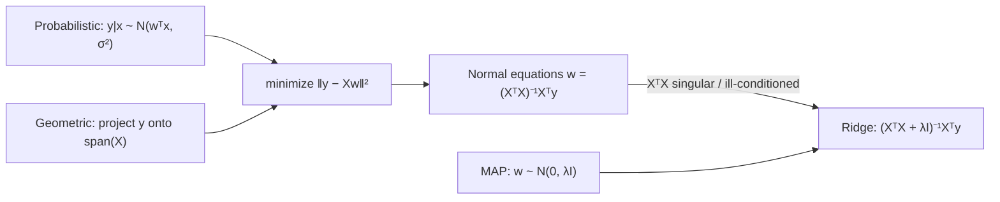

> 🌏 [中文版](/posts/learning/2026-09-29-berkeley-cs189-sp26-lectures-07-10-linear-regression)

**Video status: Videos included; playback has not been rechecked individually.** [Source details](#course-video-sources)

This guide follows [CS189 Spring 2026](https://eecs189.org/sp26/) (Jennifer Listgarten / Alex Dimakis) and covers the second half of Lecture 7 through Lecture 10 (Feb 10–19). The [previous post](/en/posts/learning/2026-09-29-berkeley-cs189-sp26-lectures-04-07-clustering-mle-gmm-en) ended with the Gaussian mixture log-likelihood, which has no closed-form maximizer. This block switches to supervised learning, and the first model is linear regression.

Linear regression itself is not hard. The hard part is that these four lectures ask you to hold three views at once:

1. **Probabilistic**: assume y given x is Gaussian, run MLE, and you get least squares.
2. **Geometric**: predictions can only live in the column space of X, and the best prediction is the orthogonal projection of y onto that subspace.
3. **Regularization**: when the solution is not unique or too sensitive, add a penalty. That penalty can also be read as a prior on the parameters.

All three meet in one formula. By the end you should be able to derive `w = (XᵀX + λI)⁻¹Xᵀy` yourself and say where each term comes from.

## Course video sources

These recordings correspond to the material discussed here. No unverified timestamp is supplied.

```youtube
url: https://www.youtube.com/watch?v=0YLmbbERr0g
title: Video
```

```youtube
url: https://www.youtube.com/watch?v=202aSB1p8do
title: Video
```

Original videos: [Video](https://www.youtube.com/watch?v=0YLmbbERr0g)、[Video](https://www.youtube.com/watch?v=202aSB1p8do)、[Video](https://www.youtube.com/watch?v=lrU8Vn0G44w)

Course and recording entries:

- [Official course and recording entry](https://eecs189.org/sp26/)

## Official materials and scope

| Lecture | Date | Title (from the schedule) | Materials |
|---|---|---|---|
| Lec 7 | Feb 10 | Mixture of Gaussians & Linear Regression | [PDF](https://drive.google.com/file/d/1AWAHBb3kuA8qdYm5mIaCk8a8DVN4c1f5/view) / [Video](https://www.youtube.com/watch?v=0YLmbbERr0g&list=PLuHtd0SzXhx4B8oOmp9PBEroMuV5n0MWE&index=6) |
| Lec 8 | Feb 12 | Linear Regression | [PDF](https://drive.google.com/file/d/10-22hV3z4fDeteznK2OZIw6vM5n9romC/view) / [Video](https://www.youtube.com/watch?v=202aSB1p8do&list=PLuHtd0SzXhx4B8oOmp9PBEroMuV5n0MWE&index=7) |
| Lec 9 | Feb 17 | Linear Regression & Regularization | [PDF](https://drive.google.com/file/d/1kDbaZf2t69nSJfqZMPU-jRV1WPKVOala/view) / [Video](https://www.youtube.com/watch?v=lrU8Vn0G44w&list=PLuHtd0SzXhx4B8oOmp9PBEroMuV5n0MWE&index=8) |
| Lec 10 | Feb 19 | Finish Linear Regression & Regularization | [PDF](https://drive.google.com/file/d/1l4QFPcDuXQB8ThIsaCU8XsSkaqejB5nh/view) / [Video](https://www.youtube.com/watch?v=SlkUTrXY60E&list=PLuHtd0SzXhx4B8oOmp9PBEroMuV5n0MWE&index=9) |

Discussions:

- [Discussion 3](https://drive.google.com/file/d/1PAxeqyZj4QAEW4tc7MBPKhhjMcz0rBoZ/view) ([solutions](https://drive.google.com/file/d/11YV3yrkNRU5VclX8xDaAM5xX__gHMiK8/view), [walkthrough](https://www.youtube.com/playlist?list=PL-ysCubq-Sa-bRfFhYJkcJ-TDF3oTAWQj))
- [Discussion 4](https://drive.google.com/file/d/1GV_knujkL_ooo51cF7bM2PDCQo8z0e-B/view) ([solutions](https://drive.google.com/file/d/18PGUKc33SP9Gyv8AILqQOpeDOFJ7aOsV/view), [walkthrough](https://www.youtube.com/playlist?list=PL-ysCubq-Sa88y_YPkqtdNi_SQ3URFY2N))

The textbook is Bishop & Bishop, *[Deep Learning: Foundations and Concepts](https://www.bishopbook.com/)*. For Lec 8 the schedule lists 1.2.2–1.2.6, 2.1.3, 2.3.4, 2.6.2, 4.1.1–4.1.4, 4.1.6, 9.2, 9.2.2, and Appendix A.3 (matrix derivatives). Lec 10 adds 9.2.2 on lasso and 5.3 on generative classifiers. The book's website hosts a free-to-use online version.

**Access level**: the PDFs and videos for all four lectures, plus the problems, solutions, and walkthroughs for both discussions, open without a Berkeley login. This block is A3 (see the [global AI/CS course map](/en/posts/learning/2026-08-21-global-ai-cs-course-map-en) for the scale). What you cannot get is Ed and the live sections.

Two small things you will notice: the Lec 8 and Lec 9 PDFs still say "Lecture 7" on their title slides, so go by the lecture numbers on the schedule. The Lec 9 title slide also announces that typos in the Lec 8 geometry slides were fixed and re-posted, so use the version currently on Drive.

## Lec 7, second half: regression estimates p(y|x)

Lec 7 wraps up GMMs and then starts regression. The slides set the goal first: data comes in pairs (xᵢ, yᵢ) with real-valued yᵢ. What we actually want is the conditional distribution p(y|x); the point prediction is its mean, ŷ = E[Y | X = x].

There are two ways to estimate p(y|x). One is to estimate the joint p(x, y), say with a multivariate Gaussian, and condition. The other treats x as fixed and models only y. That is the **discriminative** approach, and linear regression takes it.

The model is ŷ = wᵀx + w₀. The slides point out a bookkeeping trick: append a constant feature of 1 to x, and the bias folds into w.

"Linear" means linear in the parameters w, not in the input x. Expand x with a basis Φ(x) first, for example the quadratic `[1, x₁, x₂, x₁x₂, x₁², x₂²]`, and it is still linear regression, yet it can fit curves. The slides list polynomial, RBF, and sinusoidal bases. Since Φ is fixed in advance, the derivations simply write wᵀx.

## The probabilistic view: MLE under Gaussian noise is least squares

Standard linear regression assumes p(y|x) = N(y | wᵀx, σ²), which is the same as Y = wᵀx + ε with ε ~ N(0, σ²). At every x, y is a bell curve centered at wᵀx with the same variance.

The log-likelihood of the data is:

```text
log p(D | w, σ²) = n·log(1/√(2πσ²)) − (1/2σ²) · Σᵢ (yᵢ − wᵀxᵢ)²
```

The first term does not depend on w, so maximizing the log-likelihood is the same as minimizing Σ(yᵢ − wᵀxᵢ)². In the slides' words, least squares "arises naturally from conditional Gaussian MLE."

This correspondence also tells you when least squares is a poor fit. The slides show a Gaussian next to a Cauchy: if the residuals are heavy-tailed (lots of outliers), the Gaussian assumption is wrong, and heavy-tailed noise matches the data better.

<details>
<summary>Deriving the normal equations (matrix calculus)</summary>

Stack the n data points into A ∈ ℝⁿˣᵈ (each row is xᵢᵀ) and y ∈ ℝⁿ. The loss is:

```text
L = (y − Aw)ᵀ(y − Aw) = yᵀy − 2wᵀAᵀy + wᵀAᵀAw
```

Two vector-calculus rules do the work: ∂(aᵀb)/∂a = b, and for symmetric Σ, ∂(xᵀΣx)/∂x = 2Σx. So

```text
∇_w L = −2Aᵀy + 2AᵀAw = 0   ⇒   w = (AᵀA)⁻¹Aᵀy
```

The Hessian is 2AᵀA. When AᵀA is positive definite (the features are linearly independent, full rank), this critical point is the minimum. The MLE for σ² is the mean squared residual. The slides link Roweis's matrix identities cheat sheet.

</details>

Lec 8 also mentions that when AᵀA is not invertible you can use the Moore-Penrose pseudoinverse A⁺. Lec 9 fills in the details: take the SVD X = UΣVᵀ, invert only the nonzero singular values, and get X⁺ = VΣ⁺Uᵀ. The solution w* = X⁺y always exists, even with linearly dependent features. Among the infinitely many solutions with the same minimal error, it picks the one with the smallest ‖w‖₂.

## The geometric view: the prediction is a projection onto the column space

Now look at the same solution another way. Write Xw as a combination of columns:

```text
Xw = w₁·X[:,1] + w₂·X[:,2] + … + w_d·X[:,d]
```

Whatever w you choose, the prediction vector Ŷ lies in span(X), the column space of X. That is an at-most-d-dimensional subspace of ℝⁿ. The observed y is usually not in it, because of noise or because the model is missing features.

So the question becomes: which point in span(X) is closest to y? The orthogonal projection. At that point the residual e = y − Xw is perpendicular to the whole column space:

```text
Xᵀe = 0  ⇒  Xᵀ(y − Xw*) = 0  ⇒  w* = (XᵀX)⁻¹Xᵀy
```

That is the same formula as the probabilistic view, and this time without taking a single derivative. Lec 8 links an interactive Plotly figure you can rotate to see the projection in 3D.



## Where it breaks: collinearity and overfitting

Lec 8 is concrete about failure modes. XᵀX is invertible only when it has full rank, which is the same as being positive definite with all eigenvalues positive. If the features are linearly dependent on this data, the rank drops. When there are more features than samples, that is guaranteed.

The other problem is overfitting. Keep raising the polynomial degree and d grows. Once d ≥ n you can pass exactly through every training point. Even short of a perfect fit, test error can get worse. The slides' reminder: the goal was never to fit the training data exactly, but to do well on unseen test cases.

There are two families of fixes. Remove features (feature selection), or keep them and add constraints that "tighten up" the system, which is regularization.

## Regularization: ridge is MAP with a Gaussian prior

Start with the intuition. Suppose two features are perfectly collinear, x₂ = αx₁. Then infinitely many w give the same training error. Which one should you pick? The slides say: the one with the smallest norm. If each feature has as little effect on the output as possible, small perturbations of the input barely move the prediction. The slides describe the model as behaving "gracefully."

Put that preference into the loss and you get L2 regularization, also called ridge regression:

```text
L = ‖y − Aw‖² + λ‖w‖²   ⇒   w_L2 = (AᵀA + λI)⁻¹Aᵀy
```

For any λ > 0, AᵀA + λI is invertible. The slides use the loss surface as a picture: with collinear features, the MLE solutions form a flat ridge, and the penalty bends that ridge until only one lowest point remains.

The Lec 10 recap adds a numerical angle: even when AᵀA is invertible, λ lowers the condition number. With AᵀA = QDQᵀ, the condition number goes from σ_max/σ_min to (σ_max + λ)/(σ_min + λ), which is smaller and less sensitive to perturbations.

The same formula falls out of a Bayesian argument. The slides call MAP the "lazy Bayesian": instead of computing the full posterior, find the single point where the posterior peaks.

```text
w_MAP = argmax_w  log p(D|w) + log p(w)
```

Take the prior p(w) = N(0, λI). The log-prior is −‖w‖² times a constant, and together with the Gaussian likelihood you are back at the ridge loss. Lec 10 states it precisely: the two are equivalent with penalty λ′ = σ²/λ. "Prefer small weights" and "put the prior mass near zero" are the same statement.

## Choosing λ: use a validation set

Can λ be treated as a parameter and minimized along with the loss? The slides say no, you cannot use MLE for it: the training loss is always smallest at λ = 0. λ has to be chosen on independent data:

1. Split a validation set off the training data (or do K-fold cross-validation) and pick the hyperparameter that does best there.
2. Only after that, measure final performance on the test set once.

Lec 10 generalizes this into model selection: choosing the model class, the features, λ, or a neural network architecture cannot be done by optimization itself, only by splitting data. It also flags a trap: the model you pick because it won on the validation set will have a validation error lower than its true error (the winner's curse). That is why the test set is used exactly once.

On metrics, Lec 10 compares MSE with held-out log-likelihood. Two models can have the same MSE, but log-likelihood also scores the shape of the predictive distribution (for example, how well σ is estimated), so it tells you more.

## Lasso: switch to L1 and get sparsity

If you want the model to use only a few features, the direct penalty counts nonzero weights (L0). That is not differentiable and turns into combinatorial optimization. The slides' substitute is L1:

```text
w_L1 = argmin_w ‖y − Aw‖² + λ‖w‖₁
```

Why does L1 give sparse solutions? Rewrite it as a constraint ‖w‖₁ < C. The L1 constraint region is a diamond with corners on the axes. The least-squares contours often touch it first at a corner, and at a corner some coefficients are exactly zero.

A one-line summary: **ridge shrinks all coefficients together; lasso sets some of them to zero**. Lasso also has a MAP reading, with a Laplace prior. The slides list its weakness too: with highly correlated features, lasso tends to keep one and drop the rest. Combining L1 and L2 gives the elastic net.

Lec 8, 9, and 10 all end with the same thought experiment: a house-price model has small cross-validated error on a huge dataset. Is it guaranteed to be that accurate in the future? The accompanying slide quotes a November 2021 *Wall Street Journal* report on a company's home-flipping losses. The point is that correlation is not causation, and once the data distribution shifts, validation error stops predicting the future.

The second half of the Lec 10 PDF already starts classification (discriminative vs. generative, Gaussian Discriminant Analysis). That material is covered in the [Lec 11–12 post](/en/posts/learning/2026-09-29-berkeley-cs189-sp26-lectures-11-12-classification-logistic-en).

## Discussion 3–4

**Discussion 3** (the week of Lec 7) is still finishing multivariate Gaussians and serves as a prerequisite here:

1. Show that a symmetric matrix Σ is positive definite if and only if Σ = AAᵀ for some invertible A.
2. Using the MGF, show that X is multivariate Gaussian if and only if every linear combination aᵀX is univariate Gaussian.
3. Derive the MLE of μ and Σ from i.i.d. samples; the problem supplies the gradients of log det and trace.
4. Write down the K-means objective and show the algorithm converges in finitely many steps.

Problem 1's positive definiteness is exactly the background for "when is AᵀA invertible."

**Discussion 4** (the week of Lec 9) maps directly onto this post:

1. Find the gradient and Hessian of four functions: wᵀx, xᵀx, xᵀAx, ‖Wx − b‖². The last one is the least-squares loss.
2. Given each point's cluster assignment, find the MLE (πₖ, μₖ, σₖ²) of a 1D GMM.
3. Ridge regression: find the minimizer of ‖y − Xβ‖² + λ‖β‖².

Try problems 1 and 3 on your own first, then compare against the Lec 8 derivation and the official solutions. Once those two are second nature, you no longer need to memorize the normal equations or the ridge closed form.

The MAP derivation for lasso and the bias-variance decomposition appear in Discussion 5, which this series covers in the [Lec 11–12 post](/en/posts/learning/2026-09-29-berkeley-cs189-sp26-lectures-11-12-classification-logistic-en).

## What to do tonight

1. Watch the [Lec 8 video](https://www.youtube.com/watch?v=202aSB1p8do&list=PLuHtd0SzXhx4B8oOmp9PBEroMuV5n0MWE&index=7). Pause at the geometric view and sketch y, span(X), and the residual e on paper.
2. Without looking, derive the ridge closed form from `‖y − Aw‖² + λ‖w‖²`, then check against the Lec 8 slides.
3. In NumPy, build a dataset with two perfectly collinear features. Compute `np.linalg.pinv(X) @ y` and `np.linalg.solve(X.T@X + lam*np.eye(d), X.T@y)`, sweep λ from 1e-6 to 10, and watch how w changes.
4. Do problems 1 and 3 of [Discussion 4](https://drive.google.com/file/d/1GV_knujkL_ooo51cF7bM2PDCQo8z0e-B/view); open the walkthrough only if you get stuck.

## Fall 2026 mapping and further reading

[Fall 2026](https://eecs189.org/fa26/) (Norouzi / Gonzalez) covers this material in Lec 6 Linear Regression and Lec 7 Bias-Variance Trade-off + Regularization; its Discussion 4 is titled Linear Regression + MLE Perspective.

On this site:

- The same derivations told differently: [Stanford CS229 notes, chapter 1: linear regression](/en/posts/ai/2026-08-22-stanford-cs229-2026-notes-chapter-01-linear-regression-en) and [chapter 9: regularization and model selection](/en/posts/ai/2026-08-22-stanford-cs229-2026-notes-chapter-09-regularization-model-selection-en)
- The probability behind MLE: [Stanford CS109 Lecture 19: maximum likelihood estimation](/en/posts/learning/2026-08-22-stanford-cs109-lecture-19-maximum-likelihood-estimation-en)
- Series entry points: [CS189 overview](/en/posts/learning/2026-08-22-berkeley-cs189-spring-2025-overview-en), [Berkeley AI/ML course map](/en/posts/learning/2026-08-21-berkeley-ai-ml-course-map-en)

## Series navigation

- Previous: [Lec 4–7: K-means, probability review, MLE, multivariate Gaussians, and GMMs](/en/posts/learning/2026-09-29-berkeley-cs189-sp26-lectures-04-07-clustering-mle-gmm-en)
- Next: [HW1 guide: linear algebra / calculus / probability warm-up + Fashion coding](/en/posts/learning/2026-09-29-berkeley-cs189-sp26-hw1-math-refresher-fashion-en)

## Update Log

- 2026-10-10: Added explicit video status and checked recording sources and access notes.

## References

- [CS189 Spring 2026 course page and schedule](https://eecs189.org/sp26/)
- [CS189 Spring 2026 syllabus](https://eecs189.org/sp26/syllabus/)
- [Lecture 7 PDF: Mixture of Gaussians & Linear Regression](https://drive.google.com/file/d/1AWAHBb3kuA8qdYm5mIaCk8a8DVN4c1f5/view)
- [Lecture 8 PDF: Linear Regression](https://drive.google.com/file/d/10-22hV3z4fDeteznK2OZIw6vM5n9romC/view)
- [Lecture 9 PDF: Linear Regression & Regularization](https://drive.google.com/file/d/1kDbaZf2t69nSJfqZMPU-jRV1WPKVOala/view)
- [Lecture 10 PDF: Finish Linear Regression & Regularization](https://drive.google.com/file/d/1l4QFPcDuXQB8ThIsaCU8XsSkaqejB5nh/view)
- [CS189 Spring 2026 lecture video playlist](https://www.youtube.com/playlist?list=PLuHtd0SzXhx4B8oOmp9PBEroMuV5n0MWE)
- [Discussion 3](https://drive.google.com/file/d/1PAxeqyZj4QAEW4tc7MBPKhhjMcz0rBoZ/view) and [solutions](https://drive.google.com/file/d/11YV3yrkNRU5VclX8xDaAM5xX__gHMiK8/view)
- [Discussion 4](https://drive.google.com/file/d/1GV_knujkL_ooo51cF7bM2PDCQo8z0e-B/view) and [solutions](https://drive.google.com/file/d/18PGUKc33SP9Gyv8AILqQOpeDOFJ7aOsV/view)
- [Bishop & Bishop, Deep Learning: Foundations and Concepts (official site, with free online version)](https://www.bishopbook.com/)
- [CS189 Fall 2026 course page](https://eecs189.org/fa26/)
