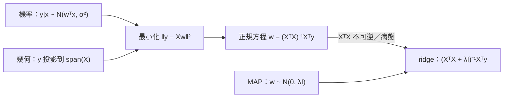

> 🌏 [English version](/en/posts/learning/2026-09-29-berkeley-cs189-sp26-lectures-07-10-linear-regression-en)

本文依 [CS189 Spring 2026](https://eecs189.org/sp26/)（Jennifer Listgarten／Alex Dimakis）整理，範圍是 Lecture 7 後半到 Lecture 10（2/10–2/19）。[上一篇](/posts/learning/2026-09-29-berkeley-cs189-sp26-lectures-04-07-clustering-mle-gmm)停在 Gaussian mixture 的 log-likelihood 沒有封閉解；這一段換到監督式學習，第一個模型就是線性回歸。

線性回歸本身不難，難的是這四講要你同時握住三種看法：

1. **機率**：假設 y 在給定 x 時是高斯分布，做 MLE，最後得到的就是最小平方。
2. **幾何**：預測向量只能落在 X 的欄空間裡，最好的預測就是 y 在這個子空間上的正交投影。
3. **正則化**：解不唯一或太敏感時，加一個懲罰項；這個懲罰項又能解讀成參數的先驗分布。

三條線最後會在同一條公式上會合。讀完這篇，你應該能自己推出 `w = (XᵀX + λI)⁻¹Xᵀy`，並說出每一項從哪裡來。

## 課程影片來源

影片連結對應本文教材；此處不提供未核對的時間跳轉。

```youtube
url: https://www.youtube.com/watch?v=0YLmbbERr0g
title: 影片
```

```youtube
url: https://www.youtube.com/watch?v=202aSB1p8do
title: 影片
```

原始影片：[影片](https://www.youtube.com/watch?v=0YLmbbERr0g)、[影片](https://www.youtube.com/watch?v=202aSB1p8do)、[影片](https://www.youtube.com/watch?v=lrU8Vn0G44w)

課程與錄影入口：

- [官方課程與錄影入口](https://eecs189.org/sp26/)

## 官方材料與讀取範圍

| 講次 | 日期 | 講題（依排程頁） | 材料 |
|---|---|---|---|
| Lec 7 | 2/10 | Mixture of Gaussians & Linear Regression | [PDF](https://drive.google.com/file/d/1AWAHBb3kuA8qdYm5mIaCk8a8DVN4c1f5/view)／[影片](https://www.youtube.com/watch?v=0YLmbbERr0g&list=PLuHtd0SzXhx4B8oOmp9PBEroMuV5n0MWE&index=6) |
| Lec 8 | 2/12 | Linear Regression | [PDF](https://drive.google.com/file/d/10-22hV3z4fDeteznK2OZIw6vM5n9romC/view)／[影片](https://www.youtube.com/watch?v=202aSB1p8do&list=PLuHtd0SzXhx4B8oOmp9PBEroMuV5n0MWE&index=7) |
| Lec 9 | 2/17 | Linear Regression & Regularization | [PDF](https://drive.google.com/file/d/1kDbaZf2t69nSJfqZMPU-jRV1WPKVOala/view)／[影片](https://www.youtube.com/watch?v=lrU8Vn0G44w&list=PLuHtd0SzXhx4B8oOmp9PBEroMuV5n0MWE&index=8) |
| Lec 10 | 2/19 | Finish Linear Regression & Regularization | [PDF](https://drive.google.com/file/d/1l4QFPcDuXQB8ThIsaCU8XsSkaqejB5nh/view)／[影片](https://www.youtube.com/watch?v=SlkUTrXY60E&list=PLuHtd0SzXhx4B8oOmp9PBEroMuV5n0MWE&index=9) |

Discussion：

- [Discussion 3](https://drive.google.com/file/d/1PAxeqyZj4QAEW4tc7MBPKhhjMcz0rBoZ/view)（[解答](https://drive.google.com/file/d/11YV3yrkNRU5VclX8xDaAM5xX__gHMiK8/view)、[walkthrough](https://www.youtube.com/playlist?list=PL-ysCubq-Sa-bRfFhYJkcJ-TDF3oTAWQj)）
- [Discussion 4](https://drive.google.com/file/d/1GV_knujkL_ooo51cF7bM2PDCQo8z0e-B/view)（[解答](https://drive.google.com/file/d/18PGUKc33SP9Gyv8AILqQOpeDOFJ7aOsV/view)、[walkthrough](https://www.youtube.com/playlist?list=PL-ysCubq-Sa88y_YPkqtdNi_SQ3URFY2N)）

指定閱讀是 Bishop & Bishop《[Deep Learning: Foundations and Concepts](https://www.bishopbook.com/)》。排程頁在 Lec 8 列了 1.2.2–1.2.6、2.1.3、2.3.4、2.6.2、4.1.1–4.1.4、4.1.6、9.2、9.2.2 與 Appendix A.3（矩陣微分）；Lec 10 另加 9.2.2 lasso 和 5.3 生成式分類器。書的官網有免費線上閱讀版。

**公開程度**：四講的 PDF 與影片、兩份 discussion 的題目／解答／walkthrough，校外都能直接打開，這一段是 A3（定義見[全球 AI／CS 課程地圖](/posts/learning/2026-08-21-global-ai-cs-course-map)）。拿不到的是 Ed 討論區與 section 現場。

兩個閱讀時會碰到的小狀況：Lec 8 和 Lec 9 的 PDF 封面仍寫著「Lecture 7」，內容以排程頁的講次為準；Lec 9 封面公告說 Lec 8 幾何那段投影片的筆誤已修正並重新上傳，所以請用現在 Drive 上的版本。

## Lec 7 後半：回歸要估的是 p(y|x)

Lec 7 前半收掉 GMM，後半開始回歸。投影片先把目標講清楚：資料是成對的 (xᵢ, yᵢ)，yᵢ 是實數；我們真正想要的是條件分布 p(y|x)，點預測就取它的期望值 ŷ = E[Y | X = x]。

估 p(y|x) 有兩條路。一條是先估聯合分布 p(x, y)，例如用多變量高斯，再用條件機率算回來。另一條是把 x 當成固定的，只對 y 建模，也就是**判別式（discriminative）**做法。線性回歸走第二條。

模型寫成 ŷ = wᵀx + w₀。投影片提醒一個記帳技巧：在 x 後面補一個恆為 1 的特徵，偏置項就併進 w 裡了。

「線性」指的是對參數 w 線性，不是對輸入 x 線性。把 x 先做基底展開 Φ(x)，例如二次展開 `[1, x₁, x₂, x₁x₂, x₁², x₂²]`，模型照樣是線性回歸，卻能畫出曲線。投影片列了多項式、RBF、正弦等基底。因為 Φ 是事先固定的，後面推導一律直接寫 wᵀx。

## 機率觀點：高斯雜訊的 MLE 就是最小平方

標準線性回歸假設 p(y|x) = N(y | wᵀx, σ²)，等價於 Y = wᵀx + ε、ε ~ N(0, σ²)。每個 x 底下，y 都是以 wᵀx 為中心、同一個變異數的鐘形分布。

對資料取 log-likelihood：

```text
log p(D | w, σ²) = n·log(1/√(2πσ²)) − (1/2σ²) · Σᵢ (yᵢ − wᵀxᵢ)²
```

對 w 來說第一項是常數，最大化 log-likelihood 就等於最小化 Σ(yᵢ − wᵀxᵢ)²。投影片的原話是 least squares「arises naturally from conditional Gaussian MLE」。

這個對應也告訴你什麼時候最小平方不合適。投影片放了一張高斯對比 Cauchy 的圖：如果殘差有重尾（離群值多），高斯假設就錯了，換成重尾分布的雜訊更貼近資料。

<details>
<summary>正規方程推導（矩陣微分）</summary>

把 n 筆資料疊成矩陣 A ∈ ℝⁿˣᵈ（每列是一筆 xᵢᵀ）、y ∈ ℝⁿ，損失寫成：

```text
L = (y − Aw)ᵀ(y − Aw) = yᵀy − 2wᵀAᵀy + wᵀAᵀAw
```

用兩條向量微分規則：∂(aᵀb)/∂a = b，以及對稱矩陣 Σ 時 ∂(xᵀΣx)/∂x = 2Σx。得到

```text
∇_w L = −2Aᵀy + 2AᵀAw = 0   ⇒   w = (AᵀA)⁻¹Aᵀy
```

Hessian 是 2AᵀA；AᵀA 正定（特徵彼此線性獨立、滿秩）時，這個臨界點就是最小值。σ² 的 MLE 則是平均殘差平方。投影片附了 Roweis 的矩陣恆等式速查表。

</details>

Lec 8 還提到 AᵀA 不可逆時可以改用 Moore-Penrose 偽逆 A⁺。Lec 9 把它講完整：先做 SVD，X = UΣVᵀ，只把非零的奇異值取倒數，得到 X⁺ = VΣ⁺Uᵀ。w* = X⁺y 在特徵線性相依時也永遠有解；在無限多個誤差同樣小的解裡，它挑的是 ‖w‖₂ 最小的那一個。

## 幾何觀點：預測是 y 在欄空間上的投影

同一個解換個角度看。把 Xw 拆成欄的線性組合：

```text
Xw = w₁·X[:,1] + w₂·X[:,2] + … + w_d·X[:,d]
```

所以不論 w 怎麼選，預測向量 Ŷ 都落在 span(X)（X 的欄空間）裡。這是一個最多 d 維、住在 ℝⁿ 裡的子空間。觀測到的 y 通常不在裡面，原因可能是雜訊，也可能是模型少了特徵。

問題就變成：在 span(X) 裡找離 y 最近的點。答案是正交投影，這時殘差 e = y − Xw 垂直於整個欄空間：

```text
Xᵀe = 0  ⇒  Xᵀ(y − Xw*) = 0  ⇒  w* = (XᵀX)⁻¹Xᵀy
```

跟機率觀點得到的是同一條公式，而且這次一個導數都沒算。Lec 8 附了一個 Plotly 互動圖，可以轉著看三維裡的投影。



## 會壞在哪裡：共線與過擬合

Lec 8 把失敗情境講得很具體。XᵀX 滿秩（等價於正定、所有特徵值都大於零）時才可逆。只要特徵在這批資料上線性相依，秩就掉下來；特徵數比樣本數多時，這件事一定會發生。

另一個問題是過擬合。多項式階數一路往上加，特徵數 d 變大；d ≥ n 時可以完美穿過每一個訓練點。即使沒有完美擬合，測試誤差也可能變差。投影片提醒：真正的目標是在沒看過的測試資料上表現好，訓練資料擬合得再漂亮也不算數。

解法分兩類。一類是拿掉特徵（feature selection），另一類是保留特徵、加限制把系統「收緊」，也就是正則化。

## 正則化：ridge 是高斯先驗的 MAP

先看直覺。假設兩個特徵完全共線，x₂ = αx₁，就會有無限多組 w 給出一樣的訓練誤差。投影片問：該挑哪一個？答案是範數最小的。每個特徵對輸出的影響越小，輸入稍微擾動時預測就越穩，投影片的說法是模型會表現得比較「gracefully」。

把這個偏好寫進損失，就是 L2 正則化，也叫 ridge regression：

```text
L = ‖y − Aw‖² + λ‖w‖²   ⇒   w_L2 = (AᵀA + λI)⁻¹Aᵀy
```

只要 λ > 0，AᵀA + λI 一定可逆。投影片用損失曲面比喻：共線時 MLE 的解是一整條平的山脊（ridge），加上懲罰項就把山脊壓彎，只剩一個最低點。

Lec 10 的回顧再補一個數值角度：就算 AᵀA 可逆，加 λ 也能降低條件數。AᵀA = QDQᵀ 時，條件數從 σ_max/σ_min 變成 (σ_max + λ)/(σ_min + λ)，比原本小，對擾動比較不敏感。

同一條公式也能從貝氏觀點推出來。投影片把 MAP 稱為「lazy Bayesian」：不去算完整的後驗分布，只找後驗機率最大的那一點。

```text
w_MAP = argmax_w  log p(D|w) + log p(w)
```

取先驗 p(w) = N(0, λI)，log 先驗剛好是 −‖w‖² 乘上一個常數；再配上高斯 likelihood，就回到 ridge 的損失。Lec 10 寫得更精確：兩者等價時，懲罰係數 λ′ = σ²/λ。「偏好小權重」和「先驗集中在零附近」其實是同一句話。

## λ 怎麼選：交給驗證集

λ 能不能也當參數，一起對損失最小化？投影片的回答是不行，不能用 MLE。訓練損失在 λ = 0 時永遠最小。λ 要用獨立的資料來挑：

1. 從訓練資料切出驗證集（或做 K-fold cross-validation），挑驗證集上最好的超參數。
2. 選定之後，才在測試集上量一次最終表現。

Lec 10 把這個流程推廣成「model selection」：選模型類別、選特徵、選 λ、選神經網路架構，都不能靠最佳化本身，只能靠切資料。它還點出一個陷阱：在驗證集上挑出來的最佳模型，驗證誤差會低估真實誤差（winner's curse），所以測試集只能用一次。

評估指標方面，Lec 10 比較了 MSE 和 held-out log-likelihood。兩個模型可以有一樣的 MSE，但 log-likelihood 會連預測分布的形狀（例如 σ 估得準不準）一起評分，給的訊息更完整。

## Lasso：換成 L1，得到稀疏

如果希望模型只用少數特徵，最直接的懲罰是數非零權重的個數（L0）。但它不可微，會變成組合最佳化。投影片的替代方案是 L1：

```text
w_L1 = argmin_w ‖y − Aw‖² + λ‖w‖₁
```

為什麼 L1 會產生稀疏解？把它改寫成限制式 ‖w‖₁ < C。L1 的限制區域是菱形，角剛好落在座標軸上；最小平方的等高線常常先碰到角，而角上有些係數正好是 0。

Ridge 和 lasso 的差別可以用一句話記：**ridge 讓係數一起縮小，lasso 讓部分係數直接歸零**。Lasso 也有 MAP 解讀，對應的是 Laplace 先驗。投影片也列了它的弱點：遇到高度相關的特徵，lasso 往往只留一個、丟掉其他的。把 L1 和 L2 合起來就是 elastic net。

Lec 8、9、10 的尾聲都放了同一個思考題：房價模型在大量資料上交叉驗證誤差很小，能不能保證未來也一樣準？配圖是一則 2021 年《華爾街日報》關於購屋翻修業務虧損的報導。重點是相關不等於因果，資料分布一變，驗證誤差就不再代表未來。

Lec 10 後半已經開始講分類（判別式 vs. 生成式、Gaussian Discriminant Analysis），這部分留到 [Lec 11–12 那篇](/posts/learning/2026-09-29-berkeley-cs189-sp26-lectures-11-12-classification-logistic)。

## Discussion 3–4 對應

**Discussion 3**（Lec 7 那週）還在收多變量高斯，是本篇的前置：

1. 證明對稱矩陣 Σ 正定，若且唯若存在可逆 A 使 Σ = AAᵀ。
2. 用 MGF 證明「X 是多變量高斯」等價於「每個線性組合 aᵀX 都是一維高斯」。
3. 從 i.i.d. 樣本推出 μ 和 Σ 的 MLE，題目給了 ∇ log det 和 ∇ Tr 的公式。
4. 寫出 K-means 的目標函數，證明演算法有限步收斂。

第 1 題的正定性，正好是本篇「AᵀA 何時可逆」的底子。

**Discussion 4**（Lec 9 那週）直接對應本篇：

1. 求四個函數的梯度與 Hessian：wᵀx、xᵀx、xᵀAx、‖Wx − b‖²。最後一個就是最小平方損失。
2. 已知每個點屬於哪一群時，求一維 GMM 的 MLE（πₖ、μₖ、σₖ²）。
3. Ridge regression：求 ‖y − Xβ‖² + λ‖β‖² 的最小解。

建議先自己做 Discussion 4 第 1、3 題，再對照 Lec 8 的推導和官方解答。這兩題做熟，正規方程和 ridge 的封閉解就不必背了。

Lasso 的 MAP 推導與 bias-variance 分解，則出現在 Discussion 5，本系列放在 [Lec 11–12 篇](/posts/learning/2026-09-29-berkeley-cs189-sp26-lectures-11-12-classification-logistic)一起講。

## 今晚可以做的動作

1. 看 [Lec 8 影片](https://www.youtube.com/watch?v=202aSB1p8do&list=PLuHtd0SzXhx4B8oOmp9PBEroMuV5n0MWE&index=7)，看到幾何觀點時暫停，自己在紙上畫 y、span(X) 和殘差 e。
2. 不看講義，從 `‖y − Aw‖² + λ‖w‖²` 推出 ridge 的封閉解，再跟 Lec 8 投影片對答案。
3. 用 NumPy 造一組兩個特徵完全共線的資料，分別算 `np.linalg.pinv(X) @ y` 和 `np.linalg.solve(X.T@X + lam*np.eye(d), X.T@y)`，把 λ 從 1e-6 調到 10，看 w 怎麼變。
4. 做 [Discussion 4](https://drive.google.com/file/d/1GV_knujkL_ooo51cF7bM2PDCQo8z0e-B/view) 第 1、3 題，卡住再看 walkthrough。

## Fall 2026 對應講次與延伸閱讀

[Fall 2026](https://eecs189.org/fa26/)（Norouzi／Gonzalez）把這段放在 Lec 6 Linear Regression、Lec 7 Bias-Variance Trade-off + Regularization，Discussion 4 標題是 Linear Regression + MLE Perspective。

站內延伸：

- 同一套推導的另一種講法：[Stanford CS229 講義第 1 章：線性回歸](/posts/ai/2026-08-22-stanford-cs229-2026-notes-chapter-01-linear-regression)、[第 9 章：正則化與模型選擇](/posts/ai/2026-08-22-stanford-cs229-2026-notes-chapter-09-regularization-model-selection)
- MLE 的機率基礎：[Stanford CS109 Lecture 19：最大概似估計](/posts/learning/2026-08-22-stanford-cs109-lecture-19-maximum-likelihood-estimation)
- 系列入口：[CS189 總覽](/posts/learning/2026-08-22-berkeley-cs189-spring-2025-overview)、[Berkeley AI／ML 課程地圖](/posts/learning/2026-08-21-berkeley-ai-ml-course-map)

## 系列導覽

- 上一篇：[Lec 4–7：K-means、機率複習、MLE、多變量高斯與 GMM](/posts/learning/2026-09-29-berkeley-cs189-sp26-lectures-04-07-clustering-mle-gmm)
- 下一篇：[HW1 導讀：線代／微積分／機率熱身 + Fashion coding](/posts/learning/2026-09-29-berkeley-cs189-sp26-hw1-math-refresher-fashion)

## 更新紀錄

- 2026-10-10：補上課程影片來源與錄影取得方式。

## 參考資料

- [CS189 Spring 2026 課程首頁與排程](https://eecs189.org/sp26/)
- [CS189 Spring 2026 Syllabus](https://eecs189.org/sp26/syllabus/)
- [Lecture 7 PDF：Mixture of Gaussians & Linear Regression](https://drive.google.com/file/d/1AWAHBb3kuA8qdYm5mIaCk8a8DVN4c1f5/view)
- [Lecture 8 PDF：Linear Regression](https://drive.google.com/file/d/10-22hV3z4fDeteznK2OZIw6vM5n9romC/view)
- [Lecture 9 PDF：Linear Regression & Regularization](https://drive.google.com/file/d/1kDbaZf2t69nSJfqZMPU-jRV1WPKVOala/view)
- [Lecture 10 PDF：Finish Linear Regression & Regularization](https://drive.google.com/file/d/1l4QFPcDuXQB8ThIsaCU8XsSkaqejB5nh/view)
- [CS189 Spring 2026 講課影片播放清單](https://www.youtube.com/playlist?list=PLuHtd0SzXhx4B8oOmp9PBEroMuV5n0MWE)
- [Discussion 3](https://drive.google.com/file/d/1PAxeqyZj4QAEW4tc7MBPKhhjMcz0rBoZ/view) 與 [解答](https://drive.google.com/file/d/11YV3yrkNRU5VclX8xDaAM5xX__gHMiK8/view)
- [Discussion 4](https://drive.google.com/file/d/1GV_knujkL_ooo51cF7bM2PDCQo8z0e-B/view) 與 [解答](https://drive.google.com/file/d/18PGUKc33SP9Gyv8AILqQOpeDOFJ7aOsV/view)
- [Bishop & Bishop, Deep Learning: Foundations and Concepts（官方網站，含免費線上版）](https://www.bishopbook.com/)
- [CS189 Fall 2026 課程首頁](https://eecs189.org/fa26/)
