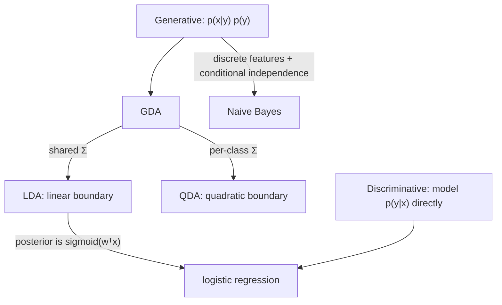

> 🌏 [中文版](/posts/learning/2026-09-29-berkeley-cs189-sp26-lectures-11-12-classification-logistic)

**Video status: Videos included.** [Source details](#course-video-sources)

This guide follows [CS189 Spring 2026](https://eecs189.org/sp26/) (Jennifer Listgarten / Alex Dimakis) and covers Lectures 11–12 (Feb 24 and 26). In [Lec 7–10](/en/posts/learning/2026-09-29-berkeley-cs189-sp26-lectures-07-10-linear-regression-en) y was a real number; now y is a class label.

The slides separate the two tasks in one line: regression tries to "draw a line to trace out the data," classification tries to "draw a line to separate the classes of data." That line is the decision boundary.

The spine of these two lectures is that **the same classification problem can be modeled in two ways**, and **how to tell whether a classifier is any good**. By the end you should be able to explain:

1. Why the LDA boundary is a line and the QDA boundary curves.
2. Why logistic regression is "more general" than LDA but not necessarily better.
3. Why 95% accuracy can mean a completely useless classifier.

## Course video sources

The official Spring 2026 schedule and the official YouTube playlist (Spring 2026 Lectures, 25 videos) were checked live on 2026-10-10; the lecture recordings embedded here are listed there. No unverified timestamp is supplied.

```youtube
url: https://www.youtube.com/watch?v=oid6SvXy8Kw
title: Lecture 11 recording: Classification
```

```youtube
url: https://www.youtube.com/watch?v=xBCpwQt8A5w
title: Lecture 12 recording: Logistic Regression, Classifier Accuracy
```

Original videos: [Lecture 11 recording: Classification](https://www.youtube.com/watch?v=oid6SvXy8Kw)、[Lecture 12 recording: Logistic Regression, Classifier Accuracy](https://www.youtube.com/watch?v=xBCpwQt8A5w)

Course and recording entries:

- [Official course and recording entry](https://eecs189.org/sp26/)
- [CS189 Spring 2026 Lectures — official YouTube playlist (25 videos)](https://www.youtube.com/playlist?list=PLuHtd0SzXhx4B8oOmp9PBEroMuV5n0MWE)

Checked: 2026-10-10.

Content check: verified against the video transcripts (2026-10-10; mostly spot samples and keyword searches, not word by word): the Lecture 11 video (oid6SvXy8Kw, about 81 minutes) is indeed classification: it recaps train/validation/test, uses lions and elephants to explain generative versus discriminative models, covers LDA/QDA decision boundaries and the COVID prior example leading into logistic regression, and ends at Naive Bayes (the instructor says it continues next class); ROC and ImageNetV2 do not appear in its transcript. The Lecture 12 video (xBCpwQt8A5w, about 80 minutes) covers sigmoid, softmax, the 5-spam-in-100-emails accuracy example, the confusion matrix, ROC, partial AUC, calibration, and PR curves; cost-sensitive classification and the discussion of why not to train directly on these metrics could not be found in the transcript and appear only on the slides. The transcripts do not name the speakers, so speaker attribution is not verified.

## Official materials and scope

| Lecture | Date | Title | Materials | Bishop reading on the schedule |
|---|---|---|---|---|
| Lec 11 | Feb 24 | Classification | [PDF](https://drive.google.com/file/d/1XRPSMXshMXlA2Y54NEbMEBKh3L3Eoh00/view) / [Video](https://www.youtube.com/watch?v=oid6SvXy8Kw&list=PLuHtd0SzXhx4B8oOmp9PBEroMuV5n0MWE&index=10) | 5.0–5.1.4 discriminant functions, 5.3–5.3.3 generative classifiers |
| Lec 12 | Feb 26 | Logistic Regression, Classifier Accuracy | [PDF](https://drive.google.com/file/d/1JvSLsdHffGdBQIXs_NrXJLQC7CQR3rd2/view) / [Video](https://www.youtube.com/watch?v=xBCpwQt8A5w&list=PLuHtd0SzXhx4B8oOmp9PBEroMuV5n0MWE&index=11) | 5.2.2 expected loss, 5.2.5 classifier accuracy, 5.2.6 ROC, 5.4–5.4.4 discriminative classifiers and logistic regression |

The same week has [Discussion 5](https://drive.google.com/file/d/1I0qfBd1cCc_QUU9wPcfCcEg6-5eCNbCb/view) ([solutions](https://drive.google.com/file/d/1auD6wh7wN9QPGN52bMKZSc1KoSipxrVF/view), [walkthrough](https://www.youtube.com/playlist?list=PL-ysCubq-Sa9TlqqkuL1y7ybVRtrA6l6w)) and the release of HW2 (due Mar 13). The textbook is Bishop & Bishop, *[Deep Learning: Foundations and Concepts](https://www.bishopbook.com/)*, whose website has a free-to-use online version.

**Access level**: both lectures' PDFs and videos, plus Discussion 5's problems, solutions, and walkthrough, open without a login. This block is A3 (see the [global AI/CS course map](/en/posts/learning/2026-08-21-global-ai-cs-course-map-en)).

One overlap to flag up front: the second half of the Lec 10 PDF already covers discriminative vs. generative and GDA, and Lec 11 restarts from the same point and finishes it. The ROC material appears in both the Lec 11 and Lec 12 PDFs. This post is organized by topic rather than split lecture by lecture.

## Three ways to build a classifier

Lec 11 opens with three strategies:

1. **Generative probabilistic models**: model p(x | Cₖ) and a prior p(Cₖ) for each class, then use Bayes' rule to get p(Cₖ | x).
2. **Discriminative probabilistic models**: model p(Cₖ | x) directly.
3. **Discriminant functions**: map x straight to a class, with no probability.

The first two are probabilistic classifiers. The slides ask why going probabilistic helps: with just a score, you have no natural way to judge how confident it is.

The slides tell a story about two children learning to tell a lion from an elephant:

- Child A draws both animals, then compares the animal on TV to each drawing. That is generative: learn what each class looks like.
- Child B remembers only the features that separate the two. That is discriminative: learn only the boundary.

The consequence, per the slides: a discriminative model "spends" all of its parameters on the decision boundary, while a generative model spends them on the full density of each class, and the boundary is a by-product. So with similar parameter counts, a discriminative model may produce a more complex boundary. On the other hand, a generative model describes how the data were generated and can produce new (x, y) pairs; a discriminative model cannot.

## Generative: Gaussian Discriminant Analysis

Despite the word "Discriminant" in its name, the slides stress that GDA is a **generative** model. Each class's p(x | y) is a Gaussian, and p(y) is a Bernoulli (categorical for more classes).

**Estimating the parameters**: MLE. Conditioned on the class, the log-likelihood splits into a separate Gaussian MLE per class, i.e. the mean and covariance of that class's data. That is exactly the derivation from [Lec 5–6](/en/posts/learning/2026-09-29-berkeley-cs189-sp26-lectures-04-07-clustering-mle-gmm-en) and Discussion 3. The slides work the 1D case in full and note that μ̂ₖ does not depend on σₖ, so you can solve for μ first and then σ.

The prior p(y) can be set two ways: from the class proportions in the training data (MLE), or by a domain expert. The slides' example is a doctor who knows the prevalence of Crohn's disease. They leave a question open: why use an expert's prior when you have training data? One plausible reason is that the class balance in the training data need not match the balance at deployment.

**What the decision boundary looks like**: the boundary is the set of x where p(y = a | x) = p(y = b | x). The slides work through four cases, from the most restrictive assumptions to the loosest:

| Assumption | Boundary |
|---|---|
| Equal priors, both classes share one spherical covariance | The perpendicular bisector of the two means (points equidistant from both μ̂) |
| Shared covariance of arbitrary shape | Still a line: rotate and rescale with Σ = USUᵀ and you are back in the spherical case |
| Unequal priors | An extra constant log p(y) shifts the boundary, which stays a line |
| Each class has its own covariance | The quadratic terms no longer cancel, so the boundary is a quadratic curve |

The two names: shared covariance is **LDA** (Linear Discriminant Analysis), separate covariances is **QDA** (Quadratic). The same results hold with more than two classes. QDA needs roughly (K−1)·D²/2 more parameters than LDA, and the slides note that this runs into the bias-variance trade-off.

With discrete features, p(x | y) becomes a discrete distribution. If you further assume the features are independent given the class, you get **Naive Bayes**; the "naive" is that independence assumption.

## From LDA to logistic regression

Normalize the LDA posterior and it comes out as:

```text
p(y = a | x) = 1 / (1 + exp(−wᵀx))
```

The slides then say: train this form directly and you have the discriminative classifier called logistic regression. The relationship fits in three sentences:

1. LDA can always be written as a logistic regression.
2. The converse is false: not every logistic regression corresponds to an LDA.
3. So LDA makes strictly stronger assumptions, and logistic regression is more general.

"More general" does not mean better. The Lec 10 slides supply the rest: when the LDA assumptions hold (each class really is Gaussian), LDA tends to beat logistic regression, and the gap shrinks as data goes to infinity. That is the general pattern for generative vs. discriminative: when a generative model's assumptions are right, restricting the model space is an advantage.



## Logistic regression: sigmoid, softmax, and no closed form

Lec 12 introduces logistic regression from the discriminative side. For binary classification:

```text
p(y = 1 | x, w) = σ(wᵀx),   σ(a) = 1 / (1 + e^(−a))
```

The slides collect the sigmoid's properties: its range is (0, 1), 1 − σ(a) = σ(−a), its inverse is the logit log(p/(1−p)), and its derivative is σ(a)(1 − σ(a)).

A nice thought experiment: what happens if you double wᵀx? In linear regression the predictions double. In logistic regression they do not double; they become **more confident**, pushed toward 0 or 1.

**Multiple classes**: generalize the sigmoid to softmax. Its outputs lie between 0 and 1 and sum to 1 across classes, so you can treat them as probabilities. The slides point out that softmax is translation invariant: adding the same vector to every wₖ changes nothing, so the parameterization is redundant. Binary logistic regression is softmax with one class's weights fixed at 0.

**Decision boundary**: where the two class probabilities are equal, (w_a − w_b)ᵀx = 0, a line in feature space (a hyperplane in higher dimensions). For curved boundaries, do a basis expansion first, just as with regression in Lec 7.

**Training**: MLE. For binary labels the likelihood is a product of Bernoullis and the log-likelihood is

```text
LL(w) = Σᵢ [ yᵢ log pᵢ + (1 − yᵢ) log(1 − pᵢ) ],   pᵢ = σ(wᵀxᵢ)
```

The sigmoid's derivative gives a clean vector form for the gradient. Unlike linear regression, though, setting the gradient to zero **has no closed-form solution**. As the slides put it: just like GMMs (and neural networks later), you need an iterative optimizer such as gradient descent. The multi-class version has a multinomial likelihood, which is why it is also called multinomial regression.

This is the second time the course hits "no closed form." The first was the [GMM](/en/posts/learning/2026-09-29-berkeley-cs189-sp26-lectures-04-07-clustering-mle-gmm-en), and the proper treatment arrives with gradient descent and optimizers in Lec 13.

## Evaluating classifiers: why accuracy is not enough

Lec 12 opens with a table: on the same test data, logistic regression and a neural network each output a column of probabilities. Which one do you pick?

The obvious move is to threshold at 0.5 and count mistakes, i.e. **accuracy**:

```text
accuracy = (TP + TN) / (TP + TN + FP + FN)
```

The slides' spam example shows the problem. Out of 100 emails, 5 are spam.

- Classifier 1 labels everything as ham: 95% accuracy, and it catches no spam at all.
- Classifier 2 labels everything as spam: 5% accuracy, and it catches every spam email.

Under class imbalance, accuracy misleads. Two more issues: why should the threshold be 0.5? And thresholding at 0.5 implicitly assumes the probabilities are **calibrated** (a 0.7 really means 70%). The slides raise a case: a model whose probabilities are not calibrated, yet some threshold other than 0.5 separates the classes perfectly. Is that a good classifier?

Once the threshold is fixed, every test point lands in one of four cells, arranged as a **confusion matrix**: TP, FP, TN, FN. Divide each by the number of samples that could have received that call and you get rates:

- TPR = TP / (TP + FN), also called sensitivity
- TNR = TN / (TN + FP), also called specificity
- Precision = TP / (TP + FP)

## ROC, AUC, and PR curves

Move the threshold and all four counts change. Sweep it from high to low, plot one point per threshold (FPR on the x-axis, TPR on the y-axis), and connect them: that is the **ROC curve**. The slides include the algorithm: sort test points by decreasing score and update TPR and FPR one step at a time. How smooth the curve is depends on the number of test points and how many distinct scores there are.

When two ROC curves cross, neither classifier wins outright; it depends on which region you care about. The slides' example: if your application can tolerate only a few false positives, pick the curve that is higher at low FPR.

Collapse the curve into one number and you have the **AUC**; bigger is better. It has an easy interpretation: the probability that the classifier scores a randomly chosen positive above a randomly chosen negative. The more separated the two classes' score distributions, the larger the AUC.

If you know you will never operate above some FPR, compute a **partial AUC**, such as AUC(0.2). The slides' scenarios are deciding on chemotherapy, or deciding whether to spend a lot of money on a follow-up biology experiment.

A few properties of ROC are worth remembering:

- **Insensitive to class balance**: TPR and TNR are each normalized within one class. To get accuracy back from an ROC curve, you also need the positive-to-negative ratio of the test set.
- **Ignores calibration**: it only looks at the ranking, not whether the probability values are right. That can be a pro or a con. The slides are explicit: if you care about calibration (medical decisions, molecule design, active learning), do not evaluate with ROC.
- If you **do** care about class balance and know it at deployment time, use a **Precision-Recall curve** instead; its summary number is the AUPR.

Two closing questions. First, if we care about these metrics, why not train on them directly as the loss? The slides' answer: most have hard thresholds and are not differentiable everywhere, and ranking needs the whole dataset, so mini-batch SGD does not apply. Second, if different errors have different costs (a missed diagnosis is worse than a false alarm), use **cost-sensitive classification**: define a cost matrix and reweight the training data with it. Unlike ROC analysis, the cost matrix changes the objective during training.

Lec 11's slides also open with a callback to ImageNetV2 from Lec 3 (the recording's transcript does not include this part): a test set collected the same way as ImageNet, on which models scored lower than expected. However cleanly you split your test set, a change in the data source moves the numbers. HW1.2's rotated test set is a small-scale version of the same thing.

## Discussion 5: actually wrapping up regression

Although Discussion 5 falls in the week of Lec 11, all three problems are about regression and estimation. They follow on from [Lec 9–10](/en/posts/learning/2026-09-29-berkeley-cs189-sp26-lectures-07-10-linear-regression-en), not from classification:

1. **ℓ1 regression**: for the intercept-only model y = β + ε, minimize Σ|yᵢ − β|. The official solution shows the minimum is at the median of the yᵢ. Compare it with least squares giving the mean, and you see why the L1 loss is more robust to outliers.
2. **Linear regression with a Laplace prior**: with Gaussian noise and an independent Laplace(0, b) prior on each βₖ, show that the MAP estimate is equivalent to lasso. The Lec 9–10 slides only state this in one line.
3. **Bias-variance decomposition**: show that an estimator's MSE = Var + Bias². This sets up Lec 14 on MLE vs. MAP and bias-variance.

If you are reading this series in order, do Discussion 5 after this post and before Lec 13, so the regression block is fully closed.

## What to do tonight

1. With scikit-learn's `LinearDiscriminantAnalysis`, `QuadraticDiscriminantAnalysis`, and `LogisticRegression`, plot decision boundaries on the same 2D dataset and see which are straight and which bend.
2. Write your own ROC: sort test points by score, update TPR/FPR step by step, then compare with `sklearn.metrics.roc_curve`.
3. Redo the slides' spam example: make a dataset with only 5% positives and compute accuracy, ROC-AUC, and PR-AUC. Which number best reflects "catches nothing"?
4. Do problem 2 of [Discussion 5](https://drive.google.com/file/d/1I0qfBd1cCc_QUU9wPcfCcEg6-5eCNbCb/view) and write out the lasso MAP derivation in full.

## Fall 2026 mapping and further reading

[Fall 2026](https://eecs189.org/fa26/) (Norouzi / Gonzalez) splits logistic regression across Lec 8–9, and its Discussion 5 is titled Logistic Regression + Regularization + Bias/Variance.

On this site:

- The same topics told differently: [Stanford CS229 notes, chapter 2: classification and logistic regression](/en/posts/ai/2026-08-22-stanford-cs229-2026-notes-chapter-02-classification-logistic-regression-en) and [chapter 4: generative learning algorithms](/en/posts/ai/2026-08-22-stanford-cs229-2026-notes-chapter-04-generative-learning-algorithms-en)
- The probability angle: [Stanford CS109 Lecture 20: logistic regression](/en/posts/learning/2026-08-22-stanford-cs109-lecture-20-logistic-regression-en), [Lecture 21: comparing classifiers](/en/posts/learning/2026-08-22-stanford-cs109-lecture-21-comparing-classifiers-en)
- Series entry points: [CS189 overview](/en/posts/learning/2026-08-22-berkeley-cs189-spring-2025-overview-en), [Berkeley AI/ML course map](/en/posts/learning/2026-08-21-berkeley-ai-ml-course-map-en)

## Series navigation

- Previous: [HW1 guide: linear algebra / calculus / probability warm-up + Fashion coding](/en/posts/learning/2026-09-29-berkeley-cs189-sp26-hw1-math-refresher-fashion-en)
- Next: [Lec 13 & 15: convergence, momentum, Adam, SGD, and learning with GD](/en/posts/learning/2026-09-29-berkeley-cs189-sp26-lectures-13-15-gradient-descent-optimizers-en)

## Update Log

- 2026-10-10: Added explicit video status and checked recording sources and access notes.
- 2026-10-10: Rechecked video status. The official Spring 2026 schedule and YouTube playlist were checked live and list the embedded lecture recordings, so the status is now Videos included.
- 2026-10-10: Checked the video content against its transcript. Both videos match their lecture topics; the Lec 11 video has no ImageNetV2 recap, so the post now marks it as slides-only.

## References

- [CS189 Spring 2026 course page and schedule](https://eecs189.org/sp26/)
- [Lecture 11 PDF: Classification](https://drive.google.com/file/d/1XRPSMXshMXlA2Y54NEbMEBKh3L3Eoh00/view)
- [Lecture 12 PDF: Logistic Regression, Classifier Accuracy](https://drive.google.com/file/d/1JvSLsdHffGdBQIXs_NrXJLQC7CQR3rd2/view)
- [Lecture 10 PDF (second half introduces classification and GDA)](https://drive.google.com/file/d/1l4QFPcDuXQB8ThIsaCU8XsSkaqejB5nh/view)
- [CS189 Spring 2026 lecture video playlist](https://www.youtube.com/playlist?list=PLuHtd0SzXhx4B8oOmp9PBEroMuV5n0MWE)
- [Discussion 5](https://drive.google.com/file/d/1I0qfBd1cCc_QUU9wPcfCcEg6-5eCNbCb/view) and [solutions](https://drive.google.com/file/d/1auD6wh7wN9QPGN52bMKZSc1KoSipxrVF/view)
- [Bishop & Bishop, Deep Learning: Foundations and Concepts (official site, with free online version)](https://www.bishopbook.com/)
- [CS189 Fall 2026 course page](https://eecs189.org/fa26/)
