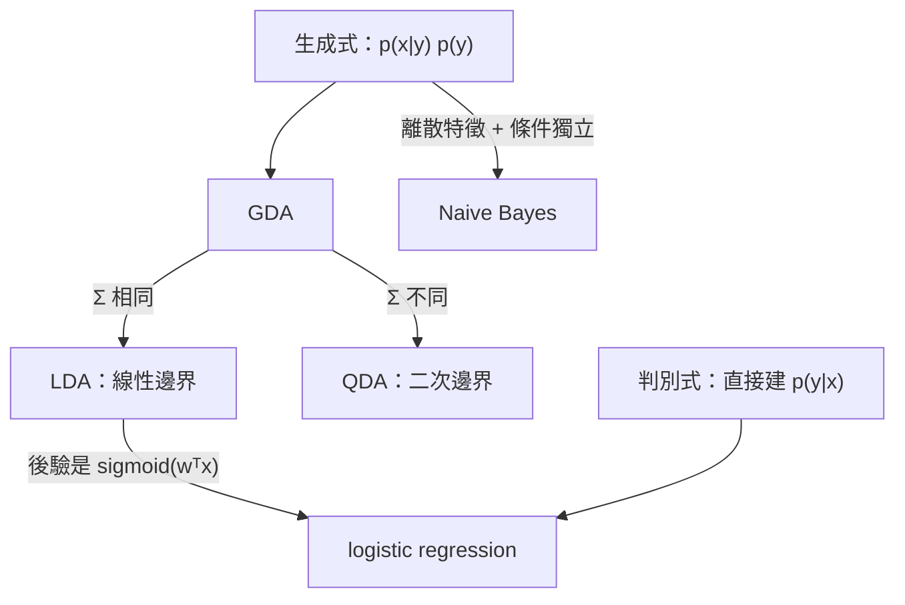

> 🌏 [English version](/en/posts/learning/2026-09-29-berkeley-cs189-sp26-lectures-11-12-classification-logistic-en)

**影片狀態：已附影片；播放未逐支確認。** [影片來源與說明](#課程影片來源)

本文依 [CS189 Spring 2026](https://eecs189.org/sp26/)（Jennifer Listgarten／Alex Dimakis）整理，範圍是 Lecture 11–12（2/24、2/26）。[Lec 7–10](/posts/learning/2026-09-29-berkeley-cs189-sp26-lectures-07-10-linear-regression) 的 y 是實數，這兩講的 y 換成類別。

投影片用一句話區分兩件事：回歸是「畫一條線去描出資料」，分類是「畫一條線把不同類別分開」，這條線叫決策邊界。

這兩講的主軸是**同一個分類問題有兩種建模方式**，以及**怎麼判斷一個分類器好不好**。讀完你應該能說清楚：

1. 為什麼 LDA 的邊界是直線，QDA 是曲線。
2. 為什麼 logistic regression 比 LDA「更一般」，卻不一定比較好。
3. 為什麼 95% 準確率可能代表一個完全沒用的分類器。

## 課程影片來源

影片連結對應本文教材；此處不提供未核對的時間跳轉。

```youtube
url: https://www.youtube.com/watch?v=oid6SvXy8Kw
title: 影片
```

```youtube
url: https://www.youtube.com/watch?v=xBCpwQt8A5w
title: 影片
```

原始影片：[影片](https://www.youtube.com/watch?v=oid6SvXy8Kw)、[影片](https://www.youtube.com/watch?v=xBCpwQt8A5w)

課程與錄影入口：

- [官方課程與錄影入口](https://eecs189.org/sp26/)

## 官方材料與讀取範圍

| 講次 | 日期 | 講題 | 材料 | 排程頁的 Bishop 閱讀 |
|---|---|---|---|---|
| Lec 11 | 2/24 | Classification | [PDF](https://drive.google.com/file/d/1XRPSMXshMXlA2Y54NEbMEBKh3L3Eoh00/view)／[影片](https://www.youtube.com/watch?v=oid6SvXy8Kw&list=PLuHtd0SzXhx4B8oOmp9PBEroMuV5n0MWE&index=10) | 5.0–5.1.4 判別函數、5.3–5.3.3 生成式分類器 |
| Lec 12 | 2/26 | Logistic Regression, Classifier Accuracy | [PDF](https://drive.google.com/file/d/1JvSLsdHffGdBQIXs_NrXJLQC7CQR3rd2/view)／[影片](https://www.youtube.com/watch?v=xBCpwQt8A5w&list=PLuHtd0SzXhx4B8oOmp9PBEroMuV5n0MWE&index=11) | 5.2.2 期望損失、5.2.5 分類器準確率、5.2.6 ROC、5.4–5.4.4 判別式分類器與 logistic regression |

同週還有 [Discussion 5](https://drive.google.com/file/d/1I0qfBd1cCc_QUU9wPcfCcEg6-5eCNbCb/view)（[解答](https://drive.google.com/file/d/1auD6wh7wN9QPGN52bMKZSc1KoSipxrVF/view)、[walkthrough](https://www.youtube.com/playlist?list=PL-ysCubq-Sa9TlqqkuL1y7ybVRtrA6l6w)），以及 HW2 發布（截止 3/13）。課本是 Bishop & Bishop《[Deep Learning: Foundations and Concepts](https://www.bishopbook.com/)》，官網有免費線上閱讀版。

**公開程度**：兩講的 PDF 與影片、Discussion 5 的題目／解答／walkthrough 都能匿名打開，這一段是 A3（定義見[全球 AI／CS 課程地圖](/posts/learning/2026-08-21-global-ai-cs-course-map)）。

教材上有一個重疊要先說：Lec 10 的 PDF 後半已經講過判別式 vs. 生成式和 GDA，Lec 11 從同一處重講並補完；ROC 那段則在 Lec 11 和 Lec 12 的 PDF 裡都有。本篇依主題整理，不逐講切開。

## 三種做分類器的方式

Lec 11 開場列了三種策略：

1. **生成式機率模型**：為每一類建 p(x | Cₖ) 和先驗 p(Cₖ)，再用 Bayes 定理算出 p(Cₖ | x)。
2. **判別式機率模型**：直接建 p(Cₖ | x)。
3. **判別函數**：直接把 x 對應到某個類別，不給機率。

前兩種是機率分類器。投影片問的是：為什麼要走機率路線？因為只拿到一個分數時，你沒有自然的方法判斷它有多可信。

投影片用兩個小孩學分辨獅子和大象的故事說明差別：

- 孩子 A 把兩種動物都畫下來，看到電視上的動物，就拿去和兩張畫比對。這是生成式：先學會「每一類長什麼樣」。
- 孩子 B 只記住能區分兩者的關鍵特徵。這是判別式：只學邊界。

投影片接著點出後果：判別式模型把所有參數都「花」在決策邊界上；生成式模型要把參數花在描述每一類的完整分布上，邊界只是副產品。所以在參數量相近時，判別式模型可能畫出更複雜的邊界。反過來，生成式模型描述了資料「怎麼產生」，可以拿來生成新的 (x, y)，判別式模型做不到。

## 生成式：Gaussian Discriminant Analysis

GDA 雖然名字有「Discriminant」，投影片特別強調它是**生成式**模型：每一類的 p(x | y) 用一個高斯來描述，p(y) 用 Bernoulli（多類時用 categorical）。

**參數怎麼估**：用 MLE。條件在類別上，log-likelihood 會拆成每一類各自的高斯 MLE，也就是用那一類的資料算平均和共變異數。這正是 [Lec 5–6](/posts/learning/2026-09-29-berkeley-cs189-sp26-lectures-04-07-clustering-mle-gmm) 和 Discussion 3 做過的推導。投影片把一維情況完整推了一遍，指出 μ̂ₖ 不依賴 σₖ，所以可以先解 μ 再解 σ。

先驗 p(y) 有兩種設法：用訓練資料裡各類的比例（MLE），或由領域專家指定。投影片的例子是醫生知道克隆氏症的盛行率。它還留了一個問題：手上明明有訓練資料，為什麼還要用專家給的先驗？一個可能的理由是訓練資料的類別比例不一定等於實際部署時的比例。

**決策邊界長什麼樣**：邊界是 p(y = a | x) = p(y = b | x) 的點集。投影片依假設由嚴到鬆推了四種情況：

| 假設 | 邊界 |
|---|---|
| 先驗相同、兩類共用同一個球形共變異數 | 兩個平均的垂直平分線（到兩個 μ̂ 等距的點） |
| 共用同一個任意形狀的共變異數 | 仍是直線：用 Σ = USUᵀ 旋轉、縮放座標後，就回到球形情況 |
| 先驗不同 | 多了一個常數項 log p(y)，邊界平移，仍是直線 |
| 每一類有自己的共變異數 | 二次項消不掉，邊界是二次曲線 |

歸納成兩個名字：共變異數相同是 **LDA**（Linear Discriminant Analysis），不同是 **QDA**（Quadratic）。多類時結論一樣成立。QDA 比 LDA 多了 (K−1)·D²/2 左右的參數，投影片提醒這會碰上 bias-variance 取捨。

特徵是離散值時，p(x | y) 換成離散分布。如果再假設各特徵在給定類別下彼此獨立，就是 **Naive Bayes**；「naive」指的就是這個獨立假設。

## 從 LDA 走到 logistic regression

LDA 算出來的後驗，正規化之後剛好是：

```text
p(y = a | x) = 1 / (1 + exp(−wᵀx))
```

投影片接著說：直接訓練這個形式，就是判別式分類器 logistic regression。兩者的關係可以濃縮成三句：

1. LDA 一定能寫成 logistic regression。
2. 反過來不成立，不是每個 logistic regression 都對應某個 LDA。
3. 所以 LDA 的假設嚴格更強，logistic regression 更一般。

「更一般」不代表比較好。Lec 10 的投影片補了後半段：LDA 的假設成立時（每類真的是高斯），LDA 往往比 logistic regression 好；資料量趨近無限時兩者差距縮小。這是生成式 vs. 判別式的通則：生成式模型的假設對了，限制模型空間反而是優勢。



## Logistic regression：sigmoid、softmax、沒有封閉解

Lec 12 從判別式這一側正式介紹 logistic regression。二元分類時：

```text
p(y = 1 | x, w) = σ(wᵀx),   σ(a) = 1 / (1 + e^(−a))
```

投影片整理了 sigmoid 的性質：值域在 0 到 1 之間、1 − σ(a) = σ(−a)、反函數是 logit log(p/(1−p))、導數是 σ(a)(1 − σ(a))。

一個有趣的思考題：把 wᵀx 放大兩倍會怎樣？線性回歸的預測會變成兩倍；logistic regression 的預測不會變成兩倍，而是**更有信心**，機率被推向 0 或 1。

**多類**：把 sigmoid 推廣成 softmax，輸出介於 0 到 1、各類加總為 1，可以當作機率。投影片指出 softmax 有平移不變性，所有 wₖ 同加一個向量結果不變，所以參數是過度參數化的；二元 logistic regression 就是把其中一類的權重固定為 0 的 softmax。

**決策邊界**：兩類機率相等時 (w_a − w_b)ᵀx = 0，在特徵空間裡是一條直線（高維是超平面）。想要曲線邊界，就像 Lec 7 的回歸一樣先做基底展開。

**訓練**：用 MLE。二元時 likelihood 是 Bernoulli 連乘，log-likelihood 是

```text
LL(w) = Σᵢ [ yᵢ log pᵢ + (1 − yᵢ) log(1 − pᵢ) ],   pᵢ = σ(wᵀxᵢ)
```

用 sigmoid 的導數性質可以寫出向量形式的梯度。但和線性回歸不同，令梯度為零**解不出封閉解**。投影片說：就像 GMM（以及之後的神經網路），要用迭代最佳化，例如梯度下降。多類版本的 likelihood 是 multinomial，所以也叫 multinomial regression。

這是課程第二次碰到「沒有封閉解」。第一次是 [GMM](/posts/learning/2026-09-29-berkeley-cs189-sp26-lectures-04-07-clustering-mle-gmm)，下一次正式處理就是 Lec 13 的梯度下降與優化器。

## 評估分類器：準確率為什麼不夠

Lec 12 用一張表開場：同一批測試資料，logistic regression 和神經網路各給出一串機率，要選哪一個？

最直覺的做法是門檻設 0.5，數錯了幾個，也就是**準確率**：

```text
accuracy = (TP + TN) / (TP + TN + FP + FN)
```

投影片的垃圾信例子說明它的問題：100 封信裡 5 封是垃圾信。

- 分類器 1 把全部判成正常信：準確率 95%，但一封垃圾信都沒抓到。
- 分類器 2 把全部判成垃圾信：準確率 5%，但抓到了所有垃圾信。

類別不平衡時，準確率會騙人。另外還有兩個問題：門檻為什麼是 0.5？而且門檻 0.5 隱含假設機率是**校準過的**（說 0.7 就真的有七成機會）。投影片舉了一個例子：一個模型的機率沒有校準，但存在某個不是 0.5 的門檻能完美分開兩類。它算不算好分類器？

把門檻固定之後，每筆測試資料會落進四格之一，排成**混淆矩陣**：TP、FP、TN、FN。再各自除以「有機會被這樣判」的樣本數，得到比率：

- TPR = TP / (TP + FN)，也叫敏感度（sensitivity）
- TNR = TN / (TN + FP)，也叫特異度（specificity）
- Precision = TP / (TP + FP)

## ROC、AUC 與 PR 曲線

門檻一移動，四格的數字都會變。把門檻從高掃到低，每個門檻畫一個點（x 軸 FPR、y 軸 TPR），連起來就是 **ROC 曲線**。投影片附了演算法：測試樣本依分數由高到低排序，往下走一格就更新一次 TPR 和 FPR。曲線的平滑程度受限於測試點數和分數有幾種不同值。

兩個分類器的 ROC 交叉時，沒有誰全面勝出，要看你在乎哪一段。投影片的例子是：如果應用只能容忍很少的偽陽性，就選在低 FPR 區段較高的那一條。

把整條曲線壓成一個數字就是 **AUC**，越大越好。它有一個很好記的解讀：隨機抽一個正例和一個負例，分類器給正例較高分的機率。兩類分數的分布分得越開，AUC 越大。

如果確定永遠不會在 FPR 超過某個值的區域運作，可以只算 **partial AUC**，例如 AUC(0.2)。投影片舉的情境是決定要不要做化療，或要不要投入大筆經費做後續生物實驗。

ROC 的幾個性質要記清楚：

- **對類別比例不敏感**：TPR、TNR 各自只在同一類內部正規化。要從 ROC 換回準確率，得另外知道測試集的正負比例。
- **不看校準**：只看排序，不看機率值準不準。這可以是優點也可以是缺點。投影片明說：如果你在乎校準（例如醫療決策、分子設計、主動學習），就不該用 ROC 評估。
- 如果你**在乎**類別比例，而且知道部署時的比例，改用 **Precision-Recall 曲線**，對應的摘要數字是 AUPR。

最後兩個延伸問題。第一，既然在乎這些指標，為什麼不直接拿來當損失函數訓練？投影片的回答是：它們大多有硬門檻、不是處處可微，而且排序需要整批資料，無法用 mini-batch 做 SGD。第二，如果不同錯誤的代價不同（漏診比誤診嚴重），可以做**成本敏感分類**：定義成本矩陣，用它重新加權訓練資料。這和 ROC 不同，成本矩陣會改變訓練時的目標函數。

Lec 11 開頭還回顧了 Lec 3 提過的 ImageNetV2：用和 ImageNet 相同方式重新收集的測試集，模型準確率卻比預期低。它提醒你，測試集切得再乾淨，資料來源一變，數字就會掉。HW1.2 的旋轉測試集是同一件事的小型版本。

## Discussion 5：其實在收尾回歸

Discussion 5 雖然排在 Lec 11 那週，三題的內容都是回歸與估計，接的是 [Lec 9–10](/posts/learning/2026-09-29-berkeley-cs189-sp26-lectures-07-10-linear-regression)，不是分類：

1. **ℓ1 regression**：只有截距的模型 y = β + ε，最小化 Σ|yᵢ − β|。官方解答的結論是最小值落在 yᵢ 的中位數。和最小平方得到平均數對照著看，就能理解 L1 損失為什麼對離群值比較穩。
2. **Laplace 先驗的線性回歸**：高斯雜訊、每個 βₖ 用 Laplace(0, b) 先驗，證明 MAP 估計等價於 lasso。這是 Lec 9–10 投影片只提了一句的推導。
3. **Bias-variance 分解**：證明估計量的 MSE = Var + Bias²。這是 Lec 14 MLE vs. MAP、bias-variance 的前置。

如果你照本系列的順序讀，建議在讀完本篇之後、進 Lec 13 之前做 Discussion 5，把回歸那一段完全收乾淨。

## 今晚可以做的動作

1. 用 scikit-learn 的 `LinearDiscriminantAnalysis`、`QuadraticDiscriminantAnalysis`、`LogisticRegression` 在同一組二維資料上畫決策邊界，觀察哪個是直線、哪個會彎。
2. 自己寫 ROC：把測試樣本依分數排序、一格一格更新 TPR／FPR，再和 `sklearn.metrics.roc_curve` 對照。
3. 重做投影片的垃圾信例子：造一組正例只佔 5% 的資料，分別算準確率、ROC-AUC、PR-AUC，看哪個數字最能反映「根本沒抓到」。
4. 做 [Discussion 5](https://drive.google.com/file/d/1I0qfBd1cCc_QUU9wPcfCcEg6-5eCNbCb/view) 第 2 題，把 lasso 的 MAP 推導寫完整。

## Fall 2026 對應講次與延伸閱讀

[Fall 2026](https://eecs189.org/fa26/)（Norouzi／Gonzalez）把 logistic regression 拆成 Lec 8–9 兩講，Discussion 5 的標題是 Logistic Regression + Regularization + Bias/Variance。

站內延伸：

- 同一主題的另一種講法：[Stanford CS229 講義第 2 章：分類與 logistic regression](/posts/ai/2026-08-22-stanford-cs229-2026-notes-chapter-02-classification-logistic-regression)、[第 4 章：生成式學習演算法](/posts/ai/2026-08-22-stanford-cs229-2026-notes-chapter-04-generative-learning-algorithms)
- 機率角度：[Stanford CS109 Lecture 20：Logistic Regression](/posts/learning/2026-08-22-stanford-cs109-lecture-20-logistic-regression)、[Lecture 21：比較分類器](/posts/learning/2026-08-22-stanford-cs109-lecture-21-comparing-classifiers)
- 系列入口：[CS189 總覽](/posts/learning/2026-08-22-berkeley-cs189-spring-2025-overview)、[Berkeley AI／ML 課程地圖](/posts/learning/2026-08-21-berkeley-ai-ml-course-map)

## 系列導覽

- 上一篇：[HW1 導讀：線代／微積分／機率熱身 + Fashion coding](/posts/learning/2026-09-29-berkeley-cs189-sp26-hw1-math-refresher-fashion)
- 下一篇：[Lec 13、15：收斂、Momentum、Adam、SGD，用 GD 學習](/posts/learning/2026-09-29-berkeley-cs189-sp26-lectures-13-15-gradient-descent-optimizers)

## 更新紀錄

- 2026-10-10：標註影片狀態，核對錄影來源與取得方式。

## 參考資料

- [CS189 Spring 2026 課程首頁與排程](https://eecs189.org/sp26/)
- [Lecture 11 PDF：Classification](https://drive.google.com/file/d/1XRPSMXshMXlA2Y54NEbMEBKh3L3Eoh00/view)
- [Lecture 12 PDF：Logistic Regression, Classifier Accuracy](https://drive.google.com/file/d/1JvSLsdHffGdBQIXs_NrXJLQC7CQR3rd2/view)
- [Lecture 10 PDF（後半為分類導論與 GDA）](https://drive.google.com/file/d/1l4QFPcDuXQB8ThIsaCU8XsSkaqejB5nh/view)
- [CS189 Spring 2026 講課影片播放清單](https://www.youtube.com/playlist?list=PLuHtd0SzXhx4B8oOmp9PBEroMuV5n0MWE)
- [Discussion 5](https://drive.google.com/file/d/1I0qfBd1cCc_QUU9wPcfCcEg6-5eCNbCb/view) 與 [解答](https://drive.google.com/file/d/1auD6wh7wN9QPGN52bMKZSc1KoSipxrVF/view)
- [Bishop & Bishop, Deep Learning: Foundations and Concepts（官方網站，含免費線上版）](https://www.bishopbook.com/)
- [CS189 Fall 2026 課程首頁](https://eecs189.org/fa26/)
