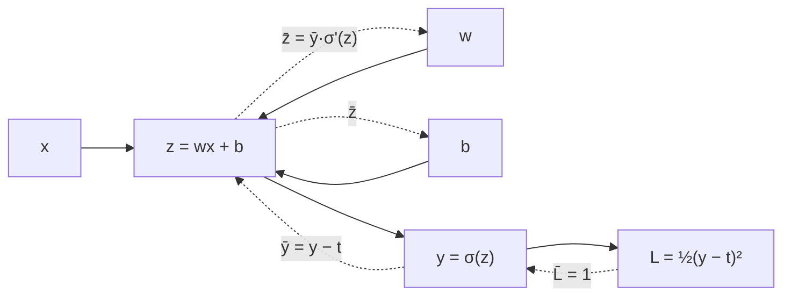

> 🌏 [中文版](/posts/learning/2026-09-29-berkeley-cs189-sp26-lectures-17-18-neural-networks-backprop)

**Video status: Videos included.** [Source details](#course-video-sources)

This guide is based on the official materials of [CS189 Spring 2026](https://eecs189.org/sp26/) (Jennifer Listgarten / Alex Dimakis): the Lecture 17 slides [Neural Networks and PyTorch](https://drive.google.com/drive/folders/1-as4P5M8XTeNvXGk0tmHPorRNNjMBtrM) (3/19, [video](https://www.youtube.com/watch?v=bMJ9igfvn1M)), the Lecture 18 slides [lec18.pdf](https://drive.google.com/drive/folders/1mHu1f3UYFTCqcsy7d1zS2jnynWzWLRas) (3/31, [video](https://www.youtube.com/watch?v=XlaV_z2knjA)), and [Discussion 8](https://drive.google.com/file/d/1XNAVahEf4jiRfGyUCr-x4XGSSseohf2M/view) (with [solutions](https://drive.google.com/file/d/12OuB5CcxfG4Ega4_BREMC1cyijm0FUd7/view) and a [walkthrough video](https://www.youtube.com/playlist?list=PL-ysCubq-Sa9sA7c_KW-WwRudeMkxQZu_)). All of them open without a login, and the course as a whole rates A3 (defined in the [global AI/CS course map](/en/posts/learning/2026-08-21-global-ai-cs-course-map-en)).

These two lectures sit right after the midterm (3/17), on either side of spring break. By now you have seen linear regression, logistic regression, gradient descent, and Adam (see [order 8 of this series](/en/posts/learning/2026-09-29-berkeley-cs189-sp26-lectures-13-15-gradient-descent-optimizers-en)). The question here is: once the model becomes many functions stacked on top of each other, can we still train it the same way? Yes, and backpropagation is how. It is the hardest idea in the course, so this post follows five layers: scene, intuition, mechanism, back to real models, and going deeper.

The assigned reading is Bishop's [Deep Learning: Foundations and Concepts](https://www.bishopbook.com/), 6.1–6.3.1 for Lec 17, and Chapter 8 from the introduction through 8.1.4 plus the opening of 8.2 (not 8.2.1 onward) for Lec 18.

## Course video sources

The official Spring 2026 schedule and the official YouTube playlist (Spring 2026 Lectures, 25 videos) were checked live on 2026-10-10; the lecture recordings embedded here are listed there. No unverified timestamp is supplied.

```youtube
url: https://www.youtube.com/watch?v=bMJ9igfvn1M
title: Lecture 17 video
```

```youtube
url: https://www.youtube.com/watch?v=XlaV_z2knjA
title: Lecture 18 video
```

Original videos: [Lecture 17 video](https://www.youtube.com/watch?v=bMJ9igfvn1M)、[Lecture 18 video](https://www.youtube.com/watch?v=XlaV_z2knjA)

Course and recording entries:

- [Official course and recording entry](https://eecs189.org/sp26/)
- [CS189 Spring 2026 Lectures — official YouTube playlist (25 videos)](https://www.youtube.com/playlist?list=PLuHtd0SzXhx4B8oOmp9PBEroMuV5n0MWE)

Checked: 2026-10-10.

Content check: verified against the video transcripts (2026-10-10; mostly spot samples and keyword searches, not word by word): the Lecture 17 video (bMJ9igfvn1M, about 76 minutes) opens by moving on to neural networks after the exam and covers the XOR hand calculation, 64×64 images and the data manifold, the universal approximation theorem, the logic-circuit analogy for depth, and activation functions and ReLU; it ends before spring break. The PyTorch core concepts, leaky ReLU, and softplus could not be found in its transcript and appear only in the slides. The Lecture 18 video (XlaV_z2knjA, about 79 minutes) is indeed backpropagation: the chain rule, computation graphs, gradients adding over multiple children, and the bar notation; the finite-difference cost comparison, symbolic differentiation, and dead units could not be found (the instructor ends by saying derivatives through nonlinearities come next class), and finite differences and initialization appear in the Lec 19 video instead. The transcripts do not name the speakers, so speaker attribution is not verified.

## Scene: a linear model cannot even learn XOR

The second half of Lec 17 works through a full example adapted from Chapter 6 of Goodfellow et al.'s [Deep Learning](https://www.deeplearningbook.org/contents/mlp.html). There are only four data points:

| x1 | x2 | y |
|---|---|---|
| 0 | 0 | 0 |
| 0 | 1 | 1 |
| 1 | 0 | 1 |
| 1 | 1 | 0 |

Start with a linear model `f(x) = wᵀx + b` and squared loss. The slides have you write the loss, compute the gradient, and take one step of size 0.5 from θ = (0, 1, 1). Run gradient descent to convergence and you get `w* = [0, 0]`, `b* = 1/2`: **the model predicts 1/2 for every input.** It learned nothing.

What about adding a hidden layer? If that layer is linear too, `y = wᵀ(Wᵀx + c) + b` expands back into `w'ᵀx + b'`. The slides conclude that a deep linear model with any number of layers is still a linear model end to end, and it stays stuck at 1/2.

Switch to ReLU and things change. The slides give concrete weights, `W = [1,1; 1,1]`, `c = [0, −1]ᵀ`, `w = [1, −2]ᵀ`, `b = 0`, with `g(z) = max(z, 0)`, and all four inputs come out right.

## Intuition: nonlinearity is what makes depth mean anything

The same example makes two points:

1. **Without a nonlinearity, extra layers do nothing.** The activation-function section of Lec 17 says the same: a hidden layer with identity activations is redundant.
2. **One nonlinear hidden layer can already express a lot.** The slides split XOR into the OR of `x1 AND ¬x2` and `¬x1 AND x2`, showing that a single step-function neuron can do AND but not XOR, while one more layer can.

The slides open with a second reason to want neural networks. Real high-dimensional data (images, audio, text) usually lies on a low-dimensional **data manifold**. A 64×64 digit is a 4096-dimensional vector, but its pose, position, and orientation have only a few degrees of freedom. Fixed bases like polynomials explode with dimension; neural networks learn data-dependent bases whose complexity scales with the manifold's dimension. The slides call this **representation learning**.

They also list three ways to expand features: problem-specific feature engineering, embedding into a general space and using kernels, and learning features from data. The third requires a model you can differentiate end to end, which leads straight to backprop in Lec 18.

## Mechanism 1: from a neuron to a deep network

The notation from Lec 17 is used for the rest of the semester:

- **Neuron** = weighted sum + activation, `y = f(w·x)`, with the bias written as `w0`.
- **One layer**: `a_j = Σ_i w_ji⁽¹⁾ x_i + w_j0⁽¹⁾` is the pre-activation (the slides also call it logits), and `z_j = h(a_j)` is the output. The superscript is the layer index.
- **Two-layer network**: `y = f(W⁽²⁾ h(W⁽¹⁾ x))`.
- **L layers**: `z⁽ˡ⁾ = h_l(W⁽ˡ⁾ z⁽ˡ⁻¹⁾)`, with `z⁽⁰⁾ = x` and `z⁽ᴸ⁾ = y`.

### Universal approximation: existence, not a recipe

The slides cite Cybenko (1989) and Funahashi (1989): any function defined on a continuous subset of ℝᴰ can be approximated to arbitrary accuracy by a network with **one hidden layer**. They then list three things the theorem does not tell you, and answer each:

| What the theorem leaves open | The slides' answer |
|---|---|
| How do you find the right weights? | Training, i.e. gradient descent |
| How big must the hidden layer be? | Possibly exponential in D |
| Which activation? | ReLU |

That prompts the question: why a "deep" network rather than a "fat" one? The slides use a logic-circuit analogy. Two layers of gates can represent any Boolean function, but some functions need exponentially fewer gates if you use more layers. The same may hold for neurons, so depth could mean fewer parameters. The slides put a question mark after "less data?" and leave it open.

### Activation functions

| Activation | What the slides say |
|---|---|
| identity | If every activation is identity, the hidden layer is redundant |
| sigmoid `1/(1+e^(−a))` | The simplest differentiable nonlinearity |
| tanh, hard tanh | tanh and the sigmoid family have gradients near 0 when \|a\| is large |
| softplus `ln(1+exp(a))` | Also called soft ReLU; approximately a when a ≫ 1 |
| ReLU `max(0, a)` | Neurons with negative activations receive "no error signal" |
| leaky ReLU `max(0,a) + α·min(0,a)` | Gives the negative side a small gradient |

The slides end the section with open questions tied to weight-space symmetries (Bishop 6.2.4): can you find a different set of weights that produces the same output for every input (stealing a network)? How would you check that two weight sets are equivalent? Could you watermark weights, or plant a backdoor that only reacts to one specific input?

### Four core PyTorch ideas

Lec 17 closes with a few slides on PyTorch (the recording does not reach them). `torch.tensor` resembles `numpy.ndarray` but can move to a GPU and records how it was computed (`grad_fn`). Models extend `nn.Module`, declaring parameters in `__init__` and computation in `forward`. `loss.backward()` uses automatic differentiation to compute every parameter's gradient. The training loop (some variant of gradient descent) is yours to write. The slides include an `MLPModel` example and flag automatic differentiation as the next lecture's topic.

## Mechanism 2: backprop is the chain rule, organized

Lec 18 starts by restating the setup: the loss is the negative log likelihood `J(w) = −LL(w)`, the model is a composition of functions, and training uses SGD or Adam (the slides point to L13 and Bishop 7.3.3). The problem is computing gradients for such large networks. The slides admit it is complicated, and say backprop is the recipe. The following slides are adapted from Roger Grosse's [CSC321](http://www.cs.toronto.edu/~rgrosse/courses/csc321_2018/) at the University of Toronto.



The diagram above is this post's own sketch in the style of the slides' "simple non-linear regression" example (the slides show it as an image). Solid arrows are the forward pass; dashed arrows are the backward pass. The slides build up in this order:

1. **Univariate chain rule**: on a small non-linear regression example, work backward from the loss, computing each intermediate derivative in turn. The slides ask whether you can see a structure that could become a general algorithm.
2. **Computation graphs and bar notation**: `v̄ = dL/dv` is the variable's error signal. In a single-child graph, `v̄_i = v̄_child · ∂v_child/∂v_i`, multiplied backward starting from `v̄_N = 1`.
3. **Why do we still need the forward pass?** Two reasons from the slides: the derivatives need the forward values, and you want to track the loss during training.
4. **Multiple children**: by the multivariate chain rule, a variable's total effect on the loss is the sum over every path through which it acts. So `v̄_i` adds up what each child sends back.
5. **Vector form**: the output-layer signal is `−(t − y)`, and the rest follows the same rule in matrix form.
6. **Backprop as message passing**: each node only needs to collect messages from its children and send one on to its parents.

<details>
<summary>The multi-path chain rule (expand)</summary>

If L depends on v through v's children c₁, …, c_k, then

```
v̄ = Σ_k  c̄_k · ∂c_k/∂v
```

This one line is the core of Discussion 9 and HW3. With a single child it collapses to a chain. When a hidden unit's output feeds several neurons in the next layer, the contributions add.

</details>

### Cost: why backprop is the only practical option

The Lec 18 slides compare three ways to get a gradient (the Lec 18 recording does not include this; the finite-difference cost is covered in the Lec 19 recording):

| Method | The slides' verdict |
|---|---|
| Finite differences `(E(w+εIᵢ) − E(w−εIᵢ)) / 2ε` | A D-dimensional weight vector needs 2D error evaluations at O(ND) each, so **O(ND²)** total, quadratic in parameters. With N ≈ 1000 and D ≫ 10⁶ that exceeds 10¹⁵ |
| Symbolic differentiation (e.g. SymPy) | Automatic and exact, but derivative expressions can balloon with repeated terms, and control flow causes trouble |
| Backpropagation | A few multiplies per weight; **linear in the number of parameters, inputs, and hidden nodes** |

What modern frameworks call automatic differentiation is backprop run automatically. Lec 19 opens by spelling this out: you used to draw the graph by hand, write the local derivatives by hand, and check against finite differences; now you write only the forward pass and the framework builds the graph, computes derivatives, and runs backprop.

### Back to activation functions

With backprop in hand, the Lec 18 slides return to what is wrong with sigmoid and tanh (the recording does not include this; the instructor ends by saying it comes next class): their asymptotes give zero gradient at both ends, so units get stuck and become "dead units". ReLU fixes half the problem (the x > 0 side); the negative side can still die. The remedies listed are a smaller learning rate, batch normalization, and leaky ReLU. Batch norm is formally introduced in Lec 19; see [the next post, order 13](/en/posts/learning/2026-09-29-berkeley-cs189-sp26-lectures-19-20-cnn-generalization-en).

The last slide is refreshingly honest. Linear regression with polynomial features is also a universal approximator, so why do deep networks often win in practice? The slides say this is **not fully understood**, probably related to the optimization landscape of massive architectures, and still an active area of theory research. They link David Donoho's [Stanford Stats385 lecture](https://stats385.github.io/assets/lectures/StanfordStats385-20170927-Lecture01-Donoho.pdf).

## Discussion 8: two results worth proving once

Discussion 8 has just two problems, both proofs:

1. **Gradient descent convergence**: assume f is μ-strongly convex with L-Lipschitz gradients (`μI ⪯ ∇²f ⪯ LI`). Show the local minimizer is unique, GD converges for `0 < α < 2/L`, reaching error ε takes O(log(1/ε)) steps, and find the optimal step size. The solution gives `α* = 2/(L+μ)` with contraction factor `(κ−1)/(κ+1)`, where κ = L/μ is the condition number. This connects back to order 8 and previews the coordinate-descent analysis in HW3 problem 2.
2. **1-D universal approximation**: for any continuous function on [0, 1], show there is an `F(x) = b₀ + Σ aᵢ·ReLU(wᵢx + bᵢ)` with maximum error below ε. The solution uses piecewise-linear interpolation and writes each change in slope as one ReLU. After this, Lec 17's claim that "one ReLU layer is enough" is concrete, at least in one dimension.

## Back to real models: what happens when you call `loss.backward()`

When you train in PyTorch, every addition, matrix multiply, or ReLU in the forward pass quietly records a node and its parents. When you call `loss.backward()`, the framework starts at the loss node with L̄ = 1 and passes error signals backward in topological order; if a tensor was used several times, its gradients add. Each parameter's `.grad` ends up holding its v̄. That whole mechanism is exactly what [the next assignment, HW3](/en/posts/learning/2026-09-29-berkeley-cs189-sp26-hw3-autograd-optimizers-en), has you build from scratch in NumPy as BearTensor.

## Going deeper

- Fall 2026 equivalents: [CS189 Fall 2026](https://eecs189.org/fa26/) splits this material into Lec 12 (non-linearity, architecture, activation functions, output layers) and Lec 13 (backpropagation).
- Related guides on this site (extensions only, not replacements): [CMU 11-785 Lecture 2: universal approximators](/en/posts/ai/2026-08-22-cmu-11785-02-universal-approximators-en), [CMU 11-785 Lecture 5: backpropagation](/en/posts/ai/2026-08-22-cmu-11785-05-backpropagation-en), [Stanford CS109 Lecture 22: deep learning and probability](/en/posts/learning/2026-08-22-stanford-cs109-lecture-22-deep-learning-probability-en).
- Series navigation: previous, [HW2 guide](/en/posts/learning/2026-09-29-berkeley-cs189-sp26-hw2-regression-gmm-flow-matching-en); next, [HW3 guide](/en/posts/learning/2026-09-29-berkeley-cs189-sp26-hw3-autograd-optimizers-en); series entry, [CS189 overview](/en/posts/learning/2026-08-22-berkeley-cs189-spring-2025-overview-en).

**Something to do tonight**: open the XOR example in the Lec 17 slides, compute the linear model's optimum `b* = 1/2` yourself in NumPy, then plug in the ReLU weights from the slides and confirm all four points come out right.

## Update Log

- 2026-10-10: Added explicit video status and checked recording sources and access notes.
- 2026-10-10: Rechecked video status. The official Spring 2026 schedule and YouTube playlist were checked live and list the embedded lecture recordings, so the status is now Videos included.
- 2026-10-10: Checked the video content against its transcript. Both videos match their topics; the PyTorch slides, the finite-difference cost comparison, and dead units are not in these two recordings, and the post now marks them.

## References

- [CS189 Spring 2026 home page and schedule](https://eecs189.org/sp26/)
- [CS189 Spring 2026 syllabus](https://eecs189.org/sp26/syllabus/)
- [Lecture 17 slides folder: Neural Networks and PyTorch](https://drive.google.com/drive/folders/1-as4P5M8XTeNvXGk0tmHPorRNNjMBtrM)
- [Lecture 17 video](https://www.youtube.com/watch?v=bMJ9igfvn1M)
- [Lecture 18 slides folder: lec18.pdf](https://drive.google.com/drive/folders/1mHu1f3UYFTCqcsy7d1zS2jnynWzWLRas)
- [Lecture 18 video](https://www.youtube.com/watch?v=XlaV_z2knjA)
- [Discussion 8 worksheet](https://drive.google.com/file/d/1XNAVahEf4jiRfGyUCr-x4XGSSseohf2M/view), [solutions](https://drive.google.com/file/d/12OuB5CcxfG4Ega4_BREMC1cyijm0FUd7/view), [walkthrough](https://www.youtube.com/playlist?list=PL-ysCubq-Sa9sA7c_KW-WwRudeMkxQZu_)
- [CS189 Spring 2026 lecture playlist](https://www.youtube.com/playlist?list=PLuHtd0SzXhx4B8oOmp9PBEroMuV5n0MWE)
- [Bishop & Bishop, Deep Learning: Foundations and Concepts](https://www.bishopbook.com/)
- [Goodfellow, Bengio, Courville, Deep Learning, Ch. 6](https://www.deeplearningbook.org/contents/mlp.html)
- [Roger Grosse, CSC321 (2018)](http://www.cs.toronto.edu/~rgrosse/courses/csc321_2018/)
- [David Donoho, Stanford Stats385 Lecture 1](https://stats385.github.io/assets/lectures/StanfordStats385-20170927-Lecture01-Donoho.pdf)
- [CS189 Fall 2026 schedule](https://eecs189.org/fa26/)
