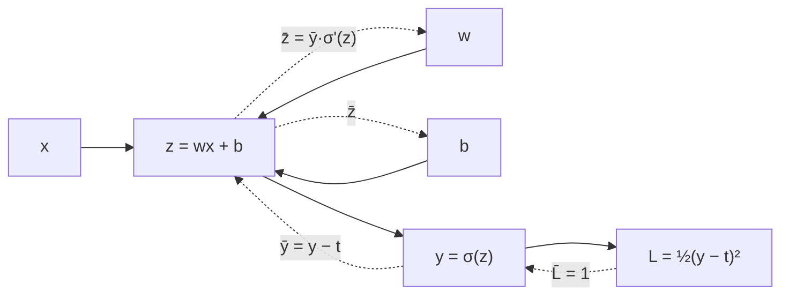

> 🌏 [English version](/en/posts/learning/2026-09-29-berkeley-cs189-sp26-lectures-17-18-neural-networks-backprop-en)

本文依 [CS189 Spring 2026](https://eecs189.org/sp26/)（Jennifer Listgarten／Alex Dimakis）的官方教材寫成：第 17 講的講義 [Neural Networks and PyTorch](https://drive.google.com/drive/folders/1-as4P5M8XTeNvXGk0tmHPorRNNjMBtrM)（3/19，[錄影](https://www.youtube.com/watch?v=bMJ9igfvn1M)）、第 18 講的 [lec18.pdf](https://drive.google.com/drive/folders/1mHu1f3UYFTCqcsy7d1zS2jnynWzWLRas)（3/31，[錄影](https://www.youtube.com/watch?v=XlaV_z2knjA)），以及 [Discussion 8](https://drive.google.com/file/d/1XNAVahEf4jiRfGyUCr-x4XGSSseohf2M/view)（附[解答](https://drive.google.com/file/d/12OuB5CcxfG4Ega4_BREMC1cyijm0FUd7/view)與 [walkthrough 影片](https://www.youtube.com/playlist?list=PL-ysCubq-Sa9sA7c_KW-WwRudeMkxQZu_)）。這幾份都能匿名打開，整門課判 A3（定義見[全球 AI／CS 課程地圖](/posts/learning/2026-08-21-global-ai-cs-course-map)）。

這兩講卡在期中考（3/17）之後、春假前後。前半學期你已經學過線性回歸、logistic regression、梯度下降和 Adam（見[本系列 order 8](/posts/learning/2026-09-29-berkeley-cs189-sp26-lectures-13-15-gradient-descent-optimizers)）；這裡要回答的是：模型換成「很多層函數疊起來」之後，還能不能用同一套方法訓練？答案是可以，靠的就是反向傳播。它是整門課的認知高峰，所以本篇照「場景 → 直覺 → 機制 → 連回模型 → 想深入」五層來寫。

官方指定閱讀是 Bishop《[Deep Learning: Foundations and Concepts](https://www.bishopbook.com/)》6.1–6.3.1（Lec 17）與第 8 章開頭到 8.1.4、8.2 開頭（Lec 18，不含 8.2.1 之後）。

## 場景：線性模型連 XOR 都學不會

Lec 17 後半有一個完整的手算例子，改編自 Goodfellow 等人《[Deep Learning](https://www.deeplearningbook.org/contents/mlp.html)》第 6 章。資料只有四筆：

| x1 | x2 | y |
|---|---|---|
| 0 | 0 | 0 |
| 0 | 1 | 1 |
| 1 | 0 | 1 |
| 1 | 1 | 0 |

先用線性模型 `f(x) = wᵀx + b` 配平方損失，講義帶你寫出損失、算梯度，再在 θ = (0, 1, 1) 用步長 0.5 走一步。梯度下降跑到底，得到 `w* = [0, 0]`、`b* = 1/2`：**不管輸入什麼，模型都預測 1/2**。它什麼也沒學到。

加一層隱藏層呢？如果隱藏層也是線性的，`y = wᵀ(Wᵀx + c) + b` 展開後還是 `w'ᵀx + b'`。講義的結論是：多層線性模型從頭到尾仍是線性模型，永遠停在 1/2。

換成 ReLU 就不一樣了。講義給了一組具體權重：`W = [1,1; 1,1]`、`c = [0, −1]ᵀ`、`w = [1, −2]ᵀ`、`b = 0`，套上 `g(z) = max(z, 0)`，四筆輸入全部答對。

## 直覺：非線性是讓層數有意義的關鍵

同一個例子說出兩件事：

1. **沒有非線性，疊再多層都白疊。** Lec 17 在激活函數那一節也講了：隱藏層若用 identity，那一層就是多餘的。
2. **只要一層非線性隱藏層，就能表達很多東西。** 講義把 XOR 拆成 `x1 AND ¬x2` 與 `¬x1 AND x2` 的 OR，說明單一神經元（階梯函數）做得到 AND，做不到 XOR；多一層就行。

講義開頭還從另一個角度講為什麼需要神經網路：真實的高維資料（影像、聲音、文字）通常落在一個低維的 **data manifold** 上。一張 64×64 的手寫數字是 4096 維向量，但姿勢、位置、方向只有少數幾個自由度。多項式這類固定基底會隨維度爆炸；神經網路則是「依資料學出來的基底」，複雜度跟著 manifold 的維度走。講義把這件事叫做**表徵學習**。

講義還整理了擴展特徵的三條路：針對問題手工做特徵、嵌入通用空間再用 kernel、直接從資料學特徵。第三條要求模型能端到端微分，這正好引出 Lec 18 的反向傳播。

## 機制一：從神經元到深度網路

Lec 17 的記號之後整學期都會用到：

- **神經元** = 加權和 + 激活函數，`y = f(w·x)`，偏差項當成 `w0`。
- **一層**：`a_j = Σ_i w_ji⁽¹⁾ x_i + w_j0⁽¹⁾` 是 pre-activation（講義也叫 logits），`z_j = h(a_j)` 是輸出；上標表示第幾層。
- **兩層網路**寫成 `y = f(W⁽²⁾ h(W⁽¹⁾ x))`。
- **L 層**：`z⁽ˡ⁾ = h_l(W⁽ˡ⁾ z⁽ˡ⁻¹⁾)`，`z⁽⁰⁾ = x`、`z⁽ᴸ⁾ = y`。

### 萬能近似定理：保證存在，但沒說怎麼找

講義引用 Cybenko（1989）與 Funahashi（1989）：任何定義在 ℝᴰ 連續子集上的函數，都能被**一層隱藏層**的神經網路近似到任意精度。講義接著列出它沒回答的三件事，並各自補上答案：

| 定理沒說的 | 講義的回答 |
|---|---|
| 怎麼找到對的權重？ | 訓練，也就是梯度下降 |
| 隱藏層要多大？ | 可能是 D 的指數級 |
| 用哪種激活函數？ | ReLU |

所以講義反問：為什麼要「深」網路，不做「胖」網路？它用邏輯電路類比：兩層邏輯閘就能表示任何布林函數，但某些函數用多層閘來做，需要的閘數會少上指數級。神經網路也一樣，多層可能讓參數更少。講義在「資料也更少？」後面打了問號，沒有下結論。

### 激活函數

| 激活函數 | 講義的重點 |
|---|---|
| identity | 全用 identity 的話，隱藏層就多餘 |
| sigmoid `1/(1+e^(−a))` | 最簡單的可微非線性 |
| tanh、hard tanh | tanh 與 sigmoid 家族在 \|a\| 大時梯度趨近 0 |
| softplus `ln(1+exp(a))` | 又叫 soft ReLU；a ≫ 1 時約等於 a |
| ReLU `max(0, a)` | a 為負的神經元收不到「error signal」 |
| leaky ReLU `max(0,a) + α·min(0,a)` | 讓負區也有一點梯度 |

講義最後拋出幾個延伸問題，對應 Bishop 6.2.4 的 weight-space symmetries：能不能換一組權重、讓網路對所有輸入輸出都一樣（偷走網路）？怎麼檢查兩組權重是否等價？怎麼替權重加浮水印，或植入只對特定輸入反應的後門？

### PyTorch 四個核心概念

Lec 17 收尾用幾張投影片介紹 PyTorch：`torch.tensor` 類似 `numpy.ndarray`，但能放上 GPU，也能記錄自己是怎麼算出來的（`grad_fn`）；模型繼承 `nn.Module`，在 `__init__` 宣告參數、在 `forward` 寫計算；`loss.backward()` 用自動微分算出所有參數的梯度；訓練迴圈（某種梯度下降）要自己寫。講義附了一個 `MLPModel` 範例，並把自動微分標註為「下一講的主題」。

## 機制二：反向傳播是整理過的 chain rule

Lec 18 先回顧設定：損失是負對數似然 `J(w) = −LL(w)`，模型是一串函數的合成，訓練用 SGD 或 Adam（講義標注見 L13 與 Bishop 7.3.3）。問題是：網路這麼大，梯度怎麼算？講義說確實很複雜，但反向傳播就是解法。後面的投影片改編自 Roger Grosse 在多倫多大學開的 [CSC321](http://www.cs.toronto.edu/~rgrosse/courses/csc321_2018/)。



上圖是本文依講義「非線性回歸」小例子的形式所畫的示意（講義本身的圖是投影片圖片）：實線是 forward pass，虛線是 backward pass。講義的推導順序是：

1. **單變數 chain rule**：用一個「非線性回歸」小例子，從損失往回，一個一個算中間導數。講義問你：看出這裡有沒有能變成通用演算法的結構？
2. **計算圖與 bar 記號**：`v̄ = dL/dv` 叫做這個變數的 error signal。單一子節點的圖，`v̄_i = v̄_child · ∂v_child/∂v_i`，從 `v̄_N = 1` 一路往回乘。
3. **為什麼還需要 forward pass？** 講義給兩個理由：算導數要用到 forward 的中間值；訓練時也要追蹤損失。
4. **多個子節點**：用多變數 chain rule，一個變數對損失的總影響，是它經過每一條路徑的影響之和。所以 `v̄_i` 要把所有子節點傳回來的量加起來。
5. **向量形式**：輸出層的訊號是 `−(t − y)`，其餘照同樣規則用矩陣寫。
6. **反向傳播就是 message passing**：每個節點只需要收齊子節點的訊息，再往父節點送。

<details>
<summary>多路徑 chain rule 的形式（展開）</summary>

若 L 經由 v 的子節點 c₁, …, c_k 依賴 v，則

```
v̄ = Σ_k  c̄_k · ∂c_k/∂v
```

這條式子就是 Discussion 9 與 HW3 的核心。單一子節點時退化成一條鏈；網路中某個隱藏單元的輸出同時送到下一層好幾個神經元時，就要相加。

</details>

### 成本：為什麼一定要用反向傳播

Lec 18 比較了三種算梯度的方法：

| 方法 | 講義的評語 |
|---|---|
| 有限差分 `(E(w+εIᵢ) − E(w−εIᵢ)) / 2ε` | D 維權重要算 2D 次誤差，每次 O(ND)，合計 **O(ND²)**，和參數量成平方。N ≈ 1000、D ≫ 10⁶ 時超過 10¹⁵ |
| 符號微分（例如 SymPy） | 自動、精確，但導數式子可能膨脹、充滿重複項；遇到控制流也有麻煩 |
| 反向傳播 | 每個權重只多幾次乘法，**和參數量、輸入數、隱藏節點數都是線性** |

現代框架做的「自動微分」，就是自動執行反向傳播。Lec 19 開頭把這件事講得更明白：以前要手畫計算圖、手寫局部導數、再用有限差分檢查；現在只要寫 forward，框架替你建圖、算導數、跑反向傳播。

### 回到激活函數

有了反向傳播，Lec 18 回頭解釋 sigmoid 和 tanh 的問題：兩端的漸近線讓梯度變成 0，單元容易卡住，變成「dead units」。ReLU 解決了一半（x > 0 那側）；負的那側仍會死掉。講義列出的補救方法有：較小的學習率、batch normalization、改用 leaky ReLU。batch norm 在 Lec 19 才正式介紹，見[下一篇 order 13](/posts/learning/2026-09-29-berkeley-cs189-sp26-lectures-19-20-cnn-generalization)。

講義最後一張投影片很誠實：多項式特徵的線性回歸也是萬能近似器，那為什麼深度網路在實務上常贏？講義說目前**還沒完全搞懂**，可能和巨大架構造成的優化地形有關，仍是理論界活躍的研究方向，並附上 David Donoho 在 Stanford Stats385 的[講義](https://stats385.github.io/assets/lectures/StanfordStats385-20170927-Lecture01-Donoho.pdf)。

## Discussion 8：兩個值得自己證一次的結果

Discussion 8 只有兩題，都是證明題：

1. **梯度下降收斂**：假設 f 是 μ-strongly convex、梯度 L-Lipschitz（`μI ⪯ ∇²f ⪯ LI`）。你要證明局部極小值唯一、`0 < α < 2/L` 時 GD 收斂、要達到誤差 ε 需要 O(log(1/ε)) 步，並求最佳步長。解答給的最佳步長是 `α* = 2/(L+μ)`，對應的收縮率是 `(κ−1)/(κ+1)`，其中 κ = L/μ 是條件數。這題接的是 order 8 的優化，也預告了 HW3 第 2 題的座標下降分析。
2. **一維萬能近似**：對 [0, 1] 上任何連續函數，證明存在 `F(x) = b₀ + Σ aᵢ·ReLU(wᵢx + bᵢ)` 讓最大誤差小於 ε。解答的做法是分段線性插值，再把每段的斜率變化寫成一個 ReLU。做完你會明白，Lec 17 那句「一層 ReLU 就夠」在一維是怎麼成立的。

## 連回模型：你寫 `loss.backward()` 時發生了什麼

用 PyTorch 訓練時，forward 每做一次加法、矩陣乘法、ReLU，框架就在背後記下一個節點和它的父節點。呼叫 `loss.backward()` 時，框架從損失節點出發，令 L̄ = 1，照拓撲順序把 error signal 往回傳；一個張量若被用了好幾次，梯度就相加。最後每個參數的 `.grad` 就是它的 v̄。這整套機制，就是[下一份作業 HW3](/posts/learning/2026-09-29-berkeley-cs189-sp26-hw3-autograd-optimizers) 要你用 NumPy 從零寫出來的 BearTensor。

## 想深入

- Fall 2026 對應講次：[CS189 Fall 2026](https://eecs189.org/fa26/) 把這段拆成 Lec 12（非線性、架構、激活函數、輸出層）與 Lec 13（Backpropagation）。
- 站內同主題的其他課導讀（只是延伸，不重複本課內容）：[CMU 11-785 第 2 講：萬能近似](/posts/ai/2026-08-22-cmu-11785-02-universal-approximators)、[CMU 11-785 第 5 講：反向傳播](/posts/ai/2026-08-22-cmu-11785-05-backpropagation)、[Stanford CS109 第 22 講：深度學習的機率觀點](/posts/learning/2026-08-22-stanford-cs109-lecture-22-deep-learning-probability)。
- 系列導覽：上一篇 [HW2 導讀](/posts/learning/2026-09-29-berkeley-cs189-sp26-hw2-regression-gmm-flow-matching)；下一篇 [HW3 導讀](/posts/learning/2026-09-29-berkeley-cs189-sp26-hw3-autograd-optimizers)；系列入口 [CS189 總覽](/posts/learning/2026-08-22-berkeley-cs189-spring-2025-overview)。

**今晚能做的事**：打開 Lec 17 講義的 XOR 例子，自己用 NumPy 算出線性模型的最佳解 `b* = 1/2`，再代入講義給的 ReLU 權重，確認四筆都對。

## 參考資料

- [CS189 Spring 2026 課程首頁與排程](https://eecs189.org/sp26/)
- [CS189 Spring 2026 Syllabus](https://eecs189.org/sp26/syllabus/)
- [Lecture 17 講義資料夾：Neural Networks and PyTorch](https://drive.google.com/drive/folders/1-as4P5M8XTeNvXGk0tmHPorRNNjMBtrM)
- [Lecture 17 錄影](https://www.youtube.com/watch?v=bMJ9igfvn1M)
- [Lecture 18 講義資料夾：lec18.pdf](https://drive.google.com/drive/folders/1mHu1f3UYFTCqcsy7d1zS2jnynWzWLRas)
- [Lecture 18 錄影](https://www.youtube.com/watch?v=XlaV_z2knjA)
- [Discussion 8 題目](https://drive.google.com/file/d/1XNAVahEf4jiRfGyUCr-x4XGSSseohf2M/view)、[解答](https://drive.google.com/file/d/12OuB5CcxfG4Ega4_BREMC1cyijm0FUd7/view)、[Walkthrough](https://www.youtube.com/playlist?list=PL-ysCubq-Sa9sA7c_KW-WwRudeMkxQZu_)
- [CS189 Spring 2026 講課播放清單](https://www.youtube.com/playlist?list=PLuHtd0SzXhx4B8oOmp9PBEroMuV5n0MWE)
- [Bishop & Bishop, Deep Learning: Foundations and Concepts](https://www.bishopbook.com/)
- [Goodfellow, Bengio, Courville, Deep Learning, Ch. 6](https://www.deeplearningbook.org/contents/mlp.html)
- [Roger Grosse, CSC321 (2018)](http://www.cs.toronto.edu/~rgrosse/courses/csc321_2018/)
- [David Donoho, Stanford Stats385 Lecture 1](https://stats385.github.io/assets/lectures/StanfordStats385-20170927-Lecture01-Donoho.pdf)
- [CS189 Fall 2026 排程](https://eecs189.org/fa26/)
