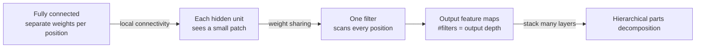

> 🌏 [中文版](/posts/learning/2026-09-29-berkeley-cs189-sp26-lectures-19-20-cnn-generalization)

This guide is based on the official materials of [CS189 Spring 2026](https://eecs189.org/sp26/) (Jennifer Listgarten / Alex Dimakis): the Lecture 19 slides [lec19.pdf](https://drive.google.com/drive/folders/12L6CYQ-h128-bzFPU1RvX1aJnFvWQ6Hi) (4/2, [video](https://www.youtube.com/watch?v=-4PpBUsB_S4)), the Lecture 20 slides [lec20.pdf](https://drive.google.com/drive/folders/1Ocw82WCz2SiUEDY9uofdfyZuPX4GrfOw) (4/7, [video](https://www.youtube.com/watch?v=4LrCyN7URuY)), and [Discussion 9](https://drive.google.com/file/d/1Aa40Z2Ufa91YBNAlhfwsHG2JCT23T2SA/view) (with [solutions](https://drive.google.com/file/d/16n2T86Vx2bneCubkQ7b52MV8c8wwFUyF/view) and a [walkthrough video](https://www.youtube.com/playlist?list=PL-ysCubq-Sa8dQDvhNbABwFT3JWWBTRAW)). All of them are available without a login, and the course rates A3 (defined in the [global AI/CS course map](/en/posts/learning/2026-08-21-global-ai-cs-course-map-en)).

[The previous post on Lec 17–18](/en/posts/learning/2026-09-29-berkeley-cs189-sp26-lectures-17-18-neural-networks-backprop-en) answered how to compute gradients. These two lectures ask two follow-ups: once you can compute gradients, how do you keep them **flowing** during training? And beyond fully connected layers, is there an architecture better suited to images? At the end, Lec 20 returns to an old question from the first half: how complex should a model be?

Assigned reading (Bishop, [Deep Learning: Foundations and Concepts](https://www.bishopbook.com/)):

| Lecture | Sections |
|---|---|
| Lec 19 | 7.2.5 NN initialization; 7.4 through 7.4.2 (data normalization, batch norm); Chapter 10 through 10.2.8, plus 10.3.2 (CNNs) |
| Lec 20 | 9.1.2 no free lunch; 9.3.1 early stopping; 9.3.2 double descent |

## Lec 19, first part: finishing backprop

Lec 19 opens by repeating Lec 18's cost comparison: finite differences cost O(NL²) per step, quadratic in the number of parameters L, and symbolic differentiation suffers from "expression swell" (Bishop 8.1.4). Then it describes the shift from backprop to automatic differentiation:

| Back in the day | Today (autodiff) |
|---|---|
| Draw the computation graph by hand | The framework builds the graph |
| Code the forward pass by hand | You write only the forward pass |
| Derive local derivatives and code them by hand | The framework computes every needed derivative |
| Check against finite differences | The framework runs backprop directly |

The slides add one implementation detail: ReLU is not differentiable at 0, so backprop uses a subgradient, 0 for x < 0 and 1 for x ≥ 0.

## Keeping gradients flowing: initialization

The slides' reasoning is short. The loss surface of a neural network is highly non-convex, so the starting point can lead to solutions of different quality or to slow convergence. What makes a good start? **Think gradients.** Activation gradients are usually largest near 0, so why not set every weight to 0?

Because then every parameter gets the same gradient, and units in the same layer stay identical forever. The slides recommend:

- initialize **randomly** near 0, `w ~ N(0, ε⁽ˡ⁾)`;
- for ReLU, use "He" initialization with variance `2 / n_inputs`;
- optionally try several initializations and keep the best network, or average their results.

## Keeping gradients flowing: batch normalization

Initialization only takes care of the start. As the slides put it, "once we start learning, all bets are off." So you keep controlling the inputs to the nonlinearities throughout training, so they stay where gradients exist. That is batch normalization.

- **Training**: for pre-activation m in layer l, compute the mean μ and variance σ² over the K examples in the mini-batch, then apply `(a − μ) / √(σ² + δ)`. These are differentiable operations, so backprop works as usual.
- **Test time**: ideally you would use μ and σ² over the whole training set, but that is too expensive. In practice you keep an exponentially decaying running average of the per-batch values during training.

The slides also cover **input normalization**. Input features can have very different scales (the slides' example is height in meters versus pinky width in millimeters), which makes gradient descent move fast in some directions and slowly in others. Continuous variables are usually normalized to zero mean and unit variance, and validation and test data must get **exactly the same** transformation.

## CNNs: from fully connected to local and shared

The slides start from two problems with fully connected layers:

1. **Parameter count**: a layer with n_i inputs and n_o outputs has n_i × n_o parameters, which adds up fast.
2. **Features cannot be reused**: every image region has its own weights, which amounts to "global template matching". The slides use a single-layer MNIST classifier as the example: one W matrix per class, i.e. one template, shown at training iterations 1, 2, 3, and 7.

A better approach is to break digits into small parts and combine them, replacing global templates with hierarchical "local feature detectors". CNNs do this with two design choices:

### Computing a convolution

- **Stride**: how far the filter moves at each step; stride = 1 skips nothing.
- **Worked example**: the slides apply a horizontal-line detector and a vertical-line detector to a small 0/1 image, computing each feature map cell by cell.
- **1D convolution as a matrix**: the slides point out that the matrix W_k has 5×3 = 15 entries but only 3 parameters. That is why CNNs have relatively few parameters. They also note that the mathematical definition flips the filter before the element-wise product.
- **Intuition for filters**: blurring, oriented edges, and sharpening can all be written as 3×3 kernels, but in a neural network these values are learned from data with backprop.
- **Output size**: for a D×D image, a K×K filter, stride 1, and no padding, each filter outputs (D−K+1)×(D−K+1); a layer of F filters costs F·K²·(D−K+1)².
- **Multiple channels**: for a J×K image with depth C, each kernel is M×M×C. The slides observe that spatial size shrinks going up while depth usually grows.
- **Padding**: to keep the output the same size, pad the border with zeros.

### Pooling, receptive fields, and the overall architecture

Pooling layers shrink feature maps and build in invariance to small shifts. The slides use face detection as the example: the face may not be perfectly centered. The common choice is 2×2 max pooling; Lec 20 adds that average pooling also exists but is much less common, and asks what you would lose compared with max.

A typical CNN repeats "(convolution + ReLU) + pooling" a few times, then adds a few (say 2) fully connected layers before a softmax classifier or regression head. Lec 20 states the division of labor clearly: convolutional layers detect features, pooling layers downsample and give local invariance, and fully connected layers make the final prediction.

Because of pooling (and different strides or filter sizes), neurons in higher layers have a larger **receptive field** than those in lower layers, even when filters are the same size.

### Training a CNN

The loss is maximum likelihood (cross-entropy), and training is still backprop plus gradient descent, with two differences:

1. **Shared weights**: one filter is applied at every position, so its gradient **accumulates** over all positions. This is a direct application of Lec 18's rule that paths add.
2. **Max pooling**: the gradient flows back only through the neuron that won the max. Strictly speaking it is a subgradient, 1 for the winner and 0 for the rest.

How do you choose an architecture? Lec 19 says to use cross-validation as elsewhere in the course; Lec 20 revises that to hold-out validation, since cross-validation is too expensive. The slides use VGG(-Face) from 2014 as the example and say innovations like ResNets "sometimes change the game" (the [HW4 guide](/en/posts/learning/2026-09-29-berkeley-cs189-sp26-hw4-resnet-transformer-dnabert-en) implements ResNet-18). Another common move is **transfer learning**: take an architecture fully trained on a large dataset, freeze the feature-extraction layers, and retrain only the top layers that do classification or regression.

## Lec 20, second part: when to stop

### Early stopping and dropout

During training you typically plot a learning curve that tracks both training and validation error. **Early stopping** means stopping when validation error stops decreasing and returning to that checkpoint. Citing a figure from Bishop 9.3.1, the slides explain that it is also a form of regularization: models usually start with small weights, so stopping early acts like weight decay (the slides note that regularization is often called "weight decay" in neural networks).

**Dropout** randomly "disables" neurons in each SGD iteration: sample `r ~ Bernoulli(1−ρ)` for each activation and multiply, with ρ typically ≤ 0.5. At test time, use all activations scaled by 1−ρ.

### Double descent

The slides first recall the bias-variance picture from earlier in the semester: test error falls then rises with model complexity, with an optimum in between. Then they say that for large neural networks trained with SGD, test error **falls a second time** past a certain point. Their description:

- the plot has an under-parameterized regime and an over-parameterized regime;
- very complex models seem to self-regularize, "likely due to SGD" in the slides' words;
- for sufficiently large models, early stopping **could** hurt generalization;
- the largest models achieve the lowest test error.

The slides use Nakkiran et al.'s [Deep Double Descent](https://arxiv.org/abs/1912.02292) (ICLR 2020) as the example, and add a note on the slide: students are not responsible for it because the figure is confusing, and it actually shows both epoch-wise double descent (along training epochs) and model-complexity double descent (along model size). Keep track of which one you are looking at.

No free lunch (Bishop 9.1.2), though on the reading list, has no section of its own in the text of the Lec 20 slides; read Bishop directly for it.

## Discussion 9: two hand calculations that double as HW3 test cases

Both problems in Discussion 9 are reused from Fall 2025 discussions (labeled F25 Dis8 Q1 and F25 Dis9 Q1):

1. **Staged backprop**: `f(x, y, z) = (x + y)z`. Split it into `g = x + y` and `f = g·z`, draw the computation graph, write out the forward and backward steps, then plug in x = −2, y = 5, z = −4 and label every intermediate value. The solution describes backprop as message passing between nodes via the gradient signal. This graph makes a good first test for the BearTensor in [HW3](/en/posts/learning/2026-09-29-berkeley-cs189-sp26-hw3-autograd-optimizers-en).
2. **Convolution**: a 9-dimensional input with a 3-weight 1D filter. Find the output size and elements with no padding and stride 1, and with padding 1 and stride 2; write the convolution as a matrix `x' = Kx` and find K's shape; compute a 2×2 kernel's output on a 3×3 image and describe its effect; and derive the general output-size formula. The solution gives `⌊(W + 2p − K) / s⌋ + 1`.

## Further reading and navigation

- Fall 2026 equivalents: in [CS189 Fall 2026](https://eecs189.org/fa26/), Lec 14 (batch normalization, initialization, and regularization) and Lec 16–17 (CNNs).
- Related guides on this site (extensions only, not replacements): [CMU 11-785 Lecture 8: optimizers and regularization](/en/posts/ai/2026-08-22-cmu-11785-08-optimizers-regularization-en), [CMU 11-785 Lecture 9: CNNs (1)](/en/posts/ai/2026-08-22-cmu-11785-09-cnn-one-en), [CMU 11-785 Lecture 10: CNNs (2)](/en/posts/ai/2026-08-22-cmu-11785-10-cnn-two-en).
- Series navigation: previous, [HW3 guide](/en/posts/learning/2026-09-29-berkeley-cs189-sp26-hw3-autograd-optimizers-en); next, [Lec 21–22: Transformers](/en/posts/learning/2026-09-29-berkeley-cs189-sp26-lectures-21-22-transformers-en); series entry, [CS189 overview](/en/posts/learning/2026-08-22-berkeley-cs189-spring-2025-overview-en).

**Something to do tonight**: following Discussion 9 problem 2, write a 1D convolution in NumPy, then rewrite it as a 7×9 matrix multiply and confirm both give the same output. You will see directly what "15 entries, only 3 parameters" means.

## References

- [CS189 Spring 2026 home page and schedule](https://eecs189.org/sp26/)
- [Lecture 19 slides folder: lec19.pdf](https://drive.google.com/drive/folders/12L6CYQ-h128-bzFPU1RvX1aJnFvWQ6Hi)
- [Lecture 19 video](https://www.youtube.com/watch?v=-4PpBUsB_S4)
- [Lecture 20 slides folder: lec20.pdf](https://drive.google.com/drive/folders/1Ocw82WCz2SiUEDY9uofdfyZuPX4GrfOw)
- [Lecture 20 video](https://www.youtube.com/watch?v=4LrCyN7URuY)
- [Discussion 9 worksheet](https://drive.google.com/file/d/1Aa40Z2Ufa91YBNAlhfwsHG2JCT23T2SA/view), [solutions](https://drive.google.com/file/d/16n2T86Vx2bneCubkQ7b52MV8c8wwFUyF/view), [walkthrough](https://www.youtube.com/playlist?list=PL-ysCubq-Sa8dQDvhNbABwFT3JWWBTRAW)
- [CS189 Spring 2026 lecture playlist](https://www.youtube.com/playlist?list=PLuHtd0SzXhx4B8oOmp9PBEroMuV5n0MWE)
- [Bishop & Bishop, Deep Learning: Foundations and Concepts](https://www.bishopbook.com/)
- [Nakkiran et al., Deep Double Descent (arXiv:1912.02292)](https://arxiv.org/abs/1912.02292)
- [CS189 Fall 2026 schedule](https://eecs189.org/fa26/)
