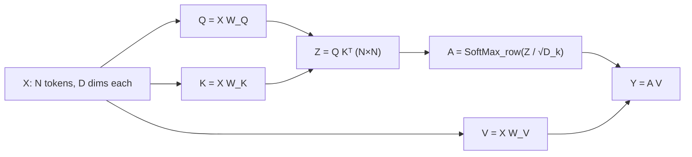

> 🌏 [中文版](/posts/learning/2026-09-29-berkeley-cs189-sp26-lectures-21-22-transformers)

**Video status: Videos included.** [Source details](#course-video-sources)

This guide is based on the official materials of [CS189 Spring 2026](https://eecs189.org/sp26/) (Jennifer Listgarten / Alex Dimakis). Lecture 21 (4/9) and Lecture 22 (4/14) share one 119-page slide deck, [Lecture 21 Attention and Transformers](https://drive.google.com/file/d/17Jb-uJK9KaI0lytfHUN95LztVAMLX0Pt/view), and each session has its own recording ([Lec 21](https://www.youtube.com/watch?v=mqaFEvi5rWE), [Lec 22](https://www.youtube.com/watch?v=syp1pSf_DYY)). The companion section is [Discussion 10](https://drive.google.com/file/d/16H_chNl76tHPrRUkf6T1G0pQaM1W0eKm/view), with [solutions](https://drive.google.com/file/d/1QV5d9Mr2XAaYv7QAT_6ttZ37CKBRCdfu/view) and a [walkthrough video](https://youtube.com/playlist?list=PL-ysCubq-Sa8nZKoYa7TbLsNlBgXQ3xQR). All of them open without a login, and the course rates A3 (defined in the [global AI/CS course map](/en/posts/learning/2026-08-21-global-ai-cs-course-map-en)).

The assigned reading is Chapter 12 (Transformers) of Bishop's *[Deep Learning: Foundations and Concepts](https://www.bishopbook.com/)*.

[The previous post on Lec 19–20](/en/posts/learning/2026-09-29-berkeley-cs189-sp26-lectures-19-20-cnn-generalization-en) covered CNNs and generalization. These two lectures answer a follow-up: CNNs are already parameter-efficient, so why do we need a new architecture? This post covers only the core of attention. Positional encodings and the full encoder/decoder implementation are left to the next post, the [HW4 guide](/en/posts/learning/2026-09-29-berkeley-cs189-sp26-hw4-resnet-transformer-dnabert-en). That assignment walks you from softmax all the way to a transformer that generates stories.

## Course video sources

The official Spring 2026 schedule and the official YouTube playlist (Spring 2026 Lectures, 25 videos) were checked live on 2026-10-10; the lecture recordings embedded here are listed there. No unverified timestamp is supplied.

```youtube
url: https://www.youtube.com/watch?v=mqaFEvi5rWE
title: Lecture 21 recording: Transformers
```

```youtube
url: https://www.youtube.com/watch?v=syp1pSf_DYY
title: Lecture 22 recording: Transformers (ctnd.)
```

Original videos: [Lecture 21 recording: Transformers](https://www.youtube.com/watch?v=mqaFEvi5rWE)、[Lecture 22 recording: Transformers (ctnd.)](https://www.youtube.com/watch?v=syp1pSf_DYY)

Course and recording entries:

- [Official course and recording entry](https://eecs189.org/sp26/)
- [CS189 Spring 2026 Lectures — official YouTube playlist (25 videos)](https://www.youtube.com/playlist?list=PLuHtd0SzXhx4B8oOmp9PBEroMuV5n0MWE)

Checked: 2026-10-10.

## What I read, and the limits

What I actually opened and read: the text layer of the slide PDF (119 pages), the Discussion 10 problems and solutions, and the titles of the two recordings. Many figures in the slides (CNN receptive fields, the attention heat maps from image captioning, the sinusoidal positional encoding curves) have no text layer, so I only relay what is written on the slides. I did not watch the recordings minute by minute, so this post does not claim what the instructors said in class.

Around page 58 the deck has a "Stopped Here" slide noting that content-based attention moves to Lec 22. The sections below follow that split.

## Lec 21: what CNNs are missing

The deck opens by listing four key ideas behind modern architectures: CNNs, residual connections, attention, and transformers. It then revisits the two kinds of network the course has already covered:

| Architecture | Strength | Weakness |
|---|---|---|
| MLP | Very expressive | Many parameters: P pixels need P² weights; fixed input size |
| CNN | Weight sharing saves parameters; built-in translation-invariance bias; input size can vary | Representations are local; only the top of the network "sees everything" |

The deck uses a photo of a child dressed as a Spider-Man firefighter to make the point: understanding one part of an image often needs a wider context. It then works a receptive-field problem. If every layer uses a width-3 convolution, how many pixels can a central activation at the top see? Higher layers see more, but you need many layers before any unit sees the whole image.

The deck frames the transformer as the basic building block of state-of-the-art networks in most fields today (chat, vision, speech recognition, image and video generation), originally designed for machine translation. It recommends *[Attention Is All You Need](https://arxiv.org/abs/1706.03762)* and admits the paper is "a bit hard to read," so the lectures build the idea up from first principles instead.

### Groundwork: from document vectors to RNNs

Lec 21's path is "turn text into vectors → sequence models → attention":

1. **Bag of words**: a tweet becomes a sparse vector of about 50,000 dimensions with only 5 to 10 nonzero entries.
2. **TF-IDF**: common words (the, and) should not dominate the representation. The deck gives an example you can compute by hand: in a 100-word document where football appears twice, TF = 2/100; if 300 of 1000 documents contain football, IDF = log(1000/300).
3. **RNN**: feed the output back in as the next input and iterate, to process and produce sequences.

The running task is image captioning. The dataset is Microsoft COCO (2014): 120,000 images, five captions each. The baseline uses a CNN to extract features and an RNN to generate the caption one word at a time.

### Soft attention: let the model decide where to look

The next step has the RNN output, for every word it generates, a probability distribution over which region of the image to look at. The deck cites *Show, Attend and Tell* (Xu et al., ICML 2015) and the translation paper by Bahdanau et al. (ICLR 2015).

With a 2×2 feature map (regions a, b, c, d), the deck compares two options:

- **Soft attention**: the output is a weighted average, for example `z = 0.1a + 0.2b + 0.7c`. The whole path is differentiable, so it trains end to end.
- **Hard attention**: sample one region according to the probabilities. Sampling is not differentiable, so training switches to the REINFORCE algorithm.

The last slide of Lec 21 raises the key question. The approach above is **location-based addressing**: the RNN outputs a distribution over a fixed number of positions. What if you don't know the number of positions in advance? The answer is **content-based addressing**: compare a query against the content of each position. That is where Lec 22 begins.

## Lec 22: deriving self-attention from a soft lookup

Lec 22's agenda lists four items: what self-attention is, how to implement it in PyTorch, how to read it as a soft lookup table, and what a transformer is.

### Step 1: softmax instead of hardmax

The deck starts with X = [1, 2, 3]: hardmax gives [0, 0, 1], softmax gives roughly [0.09, 0.24, 0.66]. Softmax on a matrix means applying it to each row separately.

### Step 2: use dot products to find positions that match the query

The deck connects attention to an old information-retrieval method: give each document a key vector, build a query vector, and rank documents by dot product. Attention differs only in that it takes a weighted average instead of a ranking:

```text
p_i = exp(qᵀ x_i) / Σ_j exp(qᵀ x_j)
y   = Σ_i p_i x_i
```

A large p_i means position i "looks like the query." The number of positions n can be anything.

### Step 3: separate keys, queries, and values

Next the deck lets keys and values live in different spaces: keys come from `W_k x_i`, the query from `W_q x_q`, the values start as the raw x_i, and `W_v` is added at the end. The three matrices are the layer's parameters, and the whole layer is differentiable, so backprop can train it.

Why use two different matrices for keys and queries? The deck's example is "I swam across the river to get to the other bank": bank needs to look up river, but river does not need to look up bank. Relevance is not always symmetric.

The deck also tries a simpler proposal first: just average the V of every token. That adds no parameters and still works when the number of tokens changes. The problem is that **all context is treated as equally important**. In "The food was good, not bad at all," whether bad pushes good the wrong way or the right way depends on whether not has already changed the representation of bad.

### Matrix form

The input is N tokens of D dimensions each, stacked into X ∈ ℝ^{N×D}:

```text
Q = X W_Q      K = X W_K      V = X W_V
Z = Q Kᵀ                         # N×N; Z_ij scores how relevant token j is to token i
A = SoftMax_row( Z / √D_k )      # each row is nonnegative and sums to 1
Y = A V
```

The deck's explanation of √D_k: a dot product that sums D_k terms has a variance that grows with dimension; dividing by √D_k keeps it near 1, which makes training more stable. That is exactly what Discussion 10, problem 2 asks you to prove.



The deck stresses that `Attention(K, Q, V)` itself has **no parameters**. All the parameters are in the three linear layers that produce K, Q, and V.

### Cost: few parameters, but N² compute

| | Self-attention | Flatten N tokens and use a fully connected layer |
|---|---|---|
| Parameters | about 3D², independent of N | N²D² |
| Compute | O(N²D), mostly in QKᵀ | O(N²D²) |

Attention's parameter count does not grow with sequence length, but its compute grows with N². That is the problem the KV cache and the many efficient-attention variants later try to address.

### A soft dictionary

The deck wraps up the concept with a Python dict. `D = {"A": 51, "B": 42, "C": 31}`, and `D["A"]` returns 51. Now replace the keys with vectors `k1 = [1,0,0]`, `k2 = [0,1,0]`, `k3 = [0,0,1]`. A query of `[0,1,0]` hits 42 exactly; a query of `[1,1,0]` returns `p1·V1 + p2·V2`, with weights given by the softmax of the query's dot product with each key. Attention is a dictionary you can query fuzzily.

## From attention to a transformer layer

### Multiple heads and GQA

If one way of querying is not enough, run H parallel sets of K, Q, and V, each with its own weights, concatenate the results, and pass them through one more linear layer. The deck notes that each head's value dimension is often set to D/H.

Storing separate K and V for every head is expensive. The deck compares three options: multi-head (most expressive), grouped-query attention (GQA, where several queries share one set of K and V), and multi-query (cheapest). According to the deck, most models today use GQA.

### What one transformer layer looks like

One transformer layer = multi-head self-attention + an MLP applied to each token separately (usually two layers), plus residual connections and LayerNorm to stabilize training.

Why is the MLP necessary? The deck's explanation: the attention output `AV` is a linear combination of V, and V is a linear transform of X. A itself is a nonlinear function of X, but that alone is not expressive enough.

Unrolled, every token uses **the same** MLP parameters, so adding tokens adds no parameters. Attention connects all the tokens and parallelizes well. When you stack layers, **each layer has its own weights**; nothing is shared between layers.

### Reading out a result

For image classification, a transformer has N outputs at the top. How do you turn them into one prediction? The deck lists three ways: pool and then apply a linear layer, concatenate and then apply a linear layer, or the common trick of adding one learnable `<class>` token and predicting from its top-layer representation only.

### Where did order go: permutation equivariance and positional encodings

Attention outputs a weighted average, and a weighted average does not care about order. Shuffle the input tokens and the outputs are just shuffled the same way. This is called **permutation equivariance**. For sets it is a feature; for images and text it is a problem. The deck's example: "The food was good not bad at all!" and "The food was bad not good at all!" swap the positions of two words and mean the opposite.

The fix is to **add** a position vector r_n to each token embedding. The deck also answers "why not concatenate?": concatenation changes the dimension, and a linear layer would end up adding the two anyway. In high dimensions, x and r are nearly orthogonal, so adding them does little damage to either.

The deck lists four properties of a good positional encoding: a unique representation for every position, bounded values, easy expression of relative distance, and support for arbitrary lengths. It then compares two approaches:

- **Learned position embeddings** (used by GPT-1): easy to implement and expressive, but the maximum length must be fixed in advance, and the model has to learn relative distance on its own.
- **Sinusoidal positional encodings** (used by the original transformer paper): the deck describes them as "a continuous version of binary encoding." A fixed offset can be written as a rotation matrix, so a linear layer can query relative position, and the dot product shrinks with distance.

The deck covers this part only at the concept level. You implement it yourself in cell 3g of the HW4 notebook, and the following week's Discussion 11 continues with relative positional encodings and RoPE (see the [Lec 23–24 guide](/en/posts/learning/2026-09-29-berkeley-cs189-sp26-lectures-23-24-llm-training-ssl-en)).

The deck's final slide summarizes the encoder transformer in four steps: build input embeddings (for example, image patches), add positional encodings, stack many transformer blocks, and hand the final output (pooled, or a special token) to the downstream task. The deck calls this the standard architecture for computer vision and language embedding tasks. It also gives an image patch size: 16×16×3 = 768 dimensions.

## Discussion 10: compute attention by hand once

Discussion 10 has only two problems, both tagged "F25 Dis10," meaning they are reused from Fall 2025.

1. **Queries, keys, and values in transformer attention**: given three 2-D tokens and W_Q, W_K, W_V, compute each token's q, k, and v, compute the attention scores of x₃ against all three tokens, then use the softmax result the problem supplies to compute the weighted sum. The second half switches to matrix form: write down the shapes of Q, K, and V, show that entry (i, j) of QKᵀ is q_iᵀk_j, and show that row i of AV is the weighted value sum for x_i. The supplied softmax weights put almost everything on one token (about 0.9975). After working it, you get a gut feel for how a slightly larger dot product makes softmax very peaked.
2. **Why scale**: assume each component of q and k is independent N(μ, σ²). Find E[qᵀk]; with μ = 0 and σ = 1, find Var(qᵀk); then find the scaling factor s that gives qᵀk/s mean 0 and variance 1.

Problem 2 asks the same thing as Q14 of the HW4 written part. Do the discussion and check the solutions first, then write the homework.

## Back to models: what happens when you call an attention layer

When you use PyTorch's `nn.MultiheadAttention` or any LLM library, each layer does the four matrix lines above, plus concatenating the heads. The KV cache you hear about at inference time caches exactly K and V: when you generate a new token, the K and V of earlier tokens don't change. Discussion 11, problem 3 has you count how many matrix multiplications that saves.

## Going further

- Fall 2026 counterpart: Lec 18 Transformers and Lec 21 Attention Methods in [CS189 Fall 2026](https://eecs189.org/fa26/).
- Guides to other courses on this site that cover the same topic (extensions only; they do not replace this course's content): [CMU 11-785 Lecture 18: Attention and Transformers](/en/posts/ai/2026-08-22-cmu-11785-18-attention-transformers-en), [CMU 11-785 Lecture 19: Transformer Architectures](/en/posts/ai/2026-08-22-cmu-11785-19-transformer-architectures-en), [Stanford CME295: Transformer](/en/posts/ai/2026-09-29-cme295-transformer-en), [Stanford CS224N guide](/en/posts/ai/2026-08-21-stanford-cs224n-nlp-deep-learning-en).
- Series navigation: previous, [Lec 19–20: CNNs and generalization](/en/posts/learning/2026-09-29-berkeley-cs189-sp26-lectures-19-20-cnn-generalization-en); next, [HW4 guide](/en/posts/learning/2026-09-29-berkeley-cs189-sp26-hw4-resnet-transformer-dnabert-en); series entry, [CS189 overview](/en/posts/learning/2026-08-22-berkeley-cs189-spring-2025-overview-en).

**Something you can do tonight**: take the three tokens and three weight matrices from Discussion 10, problem 1. Compute q, k, and v by hand, then write one line of NumPy, `softmax(Q @ K.T / np.sqrt(d)) @ V`, and check the row for x₃ against your hand calculation.

## Update Log

- 2026-10-10: Added explicit video status and checked recording sources and access notes.
- 2026-10-10: Rechecked video status. The official Spring 2026 schedule and YouTube playlist were checked live and list the embedded lecture recordings, so the status is now Videos included.

## References

- [CS189 Spring 2026 home page and schedule](https://eecs189.org/sp26/)
- [CS189 Spring 2026 syllabus](https://eecs189.org/sp26/syllabus/)
- [Lecture 21–22 slides: Attention and Transformers (PDF, Google Drive)](https://drive.google.com/file/d/17Jb-uJK9KaI0lytfHUN95LztVAMLX0Pt/view)
- [Lecture 21 recording: Transformers](https://www.youtube.com/watch?v=mqaFEvi5rWE)
- [Lecture 22 recording: Transformers (ctnd.)](https://www.youtube.com/watch?v=syp1pSf_DYY)
- [Discussion 10 problems](https://drive.google.com/file/d/16H_chNl76tHPrRUkf6T1G0pQaM1W0eKm/view), [solutions](https://drive.google.com/file/d/1QV5d9Mr2XAaYv7QAT_6ttZ37CKBRCdfu/view), [walkthrough](https://youtube.com/playlist?list=PL-ysCubq-Sa8nZKoYa7TbLsNlBgXQ3xQR)
- [CS189 Spring 2026 lecture playlist](https://www.youtube.com/playlist?list=PLuHtd0SzXhx4B8oOmp9PBEroMuV5n0MWE)
- [Bishop & Bishop, Deep Learning: Foundations and Concepts](https://www.bishopbook.com/); Chapter 12 on the [Springer chapter page](https://link.springer.com/chapter/10.1007/978-3-031-45468-4_12)
- [Vaswani et al., Attention Is All You Need (arXiv:1706.03762)](https://arxiv.org/abs/1706.03762)
- [Xu et al., Show, Attend and Tell (arXiv:1502.03044)](https://arxiv.org/abs/1502.03044)
- [Bahdanau et al., Neural Machine Translation by Jointly Learning to Align and Translate (arXiv:1409.0473)](https://arxiv.org/abs/1409.0473)
- [CS189 Fall 2026 schedule](https://eecs189.org/fa26/)
