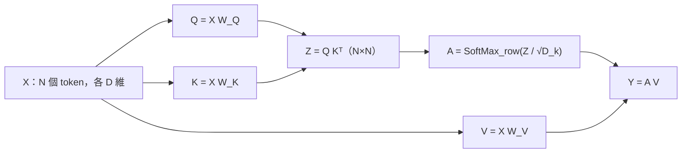

> 🌏 [English version](/en/posts/learning/2026-09-29-berkeley-cs189-sp26-lectures-21-22-transformers-en)

**影片狀態：已附影片。** [影片來源與說明](#課程影片來源)

本文依 [CS189 Spring 2026](https://eecs189.org/sp26/)（Jennifer Listgarten／Alex Dimakis）的官方教材寫成。第 21 講（4/9）和第 22 講（4/14）共用同一份 119 頁的講義 [Lecture 21 Attention and Transformers](https://drive.google.com/file/d/17Jb-uJK9KaI0lytfHUN95LztVAMLX0Pt/view)，兩堂各有一支錄影（[Lec 21](https://www.youtube.com/watch?v=mqaFEvi5rWE)、[Lec 22](https://www.youtube.com/watch?v=syp1pSf_DYY)）。配套的是 [Discussion 10](https://drive.google.com/file/d/16H_chNl76tHPrRUkf6T1G0pQaM1W0eKm/view)，附[解答](https://drive.google.com/file/d/1QV5d9Mr2XAaYv7QAT_6ttZ37CKBRCdfu/view)和 [walkthrough 影片](https://youtube.com/playlist?list=PL-ysCubq-Sa8nZKoYa7TbLsNlBgXQ3xQR)。以上都能匿名打開，整門課判 A3（定義見[全球 AI／CS 課程地圖](/posts/learning/2026-08-21-global-ai-cs-course-map)）。

官方指定閱讀是 Bishop《[Deep Learning: Foundations and Concepts](https://www.bishopbook.com/)》第 12 章（Transformers）。

上一篇 [Lec 19–20](/posts/learning/2026-09-29-berkeley-cs189-sp26-lectures-19-20-cnn-generalization) 講完 CNN 和泛化。這兩講要回答：CNN 已經很省參數了，為什麼還要一個新架構？本篇只講 attention 的主幹。位置編碼、encoder／decoder 的完整實作，留給下一篇 [HW4 導讀](/posts/learning/2026-09-29-berkeley-cs189-sp26-hw4-resnet-transformer-dnabert)，那份作業會帶你從 softmax 一路寫到能生成故事的 transformer。

## 課程影片來源

官方 Spring 2026 課表與官方 YouTube 播放清單（Spring 2026 Lectures，25 支）已於 2026-10-10 即時核對，本文嵌入的講課錄影都在清單中。此處不提供未核對的時間跳轉。

```youtube
url: https://www.youtube.com/watch?v=mqaFEvi5rWE
title: Lecture 21 錄影：Transformers
```

```youtube
url: https://www.youtube.com/watch?v=syp1pSf_DYY
title: Lecture 22 錄影：Transformers (ctnd.)
```

原始影片：[Lecture 21 錄影：Transformers](https://www.youtube.com/watch?v=mqaFEvi5rWE)、[Lecture 22 錄影：Transformers (ctnd.)](https://www.youtube.com/watch?v=syp1pSf_DYY)

課程與錄影入口：

- [官方課程與錄影入口](https://eecs189.org/sp26/)
- [CS189 Spring 2026 Lectures — official YouTube playlist (25 videos)](https://www.youtube.com/playlist?list=PLuHtd0SzXhx4B8oOmp9PBEroMuV5n0MWE)

查核日期：2026-10-10。

## 讀取範圍與限制

我實際打開並讀過的：講義 PDF 的文字層（119 頁）、Discussion 10 題目與解答、兩支錄影的標題。講義裡很多圖（CNN 感受野、看圖說話的注意力熱圖、正弦位置編碼的曲線）沒有文字層，我只轉述投影片上有字的部分。錄影我沒有逐分鐘看完，所以不寫「老師在課堂上說了什麼」。

講義在第 58 頁附近有一張「Stopped Here」，註明 content-based attention 移到 Lec 22 講。下面依這個切點分兩段。

## Lec 21：CNN 還缺什麼

講義開場把現代架構的關鍵點子列成四個：CNN、殘差連接、attention、transformer。接著回頭看已經學過的兩種網路：

| 架構 | 優點 | 弱點 |
|---|---|---|
| MLP | 表達力很強 | 參數多：P 個像素就要 P² 個權重；輸入大小固定 |
| CNN | 權重共享、省參數；內建平移不變的歸納偏誤；輸入尺寸可以變 | 表徵是局部的，只有網路頂層才「看得到全部」 |

講義用一張小孩扮成蜘蛛人消防員的照片說明：要理解影像的某一部分，常常需要更大的脈絡。接著算了一題感受野：每層都用寬度 3 的卷積，頂層中央的激活值能看到幾個像素？答案是越高層看到越多，但要堆很多層才能看到全圖。

講義對 transformer 的定位是：當今多數領域（對話、視覺、語音辨識、影像與影片生成）最先進網路的基本積木，最早是為機器翻譯設計的。講義推薦讀《[Attention Is All You Need](https://arxiv.org/abs/1706.03762)》，也坦白說它「有點難讀」，所以課堂改從第一原理一路建起來。

### 鋪路：從文件向量到 RNN

Lec 21 走的路線是「文字怎麼變成向量 → 序列模型 → attention」：

1. **Bag of words**：一則推文變成約 5 萬維、只有 5 到 10 個非零值的稀疏向量。
2. **TF-IDF**：常見字（the、and）不該主導表徵。講義給了一個可以手算的例子：一份 100 字的文件裡 football 出現 2 次，TF = 2/100；1000 份文件中有 300 份含 football，IDF = log(1000/300)。
3. **RNN**：把輸出當成下一步的輸入，反覆迭代，處理序列、產生序列。

講義的範例任務是看圖說話（image captioning）：資料集是 Microsoft COCO（2014），12 萬張圖、每張 5 句描述。基準做法是 CNN 抽特徵，交給 RNN 一個字一個字產生句子。

### Soft attention：讓模型自己決定看哪裡

下一步是讓 RNN 每產生一個字，都輸出一個「該看圖的哪個區塊」的機率分布。講義引用 *Show, Attend and Tell*（Xu 等人，ICML 2015）和 Bahdanau 等人的翻譯論文（ICLR 2015）。

講義用 2×2 的特徵圖（區塊 a、b、c、d）比較兩種做法：

- **Soft attention**：輸出是加權平均，例如 `z = 0.1a + 0.2b + 0.7c`。整條路徑可微分，能端到端訓練。
- **Hard attention**：依機率抽一個區塊。抽樣不可微分，要改用 REINFORCE 演算法訓練。

Lec 21 最後一張投影片提出關鍵問題：上面的做法是 **location-based addressing**，RNN 輸出固定數量位置上的分布。如果位置數量事先不知道呢？答案是 **content-based addressing**：拿一個 query 去比每個位置的內容。這就是 Lec 22 的起點。

## Lec 22：從軟性查表推出 self-attention

Lec 22 的議程寫著四件事：什麼是 self-attention、怎麼用 PyTorch 實作、把它解讀成軟性查表、什麼是 transformer。

### 第一步：softmax 取代 hardmax

講義先用 X = [1, 2, 3] 對照：hardmax 得到 [0, 0, 1]，softmax 得到約 [0.09, 0.24, 0.66]。對矩陣做 softmax，就是逐列（row）各做一次。

### 第二步：用內積找最像 query 的位置

講義把 attention 接到資訊檢索的老方法：給每份文件一個 key 向量，建一個 query 向量，依內積由大到小排序文件。attention 的差別只在於不取排名，而是取加權平均：

```text
p_i = exp(qᵀ x_i) / Σ_j exp(qᵀ x_j)
y   = Σ_i p_i x_i
```

p_i 大，代表第 i 個位置「長得像 query」。位置數量 n 可以是任意值。

### 第三步：把 key、query、value 分開

接著講義讓 key 和 value 住在不同空間：key 用 `W_k x_i` 算，query 用 `W_q x_q` 算，value 先用原始 x_i，最後再加上 `W_v`。三個矩陣就是這一層的參數，而且整層可微分，可以用反向傳播訓練。

為什麼 key 和 query 要用兩個不同的矩陣？講義的例子是「I swam across the river to get to the other bank」：bank 要去查 river，river 卻不必查 bank。相關性不一定對稱。

講義也先試過一個更簡單的提案：直接把所有 token 的 V 平均。這樣不加參數、token 數變了也能用，問題是**所有脈絡被當成一樣重要**。「The food was good, not bad at all」裡，bad 對 good 的影響是有害還是有益，要看 not 有沒有先改變 bad 的表徵。

### 矩陣形式

輸入是 N 個 token、每個 D 維，疊成 X ∈ ℝ^{N×D}：

```text
Q = X W_Q      K = X W_K      V = X W_V
Z = Q Kᵀ                         # N×N，Z_ij 是 token i 對 token j 的相關分數
A = SoftMax_row( Z / √D_k )      # 每列非負、加總為 1
Y = A V
```

講義對 √D_k 的說明是：D_k 項相加的內積，變異數會隨維度變大；除以 √D_k 讓它保持在 1 附近，訓練比較穩。這正是 Discussion 10 第 2 題要你證明的事。



講義特別強調：`Attention(K, Q, V)` 這一步本身**沒有參數**，參數全在產生 K、Q、V 的三個線性層。

### 成本：參數少，但計算是 N²

| | Self-attention | 把 N 個 token 攤平後接全連接層 |
|---|---|---|
| 參數 | 約 3D²，跟 N 無關 | N²D² |
| 計算 | O(N²D)，主要花在 QKᵀ | O(N²D²) |

attention 的參數不隨序列長度增加，但計算量隨 N 平方成長。這是之後 KV cache、各種高效 attention 要解決的問題。

### 軟性字典

講義用 Python dict 收尾這個概念。`D = {"A": 51, "B": 42, "C": 31}`，`D["A"]` 回傳 51。把 key 換成向量 `k1 = [1,0,0]`、`k2 = [0,1,0]`、`k3 = [0,0,1]`：query 是 `[0,1,0]` 時剛好命中 42；query 是 `[1,1,0]` 時，結果變成 `p1·V1 + p2·V2`，權重是 query 跟各 key 內積的 softmax。attention 就是一本「可以模糊查詢」的字典。

## 從 attention 到 transformer layer

### 多頭與 GQA

一種查詢方式不夠，就做 H 組平行的 K、Q、V，各自有權重，結果串接後再過一個線性層。講義提到每個頭的 value 維度常設成 D/H。

替每個頭都存一份 K、V 很貴。講義比較三種做法：multi-head（最有表達力）、grouped-query attention（GQA，多個 query 共用一組 K、V）、multi-query（最省）。講義的說法是，目前多數模型用 GQA。

### 一層 transformer 長什麼樣

一層 transformer = multi-head self-attention + 對每個 token 各自套用的 MLP（通常兩層），再加上殘差連接和 LayerNorm 讓訓練穩定。

為什麼一定要 MLP？講義的解釋是：attention 的輸出 `AV` 是對 V 的線性組合，而 V 又是 X 的線性變換；雖然 A 本身是 X 的非線性函數，但光靠這樣的表達力還不夠。

把一層展開來看，每個 token 用的 MLP 是**同一組**參數，token 數變多參數也不變；attention 則把所有 token 連在一起，而且很好平行化。多層疊起來時，**每一層有自己的權重**，層與層之間不共享。

### 怎麼讀出結果

拿 transformer 做影像分類時，頂層有 N 個輸出，要怎麼合成一個預測？講義列了三種。前兩種是 pooling 後接線性層、串接後接線性層。第三種是常用技巧：多加一個可學習的 `<class>` token，只用它的頂層表徵做預測。

### 順序去哪了：置換等變性與位置編碼

attention 的輸出是加權平均，而加權平均不在乎順序。打亂輸入 token，輸出也只會跟著打亂：這叫**置換等變性**。如果你處理的是集合，這是優點；處理影像或文字就是問題。講義的例子：「The food was good not bad at all!」和「The food was bad not good at all!」只換了兩個字的位置，意思完全相反。

解法是把位置向量 r_n **加**到 token embedding 上。講義也回答了「為什麼不串接」：串接會改變維度，而且線性層最後也會把兩者加起來；在高維空間裡，x 和 r 幾乎正交，相加不太會互相破壞。

講義列出好的位置編碼應該滿足的四個條件：每個位置有唯一表示、數值有界、容易表達相對距離、能處理任意長度。接著比較兩種做法：

- **可學習的位置 embedding**（GPT-1 用的）：好實作、表達力強；但最大長度要事先定好，相對距離也得靠模型自己學。
- **正弦位置編碼**（原始 transformer 論文用的）：講義形容它像「連續版的二進位編碼」；某個固定位移可以寫成一個旋轉矩陣，所以線性層能查詢相對位置，而且內積會隨距離變小。

這部分講義只講概念。親手實作在 HW4 notebook 的 3g，下一週的 Discussion 11 則接著講相對位置編碼和 RoPE（見 [Lec 23–24 導讀](/posts/learning/2026-09-29-berkeley-cs189-sp26-lectures-23-24-llm-training-ssl)）。

講義最後一頁把 encoder transformer 整理成四步。依序是建立輸入 embedding（例如影像 patch）、加位置編碼、疊很多層 transformer block、把最後的輸出（pooling 或特殊 token）交給下游任務。講義說這是電腦視覺和語言 embedding 任務的標準架構。講義也舉了影像 patch 的尺寸：16×16×3 = 768 維。

## Discussion 10：手算一次 attention

Discussion 10 只有兩題，題號旁標著「F25 Dis10」，代表題目沿用 Fall 2025。

1. **Transformer attention 裡的 query、key、value**：給三個二維 token 和 W_Q、W_K、W_V，你要算出每個 token 的 q、k、v，算 x₃ 對三個 token 的注意力分數，再用題目給的 softmax 結果算加權和。後半改成矩陣形式：寫出 Q、K、V 的維度，證明 QKᵀ 的 (i, j) 項就是 q_iᵀk_j，以及 AV 的第 i 列就是 x_i 的加權 value 和。題目給的 softmax 權重幾乎全壓在同一個 token 上（約 0.9975），做完你會直觀感受到：內積稍大，softmax 就會變得很尖。
2. **為什麼要縮放**：假設 q、k 的每個分量獨立服從 N(μ, σ²)，求 E[qᵀk]；在 μ = 0、σ = 1 時求 Var(qᵀk)，再找出縮放因子 s，讓 qᵀk/s 的平均為 0、變異數為 1。

第 2 題和 HW4 書面題的 Q14 問的是同一件事，建議先把 discussion 做完、對過解答，再去寫作業。

## 連回模型：你呼叫一層 attention 時發生了什麼

用 PyTorch 的 `nn.MultiheadAttention` 或任何 LLM 函式庫時，每一層做的事就是上面那四行矩陣運算，外加多頭的串接。你在推論時聽到的 KV cache，快取的就是 K 和 V：生成新 token 時，舊 token 的 K、V 不會變。Discussion 11 第 3 題會帶你算這省下多少矩陣乘法。

## 想深入

- Fall 2026 對應講次：[CS189 Fall 2026](https://eecs189.org/fa26/) 的 Lec 18 Transformers，以及 Lec 21 Attention Methods。
- 站內同主題的其他課導讀（只是延伸，不重複本課內容）：[CMU 11-785 第 18 講：Attention 與 Transformers](/posts/ai/2026-08-22-cmu-11785-18-attention-transformers)、[CMU 11-785 第 19 講：Transformer 架構](/posts/ai/2026-08-22-cmu-11785-19-transformer-architectures)、[Stanford CME295：Transformer](/posts/ai/2026-09-29-cme295-transformer)、[Stanford CS224N 導讀](/posts/ai/2026-08-21-stanford-cs224n-nlp-deep-learning)。
- 系列導覽：上一篇 [Lec 19–20：CNN 與泛化](/posts/learning/2026-09-29-berkeley-cs189-sp26-lectures-19-20-cnn-generalization)；下一篇 [HW4 導讀](/posts/learning/2026-09-29-berkeley-cs189-sp26-hw4-resnet-transformer-dnabert)；系列入口 [CS189 總覽](/posts/learning/2026-08-22-berkeley-cs189-spring-2025-overview)。

**今晚能做的事**：拿 Discussion 10 第 1 題的三個 token 和三個權重矩陣，先手算 q、k、v，再用 NumPy 寫一行 `softmax(Q @ K.T / np.sqrt(d)) @ V`，對一下你手算的 x₃ 那一列。

## 更新紀錄

- 2026-10-10：標註影片狀態，核對錄影來源與取得方式。
- 2026-10-10：重查影片狀態。官方 Spring 2026 課表與 YouTube 播放清單即時核對，嵌入的講課錄影都在清單中，狀態改為已附影片。

## 參考資料

- [CS189 Spring 2026 課程首頁與排程](https://eecs189.org/sp26/)
- [CS189 Spring 2026 Syllabus](https://eecs189.org/sp26/syllabus/)
- [Lecture 21–22 講義：Attention and Transformers（PDF，Google Drive）](https://drive.google.com/file/d/17Jb-uJK9KaI0lytfHUN95LztVAMLX0Pt/view)
- [Lecture 21 錄影：Transformers](https://www.youtube.com/watch?v=mqaFEvi5rWE)
- [Lecture 22 錄影：Transformers (ctnd.)](https://www.youtube.com/watch?v=syp1pSf_DYY)
- [Discussion 10 題目](https://drive.google.com/file/d/16H_chNl76tHPrRUkf6T1G0pQaM1W0eKm/view)、[解答](https://drive.google.com/file/d/1QV5d9Mr2XAaYv7QAT_6ttZ37CKBRCdfu/view)、[Walkthrough](https://youtube.com/playlist?list=PL-ysCubq-Sa8nZKoYa7TbLsNlBgXQ3xQR)
- [CS189 Spring 2026 講課播放清單](https://www.youtube.com/playlist?list=PLuHtd0SzXhx4B8oOmp9PBEroMuV5n0MWE)
- [Bishop & Bishop, Deep Learning: Foundations and Concepts](https://www.bishopbook.com/)，第 12 章見 [Springer 章節頁](https://link.springer.com/chapter/10.1007/978-3-031-45468-4_12)
- [Vaswani et al., Attention Is All You Need (arXiv:1706.03762)](https://arxiv.org/abs/1706.03762)
- [Xu et al., Show, Attend and Tell (arXiv:1502.03044)](https://arxiv.org/abs/1502.03044)
- [Bahdanau et al., Neural Machine Translation by Jointly Learning to Align and Translate (arXiv:1409.0473)](https://arxiv.org/abs/1409.0473)
- [CS189 Fall 2026 排程](https://eecs189.org/fa26/)
