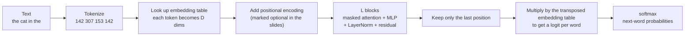

> 🌏 [中文版](/posts/learning/2026-09-29-berkeley-cs189-sp26-lectures-23-24-llm-training-ssl)

**Video status: Videos included; playback has not been rechecked individually.** [Source details](#course-video-sources)

This guide is based on the official materials of [CS189 Spring 2026](https://eecs189.org/sp26/) (Jennifer Listgarten / Alex Dimakis): Lecture 23, [LLM Training And Applications](https://drive.google.com/drive/folders/1GP3T4TwZeXV2L28LUY6a0ei6rtcnQ3TJ) (4/16, `lec23.pdf`, 63 pages, [video](https://www.youtube.com/watch?v=m13yELgj02c)); Lecture 24, [Self-Supervised Learning](https://drive.google.com/drive/folders/1BVcz-ohHf6J8mtzVHnTTDw55M7JQZmbL) (4/21, `lec24.pdf`, 77 pages, [video](https://www.youtube.com/watch?v=iGcer6b6mp8)); and [Discussion 11](https://drive.google.com/file/d/11WJr0gQUuMON1ub34DSUhSMsDl8GuM06/view) (with [solutions](https://drive.google.com/file/d/11KGelwaG_trTVtxBHPgkUFrG_BhlZE7E/view) and a [walkthrough video](https://youtube.com/playlist?list=PL-ysCubq-Sa9h8mIf8s2L-vL68rx8_hx8)). All of them open without a login, and the course rates A3 (defined in the [global AI/CS course map](/en/posts/learning/2026-08-21-global-ai-cs-course-map-en)).

These two lectures come after [Lec 21–22: Transformers](/en/posts/learning/2026-09-29-berkeley-cs189-sp26-lectures-21-22-transformers-en) and [HW4](/en/posts/learning/2026-09-29-berkeley-cs189-sp26-hw4-resnet-transformer-dnabert-en). You can already build a transformer. Here the questions are: how do you train it into something like ChatGPT? And how do you learn good representations when you have no labels? Both lectures share one core idea: **invent a fake supervised task**.

## Course video sources

These recordings correspond to the material discussed here. No unverified timestamp is supplied.

```youtube
url: https://www.youtube.com/watch?v=m13yELgj02c
title: Lecture 23 recording: LLM Training And Applications
```

```youtube
url: https://www.youtube.com/watch?v=iGcer6b6mp8
title: Lecture 24 recording: Self-Supervised Learning
```

Original videos: [Lecture 23 recording: LLM Training And Applications](https://www.youtube.com/watch?v=m13yELgj02c)、[Lecture 24 recording: Self-Supervised Learning](https://www.youtube.com/watch?v=iGcer6b6mp8)

Course and recording entries:

- [Official course and recording entry](https://eecs189.org/sp26/)

## What I read, and the limits

What I actually opened and read: the text layer of both slide PDFs, the Discussion 11 problems and solutions, and the titles of the two recordings. Many figures in the slides (architecture diagrams, generated samples, heat maps) have no text layer, so I only relay what is written on the slides. I did not watch the recordings minute by minute.

**One oddity in the assigned reading**: both the schedule page and the last page of `lec23.pdf` list Chapter 10 of Bishop's *[Deep Learning: Foundations and Concepts](https://www.bishopbook.com/)* for Lec 23. But according to Springer's table of contents, Chapter 10 is [Convolutional Networks](https://link.springer.com/chapter/10.1007/978-3-031-45468-4_10), and Transformers is [Chapter 12](https://link.springer.com/chapter/10.1007/978-3-031-45468-4_12). I list the reading as the course gives it and don't renumber it on their behalf; if you want LLM-related material, go straight to Chapter 12. The Lec 24 slides say "some content in Chapter 11," whose title is [Structured Distributions](https://link.springer.com/chapter/10.1007/978-3-031-45468-4_11). I did not read the chapter's sections, so I can't confirm which parts correspond.

## Lec 23: turning a transformer into a language model

### Classification: look only at the last token

The deck starts with a familiar task: is "Restaurant wasn't bad" a positive review? After the sentence passes through n transformer blocks, every token has a representation. To get one vector for the whole sentence, **take the last token's final representation and attach a linear classification head**. The DNABERT classification head in HW4.2 uses the same idea.

The deck also works out where GPT-3 175B's parameters live: D is about 12k, sequence length 2048, 96 blocks. Attention uses about 4D² per layer (about 600 million), and the MLP, which expands from D to 4D and back, uses about 8D² per layer (about 1.2 billion). Across 96 layers, attention totals about 58 billion and the MLP about 116 billion. The conclusion: **most of a transformer's parameters are in the MLP, not in attention**.

### Self-supervision: predicting the next word is knowledge

Supervised learning needs {x, y} pairs. The deck defines self-supervision as inventing a fake supervised task in order to learn good representations. For language, that task is predicting the next word.

The deck's example is "The capital of California is ___." To answer Sacramento, the model has to know it; the slide even lists California's earlier capitals (San Francisco in 1862, Benicia in 1853, Vallejo in 1852) to show that this is not knowledge you can guess. Predicting the next word lets a model answer questions, tell stories, and complete tasks.

### The full path of one next-token prediction

The deck breaks down "the cat in the → hat" step by step:



Generation is autoregressive: the deck continues "The best class at UC Berkeley is" with "EECS-189," then "!", and finally a stop token.

### Training: cross-entropy is MLE, and the mask prevents peeking

During training every position predicts the next token: the labels are the input shifted left by one, with a `<start>` token at the front. The loss is cross-entropy, which the deck notes is MLE.

If a position could attend to later tokens, it would simply see the answer. So a decoder-only transformer uses **masked attention**: each token can see only itself and earlier tokens. The deck expands "Can you predict the next" so that each position outputs `Pr(you | Can)`, `Pr(predict | Can you)`, and so on. This also closes the loop on Lec 21's translation example: the original paper uses an encoder to read the input and a decoder to produce the output (the deck's example is Hola, cómo estás? → Hello, how are…), while decoder-only models drop the encoder.

### Extensions of the same architecture

- **Vision-language models**: a vision encoder turns image patches into embeddings, a learned adapter maps them into the LLM's token-embedding space, and they are fed in like ordinary tokens.
- **The Llama-3 architecture**: RMSNorm, a SwiGLU FFN, grouped-query attention, and RoPE applied to Q and K. The deck specifically compares post-norm and pre-norm and concludes that pre-norm works better. Llama-3 70B Instruct's spec: hidden size 8192, 80 layers, 64 query heads, 8 KV heads. The deck notes that the actual code is "just one Python file."
- **Pretraining scale**: the deck says the Llama-3 "open-source" models were trained on 15.6T tokens with an undisclosed data mix, and the 405B model trained on 16K H100s for 39.3 million GPU hours in total.

### Post-training: GPT on its own can't chat

The deck splits ChatGPT into Chat + Generative + Pretrained + Transformer, then points out that "one thing is still missing": a model that has only been pretrained continues text; it doesn't follow instructions. Ask it "What is attorney client privilege?" and it may continue with "Provide a concise answer using an example from class.", because that looks like the next line of a homework prompt.

| Method | What the slides emphasize |
|---|---|
| SFT | Keep training on a new objective with new data (for example, chat transcripts); lower the learning rate to avoid catastrophic forgetting |
| Vicuna | The first open model "comparable to ChatGPT": LLaMA-13B fine-tuned on about 70,000 ShareGPT conversations (about 800MB); the deck credits it with kicking off open generative-AI research in academia |
| LoRA | Learn only a low-rank perturbation `W' = W + AB`; B starts at 0, so the model is unchanged before training begins. Cuts cost, reduces forgetting, and makes shared inference easy |
| Synthetic data | Use an LLM to expand a dataset, then fine-tune an LLM on it to inject behaviors and domain knowledge |
| RLHF | Train a reward model on human "A is better than B" labels, then adjust the LLM with reinforcement learning; more robust with better safety behavior, but unstable and hard to train |
| DPO | Apply the Bradley-Terry model directly and rewrite preference learning as MLE, with no separate reward model |

The DPO row deserves a pause: the deck notes that the Bradley-Terry model appeared in HW2. HW2's paper questions read Chatbot Arena, so MLE from the first half of the semester gets used once more here.

### At inference: prompting, retrieval, reasoning, tools

The last section covers ways to improve capability without changing the weights: zero-shot and in-context learning, RAG (retrieve relevant documents first and splice them into the prompt), and chain-of-thought. The deck uses the question "How many numbers from 1 to 50 have a perfect-square factor other than 1?" to show a reasoning model's long thinking: partway through it notices double counting, switches to inclusion-exclusion, checks itself, and then answers. Finally, agents: the LLM decides whether to call tools such as search, a calculator, or email, puts the tool output back into the history, and decides the next step. The deck calls this ReAct.

## Lec 24: learning representations without labels

### Why self-supervision

The deck first compares two ways of learning. Supervised learning needs a lot of collected, labeled data, which is expensive. Unsupervised learning (clustering, density estimation, dimensionality reduction) doesn't tell the model what to predict at all. The deck argues neither resembles how humans learn. Self-supervision sits in between: it uses unlabeled data and a pretext task to learn useful feature representations.

The deck's example: first train a model to predict how many degrees a cat or dog photo was rotated (you have unlimited photos and need no labels), then reuse the learned model for cat-vs-dog classification with very little labeled data.

### Transfer learning: two ways to reuse a model

The deck presents transfer learning as what self-supervision is *for*:

1. **Freeze the feature extractor and retrain only the classifier**: for a new image classification problem, keep the pretrained network's earlier layers and swap out only the final linear classifier.
2. **Fine-tune**: initialize from the pretrained weights, then train the whole network with a small learning rate.

These are cells 5f and 5g in HW4.2. The deck also lists three difficulties of self-supervision: choosing a pretext task that suits the application, the lack of a gold standard to compare learned representations against, and the lack of a single objective like test accuracy.

### Generative pretext tasks: predict part of the input

| Approach | Fake task | What the slides emphasize |
|---|---|---|
| Autoencoder | Reconstruct the input | The encoder compresses to a latent, the decoder restores it, and the loss is `‖G(F(x)) − x‖`; the narrow middle is an information bottleneck |
| Denoising autoencoder | Reconstruct the clean input from a noisy one | Noise can mean randomly zeroing parts of the input or adding Gaussian noise; the model can't just learn the identity |
| Colorization | Predict color from a grayscale image | The model has to recognize objects to color them correctly (sky is blue, clouds are white); uses an ℓ2 loss |
| Cross-channel prediction (split-brain) | Predict some channels from others | Two encoder-decoders predict each other, then combine back into the original image |
| Inpainting (context encoder) | Fill in a removed region | An ℓ2 reconstruction loss alone gives blurry results; adding a GAN loss restores detail; random-region masks beat removing the center; on PASCAL VOC semantic segmentation it beats random initialization by more than 10% |
| Super-resolution | Predict a high-resolution image from a low-resolution one | SRGAN, with a content loss that compares features |

### Discriminative pretext tasks: predict something about the input

- **Rotation**: rotate the image by one of 0°, 90°, 180°, or 270° and classify among the 4. The model has to know where the object is and what it is to guess the rotation.
- **Relative position**: given a center patch, guess which of its 8 neighbors another patch is. The deck lists tricks to stop the model from "cheating": gaps between patches, small random jitter in position, downsampling some patches and upsampling them again, and randomly dropping one or two color channels. Without these, the model solves the task with low-level cues (such as edge continuity) and learns no semantics.
- **Jigsaw puzzle**: 3×3 gives 9 pieces and in principle 9! = 362,880 orderings; the paper picks only 64 permutations with the largest pairwise Hamming distances as the classes.
- **Deep clustering**: cluster images with k-means and train on the cluster IDs as classes.

### Contrastive learning, SimCLR, and CLIP

The goal of contrastive learning: two versions of the same object (a positive pair) should score high, and different objects (negatives) should score low. Given one positive and N−1 negatives, the loss is:

```text
L = −log [ exp(s(x, x⁺)) / ( exp(s(x, x⁺)) + Σ_j exp(s(x, x_j⁻)) ) ]
```

The deck points out that this is exactly the cross-entropy of an N-way softmax classifier.

- **SimCLR**: the score is cosine similarity; an extra projection network is added and the contrast happens in the projected space; positive pairs come from data augmentation (random crops, color jitter, blur).
- **CLIP**: the data is image-caption pairs. A batch has N images and N captions; for each image this is a pick-1-of-N classification problem, and the same holds for each caption. The sum of the two cross-entropies is the CLIP loss. Training needs large image-text datasets such as LAION-2B or DataComp-12B. Once trained, you use the text encoder to turn class names into vectors and can classify MNIST, CIFAR-10, or ImageNet zero-shot.

After walking through all of this, the sentence at the start of Lec 24 makes sense: everything we did was transform the data a little, then predict something about it.

## Discussion 11: three practical transformer details

All three problems in Discussion 11 are tagged "F25 Dis11," meaning they are reused from Fall 2025. They follow Lec 22 and HW4 rather than LLM training itself:

1. **Positional encodings**: why they are needed and how relative and absolute positional encodings differ; then prove that RoPE's dot product depends only on relative position, that is, `RoPE(x, m)ᵀ RoPE(y, n) = RoPE(x, m+k)ᵀ RoPE(y, n+k)`. The problem notes that RoPE is now the default in many modern LLMs, and you can spot it on Lec 23's Llama-3 architecture diagram.
2. **Matching attention heat maps to similarity matrices**: match four 4×4 pre-softmax matrices (all equal; a very large diagonal; lower triangle with −∞ elsewhere; one finite value per row) to four heat maps; say which one is a causal mask and what kind of model uses it; then discuss how the distribution changes as the softmax temperature goes to T → 0 and T → ∞.
3. **KV cache**: without caching, how many times are the first token's K and V computed? How many key projections does the whole generation take? How many with caching? The solution's conclusion is a drop from N(N+1)/2, i.e. O(N²), to N. The last part asks why multi-turn chatbots and coding assistants especially need a KV cache.

## Back to models: where your chat model came from

Put the two lectures together: a decoder-only transformer first does next-token prediction on huge amounts of text (self-supervised pretraining), then has its behavior tuned with SFT, LoRA, RLHF, or DPO (post-training). At inference it uses a KV cache for speed, wrapped in RAG or tool calls. Contrastive models like CLIP are often used as the vision encoder in vision-language models. If you want to continue from here, the optional HW5 has you actually fine-tune an LLM.

## Going further

- Fall 2026 counterpart: Lec 19–20 LLM and Lec 25 Post-training: Fine-tuning, LoRA, PEFT, and Distillation in [CS189 Fall 2026](https://eecs189.org/fa26/). The Fall 2026 schedule has no separate self-supervised learning lecture.
- Guides to other courses on this site that cover the same topics (extensions only; they do not replace this course's content): [Stanford CME295: LLM training](/en/posts/ai/2026-09-29-cme295-llm-training-en), [Stanford CME295: preference tuning](/en/posts/ai/2026-09-29-cme295-preference-tuning-en), [CMU 11-785 Lecture 20: Large Language Models](/en/posts/ai/2026-08-22-cmu-11785-20-large-language-models-en), [CMU 11-785 Lecture 21: Representations and Autoencoders](/en/posts/ai/2026-08-22-cmu-11785-21-representations-autoencoders-en), [CMU 11-768 Lecture 8: SFT](/en/posts/ai/2026-09-29-cmu-11768-lecture-08-sft-en), [Stanford CS229 notes Chapter 16: Representation Learning](/en/posts/ai/2026-08-22-stanford-cs229-2026-notes-chapter-16-representation-learning-en).
- Series navigation: previous, [HW4 guide](/en/posts/learning/2026-09-29-berkeley-cs189-sp26-hw4-resnet-transformer-dnabert-en); next, [Lec 25–27: proteins, agents, and closing](/en/posts/learning/2026-09-29-berkeley-cs189-sp26-lectures-25-27-protein-agents-closing-en); series entry, [CS189 overview](/en/posts/learning/2026-08-22-berkeley-cs189-spring-2025-overview-en).

**Something you can do tonight**: following Lec 23's arithmetic, recompute GPT-3's attention and MLP parameter counts with D = 12288 and 96 layers, and confirm the MLP is about twice the size of attention. Then work Discussion 11, problem 3 with N = 1000 and see how many matrix multiplications the KV cache saves.

## Update Log

- 2026-10-10: Added explicit video status and checked recording sources and access notes.

## References

- [CS189 Spring 2026 home page and schedule](https://eecs189.org/sp26/)
- [CS189 Spring 2026 syllabus](https://eecs189.org/sp26/syllabus/)
- [Lecture 23 slides folder: lec23.pdf](https://drive.google.com/drive/folders/1GP3T4TwZeXV2L28LUY6a0ei6rtcnQ3TJ)
- [Lecture 23 recording: LLM Training And Applications](https://www.youtube.com/watch?v=m13yELgj02c)
- [Lecture 24 slides folder: lec24.pdf](https://drive.google.com/drive/folders/1BVcz-ohHf6J8mtzVHnTTDw55M7JQZmbL)
- [Lecture 24 recording: Self-Supervised Learning](https://www.youtube.com/watch?v=iGcer6b6mp8)
- [Discussion 11 problems](https://drive.google.com/file/d/11WJr0gQUuMON1ub34DSUhSMsDl8GuM06/view), [solutions](https://drive.google.com/file/d/11KGelwaG_trTVtxBHPgkUFrG_BhlZE7E/view), [walkthrough](https://youtube.com/playlist?list=PL-ysCubq-Sa9h8mIf8s2L-vL68rx8_hx8)
- [CS189 Spring 2026 lecture playlist](https://www.youtube.com/playlist?list=PLuHtd0SzXhx4B8oOmp9PBEroMuV5n0MWE)
- [Bishop & Bishop, Deep Learning: Foundations and Concepts](https://www.bishopbook.com/); Springer chapter pages: [Chapter 10](https://link.springer.com/chapter/10.1007/978-3-031-45468-4_10), [Chapter 11](https://link.springer.com/chapter/10.1007/978-3-031-45468-4_11), [Chapter 12](https://link.springer.com/chapter/10.1007/978-3-031-45468-4_12)
- [Rafailov et al., Direct Preference Optimization (arXiv:2305.18290)](https://arxiv.org/abs/2305.18290)
- [CS189 Fall 2026 schedule](https://eecs189.org/fa26/)
