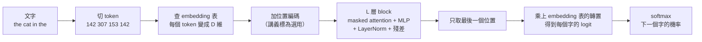

> 🌏 [English version](/en/posts/learning/2026-09-29-berkeley-cs189-sp26-lectures-23-24-llm-training-ssl-en)

**影片狀態：已附影片。** [影片來源與說明](#課程影片來源)

本文依 [CS189 Spring 2026](https://eecs189.org/sp26/)（Jennifer Listgarten／Alex Dimakis）的官方教材寫成：第 23 講 [LLM Training And Applications](https://drive.google.com/drive/folders/1GP3T4TwZeXV2L28LUY6a0ei6rtcnQ3TJ)（4/16，`lec23.pdf` 63 頁，[錄影](https://www.youtube.com/watch?v=m13yELgj02c)）、第 24 講 [Self-Supervised Learning](https://drive.google.com/drive/folders/1BVcz-ohHf6J8mtzVHnTTDw55M7JQZmbL)（4/21，`lec24.pdf` 77 頁，[錄影](https://www.youtube.com/watch?v=iGcer6b6mp8)），以及 [Discussion 11](https://drive.google.com/file/d/11WJr0gQUuMON1ub34DSUhSMsDl8GuM06/view)（附[解答](https://drive.google.com/file/d/11KGelwaG_trTVtxBHPgkUFrG_BhlZE7E/view)與 [walkthrough 影片](https://youtube.com/playlist?list=PL-ysCubq-Sa9h8mIf8s2L-vL68rx8_hx8)）。以上都能匿名打開，整門課判 A3（定義見[全球 AI／CS 課程地圖](/posts/learning/2026-08-21-global-ai-cs-course-map)）。

這兩講接在 [Lec 21–22：Transformers](/posts/learning/2026-09-29-berkeley-cs189-sp26-lectures-21-22-transformers) 和 [HW4](/posts/learning/2026-09-29-berkeley-cs189-sp26-hw4-resnet-transformer-dnabert) 之後。你已經會搭一個 transformer，這裡要回答兩個問題：怎麼把它訓練成 ChatGPT 這類的東西？沒有標籤的時候，要怎麼學到好的表徵？兩講共用一個核心想法：**自己造一個假的監督任務**。

## 課程影片來源

官方 Spring 2026 課表與官方 YouTube 播放清單（Spring 2026 Lectures，25 支）已於 2026-10-10 即時核對，本文嵌入的講課錄影都在清單中。此處不提供未核對的時間跳轉。

```youtube
url: https://www.youtube.com/watch?v=m13yELgj02c
title: Lecture 23 錄影：LLM Training And Applications
```

```youtube
url: https://www.youtube.com/watch?v=iGcer6b6mp8
title: Lecture 24 錄影：Self-Supervised Learning
```

原始影片：[Lecture 23 錄影：LLM Training And Applications](https://www.youtube.com/watch?v=m13yELgj02c)、[Lecture 24 錄影：Self-Supervised Learning](https://www.youtube.com/watch?v=iGcer6b6mp8)

課程與錄影入口：

- [官方課程與錄影入口](https://eecs189.org/sp26/)
- [CS189 Spring 2026 Lectures — official YouTube playlist (25 videos)](https://www.youtube.com/playlist?list=PLuHtd0SzXhx4B8oOmp9PBEroMuV5n0MWE)

查核日期：2026-10-10。

## 讀取範圍與限制

我實際打開並讀過的：兩份講義 PDF 的文字層、Discussion 11 題目與解答、兩支錄影的標題。講義很多圖（架構圖、生成結果、熱圖）沒有文字層，我只轉述投影片上有字的部分；錄影沒有逐分鐘看完。

**指定閱讀的一個疑點**：排程頁和 `lec23.pdf` 最後一頁都寫 Lec 23 讀 Bishop《[Deep Learning: Foundations and Concepts](https://www.bishopbook.com/)》第 10 章。但依 Springer 的目錄，第 10 章是 [Convolutional Networks](https://link.springer.com/chapter/10.1007/978-3-031-45468-4_10)，Transformers 是[第 12 章](https://link.springer.com/chapter/10.1007/978-3-031-45468-4_12)。我照官方寫法列出，不替課程改章號；想找 LLM 相關的內容，建議直接翻第 12 章。Lec 24 的講義寫「部分內容見第 11 章」，第 11 章的標題是 [Structured Distributions](https://link.springer.com/chapter/10.1007/978-3-031-45468-4_11)，我沒有讀到章內小節，無法確認哪些段落對應。

## Lec 23：把 transformer 變成語言模型

### 分類：只看最後一個 token

講義先回到一個熟悉的任務：判斷「Restaurant wasn't bad」是不是正面評論。整段話經過 n 層 transformer block 後，每個 token 都有一個表徵；要拿一個代表整段話的向量，就**用最後一個 token 的最終表徵，接一個線性分類頭**。HW4.2 的 DNABERT 分類頭用的是同一個想法。

講義也順手算了 GPT-3 175B 的參數分布：D 約 12k、序列長 2048、96 個 block。attention 每層約 4D²（約 6 億），MLP 從 D 放大到 4D 再縮回，每層約 8D²（約 12 億）。96 層加起來，attention 約 580 億、MLP 約 1160 億。結論是：**transformer 的參數大多在 MLP，不在 attention**。

### 自監督：預測下一個字就是知識

監督式學習需要 {x, y} 配對。講義把自監督定義成：為了學到好的表徵，自己造一個假的監督任務。對語言來說，這個任務就是預測下一個字。

講義的例子是「The capital of California is ___」。要答對 Sacramento，模型得知道這件事；投影片還列出加州歷史上的其他首府（1862 年的舊金山、1853 年的 Benicia、1852 年的 Vallejo），說明這份知識不是隨便猜得到的。預測下一個字，讓模型能回答問題、講故事、完成任務。

### 一次 next-token 預測的完整路徑

講義用「the cat in the → hat」一步步拆開：



生成時是自迴歸的：講義用「The best class at UC Berkeley is」接出「EECS-189」、再接「!」、最後輸出停止符號。

### 訓練：交叉熵就是 MLE，mask 防止偷看

訓練時每個位置都要預測下一個 token：標籤就是輸入往左位移一格，開頭補一個 `<start>`。損失是交叉熵，講義標注它就是 MLE。

如果某個位置能 attend 到後面的 token，它就直接看到答案了。所以 decoder-only transformer 用 **masked attention**：每個 token 只能看自己和前面的 token。講義用「Can you predict the next」展開，每一格輸出 `Pr(you | Can)`、`Pr(predict | Can you)`……這條線也回收了 Lec 21 的翻譯例子：原始論文用 encoder 讀輸入、decoder 產生輸出（講義的例子是 Hola, cómo estás? → Hello, how are…），decoder-only 模型則不用 encoder。

### 同一套架構的延伸

- **視覺語言模型**：用視覺 encoder 把影像 patch 轉成 embedding，再學一個 adapter 轉成 LLM 的 token embedding，當成一般 token 餵進去。
- **Llama-3 架構**：RMSNorm、SwiGLU 的 FFN、grouped-query attention、在 Q 和 K 上加 RoPE。講義特別比較了 post-norm 和 pre-norm，結論是 pre-norm 比較好。Llama-3 70B Instruct 的規格：hidden size 8192、80 層、64 個 query head、8 個 KV head。講義說實際程式碼「就只是一個 Python 檔」。
- **預訓練規模**：講義寫 Llama-3「開源」模型用了 15.6T token 訓練，資料組成未公開；405B 模型在 16K 張 H100 上訓練，共 3930 萬 GPU 小時。

### 後訓練：GPT 本身不會聊天

講義把 ChatGPT 拆成 Chat + Generative + Pretrained + Transformer，然後點出「還差一件事」：只做預訓練的模型會接話，不會照指令做事。問它「What is attorney client privilege?」，它可能接著寫「Provide a concise answer using an example from class.」，因為那看起來像作業題目的下一行。

| 方法 | 講義的重點 |
|---|---|
| SFT | 用新目標、新資料（例如對話紀錄）繼續訓練；學習率要調小，避免 catastrophic forgetting |
| Vicuna | 第一個「可比 ChatGPT」的開源模型：用 ShareGPT 約 7 萬段對話（約 800MB）微調 LLaMA-13B，講義說它帶動了學界的開源生成式 AI 研究 |
| LoRA | 只學一個低秩擾動 `W' = W + AB`；B 初始化為 0，所以訓練開始前模型完全不變。降低成本、減少遺忘，也方便共用推論 |
| 合成資料 | 用 LLM 擴充資料，再拿來微調 LLM，可以注入行為和領域知識 |
| RLHF | 用人類的「A 比 B 好」標註訓練獎勵模型，再用強化學習調整 LLM；更穩健、安全表現更好，但不穩定、難訓練 |
| DPO | 直接套用 Bradley-Terry 模型，把偏好學習改寫成 MLE，不需要另外訓練獎勵模型 |

DPO 那一列值得停一下：講義註明 Bradley-Terry 模型在 HW2 出現過。HW2 的論文題讀的是 Chatbot Arena，前半學期的 MLE 在這裡又用上了一次。

### 推論時：提示、檢索、推理、工具

最後一段講不改權重也能提升能力的做法：zero-shot 與 in-context learning、RAG（先檢索相關文件再拼進提示）、chain-of-thought。講義用一題「1 到 50 中有幾個數有 1 以外的完全平方因數」展示推理模型的長思考：模型中途發現重複計算、改用排容原理、自我檢查，最後給出答案。最後是 agent：LLM 決定要不要呼叫搜尋、計算機、email 這類工具，把工具輸出放回歷史，再決定下一步，講義稱之為 ReAct。

## Lec 24：沒有標籤，也能學到表徵

### 為什麼需要自監督

講義先比較兩種學法：監督式要收集、標註大量資料，成本很高；非監督式（聚類、密度估計、降維）則不告訴模型要預測什麼。講義認為兩者都不像人類的學習方式。自監督介於中間：用沒有標籤的資料，透過 pretext task 學到有用的特徵表示。

講義的例子：先訓練模型預測貓狗照片被轉了幾度（照片要多少有多少，不用標註），再把學到的模型拿去做貓狗分類，只需要很少的標註資料。

### 遷移學習：拿來用的兩種方式

講義把遷移學習當成自監督的「用途」來講：

1. **凍結特徵抽取器、只重訓分類器**：新的影像分類問題，保留預訓練網路的前面各層，只換最後的線性分類器。
2. **微調**：用預訓練權重初始化，再用小學習率訓練整個網路。

這就是 HW4.2 的 5f 和 5g。講義也列出自監督的三個難處：怎麼挑適合應用的 pretext task、學到的表徵沒有黃金標準可比、沒有像測試準確率那樣單一的目標函數。

### 生成式 pretext task：預測輸入的一部分

| 做法 | 假任務 | 講義的重點 |
|---|---|---|
| 自編碼器 | 重建輸入 | encoder 壓到 latent、decoder 還原，損失是 `‖G(F(x)) − x‖`；中間的窄口是資訊瓶頸 |
| 去噪自編碼器 | 從加了雜訊的輸入重建乾淨版本 | 雜訊可以是隨機把部分輸入設成 0，或加高斯雜訊；模型不能只學恆等函數 |
| 上色 | 從灰階圖預測顏色 | 模型得認得物體才能上對顏色（天空是藍的、雲是白的）；用 ℓ2 損失 |
| 跨通道預測（split-brain） | 從部分通道預測其他通道 | 兩個 encoder-decoder 互相預測，再合回原圖 |
| 補洞（context encoder） | 補上被挖掉的區塊 | 只用 ℓ2 重建損失會糊，加上 GAN 損失才有細節；隨機區塊的 mask 比挖中央好；在 PASCAL VOC 語意分割上比隨機初始化高 10% 以上 |
| 超解析度 | 從低解析度圖預測高解析度圖 | SRGAN，加入比較特徵的 content loss |

### 判別式 pretext task：預測關於輸入的某件事

- **旋轉**：把圖轉 0°、90°、180°、270° 之一，做 4 類分類。模型要知道物體在哪、是什麼，才猜得出轉了幾度。
- **相對位置**：以一塊 patch 為中心，猜另一塊是 8 個鄰居中的哪一個。講義特別列出防止模型「作弊」的技巧：patch 之間留空隙、位置加小抖動、部分 patch 降解析度再放大、隨機丟掉一兩個色彩通道。沒有這些，模型會靠低階線索（例如邊緣的連續性）解題，學不到語意。
- **拼圖**：3×3 共 9 塊，理論上有 9! = 362,880 種排法；論文只挑 64 種彼此 Hamming 距離最大的排列當類別。
- **深度聚類**：用 k-means 把影像分群，把群編號當類別訓練。

### 對比學習、SimCLR 與 CLIP

對比學習的目標是：同一個物體的兩個版本（正樣本對）分數要高，不同物體（負樣本）分數要低。給 1 個正樣本和 N−1 個負樣本，損失是：

```text
L = −log [ exp(s(x, x⁺)) / ( exp(s(x, x⁺)) + Σ_j exp(s(x, x_j⁻)) ) ]
```

講義指出，這就是 N 類 softmax 分類器的交叉熵。

- **SimCLR**：分數用 cosine similarity；多接一個投影網路，在投影後的空間做對比；正樣本靠資料增強產生（隨機裁切、色彩擾動、模糊）。
- **CLIP**：資料是成對的圖片和文字說明。一個 batch 有 N 張圖和 N 段文字，對每張圖來說，這是一個 N 選 1 的分類問題；對每段文字也一樣，兩邊的交叉熵加總就是 CLIP 的損失。訓練需要 LAION-2B 或 DataComp-12B 這類大型圖文資料集。訓練完之後，用文字 encoder 把類別名稱轉成向量，就能零樣本分類 MNIST、CIFAR-10 或 ImageNet。

這樣一路看下來，Lec 24 開頭那句話就講得通了：我們做的，都是把資料變換一下，再預測關於它的某件事。

## Discussion 11：transformer 的三個實務細節

Discussion 11 的三題都標著「F25 Dis11」，題目沿用 Fall 2025。它們接的是 Lec 22 和 HW4，不是 LLM 訓練本身：

1. **位置編碼**：為什麼需要位置編碼、相對與絕對位置編碼的差別；接著證明 RoPE 的內積只跟相對位置有關，也就是 `RoPE(x, m)ᵀ RoPE(y, n) = RoPE(x, m+k)ᵀ RoPE(y, n+k)`。題目說明 RoPE 已經是許多現代 LLM 的預設做法，Lec 23 的 Llama-3 架構圖上也看得到。
2. **從相似度矩陣配對注意力熱圖**：四個 4×4 的 softmax 前矩陣（全部相同、對角線特大、下三角其餘為 −∞、每列只有一個有限值）配四張熱圖；說明哪個是 causal mask、會出現在哪類模型；再討論 softmax 溫度 T → 0 與 T → ∞ 時分布怎麼變。
3. **KV cache**：不快取時，第一個 token 的 K、V 要算幾次？整段生成總共要做幾次 key 投影？快取後又是幾次？解答的結論是從 N(N+1)/2，也就是 O(N²)，降到 N。最後一小題問：為什麼多輪對話的聊天機器人和寫程式助手特別需要 KV cache。

## 連回模型：你用的那個聊天模型是怎麼來的

把兩講接起來：一個 decoder-only transformer 先在海量文字上做 next-token prediction（自監督預訓練），再用 SFT、LoRA、RLHF 或 DPO 調整行為（後訓練），推論時用 KV cache 加速，外面再包 RAG 或工具呼叫。CLIP 這類對比學習模型，則常被當成視覺語言模型的視覺 encoder。如果要從這裡繼續，HW5（選修）會帶你實際微調一個 LLM。

## 想深入

- Fall 2026 對應講次：[CS189 Fall 2026](https://eecs189.org/fa26/) 的 Lec 19–20 LLM、Lec 25 Post-training: Fine-tuning, LoRA, PEFT, and Distillation。Fall 2026 的排程上沒有獨立的自監督學習講次。
- 站內同主題的其他課導讀（只是延伸，不重複本課內容）：[Stanford CME295：LLM 訓練](/posts/ai/2026-09-29-cme295-llm-training)、[Stanford CME295：偏好微調](/posts/ai/2026-09-29-cme295-preference-tuning)、[CMU 11-785 第 20 講：大型語言模型](/posts/ai/2026-08-22-cmu-11785-20-large-language-models)、[CMU 11-785 第 21 講：表徵與自編碼器](/posts/ai/2026-08-22-cmu-11785-21-representations-autoencoders)、[CMU 11-768 第 8 講：SFT](/posts/ai/2026-09-29-cmu-11768-lecture-08-sft)、[Stanford CS229 講義第 16 章：表徵學習](/posts/ai/2026-08-22-stanford-cs229-2026-notes-chapter-16-representation-learning)。
- 系列導覽：上一篇 [HW4 導讀](/posts/learning/2026-09-29-berkeley-cs189-sp26-hw4-resnet-transformer-dnabert)；下一篇 [Lec 25–27：蛋白質、agents 與完課](/posts/learning/2026-09-29-berkeley-cs189-sp26-lectures-25-27-protein-agents-closing)；系列入口 [CS189 總覽](/posts/learning/2026-08-22-berkeley-cs189-spring-2025-overview)。

**今晚能做的事**：照 Lec 23 的算法，用 D = 12288、96 層重算一次 GPT-3 的 attention 與 MLP 參數量，確認 MLP 大約是 attention 的兩倍。接著做 Discussion 11 第 3 題，把 N = 1000 代進去，看 KV cache 省下多少次矩陣乘法。

## 更新紀錄

- 2026-10-10：標註影片狀態，核對錄影來源與取得方式。
- 2026-10-10：重查影片狀態。官方 Spring 2026 課表與 YouTube 播放清單即時核對，嵌入的講課錄影都在清單中，狀態改為已附影片。

## 參考資料

- [CS189 Spring 2026 課程首頁與排程](https://eecs189.org/sp26/)
- [CS189 Spring 2026 Syllabus](https://eecs189.org/sp26/syllabus/)
- [Lecture 23 講義資料夾：lec23.pdf](https://drive.google.com/drive/folders/1GP3T4TwZeXV2L28LUY6a0ei6rtcnQ3TJ)
- [Lecture 23 錄影：LLM Training And Applications](https://www.youtube.com/watch?v=m13yELgj02c)
- [Lecture 24 講義資料夾：lec24.pdf](https://drive.google.com/drive/folders/1BVcz-ohHf6J8mtzVHnTTDw55M7JQZmbL)
- [Lecture 24 錄影：Self-Supervised Learning](https://www.youtube.com/watch?v=iGcer6b6mp8)
- [Discussion 11 題目](https://drive.google.com/file/d/11WJr0gQUuMON1ub34DSUhSMsDl8GuM06/view)、[解答](https://drive.google.com/file/d/11KGelwaG_trTVtxBHPgkUFrG_BhlZE7E/view)、[Walkthrough](https://youtube.com/playlist?list=PL-ysCubq-Sa9h8mIf8s2L-vL68rx8_hx8)
- [CS189 Spring 2026 講課播放清單](https://www.youtube.com/playlist?list=PLuHtd0SzXhx4B8oOmp9PBEroMuV5n0MWE)
- [Bishop & Bishop, Deep Learning: Foundations and Concepts](https://www.bishopbook.com/)；Springer 章節頁：[第 10 章](https://link.springer.com/chapter/10.1007/978-3-031-45468-4_10)、[第 11 章](https://link.springer.com/chapter/10.1007/978-3-031-45468-4_11)、[第 12 章](https://link.springer.com/chapter/10.1007/978-3-031-45468-4_12)
- [Rafailov et al., Direct Preference Optimization (arXiv:2305.18290)](https://arxiv.org/abs/2305.18290)
- [CS189 Fall 2026 排程](https://eecs189.org/fa26/)
