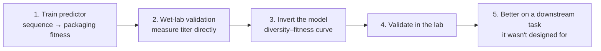

> 🌏 [中文版](/posts/learning/2026-09-29-berkeley-cs189-sp26-lectures-25-27-protein-agents-closing)

This guide is based on the official materials of [CS189 Spring 2026](https://eecs189.org/sp26/) (Jennifer Listgarten / Alex Dimakis): the Lecture 25 slides [lec25.pdf](https://drive.google.com/drive/folders/1V-V3xZCgc9ahcdZYzHEjMtC0TAo2D5uS) (4/23, [video](https://www.youtube.com/watch?v=V-SJk4AJ-xc)), the Lecture 27 slides [lec27.pdf](https://drive.google.com/file/d/1-w1R8Xki56lGIuewvwt0lukI8HNd2cgj/view) (4/30, [video](https://www.youtube.com/watch?v=yRgSQCXr8M0)), [Discussion 12](https://drive.google.com/file/d/1DWLHmY5RVWolf0KVyPDFDfpouBiwALuz/view) (with [solutions](https://drive.google.com/file/d/1iT9kueFCRKrU47y0eKiIEzMJteH4zPJD/view) and a [walkthrough video](https://www.youtube.com/playlist?list=PL-ysCubq-Sa-e6UXPAnaIlmaHf_Wv3HPX)), and the past-exam folder on the [Resources page](https://eecs189.org/sp26/resources/). The course as a whole rates A3 (defined in the [global AI/CS course map](/en/posts/learning/2026-08-21-global-ai-cs-course-map-en)), with one gap here: Lecture 26 on 4/28 was an online guest lecture, and the schedule links neither slides nor a recording.

[The previous post on Lec 23–24](/en/posts/learning/2026-09-29-berkeley-cs189-sp26-lectures-23-24-llm-training-ssl-en) turned the transformer into an LLM and finished self-supervised learning. The final three lectures introduce no new basic tools. Instead they carry the semester's material to two frontiers, protein design and agents. The topics look unrelated, but they share one question: **when you ask a model to make decisions for you, not just predictions, how do you know it can be trusted?**

The schedule lists no Bishop readings for these three lectures.

## Lec 25: AI for protein engineering

### A protein is a string of letters

The slides open with green fluorescent protein (GFP): a 238-amino-acid sequence that folds itself into a 3D structure (its discovery won the 2008 Nobel Prize in Chemistry). The applications of protein engineering are broad; the slides list antibody therapeutics, antibiotics and biofuel production, gene-therapy delivery viruses (AAV), gene editing (CRISPR/Cas9), plastic recycling (PETase), and CO₂ sequestration (RuBisCO).

The lecture covers two applications: structure prediction and protein design.

### Structure prediction: what AlphaFold2 did and did not do

The slides mark 2020 as the first time the state of the art in structure prediction was deep-learning based. AlphaFold2 is an "almost end-to-end" network whose structure module uses a rotation-equivariant attention architecture. It can still output atom positions that violate physics, so it relies on older energy-based methods to refine the coordinates.

Three observations on AlphaFold2 from the slides are worth keeping:

- DeepMind picked a long-studied, well-defined problem with clear data, clear benchmarks, and a clear way to show improvement.
- The protein structure data it used cost, by a conservative estimate, around US$20 billion to produce (Burley et al., 2023).
- It leaned heavily on years of prior work: template-based modelling, co-evolution, contact prediction, energy functions.

Did AlphaFold "solve" protein engineering? The slides say **no**. AlphaFold goes from sequence to structure, but in engineering we usually don't know which structure we need; and even if we did, we'd need structure to sequence (for which decent ML methods exist). The real bottleneck is **predicting which proteins have the function we want**, often by extrapolating to unseen regions.

### Why design is hard

The design space scales like 20^L (L is sequence length), which the slides compare with the number of atoms in the universe (about 10^80) and grains of sand on Earth (about 10^18). It is also discrete, so there are no gradients to follow, and the landscape is rugged. Past strategies fall into three groups:

| Strategy | Era noted on the slides |
|---|---|
| Computation ("data free"): physics-based energy functions like Rosetta | ~1997–2023 (marked "almost R.I.P.", with the 2024 Nobel Prize) |
| Wet lab: directed evolution, iterating directly on the property of interest | ~1993–present (2018 Nobel Prize) |
| ML-augmented: generative models, function prediction, structure prediction | ~2018–present |

The slides organize ML trends in protein engineering into five threads, and label each with what it **really is** statistically:

1. **Representation learning**: self-supervision on millions of natural proteins (e.g., with transformers), which is really density estimation of p(sequence). This is a direct application of Lec 24.
2. **Conditional generative models for sequences**: conditioned on structure (inverse folding) or on a "control tag" such as protein family, i.e., seq ~ p(seq | C).
3. **Conditional generative models for structure**: generate a backbone, then pair it with inverse folding; only as good as function prediction p(F | backbone).
4. **Estimating function from sequence**: with few or no labels (zero/few-shot), leaning on evolutionary information or large unsupervised models.
5. **Filling AlphaFold's gaps**: orphan proteins with few homologs, protein dynamics and conformational distributions, binding with other molecules.

### In design, you are the adversary

The slides use a "banana" analogy: train a predictor, then search for the sequence it scores highest, and you often get a protein that won't even fold, a piece of abstract art. The slides call this "pathology-finding" and connect it to the adversarial-examples literature: **in design, the optimizer is the adversary**, and it will find exactly where the model is least trustworthy.

The slides list four challenges Listgarten's group has worked on:

1. The tension between exploiting the model to extrapolate and knowing it is untrustworthy in large parts of protein space (related to causality).
2. The need to estimate epistemic uncertainty (what the model doesn't know), not just the aleatoric uncertainty we usually think about.
3. Which protein-appropriate inductive biases to build into neural networks.
4. Designing **distributions** rather than individual sequences.

### Three routes to conditional generation, all through Bayes' rule

The current focus is sequence generative models, which the slides point out share their technical underpinnings with natural-language models like ChatGPT. The setup: you have an unconditional generative model p(x) (the slides mention ESM3 and ProteinMPNN) and want to sample from p(x | y), where y is a property you care about (an EC number, solubility, expression), and you have labeled data or a predictor p(y | x). The slides give three statistically correct ways:

1. **Train a conditional model from scratch**, "baking in" the condition: p_θ(x | y).
2. **"Update" the unconditional model** using the predictor or data (the slides cite CbAS and DPO).
3. **"Guide" it at generation time**: freeze the unconditional model and add guidance during sampling (diffusion/flow models).

The slide title is "You are (or should be) using Bayes rule!": for any plug-and-play strategy, the only correct operation is p(x | y) ∝ p(y | x) p(x). The appeal of diffusion/score models is that they estimate a gradient with respect to x rather than the probability itself; pushing that gradient through Bayes' rule makes the nasty normalizing constant drop out, leaving the unconditional term plus a guidance term.

The catch is that sequences, graphs, and text are discrete, with no ∇ₓ. The slides list mitigations (relax into continuous space and snap back, diffusion on the multinomial simplex, continuous-time Markov processes) and present the group's work using continuous-time Markov chains (CTMCs) to enable guidance for discrete diffusion and flow models, with an experiment where ProteinGuide steers ProteinMPNN to design a TadA base editor.

### Application: library design for AAV gene-therapy vectors

The last part is a full case study. AAV is a non-pathogenic virus that shows promise for delivering gene therapies. The slides list challenges including inefficient delivery to target tissues, non-specific delivery, and pre-existing immune neutralization. The first goal is a good starting library, because a large fraction of variants fail to package and are simply wasted.

The pipeline has five steps:

The objective in step 3 is `argmax_φ E_{p_φ(x)}[f(x)] + λH[p_φ]`: high fitness and high entropy (diversity) at once. That is the concrete form of "design a distribution, not a sequence", with λ trading one against the other.

The later slides describe an ongoing protein–protein binding study (noted as not yet preprinted, in revision) that fits a statistical model to multi-round selection read counts and then analyzes epistasis (interactions between mutations). The text-extractable part of the PDF ends at the fitness-landscape geometry analysis; the remaining pages are mostly figures.

## Lec 26: online guest lecture (no public materials)

The schedule lists Lecture 26 on 4/28 as "Guest Lecture on Agents (Online, NOT In Person)", with no slide link, and the lecture playlist has no video for it. The speaker and content cannot be confirmed from public materials, so this guide doesn't guess. The Lec 27 slides list "Dimitris’ guest lecture" as one example of autonomous agents, which confirms only that it was about agents.

## Lec 27: LLMs, agents, environments

The subtitle is "How LLMs and Agents are post-trained". The lecture has three parts: what an agent is, what an environment is (using Terminal-Bench), and how agents are evaluated, trained, and optimized.

### What counts as an agent

The slides rule things out one by one:

| System | Agent? |
|---|---|
| An LLM: a box that takes tokens and produces tokens; it can't search, read documents, or send email | No |
| LLM + tools: take the text the LLM produces and run it on the command line | No |
| RAG: retrieve, build a prompt, call the LLM | No, a "hard-coded workflow" |
| A pipeline where the LLM chooses which branch to take | Still no, a workflow |
| A ReAct loop: give the LLM the state of the world, let it think, it issues a command, execute, update state, repeat | **Yes**: the LLM decides what to do and for how many steps |

How do people build agents? First one big prompt; when that gets too long, split it into roles (the slides: "multi-agent systems = multi-prompt systems"); then directed-graph frameworks like LangChain and Microsoft AutoGen. The problem is the **long horizon**: the slides say agents become unstable after 3–5 steps. At the frontier, data spend is shifting to building environments and tasks, and the successful agents are deep research and CLI agents (the slides name Claude Code and Gemini CLI).

The slides divide history into phases: LLMs as embeddings (BERT etc., 2018–2020) → assistants (ChatGPT, pre-trained then post-trained with RLHF or DPO, 2022–2024) → LLMs + tools (LangChain, AutoGen, RAG, workflows, 2024–2025) → autonomous agents (2026–). Evaluation shifts from "what does AI know?" to "what can AI do?":

| | LM evals | Agent evals |
|---|---|---|
| Data | Questions + answers | Environments |
| Compare | Inputs and outputs | Actions |
| Success criteria | Well defined | More ambiguous |
| Interaction | Single turn | Interactive, multi-turn |

### Environment = Docker + task + verifier

The main example is [Terminal-Bench](https://www.tbench.ai/): an open-source framework (Harbor) plus a set of hand-crafted, expert-level command-line tasks. An environment is a Docker container with three parts:

1. **Task description**: e.g., "my Python installation is broken and pip can't install packages";
2. **Environment**: a Dockerfile that installs Python and then deletes some files;
3. **Verifiers**: tests that check whether the task was completed.

The agent itself ("the harness, which we now call the agent", in the slides' words) is a Python program running LLM calls, memory management, and tool calls; Claude Code or Codex can run in exactly the same environment. Example tasks on the slides include installing Windows XP under QEMU, transforming a table with Pandas, and recovering rows from a corrupted SQLite database.

There is also an architecture recommendation. In their experiments, downloading a Slack workspace as folders of JSON files and letting Claude Code answer questions with grep worked better than using a Slack MCP. The reasons given: agents are superb at grep, the file system is hierarchical, and Unix commands compose well; skills are folders too, so the file system becomes the agent's long-term memory. The conclusion: **rely on the file system and CLI as much as possible and give agents some agency, rather than wiring up 100 MCP tools.**

### Improving agents with environments: SFT, RL, GEPA

Given an environment, how do you make an agent better? The slides give three routes:

- **SFT**: a teacher model solves the task and produces a trajectory; update the student's weights to raise that trajectory's probability. Like reading solved homework.
- **RL**: no teacher; the student tries, and good trajectories are made more likely, bad ones less. Like solving problems yourself. **RLVR** is the version where the answers are at the back of the book so you can check yourself; an environment full of automated tests provides that. The slides flag test coverage and robustness to reward hacking as critical research areas. **GRPO** runs the same task as a group (8 times in the slides' example) and compares within the group.
- **GEPA**: no weight updates. The student solves the task, and the trajectory and reward go to a reflection model that suggests how to change the prompt. The slides stress that it can use environments to improve agents built on **closed-weight models**.

The slides spell out the GEPA algorithm: split the training set into dev and val; keep a pool of candidate prompts, including the best one on each val item (the Pareto front); each round, pick a prompt from the Pareto front, run it on a dev minibatch collecting intermediate feedback, ask an LM to propose alternatives ("mutating" one prompt or "crossing over" two), and update the pool based on val scores; finally pick the best prompt on average. Use cases on the slides include prompt learning, inference-time search (e.g., kernel generation), agent architecture discovery, and inverting the reward to find adversarial prompts that break a model.

How complex do environments need to be? The slides cite METR's observation that the length of tasks agents can complete doubles roughly every 7 months, and extrapolate to 2029. That is an extrapolation, not a measurement.

The slides' conclusion in one line: **agents are LLMs in a loop, using tools and deciding what to do next; data is replaced by environments (Docker + task + verifier), and the key challenge is building complex, realistic ones.**

### What to study for the final

The last slide of Lec 27 recaps the whole course: optimization, MLE and MAP, K-means and GMMs, linear and logistic regression, regularization, the bias-variance tradeoff, gradient descent, neural networks, backprop, MLPs and CNNs, attention and transformers, self-supervised learning, LLMs and agents. That list is exactly the path this series took from order 3 to 17.

## Discussion 12: three closing problems

All three are marked as reused from Fall 2025 Discussion 12:

1. **SFT for vision-language models**: the vision encoder's patch embeddings are mapped into the LLM's embedding space by a projection matrix. The problem asks for the matrix shape, why both backbones are usually frozen during alignment, the trade-off between projecting only the [CLS] token and projecting all patch tokens, and why SFT on image–text pairs is still needed even when dimensions match.
2. **Self-supervised learning**: fill in a table comparing an autoencoder, a context encoder, rotation prediction, and SimCLR by input, pretext task, generative vs. discriminative, and loss; then explain what artifact a context encoder trained only on reconstruction loss produces and why adding an adversarial loss helps.
3. **Autoregressive vs. diffusion**: why both can train efficiently despite sequential inference, and how the scale of detail being generated changes as diffusion denoises from high noise to a clean image.

Problem 1 leads straight into [the LLM fine-tuning in HW5](/en/posts/learning/2026-09-29-berkeley-cs189-sp26-hw5-ssl-diffusion-finetuning-en), and problem 3 into HW5's diffusion theory.

## Final-exam practice: the Spring 2026 final is not published

The Spring 2026 final was on 5/11 (the syllabus says 11:30 AM – 2:30 PM, 40% of the CS189 grade), but the past-exam folder on the [Resources page](https://eecs189.org/sp26/resources/) only has finals through Spring 2025 and Fall 2025; there is no Spring 2026 final or solution. What you can use:

| Exam | Version | Contents | Fit |
|---|---|---|---|
| [Fall 2025 final](https://drive.google.com/file/d/1QvdWeiVY3Pj14kE8iHCVpWFoQsyITCDJ/view) + [solutions](https://drive.google.com/file/d/1DGZwafAPby1tGaAh2XbZRxrsSWWhXVYa/view) + [reference sheet](https://drive.google.com/file/d/1bHb6DFsy-H-kO3lQ31GrLlx5LO513R3f/view) | Norouzi / Gonzalez, deep-learning track | 6 questions, 84 points, 170 minutes; covers ImageNet preprocessing with logistic regression/SGD, PyTorch bug-hunting ("No Vibes Just Torch"), attention, and backprop; the reference sheet lists PyTorch optimizer and layer signatures | **Closest** to Spring 2026 |
| [Spring 2025 final](https://drive.google.com/file/d/1hzue4ogmXkCRnt0vdeLdv7Xinld6bKx-/view) + [solutions](https://drive.google.com/file/d/10T4JAwR9sUV1uy5nhxLMrhc7ZKjOCgDp/view) | Shewchuk, classic track | 150 points, 180 minutes; multiple-answer questions plus compact SVD/PCA, weighted k-means, decision trees, AdaBoost, backprop | Only k-means and backprop overlap with Spring 2026 |

Suggested use: take the Fall 2025 final under time pressure, check the solutions to find weak spots, and revisit the matching posts in this series; from Spring 2025, do only the k-means and backprop questions. For the midterm, go back to [the Lec 14 and 16 post](/en/posts/learning/2026-09-29-berkeley-cs189-sp26-lectures-14-16-mle-map-bias-variance-entropy-en) and self-grade with the Spring 2026 midterm and solutions.

## Where to go next

These directions follow the threads CS189's last lectures leave open, using guides already on this site:

- **Deeper deep learning**: Berkeley CS C182/CS282A, or the [CMU 11-785 guides](/en/posts/ai/2026-08-22-cmu-11785-20-large-language-models-en) (with dedicated posts on [diffusion](/en/posts/ai/2026-08-22-cmu-11785-23-diffusion-en) and [reinforcement learning](/en/posts/ai/2026-08-22-cmu-11785-26-reinforcement-learning-en)).
- **Agents and post-training** (following Lec 27): the [CMU 11-768 guides](/en/posts/ai/2026-09-29-cmu-11768-course-overview-en) go from [what an agent is](/en/posts/ai/2026-09-29-cmu-11768-lecture-01-what-is-an-agent-en) to [SFT](/en/posts/ai/2026-09-29-cmu-11768-lecture-08-sft-en) and [RL](/en/posts/ai/2026-09-29-cmu-11768-lecture-09-rl-basics-en); [CME295's agents post](/en/posts/ai/2026-09-29-cme295-ai-agents-en) is a good comparison.
- **LLMs themselves**: [Stanford CS224N](/en/posts/ai/2026-08-21-stanford-cs224n-nlp-deep-learning-en), [CS336](/en/posts/ai/2026-08-21-stanford-cs336-language-modeling-from-scratch-en), [CME295](/en/posts/ai/2026-09-29-stanford-cme295-transformers-llms-en).
- **Reinforcement learning**: Berkeley CS185/CS285; see the [Berkeley AI/ML course map](/en/posts/learning/2026-08-21-berkeley-ai-ml-course-map-en).

## Further reading and navigation

- Fall 2026 counterparts: [CS189 Fall 2026](https://eecs189.org/fa26/) Lec 22–23 (MDP, RL), Lec 25 (Post-training: fine-tuning, LoRA, PEFT, distillation), Lec 26 (Diffusion), and Lec 27 (Closing). Fall 2026 has no protein-engineering lecture.
- Series navigation: previous, [Lec 23–24: LLM training and self-supervised learning](/en/posts/learning/2026-09-29-berkeley-cs189-sp26-lectures-23-24-llm-training-ssl-en); next, [HW5 (optional) guide](/en/posts/learning/2026-09-29-berkeley-cs189-sp26-hw5-ssl-diffusion-finetuning-en); series entry, [CS189 overview](/en/posts/learning/2026-08-22-berkeley-cs189-spring-2025-overview-en).

**Something to do tonight**: pick a [Terminal-Bench](https://www.tbench.ai/) task category and build a mini environment with Lec 27's three parts: a one-sentence task description, a Dockerfile that breaks something, and a test script that checks whether it's fixed. Once you've written the verifier, you'll see that deciding what counts as success is much harder than getting the agent to move.

## References

- [CS189 Spring 2026 home page and schedule](https://eecs189.org/sp26/)
- [CS189 Spring 2026 syllabus](https://eecs189.org/sp26/syllabus/)
- [Lecture 25 slide folder: lec25.pdf](https://drive.google.com/drive/folders/1V-V3xZCgc9ahcdZYzHEjMtC0TAo2D5uS)
- [Lecture 25 video](https://www.youtube.com/watch?v=V-SJk4AJ-xc)
- [Lecture 27 slides: lec27.pdf](https://drive.google.com/file/d/1-w1R8Xki56lGIuewvwt0lukI8HNd2cgj/view)
- [Lecture 27 video](https://www.youtube.com/watch?v=yRgSQCXr8M0)
- [Discussion 12 worksheet](https://drive.google.com/file/d/1DWLHmY5RVWolf0KVyPDFDfpouBiwALuz/view), [solutions](https://drive.google.com/file/d/1iT9kueFCRKrU47y0eKiIEzMJteH4zPJD/view), [walkthrough](https://www.youtube.com/playlist?list=PL-ysCubq-Sa-e6UXPAnaIlmaHf_Wv3HPX)
- [CS189 Spring 2026 Resources (past exams)](https://eecs189.org/sp26/resources/)
- [CS189 Spring 2026 lecture playlist](https://www.youtube.com/playlist?list=PLuHtd0SzXhx4B8oOmp9PBEroMuV5n0MWE)
- [Terminal-Bench](https://www.tbench.ai/)
- [GEPA (GitHub)](https://github.com/gepa-ai/gepa)
- [CS189 Fall 2026 schedule](https://eecs189.org/fa26/)
