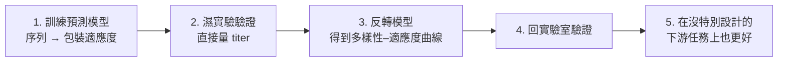

> 🌏 [English version](/en/posts/learning/2026-09-29-berkeley-cs189-sp26-lectures-25-27-protein-agents-closing-en)

本文依 [CS189 Spring 2026](https://eecs189.org/sp26/)（Jennifer Listgarten／Alex Dimakis）的官方教材寫成：第 25 講的 [lec25.pdf](https://drive.google.com/drive/folders/1V-V3xZCgc9ahcdZYzHEjMtC0TAo2D5uS)（4/23，[錄影](https://www.youtube.com/watch?v=V-SJk4AJ-xc)）、第 27 講的 [lec27.pdf](https://drive.google.com/file/d/1-w1R8Xki56lGIuewvwt0lukI8HNd2cgj/view)（4/30，[錄影](https://www.youtube.com/watch?v=yRgSQCXr8M0)）、[Discussion 12](https://drive.google.com/file/d/1DWLHmY5RVWolf0KVyPDFDfpouBiwALuz/view)（附[解答](https://drive.google.com/file/d/1iT9kueFCRKrU47y0eKiIEzMJteH4zPJD/view)與 [walkthrough 影片](https://www.youtube.com/playlist?list=PL-ysCubq-Sa-e6UXPAnaIlmaHf_Wv3HPX)），以及 [Resources 頁](https://eecs189.org/sp26/resources/)的考古題資料夾。整門課判 A3（定義見[全球 AI／CS 課程地圖](/posts/learning/2026-08-21-global-ai-cs-course-map)），但這三講有一個缺口：4/28 的第 26 講是線上 guest lecture，排程頁上沒有講義也沒有錄影。

[上一篇 Lec 23–24](/posts/learning/2026-09-29-berkeley-cs189-sp26-lectures-23-24-llm-training-ssl) 把 transformer 接成 LLM，也把自監督學習講完。最後三講不再引入新的基本工具，而是把整學期的東西拿到兩個前線去用：蛋白質設計，以及 agent。兩講的主題看起來不相干，卻有同一個問題：**當你要模型替你做決定，而不只是預測時，要怎麼知道它可信？**

這三講排程頁都沒有列 Bishop 指定閱讀。

## Lec 25：蛋白質工程的 AI

### 蛋白質是一串字母

講義從一個具體例子開場：綠色螢光蛋白（GFP）是一條 238 個胺基酸的序列，自己會摺成立體結構（這項發現拿了 2008 年諾貝爾化學獎）。蛋白質工程的應用很廣，講義列了抗體藥物、抗生素與生質燃料生產、基因治療的病毒載體（AAV）、基因編輯（CRISPR/Cas9）、塑膠回收（PETase）與固碳（RuBisCO）。

整講分兩個應用：結構預測與蛋白質設計。

### 結構預測：AlphaFold2 做到了什麼，沒做到什麼

講義說 2020 年是結構預測的最先進方法第一次改由深度學習主導。AlphaFold2 是「幾乎端到端」的網路，結構模組用了旋轉等變（rotation equivariant）的注意力架構；但它可能輸出違反物理的原子位置，所以最後還是靠傳統的能量函數方法修正座標。

講義對 AlphaFold2 的評論值得記下來：

- DeepMind 挑的是一個長期存在、定義清楚、資料明確、有清楚 benchmark 的問題；
- 它用到的蛋白質結構資料，保守估計花了約 200 億美元才累積出來（Burley et al., 2023）；
- 它大量建立在多年的前人研究上：template-based modelling、共演化、contact prediction、能量函數。

那 AlphaFold 有沒有「解決」蛋白質工程？講義的回答是**沒有**。AlphaFold 做的是序列→結構，但工程上我們通常不知道需要哪個結構；就算知道，要的也是結構→序列（這部分已有不錯的 ML 方法）。真正的瓶頸是**預測哪些蛋白質具有我們要的功能**，而且往往要外推到沒見過的區域。

### 設計為什麼難

設計空間大概是 20^L（L 是序列長度），講義拿它跟宇宙原子數（約 10^80）、地球沙粒數（約 10^18）比。這個空間還是離散的，沒有梯度可以沿著走，地形又很崎嶇。過去的做法有三條：

| 做法 | 講義標注的年代 |
|---|---|
| 計算（不靠資料）：Rosetta 這類物理能量函數 | 約 1997–2023（講義寫「almost R.I.P.」，並標 2024 諾貝爾獎） |
| 濕實驗：directed evolution，一輪一輪直接演化出要的性質 | 約 1993 至今（2018 諾貝爾獎） |
| 機器學習輔助：生成模型、功能預測、結構預測 | 約 2018 至今 |

講義把 ML 在蛋白質上的趨勢整理成五條，而且每一條都標出它在統計上**其實是什麼**：

1. **表徵學習**：在數百萬條天然蛋白質上做自監督（例如 transformer），本質是密度估計 p(sequence)。這正是 Lec 24 自監督學習的直接應用。
2. **序列的條件生成**：以結構為條件（inverse folding），或以「控制標籤」（例如蛋白質家族）為條件，本質是 seq ~ p(seq | C)。
3. **結構的條件生成**：生成骨架再配 inverse folding 得到序列，好壞取決於功能預測 p(F | backbone)。
4. **從序列估計功能**：標註資料很少甚至沒有（zero-shot／few-shot），要靠演化資訊或大型無監督模型。
5. **補 AlphaFold 的洞**：沒有同源序列的孤兒蛋白、蛋白質動態與構形分布、蛋白質與其他分子的結合。

### 在設計裡，你就是對手

講義用「香蕉」比喻：你訓練了一個預測器，然後去找讓預測分數最高的序列，結果往往得到一條根本摺不起來的蛋白質，像一幅抽象畫。講義把這叫「pathology-finding」，並接上對抗樣本的文獻：**在設計問題裡，最佳化的人自己就是對手**，會專門找到模型最不可信的地方。

講義列出 Listgarten 團隊處理過的四個挑戰：

1. 想利用模型外推，又知道模型在蛋白質空間的很多區域不可信（和因果有關）；
2. 需要估計 epistemic uncertainty（模型不知道），而不只是平常想到的 aleatoric uncertainty（資料本身的雜訊）；
3. 神經網路要用什麼適合蛋白質的 inductive bias；
4. 設計一個**分布**，而不是單一條序列。

### 條件生成的三條路，都回到 Bayes rule

現在的重心是序列生成模型，講義特別指出它和 ChatGPT 這類自然語言生成模型有相同的技術底子。問題是：你有一個無條件的生成模型 p(x)（講義舉 ESM3、ProteinMPNN），想要從 p(x | y) 取樣，y 是你在意的性質（例如 EC 編號、溶解度、表現量），手上有標註資料或一個預測器 p(y | x)。講義說統計上正確的做法有三種：

1. **從頭訓練條件模型**，直接把條件「烤進去」：p_θ(x | y)。
2. **拿無條件模型來「更新」**，用預測器或資料去調它（講義引 CbAS 與 DPO）。
3. **生成時才「引導」**：凍結無條件模型，在取樣時加 guidance（diffusion／flow 模型）。

講義的標題是「You are (or should be) using Bayes rule!」：任何即插即用的做法，唯一正確的運算就是 p(x | y) ∝ p(y | x) p(x)。diffusion／score 模型漂亮的地方在於它估的是機率對 x 的梯度，而不是機率本身；把梯度推過 Bayes rule，討厭的正規化常數就消掉了，無條件模型那一項加上「引導」項即可。

麻煩在於序列、圖、文字是離散的，沒有 ∇ₓ。講義列了幾種緩解方式（放到連續空間再取回、在多項分布上做 diffusion、連續時間馬可夫過程），並介紹 Listgarten 團隊的工作：用連續時間馬可夫鏈（CTMC）讓離散的 diffusion 和 flow 模型也能做 guidance，並展示 ProteinGuide 引導 ProteinMPNN 設計 TadA base editor 的實驗。

### 應用：AAV 基因治療載體的資料庫設計

最後一段是完整的實例。AAV 是一種不致病的病毒，有機會用來遞送基因治療。講義列出的挑戰包括遞送到目標組織效率低、不夠專一、既有免疫會中和它。第一個目標是設計一個好的起始資料庫，因為很大比例的變體根本無法包裝成病毒，直接浪費掉。

流程是五步：

第三步的目標函數是 `argmax_φ E_{p_φ(x)}[f(x)] + λH[p_φ]`：同時要高適應度和高熵（多樣性）。這就是前面「設計分布而不是單一序列」的具體形式，λ 控制兩者的取捨。

講義後段還有一個進行中的蛋白質–蛋白質結合研究（註明尚無預印本、審稿中），用多輪篩選的讀數資料訓練統計模型，再分析 epistasis（突變之間的交互作用）。PDF 可抽出文字的部分到適應度地形的幾何分析為止，之後的頁面以圖為主。

## Lec 26：線上 guest lecture（無公開教材）

排程頁上 4/28 的第 26 講標題是「Guest Lecture on Agents（Online, NOT In Person）」，沒有講義連結，播放清單也沒有這一講。講者和內容無法從公開教材確認，本文不推測。第 27 講的投影片在「自主 agent」那一頁把「Dimitris’ guest lecture」列為例子之一，只能確定它和 agent 有關。

## Lec 27：LLMs、Agents、Environments

副標是「How LLMs and Agents are post-trained」。講義分三段：什麼是 agent、什麼是環境（以 Terminal-Bench 為例）、agent 怎麼評估、訓練與最佳化。

### 什麼才算 agent

講義一步一步排除：

| 系統 | 算不算 agent |
|---|---|
| LLM：吃 token、吐 token 的盒子，本身不能搜尋、讀文件、寄信 | 不算 |
| LLM + 工具：把 LLM 輸出的文字拿去命令列執行 | 不算 |
| RAG：先檢索、組 prompt、再呼叫 LLM | 不算，是「寫死的 workflow」 |
| 由 LLM 決定走哪條分支的流程 | 仍不算，叫 workflow |
| ReAct 迴圈：把世界狀態給 LLM、讓它想、它下指令、執行、更新狀態，重複 | **算**：LLM 有權決定做什麼、做幾步 |

大家怎麼做 agent？一開始寫一個大 prompt；太長就拆成多個角色（講義的說法是「multi-agent system = multi-prompt system」）；再來是 LangChain、Microsoft AutoGen 這類有向圖框架。問題是 **long horizon**：講義說 agent 走 3–5 步之後就變得不穩定。前線的變化則是：資料預算轉向大量打造環境與任務，而成功的 agent 是 deep research 與 CLI agent（講義舉 Claude Code、Gemini CLI）。

講義把歷史分成幾期：LLM 當 embedding（BERT 等，2018–2020）→ 當助理（ChatGPT，預訓練後用 RLHF 或 DPO 後訓練，2022–2024）→ LLM + 工具（LangChain、AutoGen、RAG、workflow，2024–2025）→ 自主 agent（2026–）。評估的重點也從「AI 知道什麼」轉到「AI 能做什麼」：

| | LM 評估 | Agent 評估 |
|---|---|---|
| 資料 | 題目 + 答案 | 環境 |
| 比對 | 輸入與輸出 | 行動 |
| 成功標準 | 定義清楚 | 比較模糊 |
| 互動 | 單輪 | 多輪 |

### 環境 = Docker + 任務 + verifier

講義以 [Terminal-Bench](https://www.tbench.ai/) 為主例：一個開源框架（Harbor），加上一組專家手寫的命令列任務。一個環境就是一個 Docker 容器，裡面有三樣東西：

1. **任務描述**：例如「我的 Python 壞了，pip 裝不了套件」；
2. **環境**：一份 Dockerfile，裝好 Python 再刪掉一些檔案；
3. **verifier**：檢查任務是否完成的測試。

agent 本身（講義說「harness，現在我們叫它 agent」）是一支跑 LLM 呼叫、記憶管理、工具呼叫的 Python 程式；Claude Code 或 Codex 也能放進同一個環境跑。講義列的任務例子包括用 QEMU 裝 Windows XP、用 Pandas 轉換資料表、救回損毀的 SQLite 資料庫。

講義還有一段架構建議：在他們的實驗裡，把 Slack 工作區下載成一個個 JSON 檔、讓 Claude Code 用 grep 找答案，比接 Slack MCP 好。理由是 agent 用 grep 的能力很強，而檔案系統是階層式的、Unix 指令又能組合；skills 也是資料夾，檔案系統就成了 agent 的長期記憶。結論是：**盡量依賴檔案系統和 CLI，給 agent 一些自主權，而不是接 100 個 MCP 工具。**

### 用環境改進 agent：SFT、RL、GEPA

有了環境，怎麼讓 agent 變強？講義給三條路：

- **SFT**：請老師模型解題，產生一條軌跡，更新學生的權重，提高這條軌跡的機率。像讀已經解好的習題。
- **RL**：沒有老師，讓學生自己試，好軌跡的機率調高、壞軌跡調低。像自己做題。**RLVR** 是答案印在書末、可以自己對答案的版本；環境裡放大量自動測試就能做到。講義點出研究重點是測試覆蓋率，以及防 reward hacking。**GRPO** 則是同一題跑一組（講義例子是 8 次），在組內比較好壞。
- **GEPA**：不動權重。學生解題，把軌跡和獎勵交給一個反思模型，由它建議怎麼改 prompt。講義強調它能用環境資料改進**閉源模型**的 agent。

GEPA 的演算法講義有寫出來：把訓練集切成 dev 與 val；維護一池候選 prompt（包含在每個驗證題上最好的那個，也就是 Pareto front）；每輪從 Pareto front 選一個 prompt，在 dev 的小批次上跑並收集中間回饋，請 LM 提出改寫（可以「突變」一個 prompt 或「交配」兩個），再依 val 分數更新池子；最後選平均最好的。講義的用途例子包括 prompt 學習、推論時搜尋（例如 kernel 生成）、搜尋 agent 架構，以及把獎勵反過來、找出會讓模型答錯的對抗 prompt。

需要多複雜的環境？講義引用 METR 的觀察：agent 能完成的任務時長大約每 7 個月翻倍，並依此外推到 2029 年。這是外推，不是量測，讀的時候要記得。

講義的結論一句話：**agent 是在迴圈裡用工具、自己決定下一步的 LLM；資料被環境（Docker + 任務 + verifier）取代，關鍵挑戰是造出複雜而真實的環境。**

### 期末要讀什麼

Lec 27 最後一頁列了整門課的複習清單：最佳化、MLE 與 MAP、K-means 與 GMM、線性與 logistic 回歸、正則化、bias-variance、梯度下降、神經網路、反向傳播、MLP 與 CNN、attention 與 transformer、自監督學習、LLM 與 agent。這張清單剛好就是本系列 order 3 到 17 的路線。

## Discussion 12：三題收尾

三題都標注沿用 Fall 2025 Discussion 12：

1. **視覺語言模型的 SFT**：vision encoder 輸出的 patch embedding 要透過一個投影矩陣接到 LLM 的 embedding 空間。題目問投影矩陣的形狀、為什麼對齊階段通常凍結兩個 backbone、只投影 [CLS] 和投影全部 patch token 的取捨，以及為什麼維度一樣還是需要圖文配對資料做 SFT。
2. **自監督學習**：填一張表，比較 autoencoder、context encoder、旋轉預測、SimCLR 的輸入、pretext task、生成式或判別式、損失函數；再問 context encoder 只用重建損失會出現什麼瑕疵、為什麼加上對抗損失有幫助。
3. **自迴歸 vs diffusion**：兩者推論時都要一步步算，為什麼訓練還能有效率；以及 diffusion 去噪時，從高雜訊到乾淨影像，生成的細節尺度怎麼變化。

第 1 題直接接 [HW5 的 LLM 微調](/posts/learning/2026-09-29-berkeley-cs189-sp26-hw5-ssl-diffusion-finetuning)，第 3 題接 HW5 的 diffusion 理論。

## 期末自評：Spring 2026 的期末沒有公開

Spring 2026 的期末考在 5/11（syllabus 寫 11:30 AM – 2:30 PM，占 CS189 成績 40%），但 [Resources 頁](https://eecs189.org/sp26/resources/)的考古題資料夾裡，期末只到 Spring 2025 和 Fall 2025，沒有 Spring 2026 的題目或解答。能用的是：

| 考卷 | 版本 | 內容 | 適合度 |
|---|---|---|---|
| [Fall 2025 期末](https://drive.google.com/file/d/1QvdWeiVY3Pj14kE8iHCVpWFoQsyITCDJ/view)＋[解答](https://drive.google.com/file/d/1DGZwafAPby1tGaAh2XbZRxrsSWWhXVYa/view)＋[參考表](https://drive.google.com/file/d/1bHb6DFsy-H-kO3lQ31GrLlx5LO513R3f/view) | Norouzi／Gonzalez 的深度學習路線 | 6 題 84 分、170 分鐘；題目包括 ImageNet 前處理與 logistic/SGD、PyTorch 找 bug（「No Vibes Just Torch」）、attention、反向傳播；參考表列 PyTorch optimizer 與層的簽名 | **最接近** Spring 2026 的內容 |
| [Spring 2025 期末](https://drive.google.com/file/d/1hzue4ogmXkCRnt0vdeLdv7Xinld6bKx-/view)＋[解答](https://drive.google.com/file/d/10T4JAwR9sUV1uy5nhxLMrhc7ZKjOCgDp/view) | Shewchuk 的經典路線 | 150 分、180 分鐘；多選題之外有 compact SVD／PCA、weighted k-means、決策樹、AdaBoost、反向傳播 | 只有 k-means 與反向傳播和 Spring 2026 重疊 |

建議用法：先限時做 Fall 2025 期末，對解答找出弱項，回頭重看對應的系列文；Spring 2025 期末只挑 k-means 與反向傳播兩題。期中部分可以回到 [Lec 14、16 那篇](/posts/learning/2026-09-29-berkeley-cs189-sp26-lectures-14-16-mle-map-bias-variance-entropy)，用 Spring 2026 期中考與解答自評。

## 下一門課往哪走

以下是站內整理過的方向，選擇依據是 CS189 最後幾講留下的線頭：

- **深度學習再深一層**：Berkeley CS C182／CS282A，或站內的 [CMU 11-785 導讀](/posts/ai/2026-08-22-cmu-11785-20-large-language-models)（LLM、[diffusion](/posts/ai/2026-08-22-cmu-11785-23-diffusion)、[強化學習](/posts/ai/2026-08-22-cmu-11785-26-reinforcement-learning)各有專篇）。
- **agent 與後訓練**（接 Lec 27）：[CMU 11-768 導讀](/posts/ai/2026-09-29-cmu-11768-course-overview)從 [agent 的定義](/posts/ai/2026-09-29-cmu-11768-lecture-01-what-is-an-agent)一路講到 [SFT](/posts/ai/2026-09-29-cmu-11768-lecture-08-sft) 與 [RL](/posts/ai/2026-09-29-cmu-11768-lecture-09-rl-basics)；[CME295 的 agent 篇](/posts/ai/2026-09-29-cme295-ai-agents)也可以對照。
- **LLM 本身**：[Stanford CS224N](/posts/ai/2026-08-21-stanford-cs224n-nlp-deep-learning)、[CS336](/posts/ai/2026-08-21-stanford-cs336-language-modeling-from-scratch)、[CME295](/posts/ai/2026-09-29-stanford-cme295-transformers-llms)。
- **強化學習**：Berkeley CS185／CS285，說明見 [Berkeley AI／ML 課程地圖](/posts/learning/2026-08-21-berkeley-ai-ml-course-map)。

## 延伸與導覽

- Fall 2026 對應講次：[CS189 Fall 2026](https://eecs189.org/fa26/) 的 Lec 22–23（MDP、RL）、Lec 25（Post-training：fine-tuning、LoRA、PEFT、distillation）、Lec 26（Diffusion）與 Lec 27（Closing）。Fall 2026 沒有蛋白質工程那一講。
- 系列導覽：上一篇 [Lec 23–24：LLM 訓練與自監督學習](/posts/learning/2026-09-29-berkeley-cs189-sp26-lectures-23-24-llm-training-ssl)；下一篇 [HW5（選修）導讀](/posts/learning/2026-09-29-berkeley-cs189-sp26-hw5-ssl-diffusion-finetuning)；系列入口 [CS189 總覽](/posts/learning/2026-08-22-berkeley-cs189-spring-2025-overview)。

**今晚能做的事**：挑一個 [Terminal-Bench](https://www.tbench.ai/) 的任務類型，照 Lec 27 的三件套自己寫一個迷你環境：一句任務描述、一份會把東西弄壞的 Dockerfile、一支檢查是否修好的測試腳本。寫完 verifier 你就會發現，「怎麼判定成功」比「怎麼讓 agent 動起來」難得多。

## 參考資料

- [CS189 Spring 2026 課程首頁與排程](https://eecs189.org/sp26/)
- [CS189 Spring 2026 Syllabus](https://eecs189.org/sp26/syllabus/)
- [Lecture 25 講義資料夾：lec25.pdf](https://drive.google.com/drive/folders/1V-V3xZCgc9ahcdZYzHEjMtC0TAo2D5uS)
- [Lecture 25 錄影](https://www.youtube.com/watch?v=V-SJk4AJ-xc)
- [Lecture 27 講義：lec27.pdf](https://drive.google.com/file/d/1-w1R8Xki56lGIuewvwt0lukI8HNd2cgj/view)
- [Lecture 27 錄影](https://www.youtube.com/watch?v=yRgSQCXr8M0)
- [Discussion 12 題目](https://drive.google.com/file/d/1DWLHmY5RVWolf0KVyPDFDfpouBiwALuz/view)、[解答](https://drive.google.com/file/d/1iT9kueFCRKrU47y0eKiIEzMJteH4zPJD/view)、[Walkthrough](https://www.youtube.com/playlist?list=PL-ysCubq-Sa-e6UXPAnaIlmaHf_Wv3HPX)
- [CS189 Spring 2026 Resources（考古題資料夾）](https://eecs189.org/sp26/resources/)
- [CS189 Spring 2026 講課播放清單](https://www.youtube.com/playlist?list=PLuHtd0SzXhx4B8oOmp9PBEroMuV5n0MWE)
- [Terminal-Bench](https://www.tbench.ai/)
- [GEPA（GitHub）](https://github.com/gepa-ai/gepa)
- [CS189 Fall 2026 排程](https://eecs189.org/fa26/)
