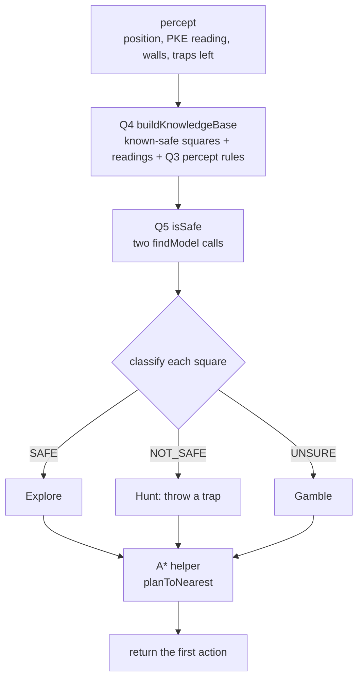

> 🌏 [中文版](/posts/learning/2026-09-29-cmu-07380-hw1-logic-hybrid-wumpus)

HW1 in [CMU 07-380](https://www.cs.cmu.edu/~07380/) was due 9/3 and has two parts: online questions on Gradescope and a programming assignment, [Logic and the Hybrid Wumpus Agent](https://www.cs.cmu.edu/~07380/assignments/logic_plan/). This post covers only the programming part: what it asks for, which idea from [Lecture 2](/en/posts/learning/2026-09-29-cmu-07380-lecture-02-logical-agents-en) each question needs, and how to run the autograder on your own machine.

Two things up front:

- **No solutions.** The course Policies forbid sharing code, pseudocode or text from submissions, and forbid using generative AI to produce any part of one. This post covers structure and concepts only.
- **The online questions are not visible.** HW1's Online link goes to the Gradescope course page, which needs a CMU account. I have not seen those questions and will not guess.

Everything below follows the assignment page as fetched on 2026-09-29.

## Course video sources

This article follows official notes, slides, or assignments. This check of the official public pages did not verify a public recording for the material covered here; it does not establish that no recording exists.

Course and recording entries:

- [cmu-07-380 — official course materials and recording index](https://www.cs.cmu.edu/~07380/)

## Official materials and what I read

- Assignment page: [assignments/logic_plan/](https://www.cs.cmu.edu/~07380/assignments/logic_plan/)
- Code: [logic_plan.zip](https://www.cs.cmu.edu/~07380/assignments/logic_plan/logic_plan.zip) (a HEAD request on 2026-09-29 returned 200)
- Due date: 9/3 Thu 11:59 pm per the Assignments table, already past

Openness: the write-up, starter code and local autograder are public, so you can redo the whole programming assignment from outside CMU. The Gradescope online questions and official grading are CMU-only.

## What the assignment is about

The page opens with a haiku: "Logic and searching. Unseen ghosts will soon be trapped. Spock would be so proud."

The setting is a Wumpus World take on Pacman. Pacman cannot see the ghosts, and stepping onto a live ghost loses the game. It has two tools:

- **A PKE meter**: reads True when a live ghost is in one of the four adjacent squares, without saying which one.
- **Traps**: `TrapNorth`, `TrapSouth`, `TrapEast` and `TrapWest` throw a trap into an adjacent square. A ghost there is caught; an empty square wastes the trap. By default there is one trap per ghost.

Ghosts never move. Trapping every ghost wins, and food along the way scores points. The page says this is exactly the hybrid-agent setting of AIMA 7.7, "Agents Based on Propositional Logic": turn the percept history into a propositional KB, ask a SAT solver what it entails, and use ordinary search to plan a route through squares proven safe.



## Setup

The assignment uses `python3.12`. The SAT solver is [pycosat](https://pypi.python.org/pypi/pycosat), a Python wrapper around [picoSAT](http://fmv.jku.at/picosat/), which you install separately:

```bash
python3.12 -m pip install pycosat
python3.12 pycosat_test.py   # should print [1, -2, -3, -4, 5]
```

If the install fails, the page suggests reinstalling with `--user --upgrade setuptools`. On Windows, an error asking for Microsoft Visual C++ 14.0 means you need the VS 2022 C++ build tools first.

Playing a game yourself is the fastest way to learn the rules:

```bash
python3.12 wumpus.py                    # random board, four ghosts
python3.12 wumpus.py -l wumpusClassic   # fixed board; PKE readings alone can prove every ghost's location
```

Move with `w a s d`, toggle trap mode with `t`, and reveal hidden ghosts and food with `v`. The page warns that random boards are not guaranteed winnable without luck, while `wumpusClassic`, `wumpusTiny` and `wumpusHunt7` never require a guess.

## Files you edit

| File | Questions | Contents |
|---|---|---|
| `logicPlan.py` | Q1–Q5 | Logic sentences, the KB, safety inference |
| `hybridAgents.py` | Q6–Q7 | Exploration agent and hybrid agent |

Worth reading: `logic.py` (propositional logic utilities adapted from aima-python), `wumpus.py` (game rules and `GameState.getPercept`), `searchUtil.py` (A\* over safe squares), and the `Grid` class in `game.py`.

Note that the A\* part is **provided**: `searchUtil.py` implements A\*, and the `planToNearest` helper in `hybridAgents.py` calls it. Your job is the logical inference and the decision logic that connects inference results to planning, not rewriting A\*. For how A\* itself works, see the [07-280 Lecture 2 guide](/posts/ai/2026-08-22-cmu-07280-lecture-02-heuristic-search-en).

## The seven questions

| Q | Points | Task | Concept it needs |
|---|---:|---|---|
| Q1 Logic Warm-up | 4 | Build three given sentences with `Expr`; implement `findModel` by calling `to_cnf` and then `pycoSAT` | Propositional syntax, CNF |
| Q2 Logic Workout | 4 | `atLeastOne`, `atMostOne`, `exactlyOne`; output must be CNF, and `to_cnf` is off-limits | Hand-written CNF, blowup |
| Q3 The Percept Rule | 6 | `pkeRule`: the PKE reading is True exactly when some non-wall neighbor has a ghost | Biconditionals, percepts as rules |
| Q4 Build the KB | 8 | `buildKnowledgeBase`: known-safe squares, the readings, and a percept rule for each reading | Assert only what is known |
| Q5 Is This Square Safe? | 10 | `isSafe` returns `SAFE`, `NOT_SAFE` or `UNSURE` | Entailment ⇔ negation is unsatisfiable |
| Q6 Safe Exploration Agent | 8 | Each turn: record the percept, classify every square, move toward the nearest unvisited safe square | Feeding inference into planning |
| Q7 Hybrid Wumpus Agent | 10 | Three tiers: Explore → Hunt → Gamble | Deciding under uncertainty |

Total: 50 points.

### Q1–Q2: getting used to `Expr` and CNF

`Expr` builds sentences with Python operators: `~` is NOT, `&` is AND, `|` is OR, `>>` is implication, `%` is the biconditional. The page stresses two things:

- `A & B & C` becomes the lopsided `((A & B) & C)`. The Q1 autograder requires `logic.conjoin` and `logic.disjoin`.
- Symbol names must start with a capital letter, and `Expr('A & B')` is a single symbol named "A & B," not an AND of two symbols.

Q2 sets up a trap for later. The page says `to_cnf` can produce exponentially large sentences on worst-case inputs, and that a non-CNF version of one of these three functions is exactly such a case. This echoes the PR1 notes: the distribution step of CNF conversion can blow a sentence up exponentially in the worst case.

### Q3–Q5: building Lec2's entailment

The page gives the shape of the Q3 rule directly:

```text
PKE[x, y] ⇔ ⋁ G[nx, ny]   (over all non-wall neighbors)
```

The task is to turn that into code. The catch is that squares inside walls must not appear in the rule.

Q4 is about **asserting only what Pacman actually knows**. The autograder evaluates the KB only over the symbols it is allowed to mention, so extra facts fail the tests.

Q5 is the bridge from Lec2: `KB ⊨ α` if and only if `KB ∧ ¬α` is unsatisfiable. The page says two `findModel` calls are enough to separate the three answers, and suggests working out on paper which two sentences to check before coding. It is the same exercise as [Recitation 1](https://www.cs.cmu.edu/~07380/recitations/Recitation1_07380_f26.pdf) part 3, which classifies Wumpus squares with a black-box SAT solver. Do the recitation first and this question goes much more smoothly.

The Q5 tests build from trivial to subtle: a known-safe square, a square nothing is known about, a square cleared by a False reading, a ghost pinned down by a True reading in a corridor, a True reading with two possible culprits, and finally several readings that together pin a ghost to one square. The page advises not moving on until the previous test passes.

### Q6–Q7: turning inference into action

The Q6 agent gets a percept dict, not a game state, with exactly four entries: `pacman`, `pkeReading`, `walls` and `traps`. Everything it knows must come from the percepts it has stored. It replans from scratch every turn, because a new reading can change which squares are provably safe.

This agent never uses traps, so it can only win on boards with no ghosts, by eating all the food. That is exactly what the autograder tests it on.

The Q7 hybrid agent tries three tiers in order and uses the first one that yields a plan:

1. **Explore:** head for the nearest unvisited SAFE square.
2. **Hunt:** if a trap is available and some square is proven NOT_SAFE, plan a route there and replace the final step with the matching Trap action. A trap thrown at a proven ghost is never wasted.
3. **Gamble:** head for the nearest UNSURE square, and if a trap is left, throw it just before stepping in.

The page points out one subtlety. Once a trap fires, the target square is safe no matter what; but earlier True readings next to it may have come from the ghost just captured, and keeping them would make the KB contradict itself. The provided `recordTrap` handles this, and your only job is to call it before returning a trap action. The page calls understanding why stale readings must be forgotten the best logic exercise in the project.

## Running the autograder

```bash
python3.12 autograder.py                 # everything
python3.12 autograder.py -q q3           # one question
python3.12 autograder.py -t test_cases/q1/correctSentence1   # one test
python3.12 wumpus.py -p HybridAgent -l wumpusTiny            # watch your agent play
```

The Q6 and Q7 test files contain their own board layouts, so `cat` shows you exactly what each test plays on. With `-q` or `-t` the games are shown graphically; add `--no-graphics` to turn that off.

The local autograder does not record grades. Official submission means uploading `logicPlan.py` and `hybridAgents.py` to Gradescope, which only enrolled students can do. The page also says the correctness of your implementation, not the autograder's verdict, is the final judge.

## What you can and cannot do off campus

| Item | Off campus |
|---|---|
| Read the write-up, download the starter, run the local autograder | Yes |
| Watch your agent with `wumpus.py` | Yes |
| Gradescope online questions | Not visible |
| Official Gradescope grading | No |
| Official solutions | Not published |

## Things to do tonight

1. Download `logic_plan.zip`, install pycosat, and confirm `pycosat_test.py` prints `[1, -2, -3, -4, 5]`.
2. Play one game on `-l wumpusClassic` yourself. For every step, write down which readings prove the next square safe. That is what Q5 automates.
3. Before Q2, write out on paper which clauses `atMostOne` needs for three literals, then think about how the clause count grows for four or ten.

Previous: [Lecture 2 guide: Logical Agents](/en/posts/learning/2026-09-29-cmu-07380-lecture-02-logical-agents-en). Next: [Lecture 3 guide: Classical Planning](/en/posts/learning/2026-09-29-cmu-07380-lecture-03-classical-planning-en).

For how this family of Pacman assignments evolved, see the [Pacman AI project lineage](/posts/learning/2026-08-22-pacman-ai-project-lineage-en).

## Update Log

- 2026-10-10: Added course video sources and recording access notes.

## References

- [07-380 HW1 programming: Logic and the Hybrid Wumpus Agent](https://www.cs.cmu.edu/~07380/assignments/logic_plan/)
- [logic_plan.zip (starter code and autograder)](https://www.cs.cmu.edu/~07380/assignments/logic_plan/logic_plan.zip)
- [07-380 Assignments and Policies](https://www.cs.cmu.edu/~07380/#policies)
- [07-380 Recitation 1: Logical Agents](https://www.cs.cmu.edu/~07380/recitations/Recitation1_07380_f26.pdf)
- [07-380 Pre-reading: Propositional Logic](https://www.cs.cmu.edu/~07380/notes/07380_F26_Notes_Propositional_Logic.pdf)
- [pycosat (PyPI)](https://pypi.python.org/pypi/pycosat)
- [PicoSAT](http://fmv.jku.at/picosat/)
