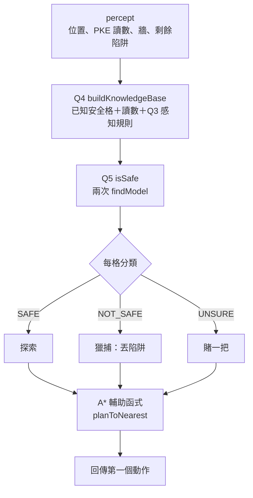

> 🌏 [English version](/en/posts/learning/2026-09-29-cmu-07380-hw1-logic-hybrid-wumpus-en)

**影片狀態：已查核：官方公開頁未列對應錄影。** [影片來源與說明](#課程影片來源)

[CMU 07-380](https://www.cs.cmu.edu/~07380/) 的 HW1 在 9/3 截止，分成兩塊：Gradescope 上的線上題，以及一份程式作業 [Logic and the Hybrid Wumpus Agent](https://www.cs.cmu.edu/~07380/assignments/logic_plan/)。這篇只導讀程式作業：它要你做什麼、每題需要 [Lecture 2](/posts/learning/2026-09-29-cmu-07380-lecture-02-logical-agents) 的哪個概念、怎麼在自己的電腦上跑 autograder。

先講清楚兩件事：

- **不附解答**。課程 Policies 規定作業不能分享程式碼、虛擬碼或文字，也不能用生成式 AI 產生作業的任何部分。這篇只講題目結構和概念。
- **線上題看不到**。HW1 的 Online 部分連到 Gradescope 課程頁，要校內帳號。本文沒有讀到它的內容，也不猜。

以下依 2026-09-29 抓取的作業頁。

## 課程影片來源

已核對 Fall 2026 官方課表及作業清單：公開來源列出投影片、預讀、示範與作業，未列對應講次的公開錄影連結。本文因此以官方教材導讀，沒有對應講次播放器；這項結論只限官方公開頁面，不代表校內沒有錄影。

官方來源：

- [CMU 07-380 Fall 2026 官方課表與教材](https://www.cs.cmu.edu/~07380/)

查核日期：2026-10-10。

## 官方材料與讀取範圍

- 作業頁：[assignments/logic_plan/](https://www.cs.cmu.edu/~07380/assignments/logic_plan/)
- 程式碼：[logic_plan.zip](https://www.cs.cmu.edu/~07380/assignments/logic_plan/logic_plan.zip)（2026-09-29 以 HEAD 請求確認可下載）
- 截止日：課站 Assignments 表寫 9/3 Thu 11:59 pm，已經過了

公開程度：作業說明、starter 和本機 autograder 都能匿名取得，程式作業可以在校外完整重做。Gradescope 的線上題和正式評分只限校內。

## 這份作業在做什麼

作業頁的開場是一首俳句：「Logic and searching. Unseen ghosts will soon be trapped. Spock would be so proud.」

情境是一個 Wumpus World 版的 Pacman。Pacman 看不到鬼，踩到活的鬼就輸。它有兩個工具：

- **PKE meter**：上下左右四個相鄰格裡只要有活鬼，就讀到 True，但不告訴你是哪一格。
- **陷阱**：`TrapNorth`、`TrapSouth`、`TrapEast`、`TrapWest` 對相鄰格丟陷阱，有鬼就抓到，沒鬼就浪費。預設每隻鬼一個陷阱。

鬼不會動。抓完所有鬼就贏，沿路吃豆子得分。作業頁說，這正是 AIMA 7.7「Agents Based on Propositional Logic」的 hybrid agent 設定：把感知歷史變成命題邏輯 KB，問 SAT solver 它 entail 了什麼，再用一般的搜尋規劃一條只經過已證明安全格的路。



## 環境準備

作業指定用 `python3.12`。SAT solver 是 [pycosat](https://pypi.python.org/pypi/pycosat)，它是 [picoSAT](http://fmv.jku.at/picosat/) 的 Python 包裝，要另外安裝：

```bash
python3.12 -m pip install pycosat
python3.12 pycosat_test.py   # 應該輸出 [1, -2, -3, -4, 5]
```

裝不起來時，作業頁建議加 `--user --upgrade setuptools` 重裝。Windows 如果出現需要 Microsoft Visual C++ 14.0 的錯誤，要先裝 VS 2022 C++ build tools。

先自己玩一局，最快理解規則：

```bash
python3.12 wumpus.py                    # 隨機盤面，四隻鬼
python3.12 wumpus.py -l wumpusClassic   # 固定盤面，只靠 PKE 讀數就能證明所有鬼的位置
```

`w a s d` 移動，`t` 切換陷阱模式，`v` 顯示隱藏的鬼和豆子。作業頁提醒：隨機盤面不保證能不靠運氣贏，`wumpusClassic`、`wumpusTiny`、`wumpusHunt7` 則保證不必猜。

## 要改的檔案

| 檔案 | 題號 | 內容 |
|---|---|---|
| `logicPlan.py` | Q1–Q5 | 邏輯句子、KB、安全性推論 |
| `hybridAgents.py` | Q6–Q7 | exploration agent 與 hybrid agent |

值得讀的檔案有 `logic.py`（改自 aima-python 的命題邏輯工具）、`wumpus.py`（遊戲規則與 `GameState.getPercept`）、`searchUtil.py`（在安全格上做 A\* 搜尋），以及 `game.py` 的 `Grid` 類別。

注意 A\* 這部分是**課程提供的**：`searchUtil.py` 實作 A\*，`hybridAgents.py` 裡的 `planToNearest` 輔助函式直接呼叫它。這份作業要你寫的是邏輯推論，和「怎麼把推論結果接到規劃上」的決策邏輯，不是重寫 A\*。A\* 本身的原理可以回頭看 [07-280 Lecture 2 導讀](/posts/ai/2026-08-22-cmu-07280-lecture-02-heuristic-search)。

## 七題的結構

| 題 | 配分 | 題目 | 需要的概念 |
|---|---:|---|---|
| Q1 Logic Warm-up | 4 | 用 `Expr` 寫出三組指定句子；實作 `findModel`，先 `to_cnf` 再丟 `pycoSAT` | 命題邏輯語法、CNF |
| Q2 Logic Workout | 4 | `atLeastOne`、`atMostOne`、`exactlyOne`，輸出必須是 CNF，不能用 `to_cnf` | 手寫 CNF、組合爆炸 |
| Q3 The Percept Rule | 6 | `pkeRule`：PKE 讀數為真，當且僅當某個非牆鄰格有鬼 | 雙條件、把感知寫成規則 |
| Q4 Build the KB | 8 | `buildKnowledgeBase`：已知安全格、讀數本身、每個讀數對應的感知規則 | KB 只放已知的事 |
| Q5 Is This Square Safe? | 10 | `isSafe` 回傳 `SAFE`、`NOT_SAFE`、`UNSURE` | entailment ⇔ 否定後不可滿足 |
| Q6 Safe Exploration Agent | 8 | 每回合記錄感知、分類所有格子、走到最近的未拜訪安全格 | 推論結果接上規劃 |
| Q7 Hybrid Wumpus Agent | 10 | 三層策略：Explore → Hunt → Gamble | 在不確定時做決策 |

合計 50 分。

### Q1–Q2：熟悉 `Expr` 和 CNF

`Expr` 用 Python 運算子組句子：`~` 是 NOT，`&` 是 AND，`|` 是 OR，`>>` 是蘊含，`%` 是雙條件。作業頁特別提醒兩件事：

- `A & B & C` 會變成不平衡的 `((A & B) & C)`。Q1 的 autograder 要求用 `logic.conjoin`／`logic.disjoin`。
- 符號名稱要大寫開頭，而且 `Expr('A & B')` 是一個叫「A & B」的單一符號，不是兩個符號的 AND。

Q2 是整份作業的伏筆。作業頁說，`to_cnf` 在某些最壞情況下會產生指數大小的句子，而「某個三函式之一的非 CNF 寫法」剛好就是這種最壞情況。這呼應 PR1 筆記說的：CNF 轉換的分配律步驟在最壞情況會讓句子指數膨脹。

### Q3–Q5：把 Lec2 的 entailment 做出來

Q3 的規則形狀，作業頁直接給了：

```text
PKE[x, y] ⇔ ⋁ G[nx, ny]   （對所有非牆鄰格）
```

這一題只要把這條寫成程式，陷阱在於牆裡的格子不能出現在規則中。

Q4 的重點是**只斷言 Pacman 真正知道的事**。autograder 只看 KB 被允許提到的符號，多放了事實就會失敗。

Q5 就是 Lec2 那條橋：`KB ⊨ α` 當且僅當 `KB ∧ ¬α` 不可滿足。作業頁說兩次 `findModel` 呼叫就能分出三種答案，並建議你「先在紙上想清楚要檢查哪兩個句子再寫」。這跟 [Recitation 1](https://www.cs.cmu.edu/~07380/recitations/Recitation1_07380_f26.pdf) 第 3 題用黑盒 SAT solver 判斷 Wumpus 格子是同一個練習。先做 recitation，這題會順很多。

Q5 的測資從簡單到微妙排好：已知安全格、什麼都不知道的格、被 False 讀數清掉的格、走廊裡被 True 讀數釘住的鬼、有兩個嫌疑格的 True 讀數，最後是多個讀數合起來把鬼鎖定在一格。作業頁建議前一個沒過就不要往下。

### Q6–Q7：把推論變成行動

Q6 的 agent 拿到的是 percept dict，不是遊戲狀態。它只有四個欄位：`pacman`、`pkeReading`、`walls`、`traps`，agent 知道的一切都必須來自自己存下來的感知。它每回合從頭重新規劃，因為新的讀數可能改變哪些格可證明安全。

這個 agent 從不用陷阱，所以只能在沒有鬼的盤面上贏（吃完豆子）。autograder 也只在這種盤面上測它。

Q7 的 hybrid agent 依序嘗試三層策略，用第一個能產生計畫的那層：

1. **Explore**：走到最近的未拜訪 SAFE 格。
2. **Hunt**：有陷阱、而且有格子被證明 NOT_SAFE，就規劃過去，把最後一步換成對應的 Trap 動作。對證明有鬼的格子丟陷阱，一定不會浪費。
3. **Gamble**：走向最近的 UNSURE 格；還有陷阱的話，同樣在踏進去前先丟。

作業頁點出一個細節：陷阱發動後，目標格一定變安全；但旁邊先前的 True 讀數，可能就是剛被抓的那隻鬼造成的，留著會讓 KB 自相矛盾。課程提供的 `recordTrap` 會處理，你只要在回傳陷阱動作前呼叫它。作業頁說，讀懂為什麼過時的讀數必須遺忘，是這份作業最好的邏輯練習。

## autograder 怎麼跑

```bash
python3.12 autograder.py                 # 全部
python3.12 autograder.py -q q3           # 單題
python3.12 autograder.py -t test_cases/q1/correctSentence1   # 單一測資
python3.12 wumpus.py -p HybridAgent -l wumpusTiny            # 看自己的 agent 玩
```

Q6、Q7 的測資檔裡直接寫著盤面，`cat` 就看得到。用 `-q` 或 `-t` 時會顯示畫面，加 `--no-graphics` 關掉。

本機 autograder 不會登錄成績。正式繳交是把 `logicPlan.py` 和 `hybridAgents.py` 上傳 Gradescope，這只有修課學生能做。作業頁也寫明：最後以實作的正確性為準，不是以 autograder 的判定為準。

## 校外能做與不能做

| 項目 | 校外 |
|---|---|
| 讀作業說明、下載 starter、跑本機 autograder | 可以 |
| 用 `wumpus.py` 觀察自己的 agent | 可以 |
| Gradescope 線上題 | 看不到 |
| Gradescope 正式評分 | 不行 |
| 官方解答 | 沒有公開 |

## 今晚可以做的動作

1. 下載 `logic_plan.zip`，裝好 pycosat，確認 `pycosat_test.py` 輸出 `[1, -2, -3, -4, 5]`。
2. 用 `-l wumpusClassic` 親手玩一局。每一步在紙上寫出你用哪些讀數證明下一格安全，這就是 Q5 要你自動化的事。
3. 做 Q2 之前，先在紙上寫出三個 literal 的 `atMostOne` 應該有哪些 clause，再想想四個、十個 literal 時 clause 數怎麼長。

上一篇：[Lecture 2 導讀：Logical Agents](/posts/learning/2026-09-29-cmu-07380-lecture-02-logical-agents)。下一篇：[Lecture 3 導讀：Classical Planning](/posts/learning/2026-09-29-cmu-07380-lecture-03-classical-planning)。

想看這類 Pacman 作業是怎麼一路演化過來的，可以讀 [Pacman AI 作業系譜](/posts/learning/2026-08-22-pacman-ai-project-lineage)。

## 更新紀錄

- 2026-10-10：標註影片狀態，核對錄影來源與取得方式。

## 參考資料

- [07-380 HW1 程式作業：Logic and the Hybrid Wumpus Agent](https://www.cs.cmu.edu/~07380/assignments/logic_plan/)
- [logic_plan.zip（starter 與 autograder）](https://www.cs.cmu.edu/~07380/assignments/logic_plan/logic_plan.zip)
- [07-380 Assignments 與 Policies](https://www.cs.cmu.edu/~07380/#policies)
- [07-380 Recitation 1: Logical Agents](https://www.cs.cmu.edu/~07380/recitations/Recitation1_07380_f26.pdf)
- [07-380 Pre-reading: Propositional Logic](https://www.cs.cmu.edu/~07380/notes/07380_F26_Notes_Propositional_Logic.pdf)
- [pycosat（PyPI）](https://pypi.python.org/pypi/pycosat)
- [PicoSAT](http://fmv.jku.at/picosat/)
