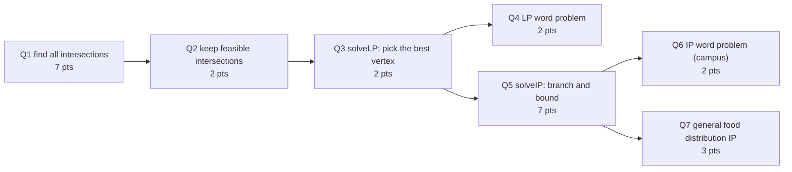

> 🌏 [中文版](/posts/learning/2026-09-29-cmu-07380-hw3-optimization-pca-map)

**Video status: Checked: no corresponding recording link listed on the public official page.** [Source details](#course-video-sources)

HW3 of [CMU 07-380 AI & ML II](https://www.cs.cmu.edu/~07380/) closes the course's optimization block: [Lecture 5 on LP](/en/posts/learning/2026-09-29-cmu-07380-lecture-05-linear-programming-en), [Lecture 6 on integer programming](/en/posts/learning/2026-09-29-cmu-07380-lecture-06-integer-programming-en), [Lecture 7 on PCA](/en/posts/learning/2026-09-29-cmu-07380-lecture-07-pca-low-rank-en), plus the just-started [Lecture 8 on MAP](/en/posts/learning/2026-09-29-cmu-07380-lecture-08-map-en). Per the Assignments table on 2026-09-29, it is due **Thursday 10/1 at 11:59 pm**.

The assignment is not yet due, and the course's AI Tools and Collaboration Policy forbids viewing or sharing any artifact that will be submitted (code, pseudocode, diagrams, text). So this guide does only three things: explain what each problem tests, point to the material to review, and flag where people get stuck. **It contains no answers.** Enrolled students should not treat it as a solution source.

## Course video sources

The official Fall 2026 schedule and assignment list have been checked: public resources include slides, pre-readings, demonstrations and assignments, but no public recording link for the corresponding lectures. This article is therefore a materials-based guide with no corresponding lecture player. This observation concerns the public official page and does not establish whether internal recordings exist.

Official sources:

- [CMU 07-380 Fall 2026 官方課表與教材](https://www.cs.cmu.edu/~07380/)

Checked on 2026-10-10.

## Official materials and what I read

The site lists three parts for HW3:

| Part | Content | Could I read it? |
|---|---|---|
| Online | [Gradescope](https://www.gradescope.com/courses/1340181) questions | No, CMU-only |
| Written | [hw3.pdf](https://www.cs.cmu.edu/~07380/assignments/hw3_blank.pdf) plus [hw3_tex.zip](https://www.cs.cmu.edu/~07380/assignments/hw3.zip) (LaTeX template) | Yes, read in full |
| Programming | [Linear and Integer Programming](https://www.cs.cmu.edu/~07380/assignments/optimization/), with `optimization.zip` and a local autograder | Yes, read the page and confirmed the zip downloads |

`hw3.zip` contains `hw3.tex`, one `.tex` per problem (`q1_ip`, `q2_ethics`, `q3_pca`, `q4_map`), a collaboration statement `q_collaboration.tex`, and two figures for the PCA problem. I cannot see the online questions, so I skip them.

On this site's [A0–A3 scale](/en/posts/learning/2026-08-21-global-ai-cs-course-map-en), the written and programming parts are both public and come with a local autograder, so an outside learner can practice fully (A3). There are no official solutions, though, and no Gradescope feedback.

## Programming: from vertex enumeration to branch and bound

The page sums up the assignment in one sentence: implement a vertex-enumeration LP solver (Q1–3), branch and bound for integer programs (Q5), and formulations of word problems (Q4, Q6, Q7). All code goes in `optimization.py`, the only dependency is numpy, and the page's commands assume Python 3.12.



Each question builds on the previous one. A bug in Q1 propagates all the way to Q7.

### Q1–Q3: why vertex enumeration works

The key line in the Lecture 5 slides is "Solutions are at feasible intersections of constraint boundaries." An LP's solution sits at a feasible intersection of constraint boundaries, meaning a vertex of the feasible region. A vertex is a point where some set of constraints hold with equality. That gives the most direct solver:

1. **Q1 `findIntersections`**: in N dimensions, pick N constraints, treat them as equalities, and solve the linear system to get one intersection. Do this for every combination.
2. **Q2 `findFeasibleIntersections`**: plug each intersection from Q1 back into all constraints and keep those that satisfy every one.
3. **Q3 `solveLP`**: among feasible intersections, return the one with the smallest objective, or `None` if none is feasible. The page lets you assume the solution is bounded.

The page recommends `np.linalg.solve`, `np.linalg.matrix_rank`, and `itertools.combinations`, and leaves you a question to think about: how does a matrix's rank relate to whether a set of hyperplanes meet at a single point? Answer that and half of Q1's edge cases are handled.

Memorize the interface convention first (from the page FAQ). Each constraint is `((a1, ..., aN), b)`, meaning `a·x ≤ b`. A `≥` constraint is negated on both sides. The objective is always **minimized**, so to maximize utility you minimize its negative. This matches Lecture 5's inequality form.

The number of combinations explodes with dimension, so vertex enumeration is a teaching solver, not a practical one. Lecture 5 also introduced simplex, which starts at one feasible intersection and moves only to neighboring intersections with a better objective, without listing them all. Comparing the two is the first problem of Recitation 3.

### Q4: the LP word problem

Pat is packing for Hawaii with a suitcase holding only sunscreen and Tantrum energy drink. There are space, weight, and minimum-quantity constraints, and each fluid ounce has a utility value. The goal is to maximize total utility. The return format is `((sunscreen_amount, tantrum_amount), maximal_utility)`. Since `solveLP` minimizes, remember to flip the sign of the utility when you return it.

### Q5: branch and bound

This corresponds to [Lecture 6](/en/posts/learning/2026-09-29-cmu-07380-lecture-06-integer-programming-en), and the pseudocode is in the [branch and bound section of the course notes](https://www.cs.cmu.edu/~07380/notes/linearprog/index.html#branchbound). The notes' procedure:

1. Solve the LP relaxation and push the solution into a priority queue ordered by objective value.
2. Repeatedly pop the best candidate. If it is all integers, return it. Otherwise pick a non-integer coordinate `x_i` and create two subproblems, `x_i ≤ floor(x_i)` and `x_i ≥ ceil(x_i)`, pushing only the feasible ones.
3. If the queue empties, the integer program is infeasible.

The page FAQ lists three pitfalls specific to this question:

- To test whether a value is an integer, check whether it is within `1e-12` of the **nearest** integer. `floor` alone is not enough. Use `np.abs`, not `math.abs`.
- Push a **fresh** constraint list for each branch. Do not append to a list already on the queue, and do not mutate anything you have pushed.
- The test cases are small and should solve in well under a second. If yours is slow, it is probably branching forever on a value it wrongly thinks is non-integer, or re-solving the same subproblem.

`util.py` provides `PriorityQueue` and `PriorityQueueWithFunction`. The page also warns that even if Q3 passes the autograder, Q5 can still fail if your tolerance checks are wrong.

### Q6–Q7: food distribution

A food rescue organization must move surplus food from M providers to N communities. Each community needs at least C_j integer units. Shipping one unit from i to j costs T_ij. Exactly one truck runs between each provider-community pair, and all trucks share the same weight limit. Food from provider i weighs W_i per unit. The goal is to minimize transportation cost.

Q6 is the campus version: three providers (Dunkin Donuts, Eatunique, Au Bon Pain) and two communities (Gates, Sorrells), with numbers in the page's table. Q7 generalizes it as `foodDistribution`. The page notes that some people prefer to write Q7 first and then apply it to Q6. That order is worth considering: once you have the general form, Q6 is just plugging in numbers.

Two things to get straight when formulating: how many decision variables there are (one per provider-community pair), and that the truck weight limit applies to each pair, not to a provider as a whole.

### Running the autograder

```bash
python3 -m pip install numpy
python3 autograder.py              # everything
python3 autograder.py -q q1        # one question
python3 autograder.py -t test_cases/q1/test2D_1
python3 autograder.py -q q1 --no-graphics
```

For 2-D test cases, the autograder draws the constraints, the feasible region, and your intersections (shown as ghosts) in a Pacman display, which helps a lot with debugging. The page credits the graphics to UC Berkeley's Pacman AI projects; for how Berkeley CS188 and CMU 15-281 share that material, see [the Pacman project lineage](/en/posts/learning/2026-08-22-pacman-ai-project-lineage-en). Local runs do not record grades. Enrolled students submit `optimization.py` to Gradescope.

## Written: four problems, one skill each

| Problem | Points | What it tests | Review |
|---|---|---|---|
| 1 Integer programming: Bayes the Bat's portfolio | 12 | Write a word problem as `min cᵀx s.t. Ax ⪯ b`, sketch the feasible region, find the LP solution, run branch and bound by hand, then tune the risk threshold R | Lec5, Lec6, [course notes](https://www.cs.cmu.edu/~07380/notes/linearprog/index.html#branchbound) |
| 2 Ethics of Amazon delivery routes | 6 | Read a Vice article and discuss what the routing algorithm optimizes, how that conflicts with drivers' needs, and whether using route data to identify an interviewee is ethical | The article itself |
| 3 PCA | 9 | Draw the first and second principal components on two 2-D plots; for a 6×5 matrix, compute the SVD, the first principal component, the projected variance, and the reconstruction error | Lec7, PR4 PCA notes |
| 4 MAP: priors and regularization | 12 | Prove that linear regression with a Laplace prior equals MSE plus L1 regularization, and express λ in terms of b and σ² | Lec8, PR5 MAP notes, Recitation 5 |

Details worth noticing when you read the problems (all are rules stated in the problems themselves):

- **Problem 1's branch-and-bound table**: each row is one depth of the tree. Branch left with `x_i ≤ ⌊v⌋` and right with `x_i ≥ ⌈v⌉`. If both coordinates are non-integer, branch on x₁ first. Each cell lists all constraints added to the original problem, and an infeasible branch is written as "infeasible." The rules are precise; follow them and don't invent your own format.
- **Problem 3's SVD**: keep the matrix dimensions as small as possible, and normalize so each column of the left matrix and each row of the right matrix has L2 norm 1, which makes grading easier. First answer whether X is centered. That step affects everything after it.
- **Problem 4**: the setup has no bias term, each weight is independently `Laplace(0, b)`, and you must write the Gaussian out in full rather than stopping at shorthand like `N(...)`. The [Lecture 8 guide](/en/posts/learning/2026-09-29-cmu-07380-lecture-08-map-en) derives the Gaussian-prior-to-L2 version. The Laplace version has the same structure, except the log gives you an absolute value.

Finally there is a collaboration statement: whether you received or gave help, and whether you saw code implementing any part of the assignment. Answer honestly.

## Submission and late policy

- Written: answer in the LaTeX template, compile to pdf, and upload to Gradescope. Do not move or resize the answer boxes.
- Programming: upload `optimization.py`. Programming may be done in pairs, but written and online parts must be done individually.
- Late days: 6 for the whole semester, at most 2 per assignment. All components with the same homework number count as one assignment, so turning everything in within one day uses one late day. Beyond two days, or with no late days left, the score is 0.

## Related reading

The "What Now?" section at the end of the programming page recommends [Google OR-Tools](https://developers.google.com/optimization) and [Gurobi](https://www.gurobi.com/). After you finish your own vertex-enumeration solver, re-solve Q6 with OR-Tools. The gap between a teaching solver and an industrial one becomes very concrete.

The previous post is [Lecture 8 on MAP](/en/posts/learning/2026-09-29-cmu-07380-lecture-08-map-en), and the next is [Lecture 9 on generative models](/en/posts/learning/2026-09-29-cmu-07380-lecture-09-generative-models-en).

## Things to do tonight

1. Download [optimization.zip](https://www.cs.cmu.edu/~07380/assignments/optimization/optimization.zip), write only the 2-D version of Q1, and get `-t test_cases/q1/test2D_1` passing.
2. Read the branch and bound example in the course notes and draw its search tree yourself before writing Q5.
3. Before starting written problem 4, write out the Gaussian-prior-to-L2 derivation and make sure you can split the negative log posterior into "loss + penalty."

## Update Log

- 2026-10-10: Added explicit video status and checked recording sources and access notes.
- 2026-10-10: Rechecked video status. Re-verified the live official course pages and public video sources; no public recording for this lecture was found, so the status stands.

## References

- [CMU 07-380 Fall 2026 course site (Assignments, Policies)](https://www.cs.cmu.edu/~07380/)
- [07-380 HW3 Programming: Optimization (Linear and Integer Programming)](https://www.cs.cmu.edu/~07380/assignments/optimization/)
- [07-380 HW3 Written (hw3.pdf)](https://www.cs.cmu.edu/~07380/assignments/hw3_blank.pdf)
- [07-380 HW3 LaTeX template (hw3.zip)](https://www.cs.cmu.edu/~07380/assignments/hw3.zip)
- [07-380 Notes: Linear and Integer Programming (branch and bound)](https://www.cs.cmu.edu/~07380/notes/linearprog/index.html#branchbound)
- [Vice: Amazon's Cost Saving Routing Algorithm Makes Drivers Walk Into Traffic](https://www.vice.com/en/article/amazons-cost-saving-routing-algorithm-makes-drivers-walk-into-traffic/)
- [Google OR-Tools](https://developers.google.com/optimization)
- [CMU 07-380 Fall 2026 Overview](/en/posts/learning/2026-08-22-cmu-07380-fall-2026-overview-en)
