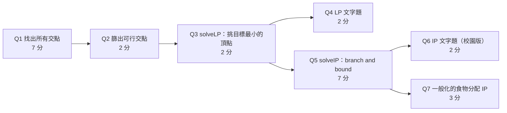

> 🌏 [English version](/en/posts/learning/2026-09-29-cmu-07380-hw3-optimization-pca-map-en)

**影片狀態：已查核：官方公開頁未列對應錄影。** [影片來源與說明](#課程影片來源)

[CMU 07-380 AI & ML II](https://www.cs.cmu.edu/~07380/) 的 HW3 把課程第二段「優化」收尾：[Lecture 5 LP](/posts/learning/2026-09-29-cmu-07380-lecture-05-linear-programming)、[Lecture 6 整數規劃](/posts/learning/2026-09-29-cmu-07380-lecture-06-integer-programming)、[Lecture 7 PCA](/posts/learning/2026-09-29-cmu-07380-lecture-07-pca-low-rank)，再加上剛開始的[Lecture 8 MAP](/posts/learning/2026-09-29-cmu-07380-lecture-08-map)。依課站 2026-09-29 的 Assignments 表，截止時間是 **10/1（週四）晚上 11:59**。

作業還沒到期，而且課程的 AI Tools and Collaboration Policy 禁止查看、分享任何要繳交的產出（程式、虛擬碼、圖、文字）。所以這篇只做三件事：講清楚每題在考什麼、要回頭看哪份材料、哪裡容易踩坑。**不附任何答案**，修課學生請不要把這篇當成解答來源。

## 課程影片來源

已核對 Fall 2026 官方課表及作業清單：公開來源列出投影片、預讀、示範與作業，未列對應講次的公開錄影連結。本文因此以官方教材導讀，沒有對應講次播放器；這項結論只限官方公開頁面，不代表校內沒有錄影。

官方來源：

- [CMU 07-380 Fall 2026 官方課表與教材](https://www.cs.cmu.edu/~07380/)

查核日期：2026-10-10。

## 官方材料與讀取範圍

課站的 HW3 列有三個部分：

| 部分 | 內容 | 我能不能讀 |
|---|---|---|
| Online | [Gradescope](https://www.gradescope.com/courses/1340181) 線上題 | 不能，只限校內 |
| Written | [hw3.pdf](https://www.cs.cmu.edu/~07380/assignments/hw3_blank.pdf) 加上 [hw3_tex.zip](https://www.cs.cmu.edu/~07380/assignments/hw3.zip)（LaTeX 範本） | 能，已讀全文 |
| Programming | [Linear and Integer Programming](https://www.cs.cmu.edu/~07380/assignments/optimization/)，附 `optimization.zip` 與本機 autograder | 能，已讀頁面、確認 zip 可下載 |

`hw3.zip` 裡是 `hw3.tex` 和四題各自的 `.tex`（`q1_ip`、`q2_ethics`、`q3_pca`、`q4_map`），加上一份合作聲明 `q_collaboration.tex` 和兩張 PCA 題用的圖。線上題的內容我看不到，下面不談。

以本站 [A0–A3 分級](/posts/learning/2026-08-21-global-ai-cs-course-map)來看，書面和程式兩部分都公開、還有本機 autograder，校外讀者可以完整練習（A3 等級）；但沒有官方解答，也拿不到 Gradescope 的評分回饋。

## 程式作業：從頂點枚舉到 branch and bound

頁面開頭把整份作業講成一句話：用頂點枚舉寫一個 LP 求解器（Q1–3），寫 branch and bound 解整數規劃（Q5），再把幾題文字題寫成數學規劃（Q4、Q6、Q7）。所有程式都寫在 `optimization.py`，只需要 numpy，頁面上的指令假設 Python 3.12。



每一題都疊在前一題上，Q1 寫錯會一路錯到 Q7。

### Q1–Q3：為什麼頂點枚舉行得通

Lecture 5 投影片的核心句是「Solutions are at feasible intersections of constraint boundaries」：LP 的解落在限制式邊界的可行交點上，也就是可行域的頂點。頂點就是某幾條限制式「剛好取等號」的交點。所以最直接的求解器是：

1. **Q1 `findIntersections`**：在 N 維裡，挑 N 條限制式當成等式，解線性方程組，得到一個交點。對所有組合都做一次。
2. **Q2 `findFeasibleIntersections`**：把 Q1 的交點代回所有限制式，留下都滿足的。
3. **Q3 `solveLP`**：在可行交點裡挑目標值最小的；沒有可行解就回傳 `None`。頁面允許你假設解是有界的。

頁面列出建議用的工具：`np.linalg.solve`、`np.linalg.matrix_rank`、`itertools.combinations`，並留了一個思考題給你：矩陣的秩和「這幾個超平面有沒有交在一點」是什麼關係？這一題想清楚，Q1 的邊界情況就解決了一半。

介面的慣例要先記住（頁面 FAQ 寫明）：每條限制式都是 `((a1, ..., aN), b)`，意思是 `a·x ≤ b`；`≥` 限制要兩邊同乘 −1；目標一律是**最小化**，要最大化效用就最小化它的負值。這和 Lecture 5 的 inequality form 一致。

頂點枚舉的組合數會隨維度爆炸，所以它是教學用的求解器，不是實務工具。Lecture 5 也介紹了 simplex：從一個可行交點出發，只往目標值更好的相鄰交點走，不必全部列出來；兩者的比較是 Recitation 3 的第一題。

### Q4：LP 文字題

Pat 要去夏威夷，行李箱只裝防曬乳和 Tantrum 能量飲料，有空間、重量、最低攜帶量幾條限制，每盎司各有效用值，要最大化總效用。回傳格式是 `((sunscreen_amount, tantrum_amount), maximal_utility)`。要注意 `solveLP` 是最小化，回傳時別忘了把效用的正負號轉回來。

### Q5：branch and bound

這題對應 [Lecture 6](/posts/learning/2026-09-29-cmu-07380-lecture-06-integer-programming) 的內容，虛擬碼在[課程筆記的 branch and bound 段落](https://www.cs.cmu.edu/~07380/notes/linearprog/index.html#branchbound)。筆記的流程是：

1. 解 LP 鬆弛問題，把解放進依目標值排序的 priority queue。
2. 反覆取出目標值最好的候選解。全是整數就回傳；否則挑一個非整數座標 `x_i`，分成 `x_i ≤ floor(x_i)` 和 `x_i ≥ ceil(x_i)` 兩個子問題，可行的才放回 queue。
3. Queue 空了就代表整數規劃不可行。

頁面 FAQ 專門列了這題的三個坑：

- 判斷是不是整數，要看它離**最近的整數**是否在 `1e-12` 以內，只用 `floor` 不夠；要用 `np.abs`，不是 `math.abs`。
- 每個分支要推一份**新的**限制式清單進 queue，不要 append 到已經在 queue 裡的清單，也不要改動任何推進去的物件。
- 測資都很小，應該在一秒內解完。如果很慢，通常是把某個值一直誤判成非整數而無限分支，或是重複解同一個子問題。

`util.py` 裡有 `PriorityQueue` 和 `PriorityQueueWithFunction` 可以用。頁面也提醒：Q3 就算過了 autograder，容差沒寫對的話，Q5 還是可能失敗。

### Q6–Q7：食物分配

背景是糧食救援組織要把 M 個供應者的剩食送到 N 個社區。每個社區至少要 C_j 個整數單位；每單位從 i 送到 j 的運費是 T_ij；每對供應者和社區之間恰好一台卡車，每台有相同的載重上限；來自供應者 i 的食物每單位重 W_i。目標是最小化運費。

Q6 是校園版：三個供應者（Dunkin Donuts、Eatunique、Au Bon Pain）、兩個社區（Gates、Sorrells），數字都在頁面表格裡。Q7 把它一般化成 `foodDistribution`。頁面建議有些人會先寫 Q7 再套到 Q6，這個順序值得考慮：寫出一般式之後，Q6 只是代入數字。

建模時要想清楚兩件事：決策變數有幾個（每對供應者和社區一個），卡車載重是對「一對」的限制，而不是對整個供應者的限制。

### 怎麼跑 autograder

```bash
python3 -m pip install numpy
python3 autograder.py              # 全部
python3 autograder.py -q q1        # 單題
python3 autograder.py -t test_cases/q1/test2D_1
python3 autograder.py -q q1 --no-graphics
```

2 維測資會用 Pacman 的畫面把限制式、可行域、你找到的交點（畫成鬼）畫出來，除錯很好用。頁面註明這些圖形來自 UC Berkeley 的 Pacman AI projects；Berkeley CS188 和 CMU 15-281 怎麼共用這套教材，見 [Pacman 作業系譜](/posts/learning/2026-08-22-pacman-ai-project-lineage)。本機跑分不會登錄成績，修課學生最後要把 `optimization.py` 上傳到 Gradescope。

## 書面作業：四題各考一件事

| 題目 | 配分 | 在考什麼 | 回頭看 |
|---|---|---|---|
| 1 整數規劃：Bayes the Bat 的投資組合 | 12 | 把文字題寫成 `min cᵀx s.t. Ax ⪯ b`，畫可行域、找 LP 解，手跑 branch and bound，最後調風險門檻 R | Lec5、Lec6、[課程筆記](https://www.cs.cmu.edu/~07380/notes/linearprog/index.html#branchbound) |
| 2 Amazon 送貨路線的倫理考量 | 6 | 讀一篇 Vice 報導，討論路線演算法優化了什麼、和司機需求怎麼衝突、用資料反查受訪者是否合乎倫理 | 報導本身 |
| 3 PCA | 9 | 在兩張 2D 資料圖上畫第一、第二主成分；對一個 6×5 矩陣做 SVD、求第一主成分、投影後的變異數與重建誤差 | Lec7、PR4 PCA 筆記 |
| 4 MAP：先驗與正則化 | 12 | 證明線性迴歸加 Laplace 先驗等價於 MSE 加 L1 正則化，並寫出 λ 和 b、σ² 的關係 | Lec8、PR5 MAP 筆記、Recitation 5 |

幾個讀題時要注意的細節（都是題目本身寫的規則）：

- **第 1 題的 branch and bound 表格**：每一列代表樹的一層；分支規則是左邊 `x_i ≤ ⌊v⌋`、右邊 `x_i ≥ ⌈v⌉`，兩個座標都不是整數時先分 x₁；每格要寫出「相對原問題新增的所有限制」，不可行就寫 infeasible。規則寫得很細，照做就好，不要自創格式。
- **第 3 題的 SVD**：題目要求維度盡量小，而且左矩陣的每一行（column）、右矩陣的每一列（row）的 L2 範數都是 1，方便批改。先回答「X 有沒有置中」，這一步會影響後面所有計算。
- **第 4 題**：題目設定沒有 bias 項，每個權重獨立服從 `Laplace(0, b)`，並要求把高斯分佈完整寫出來，不能停在 `N(...)` 這種簡寫。[Lecture 8 導讀](/posts/learning/2026-09-29-cmu-07380-lecture-08-map)推過高斯先驗對應 L2 的版本，Laplace 版的結構相同，差在 log 之後得到的是絕對值。

最後還有一份合作聲明：有沒有接受或提供幫助、有沒有看過實作相關的程式碼，都要據實填寫。

## 繳交與遲交規則

- 書面：用 LaTeX 範本作答後編成 pdf 上傳 Gradescope，答案框不能移動或改大小。
- 程式：上傳 `optimization.py`。程式部分最多兩人一組，但書面和線上題都要各自完成。
- 遲交：整學期共 6 天 late day，每份作業最多用 2 天；同一個作業編號的各部分算同一份，同一天內交齊只扣一天。超過兩天或 late day 用完就是 0 分。

## 延伸對照

程式作業頁最後的「What Now?」推薦了 [Google OR-Tools](https://developers.google.com/optimization) 和 [Gurobi](https://www.gurobi.com/)。寫完自己的頂點枚舉版之後，用 OR-Tools 重解一次 Q6，你會清楚看到教學版和工業級求解器差在哪裡。

上一篇是 [Lecture 8 MAP](/posts/learning/2026-09-29-cmu-07380-lecture-08-map)，下一篇是 [Lecture 9 生成式模型](/posts/learning/2026-09-29-cmu-07380-lecture-09-generative-models)。

## 今晚可以做的動作

1. 下載 [optimization.zip](https://www.cs.cmu.edu/~07380/assignments/optimization/optimization.zip)，先只寫 Q1 的 2 維版本，用 `-t test_cases/q1/test2D_1` 讓第一個測資變綠。
2. 讀課程筆記的 branch and bound 範例，照著畫一次搜尋樹，再動手寫 Q5。
3. 書面第 4 題動筆前，先把高斯先驗等價 L2 的推導自己寫一遍，確認你能把 −log 後驗拆成「損失 + 懲罰」兩項。

## 更新紀錄

- 2026-10-10：標註影片狀態，核對錄影來源與取得方式。
- 2026-10-10：重查影片狀態。即時回官方課程頁與公開影音來源查證，仍未找到該講公開錄影，狀態維持不變。

## 參考資料

- [CMU 07-380 Fall 2026 課站（Assignments、Policies）](https://www.cs.cmu.edu/~07380/)
- [07-380 HW3 Programming：Optimization（Linear and Integer Programming）](https://www.cs.cmu.edu/~07380/assignments/optimization/)
- [07-380 HW3 Written（hw3.pdf）](https://www.cs.cmu.edu/~07380/assignments/hw3_blank.pdf)
- [07-380 HW3 LaTeX 範本（hw3.zip）](https://www.cs.cmu.edu/~07380/assignments/hw3.zip)
- [07-380 Notes：Linear and Integer Programming（branch and bound）](https://www.cs.cmu.edu/~07380/notes/linearprog/index.html#branchbound)
- [Vice：Amazon's Cost Saving Routing Algorithm Makes Drivers Walk Into Traffic](https://www.vice.com/en/article/amazons-cost-saving-routing-algorithm-makes-drivers-walk-into-traffic/)
- [Google OR-Tools](https://developers.google.com/optimization)
- [CMU 07-380 Fall 2026 總覽](/posts/learning/2026-08-22-cmu-07380-fall-2026-overview)
