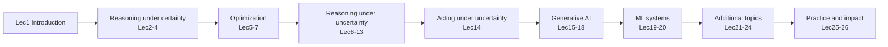

> 🌏 [中文版](/posts/learning/2026-09-29-cmu-07380-lecture-01-introduction)

This is Lecture 1 of [CMU 07-380 AI & ML II](https://www.cs.cmu.edu/~07380/), Fall 2026. The whole-course map lives in the [series overview](/en/posts/learning/2026-08-22-cmu-07380-fall-2026-overview-en). This post covers only Lec1: what the slides say, how the Schedule and Policies on the course site group the 26 lectures into modules, and which materials you can reach from outside CMU.

Everything below follows the course site as fetched on 2026-09-29. The site marks its schedule `Subject to change`, so dates and topics may still move.

## Official materials and what I read

Materials read for this post:

- [Lec1 slides (pdf)](https://www.cs.cmu.edu/~07380/lectures/07380_F26_Lec1_Introduction.pdf) and the [inked version](https://www.cs.cmu.edu/~07380/lectures/07380_F26_Lec1_Introduction_inked.pdf) (pptx is also on the site)
- The course site's [Schedule](https://www.cs.cmu.edu/~07380/#schedule), [Policies](https://www.cs.cmu.edu/~07380/#policies) and [FAQ](https://www.cs.cmu.edu/~07380/#faq)
- The Schedule lists AIMA (Russell & Norvig, 4th ed.) Ch. 1 as optional reading. I did not cite AIMA page by page

Lec1 has no pre-reading, no recitation and no homework. The site links no recordings. The inked PDF has the same text as the plain one, plus the instructor's handwriting, such as a note on the course map that says "280/380 overlap with AI courses."

Openness: the Lec1 slides, Schedule and Policies are all public, so this lecture's material is complete. The course as a whole is still A2 (in progress) on the [A0–A3 scale](/posts/learning/2026-08-21-global-ai-cs-course-map-en). Canvas, Gradescope, Piazza and the in-class polls are CMU-only.

## The thread of the slides: intelligence means doing well under uncertainty

Lec1 first recalls John McCarthy's definitions: AI is "the science and engineering of making intelligent machines," and intelligence is "the computational part of the ability to achieve goals in the world." Then it switches to Pat Virtue's own version:

> Intelligence is the ability to perform well on a task that involves uncertainty.

The slides draw two consequences. First, intelligence is not binary: how well an agent performs, and how much uncertainty it faces, decide how intelligent we consider it. Second, uncertainty has many sources, not just randomness:

| Source | Example from the slides |
|---|---|
| Hidden information | Cards in another player's hand |
| Noise | Sensor noise |
| Too complicated to model | Leaves blowing in the wind |
| Combinatorial explosion | Tic-tac-toe → checkers → chess |

The deck opens with "Why is folding clothes a research problem while robots are actively being used to assemble cars in factories?" Later it runs polls on Searle's Chinese Room and on weak AI versus AGI. The polls have no right answer. Students commit to a view first, then discuss with a neighbor (Peer Instruction).

This uncertainty thread matters because the first seven lectures of 07-380 stay almost entirely in a **certain** world: logic, planning, LP/ILP, PCA. The course only enters Reasoning Under Uncertainty at Lec8 (MAP). Read the first stretch as "learn the tools that can prove, enumerate and optimize exactly," before tackling what the definition actually cares about.

## Design goals: how II differs from I

The slides list what the instructors weighed when designing 07-380:

1. Build breadth and depth in AI and ML
2. Decide what every AI major or minor should learn, whatever electives they pick
3. Identify the building blocks that give students the language to learn more
4. Identify what is harder to learn outside a university (the slide adds, in parentheses: math)
5. Cover the state of the art
6. Prepare students for critical AI/ML challenges in practice

The most useful slide is the AI/ML bubble diagram. Light purple marks what [07-280](/posts/ai/2026-08-22-cmu-07280-course-overview-en) already covered: Heuristic Search, CSPs, Games, MLE, Markov Chains, MDP, RL, MCTS, LLM. Green marks what 07-380 adds:

- Outside ML: Logic, Planning, Optim (LP, IP), Game Theory
- Inside ML: ML Theory, Graphical Models, PCA, MAP, Policy Gradient
- Deep learning and generative AI: VAE, VLM, Diffusion, Parallel, Scaling
- AI/ML Ethics sits in dark purple, where AI and ML meet

The next slide puts 280 and 380 side by side in the "AI Core" row of CMU's AI major, followed by the ML cluster, Decision & Robotics, and other elective groups. The handwritten note points out that the two courses overlap with other AI courses.

So "II" is not just "a harder I." Course I builds the spine of search, ML and RL. Course II fills two gaps: the symbolic reasoning and optimization that I skipped on purpose, and the probabilistic graphical models, generative models and systems topics that I had no time for.

## How the 26 lectures group into modules

The Module column of the Schedule groups the lectures like this (as of 2026-09-29):

| Module | Lectures | Topics |
|---|---|---|
| Introduction | 1 | Introduction |
| Reasoning Under Certainty | 2–4 | Logical Agents, Planning, Motion Planning |
| Optimization | 5–7 | LP, ILP, PCA (LoRA) |
| Reasoning Under Uncertainty | 8–13 | MAP, Generative Models, Bayes Nets, Approximate Inference, HMM/Particle Filtering, GMM/EM |
| Acting Under Uncertainty | 14 | Policy Gradient → RLHF |
| Generative AI | 15–18 | DL Optimization, VAE, Diffusion, Multimodal |
| ML Systems | 19–20 | Parallel Computing, Scaling Laws |
| Additional Topics | 21–24 | Recommender Systems, Ensembles, ML Theory, Game Theory |
| Practice and Impact | 25–26 | ML in Practice, AI Ethics |

The FAQ adds that 07-380 is meant to be "more flexible in its topics from semester to semester." This schedule describes Fall 2026 only.

## Grading and rules

From the Policies section:

| Component | Weight | Rules |
|---|---|---|
| Quizzes | 55% | Six bi-weekly quizzes, lowest dropped; no rescheduling, no extensions |
| Homework | 25% | Online, written and programming parts |
| Final project | 10% | Team project due in the final exam period (12/7–12/15); details TBA |
| Pre-reading checkpoints | 5% | Lowest two dropped; no extensions |
| Participation | 5% | Share of in-class polls answered: 0 at 50% or less, full credit at 80% or more, linear in between |

Details that matter for self-learners:

- **No final exam.** The final project closes the course. Quiz questions are not public, so you cannot reproduce that 55% from outside.
- Homework shares a pool of **6 late days**, at most 2 per assignment. Programming and written parts with the same homework number count as one assignment.
- **Generative AI policy:** you may use AI tools to learn the material, but not to generate any part of a submission. Discussion with classmates must stay conceptual.
- You may pair up for programming parts, but written and online parts must be your own.
- Poll correctness does not affect participation, only whether you answered. Answering polls when you are not in the room is an academic integrity violation.

Final grades are not curved. The site's rough guide is A above 90% and B at 80–90%, and it says precise cutoffs will never be discussed.

## Side by side: read it with 07-280 Lec1

The [07-280 Lecture 1 guide](/posts/ai/2026-08-22-cmu-07280-lecture-01-introduction-en) covers the Spring 2026 slides, which use an alien autoencoder to talk about representation and then draw the scope of AI and ML. Read the two together and the openings differ: 07-280 starts from "how do we turn inputs into something computable," while 07-380 starts from "what should the course add that is hard to learn outside a university." Both draw AI as a bigger circle than ML, and the 07-380 bubble diagram reads like that picture with green bubbles filled in.

For prerequisites, the site asks for 07-280 plus one probability course, each with a C or better. If you took 10-301 instead, the FAQ says 10-301 plus 16-350 counts as equivalent; email `bsai@cs.cmu.edu` to discuss.

## Things to do tonight

1. Open the bubble diagram in the [inked Lec1 slides](https://www.cs.cmu.edu/~07380/lectures/07380_F26_Lec1_Introduction_inked.pdf). Copy the green topics into a list and mark each as "know it," "heard of it," or "never touched it."
2. Using the "doing well under uncertainty" definition, write one line for each of three AI systems you know: which kind of uncertainty it faces (hidden information, noise, hard to model, combinatorial explosion).
3. Before Lec2, read the [PR1 Propositional Logic notes](https://www.cs.cmu.edu/~07380/notes/07380_F26_Notes_Propositional_Logic.pdf). The course puts syntax and model checking in the pre-reading, and Lec2 starts straight from algorithms.

Next: [Lecture 2 guide: Logical Agents](/en/posts/learning/2026-09-29-cmu-07380-lecture-02-logical-agents-en). Previous: [series overview](/en/posts/learning/2026-08-22-cmu-07380-fall-2026-overview-en).

## References

- [CMU 07-380 AI & ML II Fall 2026 course site](https://www.cs.cmu.edu/~07380/)
- [07-380 Fall 2026 Schedule](https://www.cs.cmu.edu/~07380/#schedule)
- [07-380 Policies (grading, late days, AI tools and collaboration)](https://www.cs.cmu.edu/~07380/#policies)
- [07-380 Lecture 1: Introduction (pdf)](https://www.cs.cmu.edu/~07380/lectures/07380_F26_Lec1_Introduction.pdf)
- [07-380 Lecture 1: Introduction (inked pdf)](https://www.cs.cmu.edu/~07380/lectures/07380_F26_Lec1_Introduction_inked.pdf)
- [John McCarthy, What is Artificial Intelligence?](http://www-formal.stanford.edu/jmc/whatisai/whatisai.html)
- [CMU 07-380 Fall 2026 series overview](/en/posts/learning/2026-08-22-cmu-07380-fall-2026-overview-en)
- [CMU 07-280 Lecture 1 guide](/posts/ai/2026-08-22-cmu-07280-lecture-01-introduction-en)
- [Global AI/CS course map: the A0–A3 scale](/posts/learning/2026-08-21-global-ai-cs-course-map-en)
