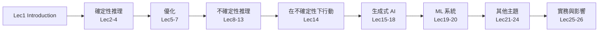

> 🌏 [English version](/en/posts/learning/2026-09-29-cmu-07380-lecture-01-introduction-en)

這是 [CMU 07-380 AI & ML II](https://www.cs.cmu.edu/~07380/) Fall 2026 的第一講。整門課的地圖在[系列總覽](/posts/learning/2026-08-22-cmu-07380-fall-2026-overview)，這篇只看 Lec1 本身：投影片講了什麼，課站的 Schedule 和 Policies 怎麼把 26 講排成幾個模組，還有你在校外能拿到哪些材料。

以下內容依 2026-09-29 抓取的課站。課站自己標了 `Subject to change`，日期和主題之後可能會動。

## 課程影片來源

本篇依官方講義、投影片或作業導讀；本次檢查官方公開頁面，尚未核實本文對應講次的公開錄影。這不表示課程沒有錄影。

課程與錄影入口：

- [cmu-07-380 — official course materials and recording index](https://www.cs.cmu.edu/~07380/)

## 官方材料與讀取範圍

本文讀過的材料：

- [Lec1 投影片 pdf](https://www.cs.cmu.edu/~07380/lectures/07380_F26_Lec1_Introduction.pdf) 與 [inked 版](https://www.cs.cmu.edu/~07380/lectures/07380_F26_Lec1_Introduction_inked.pdf)（課站另有 pptx）
- 課站的 [Schedule](https://www.cs.cmu.edu/~07380/#schedule)、[Policies](https://www.cs.cmu.edu/~07380/#policies)、[FAQ](https://www.cs.cmu.edu/~07380/#faq)
- Schedule 把 AIMA（Russell & Norvig，第 4 版）Ch.1 列為這講的選讀。本文沒有逐頁引用 AIMA

Lec1 沒有 pre-reading、沒有 recitation，也沒有對應作業。課站沒有錄影連結。inked 版和原版文字相同，差別在講師手寫的註記，例如在課程地圖上圈出「280/380 overlap with AI courses」。

公開程度：Lec1 的投影片、Schedule 和 Policies 都能匿名打開，這一講本身的材料是完整的。整門課依 [A0–A3 分級](/posts/learning/2026-08-21-global-ai-cs-course-map)仍是 A2（進行中）。Canvas、Gradescope、Piazza 和課堂 poll 都只限校內。

## 投影片主線：智慧＝在不確定性下把任務做好

Lec1 先回顧 John McCarthy 的定義：AI 是「製造智慧機器的科學與工程」，智慧是「在世界上達成目標的能力中，屬於計算的那一部分」。接著換成 Pat Virtue 自己的版本：

> Intelligence is the ability to perform well on a task that involves uncertainty.

這個定義有兩個推論，投影片都寫出來了。第一，智慧不是二元的：表現多好、面對多少不確定性，決定我們覺得它有多聰明。第二，「不確定性」的來源不只是隨機：

| 來源 | 投影片的例子 |
|---|---|
| 隱藏資訊 | 對手手上的牌 |
| 雜訊 | 感測器雜訊 |
| 複雜到無法建模 | 風吹落葉 |
| 組合爆炸 | 圈圈叉叉 → 西洋跳棋 → 西洋棋 |

投影片用「為什麼摺衣服還是研究題目，工廠卻早就用機器人組車？」開場，後面再用 Searle 的「中文房間」和「弱 AI vs AGI」各開一個 poll。這些 poll 沒有標準答案，用意是讓學生先表態，再跟旁邊的人討論（Peer Instruction）。

這條「不確定性」主線很重要，因為 07-380 的前 7 講幾乎都在**確定性**的世界裡：邏輯、規劃、LP／ILP、PCA。到 Lec8 MAP 才正式進入 Reasoning Under Uncertainty。你可以把前段理解成「先把能證明、能枚舉、能精確優化的工具學完」，再去處理這個定義真正在意的東西。

## 07-380 的設計考量：II 跟 I 差在哪

投影片列出設計 07-380 時考慮的問題：

1. 補足 AI 與 ML 的廣度和深度
2. 不管學生之後選什麼選修，AI 主修／輔修都該學到哪些東西
3. 哪些是基礎零件，讓學生有「語言」去學更多
4. 哪些東西在大學外面比較難自學（投影片括號寫：數學）
5. 跟上最新進展
6. 為實務上的 AI／ML 挑戰做準備

最有用的一張是 AI／ML 泡泡圖。淺紫色是 [07-280](/posts/ai/2026-08-22-cmu-07280-course-overview) 已經教過的：Heuristic Search、CSPs、Games、MLE、Markov Chains、MDP、RL、MCTS、LLM。綠色是 07-380 要補上的：

- ML 之外：Logic、Planning、Optim（LP、IP）、Game Theory
- ML 裡面：ML Theory、Graphical Models、PCA、MAP、Policy Gradient
- 深度學習和生成式：VAE、VLM、Diffusion、Parallel、Scaling
- 另外用深紫色標出 AI/ML Ethics，放在 AI 與 ML 的交界

下一張投影片把 280 和 380 並排放在 CMU AI 主修的「AI Core」列，後面接 ML Cluster、Decision & Robotics 等選修群。講師手寫註記指出，這兩門課跟其他 AI 課程有重疊。

所以「II」不只是「更難的 I」。I 把搜尋、ML、RL 的主幹建起來；II 補上兩塊：一塊是 I 刻意跳過的符號推理和優化，一塊是 I 沒時間講的機率圖模型、生成模型和系統議題。

## 26 講怎麼分模組

課站 Schedule 的 Module 欄把 26 講分成下面幾段（依 2026-09-29 課站）：

| Module | 講次 | 主題 |
|---|---|---|
| Introduction | 1 | Introduction |
| Reasoning Under Certainty | 2–4 | Logical Agents、Planning、Motion Planning |
| Optimization | 5–7 | LP、ILP、PCA（LoRA） |
| Reasoning Under Uncertainty | 8–13 | MAP、Generative Models、Bayes Nets、Approximate Inference、HMM／Particle Filtering、GMM／EM |
| Acting Under Uncertainty | 14 | Policy Gradient → RLHF |
| Generative AI | 15–18 | DL Optimization、VAE、Diffusion、Multimodal |
| ML Systems | 19–20 | Parallel Computing、Scaling Laws |
| Additional Topics | 21–24 | Recommender、Ensemble、ML Theory、Game Theory |
| Practice and Impact | 25–26 | ML in Practice、AI Ethics |

課站的 FAQ 也說明，07-380 的主題「每學期可以更有彈性地調整」。這份 Schedule 只代表 Fall 2026。

## 評分與規則

課站 Policies 的配分：

| 項目 | 比重 | 規則 |
|---|---|---|
| Quizzes | 55% | 6 次隔週小考，最低一次不計；不能補考、沒有延期 |
| Homework | 25% | online／written／programming 三種形式 |
| Final Project | 10% | 團隊專題，期末考週（12/7–12/15）繳交，細節 TBA |
| Pre-reading checkpoints | 5% | 最低兩次不計；沒有延期 |
| Participation | 5% | 課堂 poll 作答率：50% 以下 0 分，80% 以上滿分，中間線性 |

幾個跟校外自學者有關的細節：

- **沒有期末考**，由 Final Project 收尾。Quiz 題目沒有公開，這 55% 你在校外無法重現。
- 作業共用 **6 天遲交額度**，每份作業最多用 2 天。同一個作業編號的 programming 和 written 算同一份。
- **生成式 AI 政策**：可以用 AI 工具學習課程內容，但不能用來生成作業的任何部分。同學之間的討論只能停在概念層次。
- Programming 部分可以兩人一組，但 written 和 online 部分必須自己完成。
- Poll 的正確與否不影響 participation 分數，只看有沒有作答。人不在教室卻作答 poll，算違反學術誠信。

最後的等第沒有曲線。課站給的粗略對照是 A 90% 以上、B 80–90%，但也寫明精確的 cutoff 不會公開討論。

## 延伸對照：跟 07-280 Lec1 一起讀

[07-280 Lecture 1 導讀](/posts/ai/2026-08-22-cmu-07280-lecture-01-introduction)讀的是 Spring 2026 版投影片：用 alien autoencoder 講「表示」，再畫出 AI 與 ML 的範圍。兩講並排讀，可以看出開場重點不同：07-280 從「怎麼把輸入表示成可計算的東西」切入，07-380 從「課程要補哪些在大學外面難學的部分」切入。兩門課都把 AI 畫成比 ML 更大的圈，07-380 的泡泡圖可以看成把 07-280 那張圖填上綠色。

先修方面，課站寫的是 07-280 加上一門機率課，兩門都要 C 以上。修過 10-301 的人，FAQ 說 10-301 加 16-350 可以抵 07-280，要另外寄信給 `bsai@cs.cmu.edu` 討論。

## 今晚可以做的動作

1. 打開 [Lec1 inked 投影片](https://www.cs.cmu.edu/~07380/lectures/07380_F26_Lec1_Introduction_inked.pdf)的 AI／ML 泡泡圖，把綠色主題抄成清單，標出你已經會、只聽過、完全沒碰過的三類。
2. 用「在不確定性下把任務做好」這個定義，替你熟悉的三個 AI 系統各寫一句：不確定性來自哪一類（隱藏資訊、雜訊、難建模、組合爆炸）。
3. 在開始 Lec2 前讀完課站的 [PR1 Prop Logic 筆記](https://www.cs.cmu.edu/~07380/notes/07380_F26_Notes_Propositional_Logic.pdf)。課程把命題邏輯的語法和 model checking 放在 pre-reading，Lec2 直接從演算法開始。

下一篇：[Lecture 2 導讀：Logical Agents](/posts/learning/2026-09-29-cmu-07380-lecture-02-logical-agents)。上一篇：[系列總覽](/posts/learning/2026-08-22-cmu-07380-fall-2026-overview)。

## 更新紀錄

- 2026-10-10：補上課程影片來源與錄影取得方式。

## 參考資料

- [CMU 07-380 AI & ML II Fall 2026 課站](https://www.cs.cmu.edu/~07380/)
- [07-380 Fall 2026 Schedule](https://www.cs.cmu.edu/~07380/#schedule)
- [07-380 Policies（評分、遲交、AI 工具與合作規則）](https://www.cs.cmu.edu/~07380/#policies)
- [07-380 Lecture 1: Introduction（pdf）](https://www.cs.cmu.edu/~07380/lectures/07380_F26_Lec1_Introduction.pdf)
- [07-380 Lecture 1: Introduction（inked pdf）](https://www.cs.cmu.edu/~07380/lectures/07380_F26_Lec1_Introduction_inked.pdf)
- [John McCarthy, What is Artificial Intelligence?](http://www-formal.stanford.edu/jmc/whatisai/whatisai.html)
- [CMU 07-380 Fall 2026 系列總覽](/posts/learning/2026-08-22-cmu-07380-fall-2026-overview)
- [CMU 07-280 Lecture 1 導讀](/posts/ai/2026-08-22-cmu-07280-lecture-01-introduction)
- [世界名校 AI／CS 課程地圖：A0–A3 分級](/posts/learning/2026-08-21-global-ai-cs-course-map)
