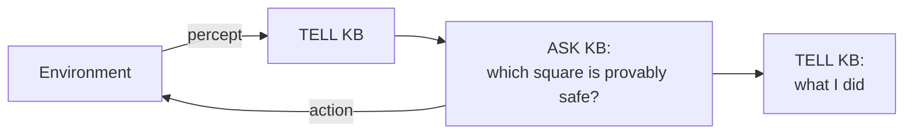

> 🌏 [中文版](/posts/learning/2026-09-29-cmu-07380-lecture-02-logical-agents)

**Video status: Checked: no corresponding recording link listed on the public official page.** [Source details](#course-video-sources)

This is Lecture 2 of [CMU 07-380 AI & ML II](https://www.cs.cmu.edu/~07380/), Fall 2026: Logical Agents. The previous post ([Lecture 1 guide](/en/posts/learning/2026-09-29-cmu-07380-lecture-01-introduction-en)) noted that the early part of 07-380 stays in a world without uncertainty. This lecture is the first stop: an agent sees a few clues and has to **prove** a square is safe, not guess.

Everything below follows the course site and materials as fetched on 2026-09-29.

## Course video sources

The official Fall 2026 schedule and assignment list have been checked: public resources include slides, pre-readings, demonstrations and assignments, but no public recording link for the corresponding lectures. This article is therefore a materials-based guide with no corresponding lecture player. This observation concerns the public official page and does not establish whether internal recordings exist.

Official sources:

- [CMU 07-380 Fall 2026 官方課表與教材](https://www.cs.cmu.edu/~07380/)

Checked on 2026-10-10.

## Official materials and what I read

- [Lec2 slides (pdf)](https://www.cs.cmu.edu/~07380/lectures/07380_F26_Lec2_Logical_Agents.pdf) and the [inked version](https://www.cs.cmu.edu/~07380/lectures/07380_F26_Lec2_Logical_Agents_inked.pdf) (pptx is also on the site)
- Pre-reading: [PR1 Propositional Logic notes](https://www.cs.cmu.edu/~07380/notes/07380_F26_Notes_Propositional_Logic.pdf) (listed as Prop Logic.pdf, checkpoint due 8/25)
- [Recitation 1 handout](https://www.cs.cmu.edu/~07380/recitations/Recitation1_07380_f26.pdf) and [solutions](https://www.cs.cmu.edu/~07380/recitations/Recitation1_07380_f26_sol.pdf)
- The two examples on the site: Minesweeper and the [Wumpus World simulator](https://thiagodnf.github.io/wumpus-world-simulator/)

The Schedule also lists AIMA Ch. 7.1–7 as optional reading, which I did not cite page by page. The official syllabus lists no public recording link. The pre-reading checkpoint lives on Canvas and is CMU-only.

Openness: the slides, notes, recitation and solutions are all public, which is enough to self-study this lecture.

## The question: not a path, but "what can I be sure of right now?"

The warm-up is Minesweeper: mark some green squares ✓ safe, X unsafe, or ? unsure. Then the slides ask what we are actually looking for:

- A path, a sequence of actions? That is what 07-280 search does.
- A complete solution? That is what a CSP does.
- Neither. We want to know **what to do next**: which unvisited squares are definitely safe, which are definitely dangerous, and which are still unknown.

The PR1 notes open the same way: sometimes the hard part is not finding a sequence of actions but working out what is true given what we know.

That is the skeleton of a logical agent. The slides show AIMA's KB-AGENT: each step it TELLs the knowledge base (KB) its percept, ASKs the KB what to do, and TELLs the KB which action it took.



## Concepts: satisfiability and entailment are different questions

The slides and PR1 share one vocabulary:

| Term | Meaning |
|---|---|
| Model | One "possible world" where every symbol is assigned True or False |
| Sentence | A statement built from logic symbols and operators |
| KB | The set of sentences known to be true (rules plus observations), implicitly ANDed together |
| Query | A sentence we want to classify as provably true, provably false, or unsure |
| Satisfiable | At least one model makes the sentence true |
| Entailment `α ⊨ β` | Every model that makes α true also makes β true |

The slides map both ideas straight onto Minesweeper:

- **Is this square definitely safe?** In every configuration consistent with the clues, there is no mine here → answer with entailment.
- **Is this square possibly safe?** At least one configuration has no mine here → answer with satisfiability.

The bridge between them appears in the slides, PR1 and Recitation 1:

```text
KB ⊨ α   if and only if   KB ∧ ¬α is unsatisfiable
```

With that identity, a fast SAT solver can answer entailment questions. Negate the conclusion you want, add it to the KB, and check satisfiability. If nothing satisfies it, you have a proof. The slides call this reductio ad absurdum.

<details>
<summary>The PR1 example: Dippy eats too much candy</summary>

PR1 uses three symbols: C (ate too much candy), S (sick), L (goes to lecture), with two rules `C ⇒ S` and `S ⇒ ¬L`. With only the rules, 4 of the 8 models survive, and they disagree: the KB does not entail ¬L, because the model (C,S,L)=(F,F,T) satisfies the rules while Dippy goes to lecture. After observing C, only (T,T,F) remains, so KB ⊨ S and KB ⊨ ¬L.

The key line in the notes: every sentence you add to a KB shrinks its set of models, and a query becomes entailed once that set fits inside the query's region.

</details>

## Three algorithms

The slides list "today" as model checking (truth tables, then DPLL), theorem proving (forward chaining), and planning with logic, which slips to the next lecture.

### 1. TT-ENTAILS: enumerate every model

PR1 already covers this algorithm, and the slides walk the pseudocode again. It enumerates all 2^N models depth-first and checks each leaf: if the KB is true there, α must be true too; models where the KB is false are skipped.

The slides give the cost as `O(2^N)` time and linear space, and note it is "the same recursion as backtracking." That line is the hook for 07-280 readers, because DPLL grows out of exactly this recursion.

### 2. DPLL: three shortcuts on top of backtracking

The slides call DPLL (Davis-Putnam-Logemann-Loveland) the core of modern SAT solvers, "essentially a backtracking search over models with some extras." It takes input in CNF:

| Trick | What it does |
|---|---|
| Early termination | Return true once every clause is satisfied; return false as soon as any clause is false, without waiting for a full assignment |
| Pure symbol | If a symbol has the same sign in every not-yet-satisfied clause, give it that value |
| Unit clause | If a clause has one literal left, set that literal true; this often cascades into new unit clauses |

Only when none of these apply does DPLL pick a symbol and branch on true and false. If you have read the [07-280 CSP guide](/posts/ai/2026-08-22-cmu-07280-lecture-04-constraint-satisfaction-en), the unit-clause cascade will look a lot like forward checking and constraint propagation. The slides themselves say "cf CSPs!" on the satisfiability slide.

### 3. Forward chaining: definite clauses only, in exchange for linear time

Model checking works on models. Theorem proving takes another route: start from the KB and apply inference rules to derive new sentences. The slides use Modus Ponens: given `X1 ∧ … ∧ Xn ⇒ Y` and all of X1…Xn, infer Y.

Forward chaining applies that rule until nothing new can be added. The price is that the KB may contain only **definite clauses**: a conjunction of symbols implying one symbol, or a single symbol on its own.

The pseudocode PL-FC-ENTAILS? keeps three tables:

- `count[c]`: how many premise symbols of clause c are not yet known
- `inferred[s]`: whether symbol s has been processed
- `agenda`: a queue of symbols known to be true and waiting to be processed

Each iteration pops a symbol p. If p is the query, return true. Otherwise decrement the count of every clause whose premise contains p, and when a count hits 0, push that clause's conclusion onto the agenda. The slides trace this on the KB `P⇒Q`, `L∧M⇒P`, `B∧L⇒M`, `A∧P⇒L`, `A∧B⇒L`, `A`, `B` until Q is proven.

The slides sum up:

| Algorithm | KB it accepts | Properties | Complexity |
|---|---|---|---|
| Forward chaining | Definite clauses only | Sound and complete | Linear time |
| Resolution | Any propositional KB | Sound and complete | Exponential time |

Resolution lives in the appendix under "out of scope," and the inference-rules slide marks unit and general resolution as out of scope too. The main characters of this lecture are TT-ENTAILS, DPLL and forward chaining.

## AlphaGeometry in the slides

The Schedule subtitles this lecture "Search + GenAI: Alpha Geometry." The slides contain only a little:

- A warm-up: prove that in triangle ABC with AB=AC, the two base angles are equal.
- Two Nature links: the [AlphaGeometry paper](https://www.nature.com/articles/s41586-023-06747-5), published January 2024, and a [February 2025 news story](https://www.nature.com/articles/d41586-025-00406-7) whose headline says AlphaGeometry 2 reaches the level of IMO gold medalists.
- One figure from the paper: symbolic deduction runs first. If it cannot finish, a language model constructs an auxiliary point (for the isosceles problem, "midpoint D of BC"), and symbolic deduction runs again until the problem is solved. The lower half shows IMO 2015 Problem 3.

That is all the slides say, and it is all this post says. For this lecture, AlphaGeometry shows symbolic inference doing the proving while a generative model proposes what to try next. That fits the lecture's theme of proving things with search plus logic.

## What Recitation 1 practices

[Recitation 1](https://www.cs.cmu.edu/~07380/recitations/Recitation1_07380_f26.pdf) has three parts:

1. **Concept review:** knowledge base, entailment, definite and Horn clauses, model checking, theorem proving, Modus Ponens, ending with "if you had a SAT algorithm, how would you decide A ⊨ B?"
2. **Forward chaining:** given a KB over symbols like P, W, E, S, C, B, G, count how many times the while loop runs and what it returns; then add W and run it again.
3. **Wumpus World:** mark squares A–H as safe, unsafe or unsure; write pseudocode with a black-box `PL_SATISFIES` that decides "definitely safe / definitely not safe / unsure"; then match game states to code blocks of the Hybrid-Wumpus-Agent pseudocode from AIMA 3rd ed.

That last exercise is a small version of the [HW1](/en/posts/learning/2026-09-29-cmu-07380-hw1-logic-hybrid-wumpus-en) programming assignment.

One thing to watch in the [Recitation 1 solutions](https://www.cs.cmu.edu/~07380/recitations/Recitation1_07380_f26_sol.pdf): the vocabulary list defines a clause as "a conjunction of literals," but both the PR1 notes and the slide vocabulary define a clause as a **disjunction** (OR) of literals. Go with PR1.

## Scope boundaries

- **No first-order logic.** The Schedule does not list it. The slides mention it only once, on the model-checking slide: fine for propositional logic (finitely many worlds), not easy for first-order logic.
- **Resolution is out of scope** and stays in the appendix.
- "Planning with logic" is on the slide plan but moves to the next lecture.

## Related reading

- Backtracking and constraint propagation: [07-280 Lecture 4 guide: Constraint Satisfaction](/posts/ai/2026-08-22-cmu-07280-lecture-04-constraint-satisfaction-en)
- Search and A\* (used in HW1's planning step): [07-280 Lecture 2 guide: Heuristic Search](/posts/ai/2026-08-22-cmu-07280-lecture-02-heuristic-search-en)
- The Schedule also links the [15-281 Fall 2025 propositional logic notes](https://www.cs.cmu.edu/~15281-f25/coursenotes/proplogic/index.html) as a second reading

## Things to do tonight

1. Play a round in the [Wumpus World simulator](https://thiagodnf.github.io/wumpus-world-simulator/). Before each move, write down why the next square is provably safe, and say whether that is entailment or merely satisfiability.
2. Without looking at the solutions, trace forward chaining on Recitation 1 part 2 by hand, recording agenda, count and inferred at each step.
3. Write a DPLL in under 20 lines. Start with early termination and branching only, then add unit clauses, and compare recursion counts on the same CNF.

Previous: [Lecture 1 guide: Introduction](/en/posts/learning/2026-09-29-cmu-07380-lecture-01-introduction-en). Next: [HW1 guide: Logic and the Hybrid Wumpus Agent](/en/posts/learning/2026-09-29-cmu-07380-hw1-logic-hybrid-wumpus-en).

## Update Log

- 2026-10-10: Added explicit video status and checked recording sources and access notes.

## References

- [07-380 Lecture 2: Logical Agents (pdf)](https://www.cs.cmu.edu/~07380/lectures/07380_F26_Lec2_Logical_Agents.pdf)
- [07-380 Lecture 2: Logical Agents (inked pdf)](https://www.cs.cmu.edu/~07380/lectures/07380_F26_Lec2_Logical_Agents_inked.pdf)
- [07-380 Pre-reading: Propositional Logic](https://www.cs.cmu.edu/~07380/notes/07380_F26_Notes_Propositional_Logic.pdf)
- [07-380 Recitation 1: Logical Agents](https://www.cs.cmu.edu/~07380/recitations/Recitation1_07380_f26.pdf)
- [07-380 Recitation 1 Solutions](https://www.cs.cmu.edu/~07380/recitations/Recitation1_07380_f26_sol.pdf)
- [07-380 Fall 2026 Schedule](https://www.cs.cmu.edu/~07380/#schedule)
- [Wumpus World Simulator](https://thiagodnf.github.io/wumpus-world-simulator/)
- [Trinh et al. (2024), Solving olympiad geometry without human demonstrations, Nature](https://www.nature.com/articles/s41586-023-06747-5)
- [Nature News (2025-02-07), DeepMind AI crushes tough maths problems on par with top human solvers](https://www.nature.com/articles/d41586-025-00406-7)
- [15-281 Fall 2025 Propositional Logic notes](https://www.cs.cmu.edu/~15281-f25/coursenotes/proplogic/index.html)
