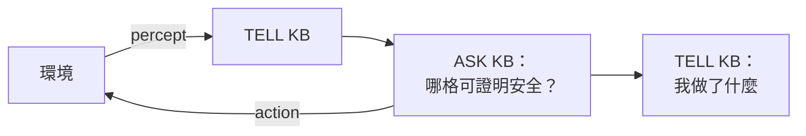

> 🌏 [English version](/en/posts/learning/2026-09-29-cmu-07380-lecture-02-logical-agents-en)

**影片狀態：已查核：官方公開頁未列對應錄影。** [影片來源與說明](#課程影片來源)

這是 [CMU 07-380 AI & ML II](https://www.cs.cmu.edu/~07380/) Fall 2026 的 Lecture 2：Logical Agents。上一講（[Lecture 1 導讀](/posts/learning/2026-09-29-cmu-07380-lecture-01-introduction)）說 07-380 前段都在確定性的世界裡，這一講是第一站：agent 看到一些線索，要**證明**某一格是安全的，而不是猜。

以下依 2026-09-29 抓取的課站與材料。

## 課程影片來源

已核對 Fall 2026 官方課表及作業清單：公開來源列出投影片、預讀、示範與作業，未列對應講次的公開錄影連結。本文因此以官方教材導讀，沒有對應講次播放器；這項結論只限官方公開頁面，不代表校內沒有錄影。

官方來源：

- [CMU 07-380 Fall 2026 官方課表與教材](https://www.cs.cmu.edu/~07380/)

查核日期：2026-10-10。

## 官方材料與讀取範圍

本文讀過的材料：

- [Lec2 投影片 pdf](https://www.cs.cmu.edu/~07380/lectures/07380_F26_Lec2_Logical_Agents.pdf) 與 [inked 版](https://www.cs.cmu.edu/~07380/lectures/07380_F26_Lec2_Logical_Agents_inked.pdf)（課站另有 pptx）
- Pre-reading：[PR1 Propositional Logic 筆記](https://www.cs.cmu.edu/~07380/notes/07380_F26_Notes_Propositional_Logic.pdf)（課站標為 Prop Logic.pdf，checkpoint 8/25 截止）
- [Recitation 1 講義](https://www.cs.cmu.edu/~07380/recitations/Recitation1_07380_f26.pdf)與[解答](https://www.cs.cmu.edu/~07380/recitations/Recitation1_07380_f26_sol.pdf)
- 課站列的兩個範例：踩地雷，以及 [Wumpus World 模擬器](https://thiagodnf.github.io/wumpus-world-simulator/)

Schedule 另外列了 AIMA Ch.7.1–7 當選讀，本文沒有逐頁引用。課站未列公開錄影連結。Pre-reading checkpoint 在 Canvas 上，只限校內。

公開程度：這一講的投影片、筆記、recitation 和解答都能匿名下載，材料層級夠自學。

## 承上問題：不是找路徑，是找「現在能確定什麼」

投影片的暖身是踩地雷：把幾個綠色格子標成 ✓ 安全、X 不安全、? 不確定。接著問一個關鍵問題：我們要找的是什麼？

- 一條路徑（一串動作）？這是 07-280 搜尋在做的事。
- 一個完整解？這是 CSP 在做的事。
- 都不是。我們要知道**下一步可以做什麼**：哪些沒走過的格子一定安全、哪些一定危險、哪些還不知道。

PR1 筆記開頭也這樣說：有時難的不是找一串動作，而是從已知推出「什麼是真的」。

這就是 logical agent 的骨架。投影片畫的是 AIMA 的 KB-AGENT：每一步把感知 TELL 給 knowledge base（KB），再 ASK 它該做什麼，最後把自己做的動作也 TELL 回去。



## 概念脈絡：satisfiable 與 entailment 是兩個不同的問題

投影片和 PR1 用同一組詞彙：

| 詞 | 意思 |
|---|---|
| Model | 所有符號都指定了 True／False 的一個「可能世界」 |
| Sentence | 用邏輯符號與運算子組成的陳述 |
| KB | 已知為真的句子集合（規則＋觀察），隱含是全部 AND 起來 |
| Query | 想知道「可證為真、可證為假、還是不確定」的句子 |
| Satisfiable | 至少有一個 model 讓句子為真 |
| Entailment `α ⊨ β` | 每個讓 α 為真的 model 也讓 β 為真 |

投影片把這兩個概念直接對到踩地雷：

- **這格一定安全嗎？**所有符合線索的配置裡，這格都沒有雷 → 用 entailment 回答。
- **這格有可能安全嗎？**存在至少一種配置讓這格沒雷 → 用 satisfiability 回答。

兩者之間有一座橋，投影片、PR1 和 Recitation 1 都有講：

```text
KB ⊨ α   當且僅當   KB ∧ ¬α 不可滿足
```

有了這條，一個「夠快的 SAT solver」就能拿來回答 entailment：把要證明的結論取否定，丟進 KB，看它能不能被滿足。不能滿足，就證明了。投影片把這叫 reductio ad absurdum（歸謬法）。

<details>
<summary>PR1 的小例子：Dippy 吃太多糖</summary>

PR1 用三個符號：C（吃太多糖）、S（生病）、L（去上課），兩條規則 `C ⇒ S`、`S ⇒ ¬L`。只有規則時，8 個 model 剩 4 個，彼此意見不一：KB 不 entail ¬L，因為 (C,S,L)=(F,F,T) 這個 model 滿足規則但 Dippy 去上課了。觀察到 C 之後，只剩 (T,T,F) 一個 model，於是 KB ⊨ S，也 KB ⊨ ¬L。

筆記的重點句是：每加一句話到 KB，model 集合只會縮小；當它縮到整個落在 query 的區域裡，entailment 就成立。

</details>

## 三種演算法

投影片把「今天的內容」列成：model checking（truth table、DPLL）、theorem proving（forward chaining），以及下一講的 planning with logic。

### 1. TT-ENTAILS：列舉所有 model

PR1 已經把這個演算法講完，投影片再帶一次虛擬碼。做法是深度優先列舉所有 2^N 個 model，在每個葉子檢查：如果 KB 為真，α 也必須為真；KB 為假的 model 直接跳過。

投影片標了複雜度：`O(2^N)` 時間、線性空間，而且「跟回溯是同一種遞迴」。這句是給 07-280 讀者的鉤子，DPLL 就是從這裡長出來的。

### 2. DPLL：在回溯上加三個捷徑

投影片說 DPLL（Davis-Putnam-Logemann-Loveland）是現代 SAT solver 的核心，本質上是「在 model 上做回溯搜尋，外加幾個額外技巧」。它吃 CNF 格式的輸入：

| 技巧 | 做法 |
|---|---|
| 提早終止 | 所有 clause 都已滿足就回傳 true；任何一個 clause 已經為假就回傳 false，不必等所有符號指定完 |
| Pure symbol | 某符號在所有還沒滿足的 clause 裡正負號都一樣，就直接給它那個值 |
| Unit clause | 某個 clause 只剩一個 literal，就指定讓它成立的值；這常常連鎖產生新的 unit clause |

三招都用不上時，才挑一個符號分成 true／false 兩支遞迴。如果你讀過 [07-280 的 CSP 導讀](/posts/ai/2026-08-22-cmu-07280-lecture-04-constraint-satisfaction)，unit clause 的連鎖跟 forward checking 和 constraint propagation 很像。投影片自己在 satisfiability 那頁也寫了「cf CSPs!」。

### 3. Forward chaining：只吃 definite clause，換來線性時間

Model checking 看的是 model。Theorem proving 換一條路：從 KB 出發，套推論規則一步步推出新句子。投影片用的規則是 Modus Ponens：知道 `X1 ∧ … ∧ Xn ⇒ Y` 且 X1…Xn 都成立，就推出 Y。

Forward chaining 一直套這條規則直到推不出新東西為止。代價是 KB 只能有 **definite clause**：左邊是一串符號的 AND，右邊是一個符號，或者單一個符號本身。

虛擬碼 PL-FC-ENTAILS? 用三個表：

- `count[c]`：clause c 的前提還有幾個符號沒成立
- `inferred[s]`：符號 s 是否已經處理過
- `agenda`：已知為真、等著處理的符號佇列

每次從 agenda 取出一個符號 p，如果 p 就是 query 就回傳 true。否則把所有前提含 p 的 clause 的 count 減一，減到 0 就把結論放進 agenda。投影片用 `P⇒Q`、`L∧M⇒P`、`B∧L⇒M`、`A∧P⇒L`、`A∧B⇒L`、`A`、`B` 這組 KB 一步步推出 Q。

投影片的結論是：

| 演算法 | 適用的 KB | 性質 | 複雜度 |
|---|---|---|---|
| Forward chaining | 只含 definite clause | sound 且 complete | 線性時間 |
| Resolution | 任何命題邏輯 KB | sound 且 complete | 指數時間 |

Resolution 在投影片的附錄，標題寫「out of scope」，推論規則頁也把 unit／general resolution 標成 out of scope。所以這一講的主角是 TT-ENTAILS、DPLL 和 forward chaining。

## 投影片裡的 AlphaGeometry

Schedule 把這講的副標寫成「Search + GenAI: Alpha Geometry」。投影片的內容其實不多：

- 暖身題：證明等腰三角形 ABC（AB=AC）的兩底角相等。
- 附了兩篇 Nature 連結：2024 年 1 月刊出的 [AlphaGeometry 論文](https://www.nature.com/articles/s41586-023-06747-5)，以及 2025 年 2 月的[新聞報導](https://www.nature.com/articles/d41586-025-00406-7)（標題說 AlphaGeometry 2 達到 IMO 金牌學生水準）。
- 一張論文裡的流程圖：先用 symbolic deduce 推；推不出來，就由語言模型 construct 一個輔助點（等腰三角形那題是「取 BC 中點 D」），再回去做符號推演，直到 solved。圖的下半部是 IMO 2015 第 3 題的例子。

投影片只有這些，沒有展開 AlphaGeometry 的細節。本文也只寫到這裡。對這一講來說，它的角色是示範「符號推論負責證明，生成模型負責提出下一步要試什麼」，跟本講「用搜尋加邏輯證明」的主線接得上。

## Recitation 1 在練什麼

[Recitation 1](https://www.cs.cmu.edu/~07380/recitations/Recitation1_07380_f26.pdf) 分三段：

1. **概念複習**：knowledge base、entailment、definite 與 Horn clause、model checking、theorem proving、Modus Ponens，最後問「手上有 SAT 演算法，怎麼判斷 A ⊨ B？」
2. **Forward chaining**：給一個含 P、W、E、S、C、B、G 等符號的 KB，要你數 while loop 跑幾次、回傳什麼；再加入 W 重跑一次。
3. **Wumpus World**：先在圖上把 A–H 格標成安全、不安全或不確定；再用一個黑盒 `PL_SATISFIES` 寫出判斷「一定安全／一定不安全／不確定」的虛擬碼；最後把幾個遊戲狀態對應到 AIMA 第 3 版的 Hybrid-Wumpus-Agent 虛擬碼區塊。

第 3 段的最後一題，就是 [HW1](/posts/learning/2026-09-29-cmu-07380-hw1-logic-hybrid-wumpus) 程式作業的縮小版。

讀解答時留意一個小地方：[Recitation 1 解答](https://www.cs.cmu.edu/~07380/recitations/Recitation1_07380_f26_sol.pdf)的詞彙表把 clause 寫成「A conjunction of literals」，但 PR1 筆記和投影片的 vocab 頁都定義 clause 是 literal 的 **disjunction**（OR）。以 PR1 為準。

## 範圍邊界

- **不講一階邏輯**。Schedule 沒有列，投影片只在 model checking 那頁提一句「對命題邏輯可行（有限多個世界），對一階邏輯不容易」。
- **Resolution 是 out of scope**，只在附錄。
- 「Planning with logic」在投影片的計畫裡，但實際放到下一講。

## 延伸對照

- 回溯與限制傳播：[07-280 Lecture 4 導讀：Constraint Satisfaction](/posts/ai/2026-08-22-cmu-07280-lecture-04-constraint-satisfaction)
- 搜尋與 A\*（HW1 的規劃部分會用到）：[07-280 Lecture 2 導讀：Heuristic Search](/posts/ai/2026-08-22-cmu-07280-lecture-02-heuristic-search)
- 課站 Schedule 另外連了 [15-281 Fall 2025 的命題邏輯筆記](https://www.cs.cmu.edu/~15281-f25/coursenotes/proplogic/index.html)，可以當第二份讀物

## 今晚可以做的動作

1. 打開 [Wumpus World 模擬器](https://thiagodnf.github.io/wumpus-world-simulator/)玩一局。每走一步前，先在紙上寫出你「證明」下一格安全的理由，並分清楚它是 entailment 還是只是 satisfiable。
2. 不看解答，把 Recitation 1 第 2 題的 forward chaining 手跑一遍，每一步記下 agenda、count、inferred 三個表。
3. 自己寫一個 20 行以內的 DPLL，先只做提早終止和分支，再加 unit clause，比較兩版在同一組 CNF 上的遞迴次數。

上一篇：[Lecture 1 導讀：Introduction](/posts/learning/2026-09-29-cmu-07380-lecture-01-introduction)。下一篇：[HW1 導讀：Logic and the Hybrid Wumpus Agent](/posts/learning/2026-09-29-cmu-07380-hw1-logic-hybrid-wumpus)。

## 更新紀錄

- 2026-10-10：標註影片狀態，核對錄影來源與取得方式。

## 參考資料

- [07-380 Lecture 2: Logical Agents（pdf）](https://www.cs.cmu.edu/~07380/lectures/07380_F26_Lec2_Logical_Agents.pdf)
- [07-380 Lecture 2: Logical Agents（inked pdf）](https://www.cs.cmu.edu/~07380/lectures/07380_F26_Lec2_Logical_Agents_inked.pdf)
- [07-380 Pre-reading: Propositional Logic](https://www.cs.cmu.edu/~07380/notes/07380_F26_Notes_Propositional_Logic.pdf)
- [07-380 Recitation 1: Logical Agents](https://www.cs.cmu.edu/~07380/recitations/Recitation1_07380_f26.pdf)
- [07-380 Recitation 1 Solutions](https://www.cs.cmu.edu/~07380/recitations/Recitation1_07380_f26_sol.pdf)
- [07-380 Fall 2026 Schedule](https://www.cs.cmu.edu/~07380/#schedule)
- [Wumpus World Simulator](https://thiagodnf.github.io/wumpus-world-simulator/)
- [Trinh et al. (2024), Solving olympiad geometry without human demonstrations, Nature](https://www.nature.com/articles/s41586-023-06747-5)
- [Nature News (2025-02-07), DeepMind AI crushes tough maths problems on par with top human solvers](https://www.nature.com/articles/d41586-025-00406-7)
- [15-281 Fall 2025 Propositional Logic notes](https://www.cs.cmu.edu/~15281-f25/coursenotes/proplogic/index.html)
