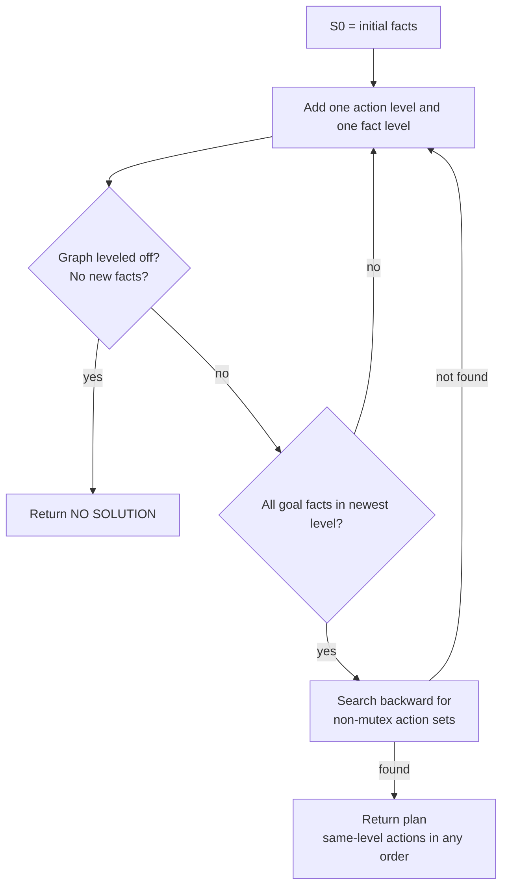

> 🌏 [中文版](/posts/learning/2026-09-29-cmu-07380-lecture-03-classical-planning)

This is Lecture 3 of [CMU 07-380 AI & ML II](https://www.cs.cmu.edu/~07380/), Fall 2026: **Classical Planning** (8/31). [HW1](/en/posts/learning/2026-09-29-cmu-07380-hw1-logic-hybrid-wumpus-en) had the agent use logic to decide which squares were safe and A\* to decide how to get there. This lecture asks the next question: if *changing the world* also needs reasoning, where does logic break down, and what representation lets us write it down?

The short version: **planning is not a new problem, it is the same search problem with a different state representation.** Once states are factored, a planner can read the action descriptions and compute its own heuristic, without a human staring at the puzzle.

Everything here reflects the [course site as of 2026-09-29](https://www.cs.cmu.edu/~07380/#schedule); the site notes that the schedule is subject to change.

## Course video sources

This article follows official notes, slides, or assignments. This check of the official public pages did not verify a public recording for the material covered here; it does not establish that no recording exists.

Course and recording entries:

- [cmu-07-380 — official course materials and recording index](https://www.cs.cmu.edu/~07380/)

## Official materials and scope

- [Lec3 slides (inked PDF)](https://www.cs.cmu.edu/~07380/lectures/07380_F26_Lec3_Classical_Planning_inked.pdf): pre-reading polls, SATPlan, STRIPS, Blocks world, PDDL, state-space search, and the start of GraphPlan
- The **first half** of the [Lec4 slides (inked PDF)](https://www.cs.cmu.edu/~07380/lectures/07380_F26_Lec4_Planning_II_inked.pdf): GraphPlan mutexes, backward search, the delete-relaxed planning graph, Fast Forward, Fast Downward. The motion-planning half is covered in the [next post on RRT](/en/posts/learning/2026-09-29-cmu-07380-lecture-04-motion-planning-rrt-en)
- [PR2 Planning pre-reading notes](https://www.cs.cmu.edu/~07380/notes/07380_F26_Notes_Planning.pdf) (checkpoint due 8/30)
- [Recitation 2](https://www.cs.cmu.edu/~07380/recitations/Recitation2_07380_f26.pdf) and its [solutions](https://www.cs.cmu.edu/~07380/recitations/Recitation2_07380_f26_sol.pdf) (9/4): successor-state axioms, GraphPlan vocabulary, the Crane problem, h<sub>max</sub>/h<sub>add</sub>
- The site assigns AIMA Ch. 11.1-3. This post does not draw on the textbook; it only lists the range

**Access level**: slides, notes, recitation, and solutions for this lecture are all public, so this part reaches A3 (enough to self-study). Canvas checkpoint questions are CMU-only. The course as a whole is still A2 (in progress); the grading scale is defined in the [global AI/CS course map](/en/posts/learning/2026-08-21-global-ai-cs-course-map-en).

## The problem carried over: logic cannot easily say "change"

In Wumpus World, once the agent shoots its arrow, it no longer has one. Writing `HaveArrow ∧ ShootArrow ⇒ ¬HaveArrow` is wrong: propositional logic has no time, so `A ∧ B ⇒ ¬A` just forbids A and B from being true together. Poll 1 in the slides uses this sentence (with `HaveTrap`) to show how absurd its truth table is.

The fix is a separate symbol for each changing fact (a fluent) at each time step, such as `HaveArrow_t`. But effect axioms alone (`Shoot_t ⇒ ¬HaveArrow_{t+1}`) are not enough, because nothing says the arrow is still there if you did not shoot. The slides enumerate the eight truth-value rows of an effect axiom, including "the trap magically appears" and "the trap got lost", none of which it rules out.

The correct form is a **successor-state axiom**: one biconditional per fluent per time step, saying the fluent holds next step if and only if some action made it true, or it was already true and no action made it false. Recitation 2 Problem 1 drills this form on a Mini Pacman grid.

The pre-reading's verdict is blunt: the logic is right, and nobody can maintain it. Every axiom must list every action that could affect its fluent; add one action and you must revisit every axiom, with no warning if you miss one. The notes call this the **frame problem** and stress that it is an engineering failure, not a logical one.

The encoding is not thrown away, though. Fix a horizon T, write the axioms as CNF, and hand them to a SAT solver: any satisfying model is a T-step plan. That is **SATPlan** in the slides.

## A new representation: STRIPS and the closed world assumption

Classical planning lets each action declare only what it changes:

| Element | Content |
|---|---|
| state | a set of facts (ground atoms), read as their conjunction |
| goal | also a set of facts, but a partial requirement: reached when `G ⊆ s` |
| action | three sets: `pre(a)`, `add(a)`, `del(a)` |
| transition | `Result(s, a) = (s \ del(a)) ∪ add(a)` |

Any fact not in the add or delete list stays unchanged. That convention is the **STRIPS assumption** (named after the 1970s Stanford Research Institute planner). The long "no action made it false" half of every successor-state axiom becomes a default. The price is that actions can only add and delete facts, not state arbitrary logical relations. Basic STRIPS also allows only positive preconditions, so checking applicability is a single subset test.

The other key piece is the **closed world assumption (CWA)**: any fact not listed in a state is false. That keeps states compact. The three-block initial state in the notes lists 6 facts; spelling out the false ones would take more than 20. The notes also flag an easy confusion: a knowledge base is an open world (unknown means unknown), while a state is a closed world (every fact has a definite value). A state is a model, not a knowledge base.

Polls 3 and 4 test exactly this: which facts belong to the state representation, and what actually happens when you move from the left picture to the right one? (Delete `Clear(A)` and `InHand(C)`; add `On(C, A)` and `HandEmpty()`.)

## PDDL: domain and problem in separate files

[PDDL](https://www.cs.cmu.edu/~07380/notes/07380_F26_Notes_Planning.pdf) is the common input format for planners. The slides and notes use the same Blocks world files:

```lisp
(define (domain blocksworld)
  (:requirements :strips)
  (:predicates (on ?x ?y) (onTable ?x) (clear ?x) (holding ?x) (handEmpty))
  (:action stack
    :parameters (?x ?y)
    :precondition (and (holding ?x) (clear ?y))
    :effect (and (on ?x ?y) (clear ?x) (handEmpty)
                 (not (holding ?x)) (not (clear ?y)))))

(define (problem bw-3blocks)
  (:domain blocksworld)
  (:objects a b c)
  (:init (on c a) (onTable a) (onTable b) (clear c) (clear b) (handEmpty))
  (:goal (and (on a b) (on b c))))
```

Three things to read for:

1. **The domain holds the reusable part**: predicates and action schemas. **The problem holds this instance**: objects, `:init`, `:goal`. Poll 5 asks about exactly this split.
2. PDDL has no `:add` or `:delete`. In `:effect`, a bare literal is an add and a literal under `not` is a delete.
3. `:init` must be complete, because the CWA reads everything missing as false; `:goal` is deliberately partial. The notes call an incomplete `:init` the most common beginner error: the planner does not warn you, it just cheerfully solves the wrong problem.

Schemas must be **grounded** (variables replaced by every object tuple) before search. Three blocks give just 18 ground actions; the notes' air cargo example (10 airports, 50 planes, 200 packages) gives 205,000. The description fits on half a page; the problem does not get any smaller.

## Planning becomes search again, and hits a wall

With `Result`, the state-transition graph comes for free: nodes are states, and each applicable action is an edge. The notes' Forward-Search uses only operations already defined: applicability is a subset test, expansion is `Result`, and the goal test is another subset test. A FIFO `Pop` gives BFS; a priority queue ordered by `g + h` gives A\*.

The slides note that BFS is sound, complete, and optimal here (with unit action costs). The problem is size: the state-space tree grows exponentially in the number of predicates. Three blocks are still tiny (22 reachable states, average branching factor 1.91, optimal plan of 6 steps). For air cargo the notes estimate an average branching factor around 2000 and a goal depth of 41, and point out that the real difficulty is **too many applicable actions, almost none of which help**.

The notes also list the complexity: deciding whether a plan exists (PlanSat) is PSPACE-complete; the bounded version is NP-complete; **with the delete lists removed**, finding some plan becomes easy and only optimal planning stays NP-hard. The notes call this row the most productive idea in classical planning, and the rest of the lecture builds on it.

## GraphPlan: two relaxations buy a polynomial-size graph

Introduced at the end of Lec3 and finished in Lec4, **GraphPlan** is a relaxation of classical planning search:

1. Actions may happen simultaneously
2. Facts are only added, never deleted

The slides use socks and shoes. S<sub>0</sub> holds the initial facts (`bareL()`, `bareR()`), A<sub>0</sub> holds every applicable action plus no-ops, S<sub>1</sub> is the union of their effects, and so on. This planning graph is linear in the number of predicates, and building it takes polynomial time and space.

Having every goal fact in some layer does not mean the goal is reachable; you still need to check **mutexes**. The slides list three action-level mutexes, and Recitation 2's Vocabulary Check adds two fact-level ones:

| Level | Name | Condition |
|---|---|---|
| action | Inconsistency | one action's effect negates the other's effect |
| action | Interference | one action's effect negates the other's precondition |
| action | Competing needs | the actions' preconditions are mutex in the previous fact level |
| fact | Negation | the two conditions negate each other |
| fact | Inconsistent support | every pair of actions producing the two conditions is mutex |

The cake example in the slides sticks: in A<sub>0</sub>, `Eat` and `no-op(Have)` have inconsistent effects; in A<sub>1</sub>, `Eat` needs `Have` while `Bake` needs `¬Have`, so they have competing needs.

The algorithm as a whole:



The slides' verdict has two halves. The bad news: the backward search is still exponential, since it may try every combination of actions at every level. The good news: the planning graph is extremely useful for more modern techniques, which leads to relaxation heuristics.

## Relaxation heuristics: drop deletes, get FF's and Fast Downward's h

The first half of Lec4 pushes the relaxation further: **do not add delete effects at all**. The slides call this "cheating even more than GraphPlan". With deletes gone, the mutexes disappear too, and the relaxed problem is very fast to solve. It does not give a good real plan, but it gives a really good heuristic.

The slides then name two systems. **Fast Forward** used planning-graph heuristics to speed up state-space search. [**Fast Downward**](https://www.fast-downward.org/) also uses planning-graph heuristics plus a few other tricks, and the slides call it the modern planning workhorse. So we end up back in state-space search, except the heuristic is now computed by the planner from the PDDL. The notes close on the same idea: in 07-280 you invented a heuristic by staring at a puzzle; from here on, the planner computes it for itself.

### A worked example you can redo: h<sub>max</sub> and h<sub>add</sub>

Recitation 2 Problem 5 is a peanut-butter-and-jelly sandwich: goal `PB Slice ∧ Jelly Slice`, every action costs 1. The solutions give:

- Converting to the relaxed graph Π<sup>+</sup> removes every delete edge pointing to `¬Toasted Bread`
- h<sub>max</sub> = 2: the maximum cost of any single subgoal. It is admissible, because a conjunction can never cost less than its most expensive conjunct
- h<sub>add</sub> = 4: the sum of subgoal costs. It is **not** admissible, because subgoals can share work (both need toasted bread first)
- The relaxed plan costs 3: toast bread, apply peanut butter, apply jelly

Check it yourself: both subgoals need the same "toasted bread" fact, so h<sub>add</sub> counts the toasting twice and overestimates, while h<sub>max</sub> only looks at the most expensive subgoal and underestimates. The relaxed plan sits between them, and it is where FF-style heuristics come from.

## Recitation and homework mapping

- **Recitation 2 §1**: the successor-state axiom form, plus a set of true/false `|=` questions. Parts (d)–(f) are the ones worth doing: when the left side has no models, the entailment holds vacuously.
- **Recitation 2 §2–4**: which assumption GraphPlan relaxes (several non-mutex actions at once), the mutex vocabulary, and the first two planning-graph levels of the Crane problem.
- **HW2 written Problem 1** (10 pts) and **programming Q1** (robot-cook PDDL) use this lecture directly. How they are graded and how to run the autograder is in the [HW2 guide](/en/posts/learning/2026-09-29-cmu-07380-hw2-planning-lp-en).

## Related reading

- The foundation of state-space search and A\*: [07-280 Lecture 2 guide](/en/posts/ai/2026-08-22-cmu-07280-lecture-02-heuristic-search-en). What is new here is that the heuristic is derived automatically from the problem description.
- SAT solvers and backtracking: [07-280 Lecture 4 CSP guide](/en/posts/ai/2026-08-22-cmu-07280-lecture-04-constraint-satisfaction-en). SATPlan hands planning to exactly this kind of solver.
- Appendix B of the pre-reading has a table that places classical planning on a wider map alongside search, MDPs, and RL. It is not in the slides, but it is useful if you have finished 07-280.

## Things to do tonight

1. Work out Poll 2 by hand: with 4 blocks, how many ground atoms does `on(block1, block2)` have? Then decide whether `on(x, x)` should be excluded.
2. Trace the six-step plan in §2.6 of the notes with `Result(s, a)`, checking at each step that the precondition is a subset of the state.
3. Without the solutions, draw S<sub>0</sub>–A<sub>0</sub>–S<sub>1</sub> for the Crane problem in Recitation 2, and find one interference, one inconsistent-effects pair, and one inconsistent-support pair.
4. Install `unified-planning[fast-downward]` and run the planner on the Blocks world files shipped with HW2 until it prints the six-step plan (commands in the [HW2 guide](/en/posts/learning/2026-09-29-cmu-07380-hw2-planning-lp-en)).

## Series navigation

- Previous: [HW1 guide: Logic and the Hybrid Wumpus Agent](/en/posts/learning/2026-09-29-cmu-07380-hw1-logic-hybrid-wumpus-en)
- Next: [Lecture 4 guide: Motion Planning, RRT samples its way through continuous space](/en/posts/learning/2026-09-29-cmu-07380-lecture-04-motion-planning-rrt-en)
- Series overview: [CMU 07-380 Fall 2026 overview](/en/posts/learning/2026-08-22-cmu-07380-fall-2026-overview-en)

## Update Log

- 2026-10-10: Added course video sources and recording access notes.

## References

- [CMU 07-380 AI & ML II Fall 2026 course site](https://www.cs.cmu.edu/~07380/)
- [07-380 Fall 2026 Lecture 3 — Classical Planning (inked PDF)](https://www.cs.cmu.edu/~07380/lectures/07380_F26_Lec3_Classical_Planning_inked.pdf)
- [07-380 Fall 2026 Lecture 4 — Classical Planning II and Motion Planning (inked PDF)](https://www.cs.cmu.edu/~07380/lectures/07380_F26_Lec4_Planning_II_inked.pdf)
- [07-380 Pre-reading: Classical Planning (PR2)](https://www.cs.cmu.edu/~07380/notes/07380_F26_Notes_Planning.pdf)
- [07-380 Recitation 2](https://www.cs.cmu.edu/~07380/recitations/Recitation2_07380_f26.pdf)
- [07-380 Recitation 2 Solutions](https://www.cs.cmu.edu/~07380/recitations/Recitation2_07380_f26_sol.pdf)
- [Fast Downward](https://www.fast-downward.org/)
