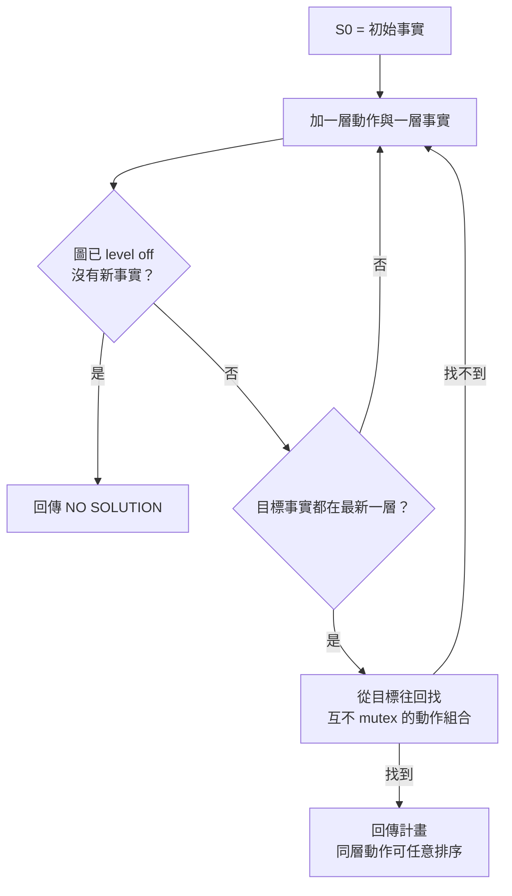

> 🌏 [English version](/en/posts/learning/2026-09-29-cmu-07380-lecture-03-classical-planning-en)

這是 [CMU 07-380 AI & ML II](https://www.cs.cmu.edu/~07380/) Fall 2026 的 Lecture 3：**Classical Planning**（8/31）。[上一篇 HW1](/posts/learning/2026-09-29-cmu-07380-hw1-logic-hybrid-wumpus) 讓 agent 用邏輯判斷哪一格安全，再用 A\* 決定怎麼走。這一講問的是下一步：如果「怎麼改變世界」本身也要推理，邏輯會卡在哪裡？換成什麼表示法才寫得下去？

一句話先講結論：**規劃不是新問題，是同一個搜尋問題換了狀態表示**。表示法換成 factored 之後，planner 可以讀懂動作的描述，自己算出 heuristic，不用人盯著題目去想。

依 [2026-09-29 課站](https://www.cs.cmu.edu/~07380/#schedule)狀態整理；課站註明 schedule 可能變動。

## 官方材料與讀取範圍

- [Lec3 投影片（inked PDF）](https://www.cs.cmu.edu/~07380/lectures/07380_F26_Lec3_Classical_Planning_inked.pdf)：pre-reading polls、SATPlan、STRIPS、Blocks world、PDDL、state-space search、GraphPlan 開頭
- [Lec4 投影片（inked PDF）](https://www.cs.cmu.edu/~07380/lectures/07380_F26_Lec4_Planning_II_inked.pdf)**前半**：GraphPlan 的 mutex、backward search、delete-relaxed planning graph、Fast Forward、Fast Downward。後半的 motion planning 留給[下一篇 RRT 導讀](/posts/learning/2026-09-29-cmu-07380-lecture-04-motion-planning-rrt)
- [PR2 Planning 預讀筆記](https://www.cs.cmu.edu/~07380/notes/07380_F26_Notes_Planning.pdf)（checkpoint 截止 8/30）
- [Recitation 2](https://www.cs.cmu.edu/~07380/recitations/Recitation2_07380_f26.pdf) 與[解答](https://www.cs.cmu.edu/~07380/recitations/Recitation2_07380_f26_sol.pdf)（9/4）：successor-state axioms、GraphPlan 詞彙、Crane 問題、h<sub>max</sub>／h<sub>add</sub>
- 課站指定閱讀 AIMA Ch. 11.1-3。本文沒有引用課本內容，只列出指定範圍

**公開程度**：這一講的投影片、預讀筆記、recitation 與解答全部公開，已達 A3（足以自學）。Canvas checkpoint 題目只限校內。全課目前仍是 A2（進行中），分級定義見[全球 AI／CS 課程地圖](/posts/learning/2026-08-21-global-ai-cs-course-map)。

## 承上問題：邏輯為什麼寫不動「改變」

Wumpus World 裡，agent 射出箭之後就沒有箭了。直接寫 `HaveArrow ∧ ShootArrow ⇒ ¬HaveArrow` 是錯的：命題邏輯沒有時間，`A ∧ B ⇒ ¬A` 只會讓 A 和 B 不能同時為真。投影片的 Poll 1 就是用這句（換成 `HaveTrap`）讓你看到它的真值表有多荒謬。

修法是給每個會變的事實（fluent）每個時間點各一個符號，例如 `HaveArrow_t`。但只寫 effect axiom（`Shoot_t ⇒ ¬HaveArrow_{t+1}`）不夠，因為沒有東西說「沒射箭的話箭還在」。投影片列出 effect axiom 的八種真值組合，其中有「陷阱憑空出現」「陷阱不見了」這些它擋不住的情況。

正解是 **successor-state axiom**：每個 fluent 每個時間步一條雙條件式，意思是「下一步為真，若且唯若某個動作讓它變真，或它原本為真而且沒有動作讓它變假」。Recitation 2 第一題用 Mini Pacman 練這個形式。

預讀筆記的判斷很直接：這套邏輯是對的，但沒人維護得了。每條 axiom 都要列出所有可能影響它的動作，新增一個動作就要回頭檢查每一條，漏了也沒有任何警告。筆記把這叫做 **frame problem**，並強調這是工程上的失敗，不是邏輯上的失敗。

這個編碼也沒有被丟掉。固定步數 T，把 axioms 寫成 CNF 交給 SAT solver，滿足的 model 就是一個 T 步計畫，這就是投影片上的 **SATPlan**。

## 換表示法：STRIPS 與 closed world assumption

Classical planning 的做法是讓動作只宣告自己改變了什麼：

| 元素 | 內容 |
|---|---|
| state | 一組事實（ground atom）的集合，讀成它們的合取 |
| goal | 也是一組事實，但只是部分要求：`G ⊆ s` 就算達成 |
| action | 三個集合：`pre(a)`、`add(a)`、`del(a)` |
| 轉移 | `Result(s, a) = (s \ del(a)) ∪ add(a)` |

沒有列在 add 或 del 的事實一律不變，這個慣例叫 **STRIPS assumption**（名稱來自 1970 年代 Stanford Research Institute 的 planner）。successor-state axiom 裡那一大串「沒有動作讓它變假」的部分，就這樣變成一個預設。代價是動作只能加事實和刪事實，不能描述任意邏輯關係。基本 STRIPS 的前置條件也只能是正面事實，所以「能不能做這個動作」只是一次子集合檢查。

另一個關鍵是 **closed world assumption（CWA）**：state 裡沒列的事實就是假的。這讓 state 很精簡。預讀筆記的三塊積木初始狀態只列 6 個事實，要把假的事實也寫出來會超過 20 個。筆記也點出一個容易混淆的地方：知識庫是 open world（不知道就是不知道），state 是 closed world（每個事實都有確定真值），state 是一個 model，不是知識庫。

投影片的 Poll 3、Poll 4 就在考這兩件事：哪些事實屬於 state 表示？從左圖移到右圖時到底做了什麼？（答案是刪掉 `Clear(A)`、`InHand(C)`，加入 `On(C, A)`、`HandEmpty()`。）

## PDDL：domain 與 problem 分兩個檔

[PDDL](https://www.cs.cmu.edu/~07380/notes/07380_F26_Notes_Planning.pdf) 是 planner 共通的輸入格式。投影片與預讀筆記用同一組 Blocks world 檔：

```lisp
(define (domain blocksworld)
  (:requirements :strips)
  (:predicates (on ?x ?y) (onTable ?x) (clear ?x) (holding ?x) (handEmpty))
  (:action stack
    :parameters (?x ?y)
    :precondition (and (holding ?x) (clear ?y))
    :effect (and (on ?x ?y) (clear ?x) (handEmpty)
                 (not (holding ?x)) (not (clear ?y)))))

(define (problem bw-3blocks)
  (:domain blocksworld)
  (:objects a b c)
  (:init (on c a) (onTable a) (onTable b) (clear c) (clear b) (handEmpty))
  (:goal (and (on a b) (on b c))))
```

三個讀法重點：

1. **domain 放可重用的部分**：predicates 和 action schemas。**problem 放這一題**：objects、`:init`、`:goal`。投影片 Poll 5 問的就是這個分工。
2. PDDL 沒有 `:add`、`:delete`。`:effect` 裡沒被 `not` 包住的是 add，被 `not` 包住的是 delete。
3. `:init` 必須完整，因為 CWA 會把沒寫的全當假；`:goal` 則刻意只寫部分。預讀筆記說漏寫 `:init` 是最常見的新手錯誤，planner 不會警告，只會開心地解錯的題目。

Schema 要先 **grounding**（把變數代入所有物件組合）才能搜尋。三塊積木只有 18 個 ground action；預讀筆記的 air cargo 例子（10 個機場、50 架飛機、200 件貨）會長出 205,000 個。描述只有半頁，問題本身並沒有變小。

## 規劃變回搜尋：forward search 與它的極限

有了 `Result`，state-transition graph 就免費拿到了：節點是 state，每個可用動作是一條邊。預讀筆記的 Forward-Search 只用三個已定義的操作：可用性是子集合檢查，展開是 `Result`，goal test 是另一個子集合檢查。`Pop` 用 FIFO 就是 BFS，用 `g + h` 排序的 priority queue 就是 A\*。

投影片說 BFS 在這裡 sound、complete、optimal（動作成本相同時）。問題在規模：狀態空間樹的大小對 predicate 數量是指數成長。三塊積木還很小（可達 22 個 state，平均 branching factor 1.91，最優計畫 6 步）。預讀筆記估 air cargo 的平均 branching factor 約 2000、目標深度 41，並指出真正的困難是**分支太多，而且大多數動作對目標沒有幫助**。

預讀筆記也列了複雜度：判斷計畫是否存在（PlanSat）是 PSPACE-complete；限制步數是 NP-complete；**如果把 delete list 拿掉**，找一個計畫變得容易，只剩求最優仍是 NP-hard。筆記說這一行是 classical planning 最有生產力的觀察，下面整段都建立在它上面。

## GraphPlan：兩個放寬換來多項式大小的圖

Lec3 最後介紹、Lec4 接著講完的 **GraphPlan**，是 classical planning 搜尋的一種 relaxation：

1. 允許多個動作同時發生
2. 事實只加不刪

投影片用穿襪子穿鞋當例子：S<sub>0</sub> 放初始事實（`bareL()`、`bareR()`），A<sub>0</sub> 放所有能做的動作加上 no-op，S<sub>1</sub> 是它們效果的聯集，依此交替延伸。這張 planning graph 的大小對 predicate 數量是線性的，建圖是多項式時間與空間。

目標事實全部出現在某一層，不代表真的做得到，還要檢查 **mutex**。投影片列出動作層的三種 mutex，Recitation 2 的 Vocabulary Check 再補上事實層的兩種：

| 層 | 名稱 | 條件 |
|---|---|---|
| 動作 | Inconsistency | 一個動作的效果否定另一個的效果 |
| 動作 | Interference | 一個動作的效果否定另一個的前置條件 |
| 動作 | Competing needs | 兩個動作的前置條件在上一層事實層互斥 |
| 事實 | Negation | 兩個條件互為否定 |
| 事實 | Inconsistent support | 能產生這兩個條件的每一對動作都互斥 |

投影片的蛋糕例子很好記：在 A<sub>0</sub>，`Eat` 和 `no-op(Have)` 效果互相矛盾；在 A<sub>1</sub>，`Eat` 需要 `Have`、`Bake` 需要 `¬Have`，是 competing needs。

整個演算法的流程如下：



投影片的結論分兩半。壞消息是 backward search 仍是指數時間，可能要試遍每一層的動作組合。好消息是 planning graph 對後來的技術非常有用，這就接到 relaxation heuristic。

## Relaxation heuristic：刪掉 delete，得到 FF 與 Fast Downward 的 h

Lec4 前半把放寬再推一步：**完全不加 delete effects**。投影片的說法是「比 GraphPlan 還更作弊」。刪除效果沒了，mutex 也跟著消失，這個 relaxed problem 解起來非常快。它給不出好的真實計畫，但給得出很好的 heuristic。

投影片接著點名兩個系統：**Fast Forward** 用 planning graph heuristic 加速狀態空間搜尋；[**Fast Downward**](https://www.fast-downward.org/) 同樣用 planning graph heuristic，再加上一些其他技巧，投影片稱它是現代規劃的主力。繞了一圈又回到狀態空間搜尋，只是 heuristic 變成 planner 自己從 PDDL 算出來的。預讀筆記的收尾也是這個意思：07-280 的 heuristic 要自己盯著題目發明，這裡的 heuristic 由 planner 自動算。

### 可重做的小例子：h<sub>max</sub> 與 h<sub>add</sub>

Recitation 2 第 5 題是花生醬果醬吐司：目標 `PB Slice ∧ Jelly Slice`，每個動作成本 1。解答給出：

- 轉成 relaxed graph Π<sup>+</sup> 時，拿掉的是所有指向 `¬Toasted Bread` 的 delete 邊
- h<sub>max</sub> = 2：取達成單一子目標的最大成本。它 admissible，因為達成合取目標的成本不可能低於其中任何一個子目標
- h<sub>add</sub> = 4：把每個子目標的成本加總。它**不** admissible，因為子目標之間可能共用工作（兩個都要先烤吐司）
- relaxed plan 的成本是 3：烤吐司、塗花生醬、塗果醬

自己驗證一次：兩個子目標都需要「烤過的吐司」這個前置事實，h<sub>add</sub> 把烤吐司算了兩次，所以高估；h<sub>max</sub> 只看最貴的一個子目標，所以低估。relaxed plan 走在兩者之間，也是 FF 風格 heuristic 的來源。

## Recitation 與 HW 對應

- **Recitation 2 §1**：successor-state axiom 的形式，加上一串 `|=` 真假判斷。最值得做的是 (d)–(f)：左邊沒有任何 model 時，entailment 會空虛地成立。
- **Recitation 2 §2–4**：什麼假設被 GraphPlan 放寬（可同時做多個非 mutex 動作）、mutex 詞彙、Crane 問題的前兩層 planning graph。
- **HW2 書面第 1 題**（10 分）與**程式作業 Q1**（robot-cook PDDL）直接用到這一講。作業怎麼考、怎麼跑 autograder，見 [HW2 導讀](/posts/learning/2026-09-29-cmu-07380-hw2-planning-lp)。

## 延伸對照

- 狀態空間搜尋與 A\* 的地基：[07-280 Lecture 2 導讀](/posts/ai/2026-08-22-cmu-07280-lecture-02-heuristic-search)。這一講的新意在於 heuristic 可以從問題描述自動算出，不用人設計。
- SAT solver 與回溯的關係：[07-280 Lecture 4 CSP 導讀](/posts/ai/2026-08-22-cmu-07280-lecture-04-constraint-satisfaction)。SATPlan 就是把規劃丟給這類 solver。
- 預讀筆記附錄 B 有一張表，把 classical planning 放進搜尋、MDP、RL 的大地圖。這張表不在投影片裡，但對讀完 07-280 的人很有用。

## 今晚可以做的動作

1. 手算投影片 Poll 2：4 塊積木時，`on(block1, block2)` 有幾個 ground atom？再想想要不要排除 `on(x, x)`。
2. 把預讀筆記 §2.6 的六步計畫逐步用 `Result(s, a)` 算一次，確認每一步的前置條件都是子集合。
3. 不看解答畫 Recitation 2 Crane 問題的 S<sub>0</sub>–A<sub>0</sub>–S<sub>1</sub>，各找一組 interference、inconsistent effects、inconsistent support。
4. 裝 `unified-planning[fast-downward]`，用 HW2 附的 blocksworld 檔跑一次 planner，看它印出六步計畫（指令見 [HW2 導讀](/posts/learning/2026-09-29-cmu-07380-hw2-planning-lp)）。

## 系列導覽

- 上一篇：[HW1 導讀：Logic and the Hybrid Wumpus Agent](/posts/learning/2026-09-29-cmu-07380-hw1-logic-hybrid-wumpus)
- 下一篇：[Lecture 4 導讀：Motion Planning，RRT 在連續空間用取樣找路](/posts/learning/2026-09-29-cmu-07380-lecture-04-motion-planning-rrt)
- 系列總覽：[CMU 07-380 Fall 2026 總覽](/posts/learning/2026-08-22-cmu-07380-fall-2026-overview)

## 參考資料

- [CMU 07-380 AI & ML II Fall 2026 課站](https://www.cs.cmu.edu/~07380/)
- [07-380 Fall 2026 Lecture 3 — Classical Planning（inked PDF）](https://www.cs.cmu.edu/~07380/lectures/07380_F26_Lec3_Classical_Planning_inked.pdf)
- [07-380 Fall 2026 Lecture 4 — Classical Planning II and Motion Planning（inked PDF）](https://www.cs.cmu.edu/~07380/lectures/07380_F26_Lec4_Planning_II_inked.pdf)
- [07-380 Pre-reading: Classical Planning（PR2）](https://www.cs.cmu.edu/~07380/notes/07380_F26_Notes_Planning.pdf)
- [07-380 Recitation 2](https://www.cs.cmu.edu/~07380/recitations/Recitation2_07380_f26.pdf)
- [07-380 Recitation 2 Solutions](https://www.cs.cmu.edu/~07380/recitations/Recitation2_07380_f26_sol.pdf)
- [Fast Downward](https://www.fast-downward.org/)
