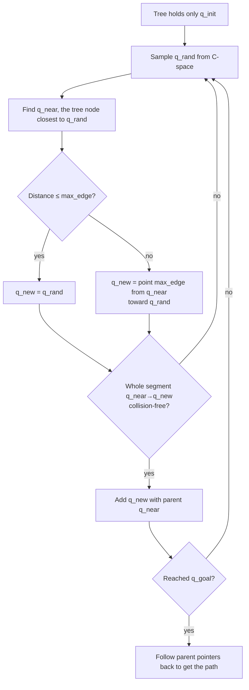

> 🌏 [中文版](/posts/learning/2026-09-29-cmu-07380-lecture-04-motion-planning-rrt)

This is Lecture 4 of [CMU 07-380 AI & ML II](https://www.cs.cmu.edu/~07380/), Fall 2026 (9/2). The schedule lists it as "Motion Planning: RRT"; the slides are titled "Classical Planning II and Motion Planning". The first half finishes GraphPlan and relaxation heuristics, which live in the [previous post on Lecture 3](/en/posts/learning/2026-09-29-cmu-07380-lecture-03-classical-planning-en). This post covers only the second half: **how do you plan when the state is continuous and cannot be enumerated?**

The previous lecture's world was made of finitely many facts; it could be huge, but it was finite. Joint angles on a robot arm or a game character's coordinates are real numbers, so there are infinitely many states and BFS cannot even finish the first layer. This lecture's answer: stop enumerating and start sampling.

Everything here reflects the [course site as of 2026-09-29](https://www.cs.cmu.edu/~07380/#schedule); the site notes that the schedule is subject to change.

## Official materials and scope

- The second half of the [Lec4 slides (inked PDF)](https://www.cs.cmu.edu/~07380/lectures/07380_F26_Lec4_Planning_II_inked.pdf): the Among Us and Robot Cook motivation, configuration space, RRT, collision handling, completeness and optimality, RRT\*
- The three interactive demos on the site: [Piano Mover](https://www.cs.cmu.edu/~pvirtue/AIS/modules/planning/piano_mover.html), [Robot Cook](https://www.cs.cmu.edu/~pvirtue/AIS/modules/planning/pancake_robot.html), and [Robot Cook N-link](https://www.cs.cmu.edu/~pvirtue/AIS/modules/planning/pancake_robot_nlink.html)
- [Recitation 2 solutions](https://www.cs.cmu.edu/~07380/recitations/Recitation2_07380_f26_sol.pdf) §6: hand-computed RRT on a warehouse robot. This lecture has no recitation of its own; RRT practice is the last section of Recitation 2
- The site assigns AIMA Ch. 26.5. This post does not draw on the textbook
- There is no pre-reading for this lecture

**Access level**: slides, all three demos, and the recitation solutions are public, and the matching HW2 programming assignment ships starter code and a local autograder, so this part reaches A3. The course as a whole is still A2 (in progress); see the [global AI/CS course map](/en/posts/learning/2026-08-21-global-ai-cs-course-map-en) for the scale.

## From discrete to continuous: configuration space

The slides open with a question: how do you write an Among Us agent that moves from one location to another? Then comes the Robot Cook: a two-link arm working in front of a pancake griddle.

The central idea is **configuration space (C-space)**. A physical state s is not the same thing as a configuration q describing the robot's pose. The Piano Mover demo makes this concrete: the piano's pose is fully described by three numbers, position (x, y) and rotation θ, so in C-space the whole piano shrinks to a single point, and configurations where it would hit furniture form C-obstacles. Poll 3 in the slides asks how many dimensions the Piano Mover C-space has.

The right panel of the Robot Cook demo is the (θ<sub>1</sub>, θ<sub>2</sub>) plane: the arm moves around the kitchen on the left while a single dot moves on the right. The N-link version lets you set 2–6 joints. Its page warns that beyond two links the right panel is only a 2-D slice, so the projected tree can seem to pass through obstacles; that is just the shadow of a higher-dimensional tree.

The summary slide gives two options: **chop the continuous space into a discrete grid**, or **sample the continuous space**. RRT is the second.

## RRT: pick a random point, find its nearest neighbor, don't go too far

The slides give the algorithm as a rewritten nursery rhyme: "Pick a random point, and find its nearest neighbor; never let it get too far away." The steps:



The slides are careful about collisions:

- If q<sub>rand</sub> is inside an obstacle, you can reject it and resample, or still extend toward it to get q<sub>new</sub>
- If q<sub>new</sub> is infeasible, reject it and resample
- **Check the whole line segment**, not just its endpoint, or a step can cut through a wall
- The agent can only move so far per step, so the RRT path must be chopped into short pieces and converted into actions

### A worked example: one extension

The tree has two nodes, (0, 0) and (2, 0); `max_edge = 1.5`; the sampler returns q<sub>rand</sub> = (2, 4).

```text
dist((0,0), (2,4)) = √(4+16) ≈ 4.47
dist((2,0), (2,4)) = 4.00        → q_near = (2,0)
4.00 > 1.5, so take a partial step:
direction = ((2,4) − (2,0)) / 4 = (0, 1)
q_new = (2,0) + 1.5·(0,1) = (2, 1.5)
```

Then check the whole segment from (2, 0) to (2, 1.5) and add the node only if it is clear. Recitation 2 §6.5 has the same structure with nastier numbers: the nearest neighbor beats the runner-up by only 0.123, and the solutions point out that you have to compute, not eyeball. They also note that `max_edge` is only an upper bound on edge length; edges get shorter as samples land close to a dense tree.

## Two properties of RRT: it gets there, but it does not get better

**Completeness.** The slides say RRT can be probabilistically complete. The Recitation 2 solutions define it precisely: if a solution exists, the probability of finding one tends to 1 as the number of samples tends to infinity. There is no finite-time guarantee, and RRT can never report that no solution exists.

The slides list two improvements: **goal bias**, which with some probability uses q<sub>goal</sub> as q<sub>rand</sub>, and **RRT-Connect**, which grows a second tree from the goal. Recitation 2 §6.9 shows the goal-bias trade-off with two extremes: at probability 0 RRT is still probabilistically complete but rarely hits the goal region; at probability 1 it stops exploring entirely, the tree becomes one chain driving straight at the goal, stalls at the first wall, and loses completeness.

**Optimality.** The slides explain the cause clearly: a node's parent is fixed the moment it is created and never reconsidered. New samples can extend the tree but cannot repair a detour taken 500 iterations ago, so the final path is decided by the tree's early, sparse phase, when samples were least informative. The slides cite Karaman and Frazzoli (2011): RRT converges to a suboptimal solution with probability 1. Their conclusion: the fix is not more samples, it is allowing the tree to be rewritten.

## RRT*: use the tree's path costs

RRT\* adds two tricks to RRT, both based on the path cost from the root to a node:

1. **Find a better parent**: instead of connecting to the single nearest q<sub>near</sub>, find all tree nodes within radius R and choose the one minimizing `cost(q_parent) + c(q_parent, q_new)`.
2. **Rewire the neighborhood**: after attaching q<sub>new</sub>, for each neighbor within R, if `cost(q_new) + c(q_new, q_neighbor) < cost(q_neighbor)`, make q<sub>new</sub> that neighbor's parent.

### A worked example: one best-parent step and one rewire

Root r = (0, 0) with cost 0; A = (0, 2) with parent r and cost 2; B = (2, 2) with parent A and cost 4. New node q<sub>new</sub> = (1, 1), R = 1.5, no obstacles. All three nodes are √2 ≈ 1.41 from q<sub>new</sub>, so all are within the radius.

```text
Choose parent:
  via r: 0 + 1.41 = 1.41   ← lowest
  via A: 2 + 1.41 = 3.41
  via B: 4 + 1.41 = 5.41
q_new attaches to r, cost(q_new) = 1.41

Rewire:
  A: 1.41 + 1.41 = 2.83, not less than 2, unchanged
  B: 1.41 + 1.41 = 2.83 < 4, reparent to q_new
```

B used to be reachable only through A at cost 4; with q<sub>new</sub> it drops to 2.83. Plain RRT cannot make this repair because it never revisits a parent.

The summary slide: RRT is not optimal; RRT\* considers minimal path cost as samples are added and rewires parents as needed, so **the path keeps improving and converges to optimal**. The Recitation 2 solutions add that RRT\* changes optimality (it becomes asymptotically optimal), not completeness, which was already as strong as sampling allows.

## Recitation and homework mapping

- **Recitation 2 §6**: a fully hand-computed warehouse robot (12 × 10 m bay, two obstacles, ε = 2.0, goal bias 0.10): C-space dimension, nearest neighbor, steering, collision checks, goal test, path extraction, and behavior under changed parameters. One line from §6.4 is worth remembering: switch to a six-joint arm and not a single line of the algorithm changes, only the distance metric and the collision checker.
- **HW2 programming Q2–Q7**: implement segment checking, nearest node, RRT, best parent, rewire, and RRT\* in `rrt.py`, then watch the Among Us crewmate and the Robot Cook arm plan for themselves. Details in the [HW2 guide](/en/posts/learning/2026-09-29-cmu-07380-hw2-planning-lp-en).

## Related reading

- The slides' "Beyond RRT" page points to Wikipedia's list of RRT variants; the lecture does not go further.
- For path search on a discrete grid, see the [07-280 Lecture 2 guide](/en/posts/ai/2026-08-22-cmu-07280-lecture-02-heuristic-search-en). RRT\*'s `cost + c` comparison is the same intuition as UCS's `g(n)`, only on a randomly grown tree.

## Things to do tonight

1. Open the [Piano Mover demo](https://www.cs.cmu.edu/~pvirtue/AIS/modules/planning/piano_mover.html), pick the "Doorway" room, and rotate θ to see how the C-obstacle slice changes.
2. Open the [N-link demo](https://www.cs.cmu.edu/~pvirtue/AIS/modules/planning/pancake_robot_nlink.html) and plan to the same goal with 2 and 4 links, once with RRT and once with RRT\*, then compare the trees.
3. Do Recitation 2 §6.5–6.7 without the solutions, computing every distance instead of eyeballing.
4. Change A to (0, 1) in the RRT\* example above and redo the best-parent and rewire steps.

## Series navigation

- Previous: [Lecture 3 guide: Classical Planning, PDDL, State-Space Search, and Relaxation Heuristics](/en/posts/learning/2026-09-29-cmu-07380-lecture-03-classical-planning-en)
- Next: [HW2 guide: Classical and Motion Planning, from robot-cook PDDL to RRT* to graphing LPs](/en/posts/learning/2026-09-29-cmu-07380-hw2-planning-lp-en)
- Series overview: [CMU 07-380 Fall 2026 overview](/en/posts/learning/2026-08-22-cmu-07380-fall-2026-overview-en)

## References

- [CMU 07-380 AI & ML II Fall 2026 course site](https://www.cs.cmu.edu/~07380/)
- [07-380 Fall 2026 Lecture 4 — Classical Planning II and Motion Planning (inked PDF)](https://www.cs.cmu.edu/~07380/lectures/07380_F26_Lec4_Planning_II_inked.pdf)
- [Demo: Piano Mover Configuration Space](https://www.cs.cmu.edu/~pvirtue/AIS/modules/planning/piano_mover.html)
- [Demo: Pancake Robot Configuration Space (Robot Cook)](https://www.cs.cmu.edu/~pvirtue/AIS/modules/planning/pancake_robot.html)
- [Demo: Robot Cook N-Link Arm RRT](https://www.cs.cmu.edu/~pvirtue/AIS/modules/planning/pancake_robot_nlink.html)
- [07-380 Recitation 2 Solutions](https://www.cs.cmu.edu/~07380/recitations/Recitation2_07380_f26_sol.pdf)
- [07-380 HW2 programming assignment: Classical and Motion Planning](https://www.cs.cmu.edu/~07380/assignments/planning/)
