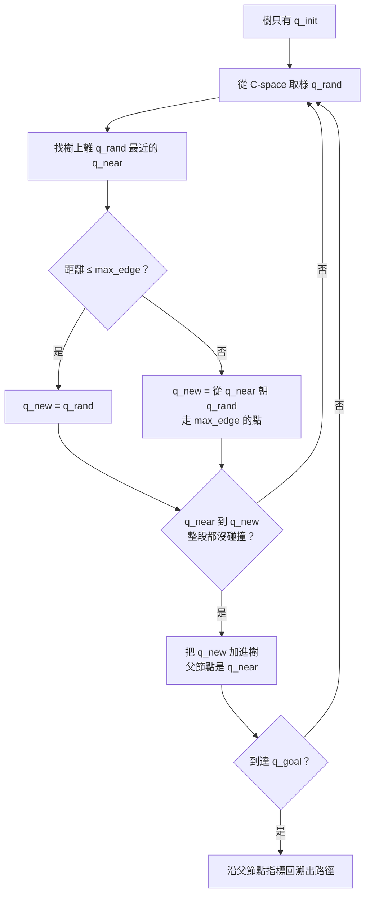

> 🌏 [English version](/en/posts/learning/2026-09-29-cmu-07380-lecture-04-motion-planning-rrt-en)

**影片狀態：已查核：官方公開頁未列對應錄影。** [影片來源與說明](#課程影片來源)

這是 [CMU 07-380 AI & ML II](https://www.cs.cmu.edu/~07380/) Fall 2026 的 Lecture 4（9/2）。課站 schedule 把它標成「Motion Planning：RRT」，投影片的標題是「Classical Planning II and Motion Planning」。前半講完 GraphPlan 與 relaxation heuristic，那部分收在[上一篇 Lecture 3 導讀](/posts/learning/2026-09-29-cmu-07380-lecture-03-classical-planning)。本文只講後半：**狀態連續、沒辦法枚舉的時候，要怎麼規劃？**

上一篇的世界由有限個事實組成，最多就是很大。機械手臂的關節角度、遊戲角色的座標是實數，狀態有無限多個，BFS 連第一層都展不完。這一講的答案是：不枚舉，改用取樣。

依 [2026-09-29 課站](https://www.cs.cmu.edu/~07380/#schedule)狀態整理；課站註明 schedule 可能變動。

## 課程影片來源

已核對 Fall 2026 官方課表及作業清單：公開來源列出投影片、預讀、示範與作業，未列對應講次的公開錄影連結。本文因此以官方教材導讀，沒有對應講次播放器；這項結論只限官方公開頁面，不代表校內沒有錄影。

官方來源：

- [CMU 07-380 Fall 2026 官方課表與教材](https://www.cs.cmu.edu/~07380/)

查核日期：2026-10-10。

## 官方材料與讀取範圍

- [Lec4 投影片（inked PDF）](https://www.cs.cmu.edu/~07380/lectures/07380_F26_Lec4_Planning_II_inked.pdf)後半：Among Us 與 Robot Cook 的動機、configuration space、RRT、碰撞處理、completeness 與 optimality、RRT\*
- 課站列出的三個互動 demo：[Piano Mover](https://www.cs.cmu.edu/~pvirtue/AIS/modules/planning/piano_mover.html)、[Robot Cook](https://www.cs.cmu.edu/~pvirtue/AIS/modules/planning/pancake_robot.html)、[Robot Cook N-link](https://www.cs.cmu.edu/~pvirtue/AIS/modules/planning/pancake_robot_nlink.html)
- [Recitation 2 解答](https://www.cs.cmu.edu/~07380/recitations/Recitation2_07380_f26_sol.pdf) §6：倉庫機器人的 RRT 手算題。這一講沒有自己的 recitation，RRT 練習放在 Recitation 2 最後一節
- 課站指定閱讀 AIMA Ch. 26.5。本文沒有引用課本內容
- 這一講沒有 pre-reading 筆記

**公開程度**：投影片、三個 demo 與 recitation 解答都公開，對應的 HW2 程式作業也有 starter 與本機 autograder，這一段已達 A3。全課目前仍是 A2（進行中），分級見[全球 AI／CS 課程地圖](/posts/learning/2026-08-21-global-ai-cs-course-map)。

## 從離散跳到連續：configuration space

投影片的開場問題是：要怎麼寫一個 Among Us 的 agent，讓它從一個地點走到另一個地點？接著是 Robot Cook：一支兩節的機械手臂在煎餅台前工作。

關鍵概念是 **configuration space（C-space）**。物理空間裡的狀態 s，跟描述機器人姿態的 configuration q 是兩回事。Piano Mover demo 把這件事做得很直觀：鋼琴的姿態由位置 (x, y) 和旋轉角 θ 三個數字完整描述，所以在 C-space 裡整台鋼琴縮成一個點；會讓鋼琴撞到家具的 configuration 形成 C-obstacle。投影片的 Poll 3 問的就是 Piano Mover 的 C-space 有幾維。

Robot Cook demo 的右半邊畫的是 (θ<sub>1</sub>, θ<sub>2</sub>) 平面：手臂在左邊的廚房移動，右邊只是一個點在動。N-link 版本可以把關節數調到 2–6。頁面說明提醒，超過兩節時右邊只能畫一張二維切片，樹投影上去看起來會穿過障礙物，那只是高維樹的影子。

投影片的總結給出兩條路：**把連續空間切成離散格子**，或者**在連續空間裡取樣**。RRT 是後者。

## RRT：挑一個隨機點，找最近的鄰居，別走太遠

投影片用一首改寫的童謠記演算法：「Pick a random point, and find its nearest neighbor; never let it get too far away.」對應的步驟是：



投影片對碰撞講得很細：

- q<sub>rand</sub> 落在障礙物裡時，可以直接丟掉重抽，也可以照樣朝它延伸出 q<sub>new</sub>
- q<sub>new</sub> 不合法就丟掉重抽
- **要檢查整段線段**，不能只看端點，否則一步可能穿牆
- agent 每一步能移動的距離有限，所以 RRT 找到的路徑還要切成小段、轉成動作

### 可重做的小例子：一次延伸

樹上有兩個節點 (0, 0) 與 (2, 0)，`max_edge = 1.5`，抽到 q<sub>rand</sub> = (2, 4)。

```text
dist((0,0), (2,4)) = √(4+16) ≈ 4.47
dist((2,0), (2,4)) = 4.00        → q_near = (2,0)
4.00 > 1.5，走部分步長：
方向 = ((2,4) − (2,0)) / 4 = (0, 1)
q_new = (2,0) + 1.5·(0,1) = (2, 1.5)
```

然後檢查 (2, 0) 到 (2, 1.5) 整段是否碰撞，沒撞才加進樹。Recitation 2 §6.5 有同樣結構、但數字更刁的題目：最近鄰只贏第二名 0.123，解答特別提醒這種情況要算，不能用目測。它也指出 `max_edge` 只是邊長的上限，樣本落在樹附近時邊會更短。

## RRT 的兩個性質：會找到，但不會變好

**Completeness**。投影片說 RRT 可以是 probabilistically complete。Recitation 2 解答給出精確定義：如果解存在，樣本數趨近無限時找到解的機率趨近 1；它沒有有限時間的保證，也永遠沒辦法回報「無解」。

投影片列了兩個改進：**goal bias**，以某個機率直接把 q<sub>goal</sub> 當成 q<sub>rand</sub>；以及 **RRT-Connect**，從終點也長一棵樹。Recitation 2 §6.9 用兩個極端說明 goal bias 的取捨：機率 0 仍然 probabilistically complete，只是很少碰到目標區；機率 1 則完全不探索，樹變成一條直衝目標的鏈，撞到第一面牆就卡死，失去 completeness。

**Optimality**。投影片把原因講得很清楚：節點的父節點在建立那一刻就固定，之後不會重新考慮。後來的樣本可以延伸樹，但修不了 500 次迭代前走的彎路，所以最終路徑是由樹最早、樣本最稀疏、資訊最少的階段決定的。投影片引用 Karaman 與 Frazzoli（2011）：RRT 以機率 1 收斂到次佳解。投影片給的修法是讓樹可以被改寫，多抽樣本沒有用。

## RRT*：利用樹上的路徑成本

RRT\* 在 RRT 上加兩個技巧，兩個都用到「從根到節點的路徑成本」：

1. **找更好的父節點**：不只接到最近的 q<sub>near</sub>，而是找出半徑 R 內所有節點，挑讓 `cost(q_parent) + c(q_parent, q_new)` 最小的那個當父節點。
2. **重接鄰居（rewire）**：q<sub>new</sub> 接好之後，檢查半徑 R 內每個鄰居，如果 `cost(q_new) + c(q_new, q_neighbor) < cost(q_neighbor)`，就把那個鄰居的父節點改成 q<sub>new</sub>。

### 可重做的小例子：一次 best parent 加一次 rewire

根 r = (0, 0)，成本 0；A = (0, 2)，父節點 r，成本 2；B = (2, 2)，父節點 A，成本 4。新節點 q<sub>new</sub> = (1, 1)，R = 1.5，假設沒有障礙。三個節點到 q<sub>new</sub> 的距離都是 √2 ≈ 1.41，都在半徑內。

```text
選父節點：
  經 r：0 + 1.41 = 1.41   ← 最小
  經 A：2 + 1.41 = 3.41
  經 B：4 + 1.41 = 5.41
q_new 接到 r，cost(q_new) = 1.41

重接鄰居：
  A：1.41 + 1.41 = 2.83，不小於 2，不動
  B：1.41 + 1.41 = 2.83 < 4，改接到 q_new
```

B 原本要繞 A 才到得了，成本 4；有了 q<sub>new</sub> 之後降到 2.83。普通 RRT 做不到這種修正，因為它不會回頭改父節點。

投影片的總結：RRT 不最優；RRT\* 在加入樣本的過程中考慮最小路徑成本、必要時重接父節點，**路徑會一直變好，收斂到最優**。Recitation 2 解答補充，RRT\* 改的是 optimality（變成 asymptotically optimal），completeness 已經是取樣方法能給的最強程度，沒有再變強。

## Recitation 與 HW 對應

- **Recitation 2 §6**：倉庫機器人（12 × 10 m、兩個障礙物、ε = 2.0、goal bias 0.10）的完整手算：C-space 維度、最近鄰、steering、碰撞判斷、goal test、路徑回溯、參數改變後的行為。§6.4 有一句很值得記：改成六關節手臂時，演算法一行都不用改，只換距離函數和碰撞檢查。
- **HW2 程式作業 Q2–Q7**：在 `rrt.py` 裡實作線段檢查、最近節點、RRT、best parent、rewire、RRT\*，最後讓 Among Us 船員和 Robot Cook 手臂自己規劃。細節見 [HW2 導讀](/posts/learning/2026-09-29-cmu-07380-hw2-planning-lp)。

## 延伸對照

- 投影片的「Beyond RRT」頁指向 Wikipedia 上的 RRT 變體清單，這一講沒有展開。
- 離散格子上的路徑搜尋可以回頭看 [07-280 Lecture 2 導讀](/posts/ai/2026-08-22-cmu-07280-lecture-02-heuristic-search)。RRT\* 的 `cost + c` 比較跟 UCS 的 `g(n)` 是同一個直覺，只是發生在一棵隨機長出來的樹上。

## 今晚可以做的動作

1. 打開 [Piano Mover demo](https://www.cs.cmu.edu/~pvirtue/AIS/modules/planning/piano_mover.html)，選「Doorway」房間，轉動 θ 看 C-obstacle 的切片怎麼變。
2. 打開 [N-link demo](https://www.cs.cmu.edu/~pvirtue/AIS/modules/planning/pancake_robot_nlink.html)，同一個目標分別用 2 節與 4 節手臂、RRT 與 RRT\* 各規劃一次，比較樹的形狀。
3. 不看解答做 Recitation 2 §6.5–6.7，每一步都算出距離，不用目測。
4. 把上面 RRT\* 的例子改成 A = (0, 1)，重算一次 best parent 和 rewire，看結果怎麼變。

## 系列導覽

- 上一篇：[Lecture 3 導讀：Classical Planning，PDDL、狀態空間搜尋與 relaxation heuristic](/posts/learning/2026-09-29-cmu-07380-lecture-03-classical-planning)
- 下一篇：[HW2 導讀：Classical and Motion Planning，從 robot-cook PDDL 到 RRT* 再到 LP 圖解](/posts/learning/2026-09-29-cmu-07380-hw2-planning-lp)
- 系列總覽：[CMU 07-380 Fall 2026 總覽](/posts/learning/2026-08-22-cmu-07380-fall-2026-overview)

## 更新紀錄

- 2026-10-10：標註影片狀態，核對錄影來源與取得方式。

## 參考資料

- [CMU 07-380 AI & ML II Fall 2026 課站](https://www.cs.cmu.edu/~07380/)
- [07-380 Fall 2026 Lecture 4 — Classical Planning II and Motion Planning（inked PDF）](https://www.cs.cmu.edu/~07380/lectures/07380_F26_Lec4_Planning_II_inked.pdf)
- [Demo: Piano Mover Configuration Space](https://www.cs.cmu.edu/~pvirtue/AIS/modules/planning/piano_mover.html)
- [Demo: Pancake Robot Configuration Space（Robot Cook）](https://www.cs.cmu.edu/~pvirtue/AIS/modules/planning/pancake_robot.html)
- [Demo: Robot Cook N-Link Arm RRT](https://www.cs.cmu.edu/~pvirtue/AIS/modules/planning/pancake_robot_nlink.html)
- [07-380 Recitation 2 Solutions](https://www.cs.cmu.edu/~07380/recitations/Recitation2_07380_f26_sol.pdf)
- [07-380 HW2 程式作業：Classical and Motion Planning](https://www.cs.cmu.edu/~07380/assignments/planning/)
