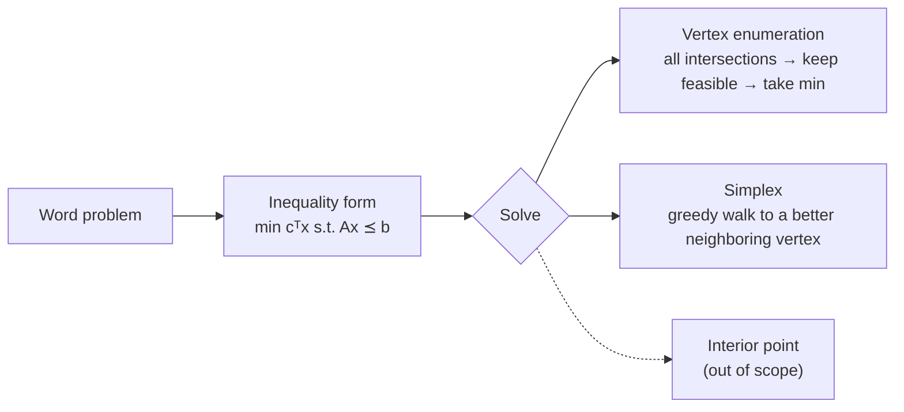

> 🌏 [中文版](/posts/learning/2026-09-29-cmu-07380-lecture-05-linear-programming)

This is Lecture 5 of [CMU 07-380 AI & ML II](https://www.cs.cmu.edu/~07380/), Fall 2026: **Continuous Optimization: LP** (9/9). The [previous post on HW2](/en/posts/learning/2026-09-29-cmu-07380-hw2-planning-lp-en) closed out the planning module. This lecture opens a new module, "Optimization."

In [07-280 Lecture 8](/en/posts/ai/2026-08-22-cmu-07280-lecture-08-optimization-en) we learned gradient descent: a smooth objective, no constraints, follow the slope downhill. LP is the opposite case. The objective is linear, so its gradient is the same everywhere and never reaches zero. What decides the answer is a set of **linear constraints**. Walking downhill just takes you to the edge of the feasible region, and the question becomes: which point on that edge?

The short answer: **if an LP has a finite optimum, the set of optimal points always includes at least one vertex.** A solver only has to check the intersections of constraint boundaries, not the whole plane.

Everything here reflects the [course site as of 2026-09-29](https://www.cs.cmu.edu/~07380/#schedule). The site notes that the schedule is subject to change.

## Official materials and what I read

- [Lec5 slides (inked PDF)](https://www.cs.cmu.edu/~07380/lectures/07380_F26_Lec5_Linear_Programming_inked.pdf): pre-reading polls, modeling the Diet Problem, three LP forms, the graphical view, vertex enumeration, simplex intuition, higher dimensions. A [pptx version](https://www.cs.cmu.edu/~07380/lectures/07380_F26_Lec5_Linear_Programming.pptx) is also posted
- [PR3 Linear Programming pre-reading](https://www.cs.cmu.edu/~07380/notes/07380_F26_Notes_Linear_Programming.pdf) (checkpoint due 9/8): the Diet Problem, matrix dimension checks, dot products, lines and half-planes
- The seven Desmos demos listed on the site: [Dot Product](https://www.desmos.com/calculator/ns7z4a6t7p), [Cost at points](https://www.desmos.com/calculator/k8mplulyxm), [Zero cost](https://www.desmos.com/calculator/tbzzbwta0g), [Cost contours](https://www.desmos.com/calculator/8d9kxbdq9u), [Constraint](https://www.desmos.com/calculator/hwudcts2yd), [Cost with one constraint](https://www.desmos.com/calculator/ufrnzjgyvb), [LP](https://www.desmos.com/calculator/plp1thgsbh)
- [Recitation 3-4 handout](https://www.cs.cmu.edu/~07380/recitations/Recitation3-4_07380_f26.pdf) and [solutions](https://www.cs.cmu.edu/~07380/recitations/Recitation3-4_07380_f26_sol.pdf): this post uses only Problem 1 (vertex enumeration vs. simplex) and Cargo Plane. Recitation 3 (9/11, also the day of Quiz 1) and Recitation 4 (9/18) share this one PDF
- Assigned reading: [Boyd & Vandenberghe, *Convex Optimization*](https://web.stanford.edu/~boyd/cvxbook/bv_cvxbook.pdf) §2.2.1 hyperplanes and halfspaces, §2.2.4 polyhedra, §4.3–4.3.1 linear programs and examples (the first example in §4.3.1 is the diet problem)

**Access level**: all of the above downloads freely from outside CMU, so this lecture's materials reach A3 (defined in the [global AI/CS course map](/en/posts/learning/2026-08-21-global-ai-cs-course-map-en)). The site has no lecture recordings, and the Canvas checkpoint and Quiz 1 are CMU-only.

## The starting question: from a word problem to solver input

The whole lecture runs on one Diet Problem. A restaurant sells two items, and the doctor sets three goals:

| Food | Cost | Calories | Sugar | Calcium |
|---|---:|---:|---:|---:|
| Stir-fry (per oz) | 1 | 100 | 3 | 20 |
| Boba (per fl oz) | 0.5 | 50 | 4 | 70 |

The goals are 2000 ≤ calories ≤ 2500, sugar ≤ 100 g, and calcium ≥ 700 mg. What is the cheapest way to eat?

The slides sum up the key idea as a pipeline: **Problem description → LP formulation → LP Solver**. The PR3 notes add that you should be able to move between three views of the same problem: words, the optimization form, and a picture when there are two variables.

Let x₁ be ounces of stir-fry and x₂ fluid ounces of boba. Calories have both a lower and an upper bound, so they give two inequalities. The two ≥ constraints get multiplied by −1 to become ≤. The result is inequality form:

```text
min  cᵀx          c = [1, 0.5]ᵀ
s.t. Ax ⪯ b

A = [ -100  -50 ]    b = [ -2000 ]   calorie min
    [  100   50 ]        [  2500 ]   calorie max
    [    3    4 ]        [   100 ]   sugar
    [  -20  -70 ]        [  -700 ]   calcium
```

The notes point out that after flipping, the minus signs live inside the numbers in `A` and `b`; the formulation itself has none. Slide Polls 1 and 2 test exactly this. Add a nutrition constraint and the height of `A` and the length of `b` grow. Add a menu item and the lengths of `x` and `c` and the width of `A` grow.

The slides also list two other forms: general form (adds equality constraints and a constant `d`) and standard form (`Ax = b`, `x ⪰ 0`). The course convention is **inequality form unless noted otherwise**, and the forms are interchangeable.

## The picture: constraints are half-planes, cost is a direction

The second half of PR3 builds one idea: the sign of a dot product tells you whether two vectors point roughly the same way or opposite ways. Two rules follow.

1. **Cost contours are perpendicular to c.** `cᵀx = 0` is the line through the origin perpendicular to `c`. `cᵀx = 1, 2, …` are parallel lines shifted in the direction of `c`. The slides ask how the spacing changes as `c` gets longer. It shrinks, because each step now changes the cost faster.
2. **`a` points into the infeasible side.** `aᵀx ≤ b` is a half-plane. Stepping from the boundary in the direction of `a` increases `aᵀx` and breaks the constraint. `b` only shifts the boundary; `a` alone decides which side is infeasible.

Stack the four half-planes and their intersection is the **feasible region**, all points that satisfy every constraint. Minimizing `cᵀx` means sliding a line perpendicular to `c` in the `−c` direction. The last point (or edge) it touches before leaving the region is the answer.

The same picture explains the vertex result. When that line leaves the region, it touches either a corner or a whole edge, and the ends of an edge are corners too. The Desmos demo [Cost with one constraint](https://www.desmos.com/calculator/ufrnzjgyvb) goes with slide Poll 5: does a minimizing LP with exactly one constraint always go to −∞? Drag it and you will see that when `c` points exactly opposite to `a`, the minimum sits on the boundary. Any other direction is unbounded.

## Algorithms: only look at intersections

The key slide line is "Solutions are at feasible intersections of constraint boundaries!!" Two algorithms follow.

**Vertex enumeration**

1. List every pairwise intersection of constraint boundaries. In 2-D, pick two rows of `A` and solve a 2×2 system; in N dimensions, pick N rows
2. Keep only the intersections that satisfy every inequality
3. Return the one with the lowest objective

**Simplex (intuition only)**

- Start at a feasible intersection (if none is obvious, you can solve another LP to find one)
- A "neighbor" swaps one row of the current subset for a row outside it; then check feasibility
- Move to any neighbor with a lower objective; stop when there is none

The slides call this greedy local hill-climbing that nonetheless always finds the optimum for an LP. Interior point methods are marked out of scope, with only Figure 11.2 from Boyd shown.



## A worked example you can redo: vertex enumeration on the Diet Problem

I computed this from the slide's `A` and `b`; it is not an official solution. Four constraints give six pairs:

| Pair | Intersection (x₁, x₂) | Feasible? | Cost with c=[1,0.5] |
|---|---|---|---:|
| calorie min × calorie max | parallel, none | — | — |
| calorie min × sugar | (12, 16) | yes | 20 |
| calorie min × calcium | (17.5, 5) | yes | 20 |
| calorie max × sugar | (20, 10) | yes | 25 |
| calorie max × calcium | (23.33, 3.33) | yes | 25 |
| sugar × calcium | (32.31, 0.77) | no (too many calories) | — |

Two vertices tie. That is because `c = [1, 0.5]` is exactly 1/100 of the calorie row `[100, 50]`. The cost contours run parallel to the calorie-min boundary, so the whole edge from (12, 16) to (17.5, 5) is optimal. This matches Recitation Problem 2, part 4: an LP can have infinitely many optimal solutions when the cost vector is perpendicular to a constraint boundary. Vertex enumeration still returns the correct optimal value; it just reports one of the vertices.

The branch and bound example in [the next lecture](/en/posts/learning/2026-09-29-cmu-07380-lecture-06-integer-programming-en) uses `c = [1, 0.6]`. With that cost, the unique optimal vertex is (17.5, 5), with cost 20.5.

## Recitation and homework

- **Recitation Problem 1**: given a picture of a feasible region, describe the two algorithms using vertices, intersections, and neighbors, then run simplex from point B and from point C. The solutions end at E and D, which are equally good. The lesson: where simplex stops depends on where it starts, but the optimal value does not
- **Cargo Plane**: 4 cargoes × 3 compartments, 12 variables and 10 constraints, so `A` is a sparse 10×12 matrix. The solutions spell out the modeling assumptions, such as cargo being splittable and compartments being fillable. The orange-and-pineapple follow-up asks for a graph with cost contours; the answer is 9 boxes of oranges and 5 of pineapples for 105 gold pieces
- **HW2 written** Q2 Bayes the Bat (8 pts), Q3 Graphing LPs (6 pts), and Q4 Feasible Regions (9 pts) all drill this lecture's modeling and graphing. See the [HW2 guide](/en/posts/learning/2026-09-29-cmu-07380-hw2-planning-lp-en)
- **HW3 programming**, [Linear and Integer Programming](https://www.cs.cmu.edu/~07380/assignments/optimization), Q1–Q3 has you write the three steps of vertex enumeration: find intersections, filter feasible ones, pick the best. HW3 is due 10/1, and this series does not post solutions

## Connections

- LP fits naturally after [07-280 CSPs](/en/posts/ai/2026-08-22-cmu-07280-lecture-04-constraint-satisfaction-en). The slides write a CSP as "any `x` that satisfies the constraints"; an LP picks the cheapest such `x`
- The slides ask, next to the LP form, whether linear regression or neural-net training is an LP. Squared error is not a linear objective, and neural nets are further still. That is the line between LP and general optimization (`fᵢ(x) ≤ 0`)
- The site also links the [15-281 Fall 2025 LP course notes](https://www.cs.cmu.edu/~15281-f25/coursenotes/linearprog/index.html) as a second explanation

## Things to do tonight

1. Open [LP: Constraint](https://www.desmos.com/calculator/hwudcts2yd), drag `b` negative, and confirm that `a` still points into the shaded (infeasible) side.
2. Compute the six intersections in the table with numpy, then change `c` to `[1, 0.6]` and see which vertex wins.
3. Without the solutions, write out Cargo Plane's 12 variables and 10 constraints and check that `A` is 10×12.

## Series navigation

- Previous: [HW2 guide: Classical and Motion Planning, from Robot-Cook PDDL to RRT\* to Graphing LPs](/en/posts/learning/2026-09-29-cmu-07380-hw2-planning-lp-en)
- Next: [Lecture 6: Integer Programming, Relax to an LP and Branch and Bound](/en/posts/learning/2026-09-29-cmu-07380-lecture-06-integer-programming-en)
- Series overview: [CMU 07-380 Fall 2026 Overview](/en/posts/learning/2026-08-22-cmu-07380-fall-2026-overview-en)

## References

- [CMU 07-380 AI & ML II Fall 2026 course site](https://www.cs.cmu.edu/~07380/)
- [07-380 Fall 2026 Lecture 5 — Linear Programming (inked PDF)](https://www.cs.cmu.edu/~07380/lectures/07380_F26_Lec5_Linear_Programming_inked.pdf)
- [07-380 Pre-reading: Linear Programming (PR3)](https://www.cs.cmu.edu/~07380/notes/07380_F26_Notes_Linear_Programming.pdf)
- [07-380 Recitation 3 & 4](https://www.cs.cmu.edu/~07380/recitations/Recitation3-4_07380_f26.pdf)
- [07-380 Recitation 3 & 4 Solutions](https://www.cs.cmu.edu/~07380/recitations/Recitation3-4_07380_f26_sol.pdf)
- [07-380 HW3 Programming: Linear and Integer Programming](https://www.cs.cmu.edu/~07380/assignments/optimization)
- [07-380 HW2 Written](https://www.cs.cmu.edu/~07380/assignments/hw2_blank.pdf)
- [Desmos: LP](https://www.desmos.com/calculator/plp1thgsbh)
- [Boyd & Vandenberghe, Convex Optimization (PDF)](https://web.stanford.edu/~boyd/cvxbook/bv_cvxbook.pdf)
- [15-281 Fall 2025 Linear Programming course notes](https://www.cs.cmu.edu/~15281-f25/coursenotes/linearprog/index.html)
