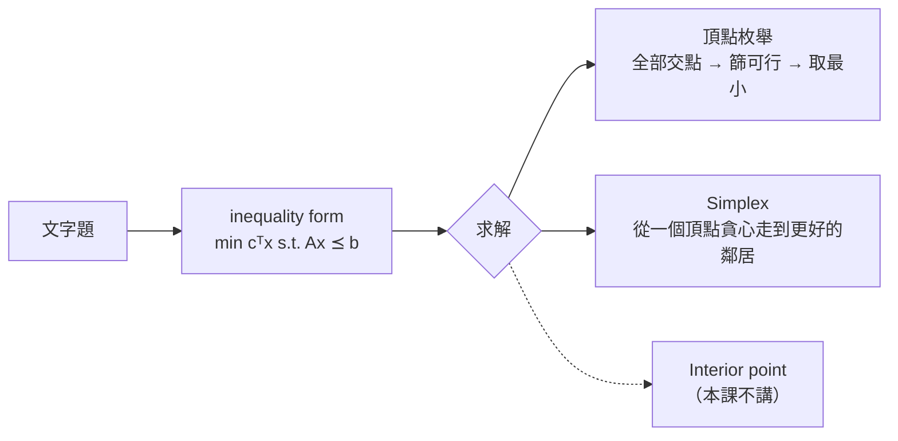

> 🌏 [English version](/en/posts/learning/2026-09-29-cmu-07380-lecture-05-linear-programming-en)

這是 [CMU 07-380 AI & ML II](https://www.cs.cmu.edu/~07380/) Fall 2026 的 Lecture 5：**Continuous Optimization: LP**（9/9）。[上一篇 HW2 導讀](/posts/learning/2026-09-29-cmu-07380-hw2-planning-lp)收掉了規劃模組，這一講換到新的模組「Optimization」。

在 [07-280 Lecture 8](/posts/ai/2026-08-22-cmu-07280-lecture-08-optimization) 我們學的是 gradient descent：objective 平滑、沒有限制，就順著梯度往下走。LP 的情況剛好相反：objective 是一條直線般單純的線性函數，梯度處處一樣、永遠不會變成零，真正決定答案的是一堆**線性限制**。這時候「往下走」只會一路走到可行域的邊界，問題變成：邊界上哪一點？

先講結論：**只要 LP 有有限的最優值，最優解集合一定包含至少一個頂點**。所以求解器只需要檢查限制邊界的交點，不必掃過整個平面。

依 [2026-09-29 課站](https://www.cs.cmu.edu/~07380/#schedule)狀態整理；課站註明 schedule 可能變動。

## 課程影片來源

本篇依官方講義、投影片或作業導讀；本次檢查官方公開頁面，尚未核實本文對應講次的公開錄影。這不表示課程沒有錄影。

課程與錄影入口：

- [cmu-07-380 — official course materials and recording index](https://www.cs.cmu.edu/~07380/)

## 官方材料與讀取範圍

- [Lec5 投影片（inked PDF）](https://www.cs.cmu.edu/~07380/lectures/07380_F26_Lec5_Linear_Programming_inked.pdf)：pre-reading polls、Diet Problem 建模、三種 LP 形式、圖解、頂點枚舉、simplex 直覺、高維。另有 [pptx 版](https://www.cs.cmu.edu/~07380/lectures/07380_F26_Lec5_Linear_Programming.pptx)
- [PR3 Linear Programming 預讀筆記](https://www.cs.cmu.edu/~07380/notes/07380_F26_Notes_Linear_Programming.pdf)（checkpoint 截止 9/8）：Diet Problem、矩陣維度檢查、dot product、直線與半平面
- 課站列的 7 個 Desmos：[Dot Product](https://www.desmos.com/calculator/ns7z4a6t7p)、[Cost at points](https://www.desmos.com/calculator/k8mplulyxm)、[Zero cost](https://www.desmos.com/calculator/tbzzbwta0g)、[Cost contours](https://www.desmos.com/calculator/8d9kxbdq9u)、[Constraint](https://www.desmos.com/calculator/hwudcts2yd)、[Cost with one constraint](https://www.desmos.com/calculator/ufrnzjgyvb)、[LP](https://www.desmos.com/calculator/plp1thgsbh)
- [Recitation 3-4 講義](https://www.cs.cmu.edu/~07380/recitations/Recitation3-4_07380_f26.pdf)與[解答](https://www.cs.cmu.edu/~07380/recitations/Recitation3-4_07380_f26_sol.pdf)：本篇只用第 1 題（頂點枚舉 vs simplex）與 Cargo Plane。Recitation 3（9/11，當天也是 Quiz 1）跟 Recitation 4（9/18）共用這一份 PDF
- 課站指定閱讀：[Boyd & Vandenberghe《Convex Optimization》](https://web.stanford.edu/~boyd/cvxbook/bv_cvxbook.pdf) §2.2.1 超平面與半空間、§2.2.4 多面體、§4.3–4.3.1 線性規劃與範例（§4.3.1 第一個例子就是 diet problem）

**公開程度**：以上都能在校外直接下載，這一講的材料已到 A3 等級（定義見[全球 AI／CS 課程地圖](/posts/learning/2026-08-21-global-ai-cs-course-map)）。課站沒有錄影連結，Canvas checkpoint 和 Quiz 1 題目只限校內。

## 承上問題：從文字題到求解器看得懂的形式

整講的主角是一道 Diet Problem。餐廳賣兩樣東西，醫生給三條目標：

| 食物 | 價格 | 熱量 | 糖 | 鈣 |
|---|---:|---:|---:|---:|
| 炒飯 stir-fry（每 oz） | 1 | 100 | 3 | 20 |
| 珍奶 boba（每 fl oz） | 0.5 | 50 | 4 | 70 |

目標是 2000 ≤ 熱量 ≤ 2500、糖 ≤ 100 g、鈣 ≥ 700 mg，問最便宜怎麼吃。

投影片把重點寫成一條流水線：**Problem description → LP formulation → LP Solver**。PR3 筆記則強調同一題有三種表示法要能互相切換：文字、最佳化式子、二維時的圖。

令 x₁ 為炒飯盎司數、x₂ 為珍奶液盎司數。熱量有上下限，所以貢獻兩條不等式；兩條 ≥ 乘上 −1 翻成 ≤。整理完就是 inequality form：

```text
min  cᵀx          c = [1, 0.5]ᵀ
s.t. Ax ⪯ b

A = [ -100  -50 ]    b = [ -2000 ]   熱量下限
    [  100   50 ]        [  2500 ]   熱量上限
    [    3    4 ]        [   100 ]   糖
    [  -20  -70 ]        [  -700 ]   鈣
```

筆記特別提醒：翻號之後負號住在 `A` 和 `b` 的數字裡，式子本身沒有負號。投影片的 Poll 1、Poll 2 就是在考這件事：多加一條營養限制，`A` 的高度和 `b` 的長度會變；多加一道菜，`x`、`c` 的長度和 `A` 的寬度會變。

投影片也列了另外兩種形式：general form（多了等式限制和常數 `d`）與 standard form（`Ax = b`、`x ⪰ 0`）。課程約定**除非特別說明，一律用 inequality form**，而且三種可以互換。

## 圖解：限制是半平面，cost 是方向

PR3 的後半在補一個觀念：dot product 的正負號決定兩個向量同向還是反向。由此推出兩條規則：

1. **等成本線垂直於 c**。`cᵀx = 0` 是通過原點、垂直於 `c` 的直線；`cᵀx = 1, 2, …` 是往 `c` 方向平移的平行線。投影片問：`c` 變長時等成本線的間距怎麼變？答案是變密，因為同樣走一步，成本漲得更快。
2. **`a` 指向不可行的那一側**。`aᵀx ≤ b` 是一個半平面，從邊界往 `a` 的方向走一步 `aᵀx` 會變大、違反限制。`b` 只負責平移邊界，哪一側不可行由 `a` 單獨決定。

把四個半平面疊起來，交集就是 **feasible region**（滿足所有限制的點）。最小化 `cᵀx`，等於拿一條垂直於 `c` 的線往 `−c` 方向推，推到最後一刻還碰得到可行域的那一點（或那一段邊）就是答案。

這張圖同時解釋了頂點定理：那條線最後離開可行域時，碰到的若不是一個角，就是一整條邊，而邊的兩端也是角。Desmos 的 [Cost with one constraint](https://www.desmos.com/calculator/ufrnzjgyvb) 對應投影片 Poll 5：只有一條限制的最小化 LP，是否一定是 −∞？拖一下就會發現，當 `c` 剛好和 `a` 反向時，最小值落在邊界上，其他方向才會無界。

## 演算法：只看交點

投影片的關鍵句是「Solutions are at feasible intersections of constraint boundaries!!」。由此給出兩個演算法：

**頂點枚舉（vertex enumeration）**

1. 列出所有限制邊界兩兩的交點。二維時，從 `A` 挑兩列解 2×2 方程組；N 維時挑 N 列
2. 只留下滿足全部不等式的交點
3. 回傳 objective 最小的那個

**Simplex（只講直覺）**

- 從一個可行交點出發（找不到現成的，可以先解另一個 LP 來找）
- 「鄰居」是把目前那組列換掉一列、補進另一列所得到的交點，再檢查可不可行
- 只要有鄰居的 objective 更低就移過去，沒有就停

投影片的評語是：這是 greedy local hill-climbing，但對 LP 永遠找得到最優解。Interior point 方法則標為 out of scope，只放了 Boyd 書中的 Figure 11.2。



## 可重做的小例子：Diet Problem 的頂點枚舉

下面是我照投影片的 `A`、`b` 自己算的，不是官方解答。4 條限制兩兩配對共 6 組：

| 配對 | 交點 (x₁, x₂) | 可行？ | c=[1,0.5] 的成本 |
|---|---|---|---:|
| 熱量下限 × 熱量上限 | 平行，沒有交點 | — | — |
| 熱量下限 × 糖 | (12, 16) | 是 | 20 |
| 熱量下限 × 鈣 | (17.5, 5) | 是 | 20 |
| 熱量上限 × 糖 | (20, 10) | 是 | 25 |
| 熱量上限 × 鈣 | (23.33, 3.33) | 是 | 25 |
| 糖 × 鈣 | (32.31, 0.77) | 否（熱量超標） | — |

有意思的是兩個頂點平手。原因是 `c = [1, 0.5]` 剛好是熱量那一列 `[100, 50]` 的 1/100，等成本線和熱量下限的邊界平行，所以 (12, 16) 到 (17.5, 5) 整條邊都是最優解。這正好對上 Recitation 第 2 大題第 4 小題：LP 可以有無限多個最優解，只要 cost 向量垂直於某條限制邊界。頂點枚舉仍然回傳正確的最優值，只是回傳其中一個頂點。

[下一講 Lec6](/posts/learning/2026-09-29-cmu-07380-lecture-06-integer-programming) 的 branch and bound 範例用的是 `c = [1, 0.6]`，那時唯一的最優頂點就是 (17.5, 5)，成本 20.5。

## Recitation 與 HW 對應

- **Recitation 第 1 題**：給一張可行域圖，要你用 vertices、intersections、neighbors 描述兩種演算法的差別，再從 B 點、C 點各跑一次 simplex。解答顯示兩條路徑分別停在 E 和 D，兩者一樣好。這題的重點是：simplex 停下的頂點取決於起點，但最優值相同
- **Cargo Plane**：4 種貨物 × 3 個艙位，12 個變數、10 條限制，`A` 是 10×12 的稀疏矩陣。解答特別列出建模時的假設，例如貨物能任意切分、能塞滿艙位。後半的柳橙鳳梨小題要畫圖和等成本線，答案是 9 箱柳橙、5 箱鳳梨、105 枚金幣
- **HW2 書面**的 Q2 Bayes the Bat（8 分）、Q3 Graphing LPs（6 分）、Q4 Feasible Regions（9 分）都在練這一講的建模和圖解，見 [HW2 導讀](/posts/learning/2026-09-29-cmu-07380-hw2-planning-lp)
- **HW3 程式作業** [Linear and Integer Programming](https://www.cs.cmu.edu/~07380/assignments/optimization) 的 Q1–Q3 要你寫出找交點、篩可行、取最優三步，也就是本講的頂點枚舉。HW3 截止日是 10/1，本系列不附解答

## 延伸對照

- LP 放在 [07-280 CSP](/posts/ai/2026-08-22-cmu-07280-lecture-04-constraint-satisfaction) 之後很合理：投影片把 CSP 寫成「任何滿足限制的 `x`」，LP 則是在滿足限制的 `x` 裡挑最便宜的
- 投影片 Question 問線性迴歸和神經網路算不算 LP：前者的平方誤差不是線性 objective，後者更不是。這也是 LP 跟 general optimization（`fᵢ(x) ≤ 0`）的分界
- 課站另列了 [15-281 Fall 2025 的 LP 課程筆記](https://www.cs.cmu.edu/~15281-f25/coursenotes/linearprog/index.html)，可當第二份講解

## 今晚可以做的動作

1. 打開 [LP: Constraint](https://www.desmos.com/calculator/hwudcts2yd)，把 `b` 拉成負數，確認 `a` 仍然指向陰影（不可行）那側。
2. 用 numpy 把上表 6 組交點算一次，再把 `c` 改成 `[1, 0.6]`，看最優頂點怎麼變。
3. 不看解答寫出 Cargo Plane 的 12 個變數和 10 條限制，檢查 `A` 的形狀是不是 10×12。

## 系列導覽

- 上一篇：[HW2 導讀：Classical and Motion Planning，從 robot-cook PDDL 到 RRT\* 再到 LP 圖解](/posts/learning/2026-09-29-cmu-07380-hw2-planning-lp)
- 下一篇：[Lecture 6 導讀：Integer Programming，先鬆弛成 LP 再用 branch and bound 分支](/posts/learning/2026-09-29-cmu-07380-lecture-06-integer-programming)
- 系列總覽：[CMU 07-380 Fall 2026 總覽](/posts/learning/2026-08-22-cmu-07380-fall-2026-overview)

## 更新紀錄

- 2026-10-10：補上課程影片來源與錄影取得方式。

## 參考資料

- [CMU 07-380 AI & ML II Fall 2026 課站](https://www.cs.cmu.edu/~07380/)
- [07-380 Fall 2026 Lecture 5 — Linear Programming（inked PDF）](https://www.cs.cmu.edu/~07380/lectures/07380_F26_Lec5_Linear_Programming_inked.pdf)
- [07-380 Pre-reading: Linear Programming（PR3）](https://www.cs.cmu.edu/~07380/notes/07380_F26_Notes_Linear_Programming.pdf)
- [07-380 Recitation 3 & 4](https://www.cs.cmu.edu/~07380/recitations/Recitation3-4_07380_f26.pdf)
- [07-380 Recitation 3 & 4 Solutions](https://www.cs.cmu.edu/~07380/recitations/Recitation3-4_07380_f26_sol.pdf)
- [07-380 HW3 Programming: Linear and Integer Programming](https://www.cs.cmu.edu/~07380/assignments/optimization)
- [07-380 HW2 Written](https://www.cs.cmu.edu/~07380/assignments/hw2_blank.pdf)
- [Desmos: LP](https://www.desmos.com/calculator/plp1thgsbh)
- [Boyd & Vandenberghe, Convex Optimization（PDF）](https://web.stanford.edu/~boyd/cvxbook/bv_cvxbook.pdf)
- [15-281 Fall 2025 Linear Programming course notes](https://www.cs.cmu.edu/~15281-f25/coursenotes/linearprog/index.html)
