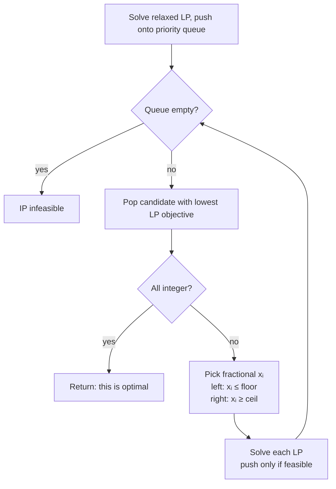

> 🌏 [中文版](/posts/learning/2026-09-29-cmu-07380-lecture-06-integer-programming)

**Video status: Checked: no corresponding recording link listed on the public official page.** [Source details](#course-video-sources)

This is Lecture 6 of [CMU 07-380 AI & ML II](https://www.cs.cmu.edu/~07380/), Fall 2026: **Discrete Optimization: ILP** (9/14). The title slide reads "Linear and Integer Programming," and the instructors are Pat Virtue and Mohammad Salameh.

[Lec5](/en/posts/learning/2026-09-29-cmu-07380-lecture-05-linear-programming-en) ended with this result: the optimum of an LP sits at a vertex of the feasible region, so checking boundary intersections is enough. This lecture sells stir-fry by the bowl and boba by the glass, so the variables must be integers. Vertices rarely land on integer grid points, and last lecture's guarantee is gone.

The answer is **branch and bound**. Pretend the integer constraint isn't there and solve the LP for an optimistic bound. If the result isn't integral, split the problem in two and keep going.

Everything here reflects the [course site as of 2026-09-29](https://www.cs.cmu.edu/~07380/#schedule). The site notes that the schedule is subject to change.

## Course video sources

The official Fall 2026 schedule and assignment list have been checked: public resources include slides, pre-readings, demonstrations and assignments, but no public recording link for the corresponding lectures. This article is therefore a materials-based guide with no corresponding lecture player. This observation concerns the public official page and does not establish whether internal recordings exist.

Official sources:

- [CMU 07-380 Fall 2026 官方課表與教材](https://www.cs.cmu.edu/~07380/)

Checked on 2026-10-10.

## Official materials and what I read

- [Lec6 slides (inked PDF)](https://www.cs.cmu.edu/~07380/lectures/07380_F26_Lec6_Integer_Programming_inked.pdf), 18 pages: LP → IP, the graphical view, relaxation, argmin vs. min notation, three polls, the branch and bound algorithm and example. A [pptx version](https://www.cs.cmu.edu/~07380/lectures/07380_F26_Lec6_Integer_Programming.pptx) is also posted
- [Desmos: IP](https://www.desmos.com/calculator/tnlo7p5plp): the only demo listed under Lec6; slide Poll 1 uses it to ask "What is the solution to this LP?"
- [Recitation 3-4 handout](https://www.cs.cmu.edu/~07380/recitations/Recitation3-4_07380_f26.pdf) and [solutions](https://www.cs.cmu.edu/~07380/recitations/Recitation3-4_07380_f26_sol.pdf): the site labels Recitation 4 (9/18) "ILP and PCA," and it shares this PDF with Recitation 3. This post uses Problem 2, Baymax's Factory, and Problem 3, Cargo Plane, and mentions Problem 4, CSP as IP, and Problem 5, 4-Queens
- Lec6 has no pre-reading notes, and the site lists no assigned reading for it

**Access level**: everything above downloads freely from outside CMU, so this lecture's materials reach A3 (defined in the [global AI/CS course map](/en/posts/learning/2026-08-21-global-ai-cs-course-map-en)). The official syllabus lists no public recording links, and the Canvas checkpoint is CMU-only.

## The starting question: what breaks when you add x ∈ ℤᴺ

The slides put the two problems side by side:

```text
LP:  min cᵀx  s.t. Ax ⪯ b
IP:  min cᵀx  s.t. Ax ⪯ b,  x ∈ ℤᴺ
```

The same slide names two variants: the stricter **Binary Integer Programming** (variables are 0 or 1) and **Mixed Integer Linear Programming**, where only some variables must be integers.

The picture is simple: lay a grid of integer points over the LP drawing, and the feasible solutions are the grid points inside the region. Two intuitive traps follow, and the slides spend a poll on each:

- **Poll 2: which is larger, the IP optimum or the LP optimum?** Dropping the integer constraint enlarges the feasible set. A minimization over a larger set can only do as well or better. So for minimization, the relaxed value satisfies `y*_LP ≤ y*_IP`. That direction is where the "bound" in branch and bound comes from. The optimal points `x*` are generally different
- **Poll 3: is it enough to check the integer points around the LP solution?** The slide draws a thin, slanted feasible region. Every grid point next to the LP optimum can be infeasible while the true integer optimum sits far away. Rounding is not an algorithm

There is also a Notation Alert slide: `x*_IP = argmin` is the optimal **point**, `y*_IP = min` is the optimal **value**, and `y = cᵀx`. The branch and bound queue is ordered by `y` but returns `x`, so keep them apart.

## Relaxation: the same idea as an A\* heuristic

Next to the relaxation slide the lecture asks, "Remember heuristics?" That points back to [07-280 heuristic search](/en/posts/ai/2026-08-22-cmu-07280-lecture-02-heuristic-search-en): loosen the original problem's constraints and get an optimistic estimate that is cheap to compute. The previous module's [Lec3 guide](/en/posts/learning/2026-09-29-cmu-07380-lecture-03-classical-planning-en) used the same trick when it dropped delete effects to build planning heuristics.

In IP, what gets loosened is `x ∈ ℤᴺ`. The LP value `y*_LP` is never worse than the true integer optimum, so it is an admissible lower bound.

## Branch and bound: the algorithm from the slides

Core steps:

1. Use an LP solver on the relaxed problem to get `x*_LP`
2. If every coordinate of `x*_LP` is an integer, return it
3. Otherwise pick a fractional coordinate `xᵢ` and create two subproblems:
   - Left branch: add `xᵢ ≤ floor(xᵢ)`
   - Right branch: add `xᵢ ≥ ceil(xᵢ)`

The full version manages subproblems with a priority queue:

1. Push the LP solution of the original problem, **ordered by LP objective value**
2. Repeat:
   - If the queue is empty, the IP is infeasible
   - Pop the candidate `x*_LP` with the lowest objective
   - If it is all integer-valued, you are done; return it
   - Otherwise pick a fractional coordinate and push the LPs for the left and right branches
3. The slides add: only push an LP onto the queue if it is **feasible**



Why is the first integer solution popped optimal? Every value in the queue is a lower bound for its branch. The popped integer solution is no worse than all the remaining bounds, so no other branch can hide a better integer solution. This is the same structure as A\*'s optimality argument with an admissible heuristic.

## A worked example you can redo: branching on the Diet Problem

The slide example keeps the Diet Problem's four constraints but changes the cost vector to `c = [1, 0.6]ᵀ`:

```text
root:  x* = (17.5, 5)    y* = 20.5    → x₁ is fractional, branch
  left  x₁ ≤ 17:  x* = (17, 6)     y* = 20.6
  right x₁ ≥ 18:  x* = (18, 4.85)  y* = 20.91
queue: 1. (17, 6), 20.6   2. (18, 4.85), 20.91
```

Pop (17, 6). Both coordinates are integers, so the search ends. The right branch's bound of 20.91 is already worse than 20.6, so it never needs expanding.

You can check the left branch by hand. At x₁ = 17, the calorie minimum requires 1700 + 50x₂ ≥ 2000, so x₂ ≥ 6. Calcium requires 340 + 70x₂ ≥ 700, which only needs x₂ ≥ 5.14. The calorie constraint is tighter, so x₂ = 6 and the cost is 17 + 3.6 = 20.6. The right branch works the same way: at x₁ = 18, calcium becomes the tighter constraint, giving x₂ ≥ 4.857.

## Recitation: Baymax's Factory

This is the recitation's most complete branch and bound problem. One ounce of medicine takes 0.2 hours of human labor and 4 hours of robot labor. One inch of bandage takes 0.5 human hours and 2 robot hours. Both sell for $30. Human hours are capped at 90 and robot hours at 800.

- **Part 1 (LP)**: fractional units are allowed, so it's an LP. Maximization becomes `min −30x − 30y`, with optimum (137.5, 125)
- **Part 2 (IP)**: whole units only. The solutions branch in this order:
  - Branch on x first: left x ≤ 137 gives (137, 125.2) with value −7866; right x ≥ 138 gives (138, 124) with value −7860
  - The left branch has the lower value and is popped first. y is fractional, so branch on y: y ≤ 125 gives (137, 125) with −7860; y ≥ 126 gives (135, 126) with −7830
  - The right branch and the left-left branch tie at −7860 and both are integral; whichever pops first is returned
- **Part 3**: fractional medicine but whole bandages makes it a MILP, and you only branch on bandages
- **Part 4**: both LP and IP can have infinitely many optimal solutions, for example when the cost vector is perpendicular to a constraint boundary that passes through infinitely many integer points

**Cargo Plane** in the same recitation is really an LP modeling problem (12 variables, 10 constraints), and the point is to state assumptions such as splittable cargo. Problems 4 and 5 rewrite the [07-280 CSP](/en/posts/ai/2026-08-22-cmu-07280-lecture-04-constraint-satisfaction-en) floor-assignment problem and 4-Queens as IPs. 4-Queens uses 0/1 variables, which makes it a binary IP.

## Homework

- **HW3 programming**, [Linear and Integer Programming](https://www.cs.cmu.edu/~07380/assignments/optimization): Q5 (7 pts) implements branch and bound in `solveIP`, reusing your Q3 LP solver; Q6 (2 pts) models a campus food-distribution problem as an IP; Q7 (3 pts) generalizes it to M providers and N communities
- Two implementation notes on the assignment page are worth copying down: test integrality with a 1e-12 tolerance, since `floor` alone is not enough; and push a **fresh** constraint list for each branch instead of mutating one already on the queue
- **HW3 written** Q1 is Bayes the Bat's portfolio IP (12 pts); see the [HW3 guide](/en/posts/learning/2026-09-29-cmu-07380-hw3-optimization-pca-map-en). HW3 is due 10/1, and this series does not post solutions

## Things to do tonight

1. Open [Desmos: IP](https://www.desmos.com/calculator/tnlo7p5plp), find the LP optimum, then the integer optimum, and see how far apart they are.
2. Without the solutions, solve the LP for each of Baymax's Factory's four subproblems and check that you get the values above.
3. Write a branch and bound in under 30 lines: `heapq` for the priority queue, `scipy.optimize.linprog` for the LPs to start, and test it on the slide's Diet Problem with `c = [1, 0.6]`.

## Series navigation

- Previous: [Lecture 5: Linear Programming, and Why the Optimum Sits at a Vertex](/en/posts/learning/2026-09-29-cmu-07380-lecture-05-linear-programming-en)
- Next: [Lecture 7: Low Rank Optimization, PCA's Reconstruction Error, Projected Variance, and LoRA](/en/posts/learning/2026-09-29-cmu-07380-lecture-07-pca-low-rank-en)
- Series overview: [CMU 07-380 Fall 2026 Overview](/en/posts/learning/2026-08-22-cmu-07380-fall-2026-overview-en)

## Update Log

- 2026-10-10: Added explicit video status and checked recording sources and access notes.
- 2026-10-10: Rechecked video status. Re-verified the live official course pages and public video sources; no public recording for this lecture was found, so the status stands.

## References

- [CMU 07-380 AI & ML II Fall 2026 course site](https://www.cs.cmu.edu/~07380/)
- [07-380 Fall 2026 Lecture 6 — Linear and Integer Programming (inked PDF)](https://www.cs.cmu.edu/~07380/lectures/07380_F26_Lec6_Integer_Programming_inked.pdf)
- [Desmos: IP](https://www.desmos.com/calculator/tnlo7p5plp)
- [07-380 Recitation 3 & 4](https://www.cs.cmu.edu/~07380/recitations/Recitation3-4_07380_f26.pdf)
- [07-380 Recitation 3 & 4 Solutions](https://www.cs.cmu.edu/~07380/recitations/Recitation3-4_07380_f26_sol.pdf)
- [07-380 HW3 Programming: Linear and Integer Programming](https://www.cs.cmu.edu/~07380/assignments/optimization)
- [07-380 HW3 Written](https://www.cs.cmu.edu/~07380/assignments/hw3_blank.pdf)
