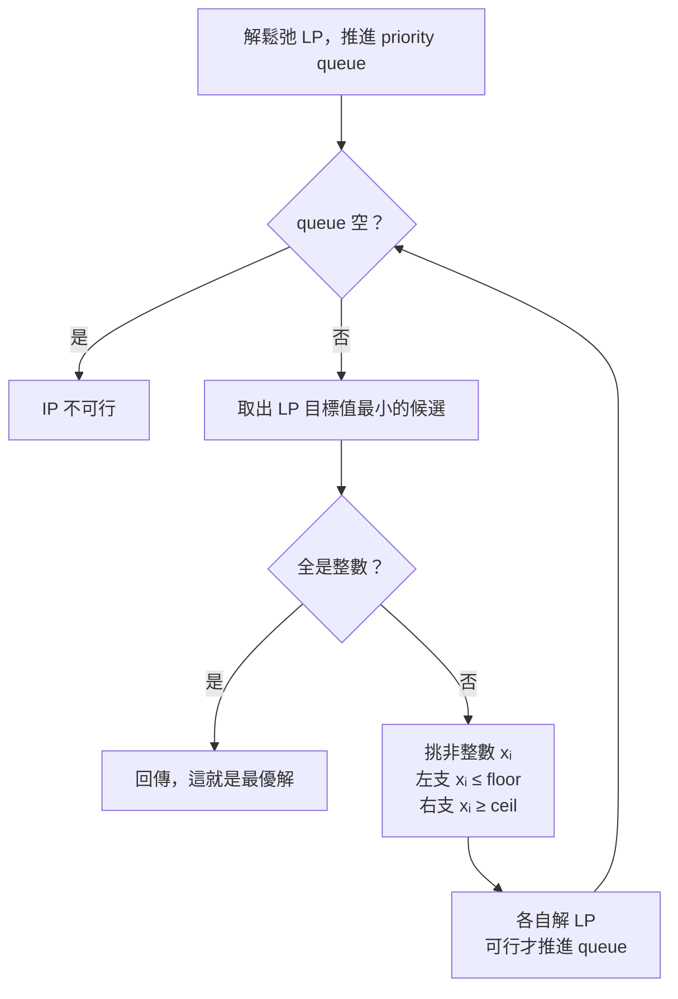

> 🌏 [English version](/en/posts/learning/2026-09-29-cmu-07380-lecture-06-integer-programming-en)

**影片狀態：已查核：官方公開頁未列對應錄影。** [影片來源與說明](#課程影片來源)

這是 [CMU 07-380 AI & ML II](https://www.cs.cmu.edu/~07380/) Fall 2026 的 Lecture 6：**Discrete Optimization: ILP**（9/14）。投影片封面的標題是「Linear and Integer Programming」，講師是 Pat Virtue 與 Mohammad Salameh。

[上一篇 Lec5](/posts/learning/2026-09-29-cmu-07380-lecture-05-linear-programming) 的結論是：LP 的最優解落在可行域的頂點，所以只要檢查限制邊界的交點。這一講把炒飯改成「一碗一碗」、珍奶改成「一杯一杯」賣，變數只能取整數。頂點通常不在整數格點上，上一講的保證就沒了。

這一講的答案是 **branch and bound**：先假裝沒有整數限制，用 LP 算出一個樂觀的下界；解出來不是整數，就把問題切成兩半，繼續算。

依 [2026-09-29 課站](https://www.cs.cmu.edu/~07380/#schedule)狀態整理；課站註明 schedule 可能變動。

## 課程影片來源

已核對 Fall 2026 官方課表及作業清單：公開來源列出投影片、預讀、示範與作業，未列對應講次的公開錄影連結。本文因此以官方教材導讀，沒有對應講次播放器；這項結論只限官方公開頁面，不代表校內沒有錄影。

官方來源：

- [CMU 07-380 Fall 2026 官方課表與教材](https://www.cs.cmu.edu/~07380/)

查核日期：2026-10-10。

## 官方材料與讀取範圍

- [Lec6 投影片（inked PDF）](https://www.cs.cmu.edu/~07380/lectures/07380_F26_Lec6_Integer_Programming_inked.pdf)，共 18 頁：LP → IP、圖解、relaxation、argmin 與 min 的記號、三個 poll、branch and bound 演算法與範例。另有 [pptx 版](https://www.cs.cmu.edu/~07380/lectures/07380_F26_Lec6_Integer_Programming.pptx)
- [Desmos: IP](https://www.desmos.com/calculator/tnlo7p5plp)：課站在 Lec6 下列的唯一 demo，投影片 Poll 1 用它問「這個 LP 的解是什麼」
- [Recitation 3-4 講義](https://www.cs.cmu.edu/~07380/recitations/Recitation3-4_07380_f26.pdf)與[解答](https://www.cs.cmu.edu/~07380/recitations/Recitation3-4_07380_f26_sol.pdf)：課站把 Recitation 4（9/18）標為「ILP and PCA」，和 Recitation 3 共用這份 PDF。本篇用第 2 題 Baymax's Factory、第 3 題 Cargo Plane，並提到第 4 題 CSP as IP、第 5 題 4-Queens
- Lec6 沒有 pre-reading 筆記，課站也沒有列指定閱讀

**公開程度**：以上都能在校外下載，這一講的材料已到 A3 等級（定義見[全球 AI／CS 課程地圖](/posts/learning/2026-08-21-global-ai-cs-course-map)）。沒有錄影連結，Canvas checkpoint 只限校內。

## 承上問題：多一條 x ∈ ℤᴺ 會壞掉什麼

投影片把兩個問題並排：

```text
LP:  min cᵀx  s.t. Ax ⪯ b
IP:  min cᵀx  s.t. Ax ⪯ b,  x ∈ ℤᴺ
```

同一頁也提到兩種變形：限制更嚴的 **Binary Integer Programming**（變數只能是 0 或 1），以及部分變數是整數的 **Mixed Integer Linear Programming**。

圖解很直接：在 LP 的圖上鋪一層整數格點，可行解只剩落在可行域裡的格點。這時會碰到兩個直覺陷阱，投影片各用一個 poll 處理：

- **Poll 2：IP 最優值跟 LP 最優值誰大？** 拿掉整數限制等於放大可行集合，最小化問題在更大的集合裡只會找到一樣好或更好的值。所以對最小化問題，鬆弛後的 `y*_LP ≤ y*_IP`。這個方向就是後面「bound」的來源。兩者的最優點 `x*` 一般不相同
- **Poll 3：只看 LP 解周圍的整數點夠不夠？** 投影片畫了一個又細又斜的可行域：LP 最優點旁邊的格點可能全都不可行，真正的整數最優解在遠處。四捨五入不是演算法

投影片還有一頁 Notation Alert：`x*_IP = argmin` 是最優**點**，`y*_IP = min` 是最優**值**，`y = cᵀx`。Branch and bound 的 priority queue 排的是 `y`，回傳的是 `x`，要分清楚。

## Relaxation：跟 A\* 的 heuristic 同一個想法

投影片在 relaxation 那頁旁邊寫了一句「Remember heuristics?」。這指的是 [07-280 heuristic search](/posts/ai/2026-08-22-cmu-07280-lecture-02-heuristic-search) 的做法：把原問題的限制放寬，得到一個好算的樂觀估計。上一個模組的 [Lec3 導讀](/posts/learning/2026-09-29-cmu-07380-lecture-03-classical-planning)也用過同一招，把 delete effect 拿掉換 planning heuristic。

在 IP 裡，放寬的是 `x ∈ ℤᴺ`。LP 解出來的 `y*_LP` 永遠不會比真正的整數解差，所以它是一個 admissible 的下界。

## Branch and bound：投影片的演算法

核心步驟：

1. 用 LP solver 解鬆弛問題，得到 `x*_LP`
2. 如果 `x*_LP` 每個座標都是整數，直接回傳
3. 否則挑一個非整數座標 `xᵢ`，建兩個子問題：
   - 左支：多加 `xᵢ ≤ floor(xᵢ)`
   - 右支：多加 `xᵢ ≥ ceil(xᵢ)`

完整版本用 priority queue 管理子問題：

1. 把原問題的 LP 解推進 queue，**依 LP 目標值排序**
2. 重複：
   - queue 空了 → IP 不可行
   - 取出目標值最小的候選 `x*_LP`
   - 若全是整數 → 完成，回傳
   - 否則挑一個非整數座標，把左右兩支的 LP 推進 queue
3. 投影片註明：只有**可行**的 LP 才推進 queue



為什麼第一個取出的整數解就是最優？queue 裡每個候選的值都是它那一支的下界。這個整數解的值不大於其他所有下界，所以其他分支裡不可能藏著更好的整數解。這個論證跟 A\* 用 admissible heuristic 保證最優是同一個結構。

## 可重做的小例子：投影片的 Diet Problem 分支

投影片的範例沿用 Diet Problem 的四條限制，成本向量換成 `c = [1, 0.6]ᵀ`：

```text
根節點：x* = (17.5, 5)    y* = 20.5    → x₁ 不是整數，分支
  左支 x₁ ≤ 17：x* = (17, 6)     y* = 20.6
  右支 x₁ ≥ 18：x* = (18, 4.85)  y* = 20.91
queue：1. (17, 6), 20.6   2. (18, 4.85), 20.91
```

取出 (17, 6)，兩個座標都是整數，結束。右支的下界 20.91 已經比 20.6 差，不用再展開。

你可以自己驗算左支：x₁ = 17 時，熱量下限要求 1700 + 50x₂ ≥ 2000，也就是 x₂ ≥ 6；鈣要求 340 + 70x₂ ≥ 700，只要 x₂ ≥ 5.14。熱量那條比較緊，所以 x₂ = 6，成本 17 + 3.6 = 20.6。右支同理：x₁ = 18 時鈣變成比較緊的那條，x₂ ≥ 4.857。

## Recitation 對應：Baymax's Factory

這是 Recitation 最完整的一題 branch and bound。題目：做一盎司藥要 0.2 小時人力、4 小時機器人；做一吋繃帶要 0.5 小時人力、2 小時機器人；兩者都賣 30 元；人力上限 90 小時，機器人上限 800 小時。

- **小題 1（LP）**：可以賣分數單位，所以是 LP。最大化轉成 `min −30x − 30y`，最優點 (137.5, 125)
- **小題 2（IP）**：只能賣整數。解答的分支順序：
  - 先對 x 分支：左支 x ≤ 137 得 (137, 125.2)、值 −7866；右支 x ≥ 138 得 (138, 124)、值 −7860
  - 左支值較小先取出，y 不是整數，再對 y 分支：y ≤ 125 得 (137, 125)、值 −7860；y ≥ 126 得 (135, 126)、值 −7830
  - 右支和左左支同為 −7860 且都是整數，先取出哪個就回傳哪個
- **小題 3**：藥可以分數、繃帶只能整數，這是 MILP，只需要對繃帶分支
- **小題 4**：LP 和 IP 都可能有無限多個最優解，例如 cost 向量垂直於一條穿過無數整數點的限制邊界

同一份 Recitation 的 **Cargo Plane** 其實是 LP 建模題（12 個變數、10 條限制），重點在寫清楚假設，例如貨物能任意切分。第 4、5 題把 [07-280 CSP](/posts/ai/2026-08-22-cmu-07280-lecture-04-constraint-satisfaction) 的樓層分配和 4-Queens 改寫成 IP，後者用 0/1 變數，就是 binary IP。

## HW 對應

- **HW3 程式作業** [Linear and Integer Programming](https://www.cs.cmu.edu/~07380/assignments/optimization)：Q5（7 分）在 `solveIP` 實作 branch and bound，要重用 Q3 的 LP 求解器；Q6（2 分）是校園送餐的 IP 建模；Q7（3 分）把它推廣到 M 個供應者、N 個社區
- 作業頁的兩個實作提醒很實用：判斷整數要用 1e-12 的容差，光用 `floor` 不夠；每個分支要推一份**新的**限制清單進 queue，不能改動已經推進去的清單
- **HW3 書面** Q1 是 Bayes the Bat 的投資組合 IP（12 分），詳見 [HW3 導讀](/posts/learning/2026-09-29-cmu-07380-hw3-optimization-pca-map)。HW3 截止日是 10/1，本系列不附解答

## 今晚可以做的動作

1. 打開 [Desmos: IP](https://www.desmos.com/calculator/tnlo7p5plp)，先找出 LP 最優點，再找整數最優點，看兩者差多遠。
2. 不看解答把 Baymax's Factory 的四個子問題各解一次 LP，確認你得到的值跟上表一樣。
3. 寫一個 30 行內的 branch and bound：用 `heapq` 當 priority queue，LP 部分先借用 `scipy.optimize.linprog`，拿投影片的 Diet Problem 和 `c = [1, 0.6]` 測試。

## 系列導覽

- 上一篇：[Lecture 5 導讀：Linear Programming，為什麼最優解落在可行域的頂點](/posts/learning/2026-09-29-cmu-07380-lecture-05-linear-programming)
- 下一篇：[Lecture 7 導讀：Low Rank Optimization，PCA 的重建誤差、投影變異數與 LoRA](/posts/learning/2026-09-29-cmu-07380-lecture-07-pca-low-rank)
- 系列總覽：[CMU 07-380 Fall 2026 總覽](/posts/learning/2026-08-22-cmu-07380-fall-2026-overview)

## 更新紀錄

- 2026-10-10：標註影片狀態，核對錄影來源與取得方式。

## 參考資料

- [CMU 07-380 AI & ML II Fall 2026 課站](https://www.cs.cmu.edu/~07380/)
- [07-380 Fall 2026 Lecture 6 — Linear and Integer Programming（inked PDF）](https://www.cs.cmu.edu/~07380/lectures/07380_F26_Lec6_Integer_Programming_inked.pdf)
- [Desmos: IP](https://www.desmos.com/calculator/tnlo7p5plp)
- [07-380 Recitation 3 & 4](https://www.cs.cmu.edu/~07380/recitations/Recitation3-4_07380_f26.pdf)
- [07-380 Recitation 3 & 4 Solutions](https://www.cs.cmu.edu/~07380/recitations/Recitation3-4_07380_f26_sol.pdf)
- [07-380 HW3 Programming: Linear and Integer Programming](https://www.cs.cmu.edu/~07380/assignments/optimization)
- [07-380 HW3 Written](https://www.cs.cmu.edu/~07380/assignments/hw3_blank.pdf)
