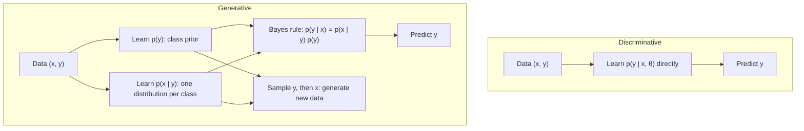

> 🌏 [中文版](/posts/learning/2026-09-29-cmu-07380-lecture-09-generative-models)

**Video status: Checked: no corresponding recording link listed on the public official page.** [Source details](#course-video-sources)

Lecture 9 of [CMU 07-380 AI & ML II](https://www.cs.cmu.edu/~07380/), **Generative Models**, met on Wednesday, September 23, 2026. Its subtitle on the schedule is "Naive Bayes; Gaussian discriminant analysis."

Every classifier in 07-280 and 07-380 so far (logistic regression, neural networks) learned `p(y|x)` directly. This lecture turns the other way. First describe how the data is produced, meaning learn `p(y)` and `p(x|y)`, then invert with Bayes rule at prediction time. GMM/EM, VAEs, and diffusion later in the schedule are also generative models, and this lecture is where the course starts down that road.

This guide reflects the course site as of 2026-09-29. The schedule is marked `subject to change`.

## Course video sources

The official Fall 2026 schedule and assignment list have been checked: public resources include slides, pre-readings, demonstrations and assignments, but no public recording link for the corresponding lectures. This article is therefore a materials-based guide with no corresponding lecture player. This observation concerns the public official page and does not establish whether internal recordings exist.

Official sources:

- [CMU 07-380 Fall 2026 官方課表與教材](https://www.cs.cmu.edu/~07380/)

Checked on 2026-10-10.

## Official materials and what I read

Materials I opened and read:

- [Lec9-10 Probabilistic Generative Models slides (pdf)](https://www.cs.cmu.edu/~07380/lectures/07380_F26_Lec9-10_Probabilistic_Generative_Models.pdf), plus pptx and inked versions, subtitled "Discriminant Analysis & Naive Bayes."
- [Notes_Generative_Models.pdf](https://www.cs.cmu.edu/~07380/notes/07380_F26_Notes_Probabilistic_Generative_Models.pdf): the full one-feature Iris example and the generative story.
- The [Naive Bayes SPAM worksheet](https://www.cs.cmu.edu/~07380/lectures/07380_F26_Lec9-10_Naive_Bayes_handout.pdf), whose solution is section 7 of the [Recitation 5 Solutions](https://www.cs.cmu.edu/~07380/recitations/Recitation5_07380_f26_sol.pdf).
- Two notebooks on Google Drive, downloadable without login: [cat_dog_sampling.ipynb](https://drive.google.com/file/d/17O6w49maTydc_4zmeYW6vUpedW1lS5dF/view?usp=drive_link) and [discriminant_analysis.ipynb](https://drive.google.com/file/d/1895ysOVVlDl1IGV2OjN9Ow14szP7hRh6/view?usp=drive_link).
- Further reading: [Mitchell, Generative and Discriminative Classifiers](http://www.cs.cmu.edu/~tom/mlbook/NBayesLogReg.pdf). The site also lists Murphy 3.5, 4.2, and 8.6, but that link goes through CMU's EBSCO library portal, which most outside readers can't open. I did not read it.

Limits: the slides' text layer holds only titles, equations, and poll questions. Many figures (the Iris scatter plots, the generative-story diagrams) and the handwritten derivations have no text, and I don't describe what I can't see. This lecture has no pre-reading checkpoint and no recording link.

**About the file name**: the slides are named "Lec9-10," but Lecture 10 on the schedule (9/28) is Bayes Nets, and `07380_F26_Lec10_Bayes_Nets.pdf` still returned 404 on 2026-09-29. The site doesn't say whether generative models took one session or two, and I won't guess.

## The question carried forward: Bayes rule's second use

[Lecture 8 on MAP](/en/posts/learning/2026-09-29-cmu-07380-lecture-08-map-en) already wrote Bayes rule two ways. Last time used the "data and parameters" form. This time it's "inputs and outputs":

```text
p(y|x) = p(x|y) p(y) / p(x)
```

The notes give the three terms new names: `p(x|y)` is the class conditional distribution, `p(y)` is the class prior, and `p(y|x)` is the conditional likelihood we want. The slides add a line here, "Where did the parameters go?!?" No θ appears in this formula, but every distribution in it has parameters to estimate. They are just left implicit.

## Discriminative vs generative

Definitions from the notes:

- A **discriminative model** models `p(y|x, θ)` directly. Logistic regression is the canonical example. Linear regression counts too; discriminative does not have to mean classification.
- A **generative model** models `p(x, y|θ)`, usually factored as `p(x|y, θ) p(y|θ)`, and uses Bayes rule to get `p(y|x)`.



The slides compress the trade-off into one line: discriminative models make weak assumptions and rely on lots of data; generative models make stronger assumptions and need less data. Recitation 5 adds two points: generative models can be used for unsupervised learning where class labels are unknown, and discriminative models need more labeled data.

The notes stress one capability a discriminative model lacks: **generating new data**. With only `p(y|x)`, you need an x before you can sample a y, so you never get a brand-new `(x, y)` pair.

## Worked example 1: one-feature Iris classification

The notes use two Iris species and a single feature x₁. The steps:

1. Using only the Y = 0 points, fit a Gaussian `p(x₁|Y=0)`. Using only the Y = 1 points, fit a separate Gaussian `p(x₁|Y=1)`. Each has its own μ and σ, four parameters in total.
2. Estimate the Bernoulli parameter ϕ as the fraction of Y = 1 points, giving `p(y)`.
3. Multiply to get the joint `p(x₁, y)`, then normalize:

```text
p(Y=1|x₁) = p(x₁|Y=1) P(Y=1) / [ p(x₁|Y=0) P(Y=0) + p(x₁|Y=1) P(Y=1) ]
```

The notes set a trap here. Looking at the two density curves, it's tempting to put the decision boundary where they cross (around x₁ = 6.5). **That is wrong**, because the class prior hasn't been applied yet. Once it is, the `P(Y=1|x₁) = 0.5` boundary appears in two places, x₁ = 5.8 and x₁ = 4.2. The second boundary exists because the Y = 1 Gaussian is wider and its prior is larger, so far to the left Y = 1 becomes more probable than Y = 0 again.

Logistic regression on the same data gives only one boundary (the notes put it around x₁ = 5.5). The generative model makes more assumptions and gets a more flexible boundary in return.

## Worked example 2: the generative story and sampling

Section 4 of the notes writes "generation" as three steps:

1. Sample a class from `p(y)` (flip a biased coin).
2. Given that y, sample x from the matching `p(x|Y=y)`.
3. The result is a new `(x, y)` pair that was not in the original dataset.

`cat_dog_sampling.ipynb` turns this story into code. Y = 1 is dog, ϕ = 0.8, and the features are length and weight, with means (15, 12) for cats and (20, 20) for dogs. Here is a minimal version using the notebook's parameters:

```python
import numpy as np

phi = 0.8                                  # P(Y=1), Y=1 is dog
mus = np.array([[15, 12], [20, 20]])       # (length, weight) means for [cat, dog]
sigmas = np.array([[1.4, 2], [5, 5]])      # per-feature std devs (diagonal = Naive Bayes)

rng = np.random.default_rng(0)
samples = []
for _ in range(100):
    y = rng.choice([0, 1], p=[1 - phi, phi])   # step 1: sample the class
    x = rng.normal(mus[y], sigmas[y])          # step 2: sample features given the class
    samples.append((x, y))
```

The second half of the notebook, "Repeat without Naive Bayes," switches to full covariance matrices (for dogs, `[[25, 22], [22, 25]]`) and samples with `np.random.multivariate_normal`. Put the two scatter plots side by side and you can see what "length and weight are independent given the class" looks like: axis-aligned elliptical clouds in the first, tilted ones in the second.

## Naive Bayes: trading conditional independence for estimability

With many features, the parameters of `p(x|y)` explode. The slides use handwritten digits and ask how many parameters the full `p(X₁, …, X₆₄|Y=3)` needs. My own count: a joint distribution over 64 binary pixels needs 2⁶⁴ − 1 parameters per class, far too many to estimate.

The Naive Bayes assumption: given the class, the features are conditionally independent.

```text
p(X₁, …, X_M | Y) = Π_m p(X_m | Y)
```

The slides call this a "bag of pixels." Now each pixel needs just one Bernoulli parameter per class. The slides give the full setup for two examples: SPAM uses `Y ~ Bern(ϕ)` and `X_m ~ Bern(θ_{m,y})`, and digit recognition swaps the class distribution for a Categorical.

Training (Recitation 5, section 7.1): estimate the class prior the MLE way. Then for each class, using only that class's data, estimate each feature's conditional distribution **independently**. To predict, take `argmax_y P(Y=y) Π_j P(X_j|Y=y)`.

### The SPAM worksheet: work it once

The worksheet has 7 training emails and a 10-word vocabulary, and asks whether "Pat teach now" is spam. The Recitation 5 solution uses Laplace smoothing (α = 1):

```text
P(x_i = k | Y=y) = (# samples in class y with x_i = k + α) / (# samples in class y + αK)
```

Why is smoothing necessary? I checked the unsmoothed version against the worksheet data. All three spam emails contain "money," so `P(money=0|spam) = 0`, and any email without "money" gets a spam probability of exactly 0. Recitation 5 describes the mirror image of the same problem: if a word never appears in a class, that class's probability drops to zero.

The solution reports `P(Y=1|x) ≈ 0.118`. **When I checked it, I found a small slip.** The solution's table gives `P(tomorrow=0|Y=0) = 5/6`, but the product line uses 3/6. Recomputing with 5/6 gives `P(Y=0, x) ≈ 0.00567` and a spam probability of about 0.074. The conclusion stands: the email is not spam, and its spam probability is no longer 0. Working it by hand is the fastest way to check whether you really understand Naive Bayes.

Recitation 5 makes two more points. As α grows, the conditional distributions approach uniform. And for a Bernoulli, Laplace smoothing is equivalent to a Beta prior, so it is an example of "generative + MAP," the bottom-right cell of the 2×2 table in [Lecture 8](/en/posts/learning/2026-09-29-cmu-07380-lecture-08-map-en).

## Gaussian Discriminant Analysis: continuous features

When features are continuous, replace `p(x|y)` with a multivariate Gaussian: `X | Y=y ~ N(μ_y, Σ_y)`. Recitation 5 points out that despite "discriminant" in the name, it models `p(x|y)p(y)`, so it is a generative model.

At the end of the Iris example, the slides list three blanks to fill in during class: what the Naive Bayes assumption corresponds to, when the boundary is linear, and when it is quadratic. Recitation 5, problem 6, gives the skeleton of the answer:

- When both classes share the same covariance (for example, both I), the decision boundary is a straight line.
- When the covariances differ, the boundary is the zero set of a quadratic function, which can be an ellipse around one of the classes.

As for what Naive Bayes looks like in the Gaussian case: conditional independence means the off-diagonal entries of the covariance matrix are 0. Poll 2 on the slides gives four `(μ, Σ)` pairs to classify, and it's worth doing yourself.

`discriminant_analysis.ipynb` shows this directly. The class means sit at (−3.5, 0) and (3.5, 0) with ϕ = 0.5. The first setting gives both classes covariance I; the second shrinks class 0 to 0.2·I. Drag the test point with the sliders, and the change in `p(y|x)` shows the boundary turning from a line into a curve wrapped around the narrow Gaussian.

## Related reading: how Mitchell compares Naive Bayes and logistic regression

Mitchell's chapter proves a neat result. Under one variant of Gaussian Naive Bayes, where each feature's variance does not depend on the class, the implied form of `P(Y|X)` is exactly logistic regression. If those assumptions hold, the two converge to the same classifier as the training set grows toward infinity.

When the assumptions fail, they diverge. Mitchell cites Ng and Jordan (2002): Gaussian Naive Bayes parameter estimates converge in roughly log n examples (n is the feature dimension), while logistic regression needs on the order of n. On several datasets, Naive Bayes wins when data is scarce and logistic regression wins when data is plentiful. That is the empirical version of the slide's "generative: stronger assumptions, less data."

Background for the discriminative side: [07-280 Lecture 9 on logistic regression](/en/posts/ai/2026-08-22-cmu-07280-lecture-09-logistic-regression-en). The MLE derivation is in [07-280 Lecture 16](/en/posts/ai/2026-08-22-cmu-07280-lecture-16-maximum-likelihood-en).

## Next: Naive Bayes is really a graph

Before Naive Bayes, the slides review the definitions of independence and conditional independence. That isn't a detour. Naive Bayes can be drawn as a directed graph with Y pointing to every X, which makes it a Bayes Net of one specific shape. The next post, [Lecture 10 on Bayes Nets](/en/posts/learning/2026-09-29-cmu-07380-lecture-10-bayes-nets-en), generalizes this special case. The previous post is the [HW3 guide](/en/posts/learning/2026-09-29-cmu-07380-hw3-optimization-pca-map-en).

## Things to do tonight

1. Print the [SPAM worksheet](https://www.cs.cmu.edu/~07380/lectures/07380_F26_Lec9-10_Naive_Bayes_handout.pdf), work it without looking at the solution, then compare with the 0.074 above.
2. Run the sampling code above, then replace `sigmas` with full covariance matrices and switch to `rng.multivariate_normal`. Compare the two scatter plots.
3. Do Poll 1 from the slides: a GDA with three classes, two features, and a full covariance per class has how many parameters? Count the μ's first, then the truly free entries of each Σ.

## Update Log

- 2026-10-10: Added explicit video status and checked recording sources and access notes.
- 2026-10-10: Rechecked video status. Re-verified the live official course pages and public video sources; no public recording for this lecture was found, so the status stands.

## References

- [CMU 07-380 Fall 2026 course site (Schedule, Recitation)](https://www.cs.cmu.edu/~07380/)
- [07-380 Lec9-10 Probabilistic Generative Models slides (pdf)](https://www.cs.cmu.edu/~07380/lectures/07380_F26_Lec9-10_Probabilistic_Generative_Models.pdf)
- [07-380 Notes: Probabilistic Generative Models](https://www.cs.cmu.edu/~07380/notes/07380_F26_Notes_Probabilistic_Generative_Models.pdf)
- [07-380 Naive Bayes SPAM worksheet](https://www.cs.cmu.edu/~07380/lectures/07380_F26_Lec9-10_Naive_Bayes_handout.pdf)
- [07-380 Recitation 5 Solutions (GDA, Naive Bayes, Laplace smoothing)](https://www.cs.cmu.edu/~07380/recitations/Recitation5_07380_f26_sol.pdf)
- [cat_dog_sampling.ipynb (Google Drive)](https://drive.google.com/file/d/17O6w49maTydc_4zmeYW6vUpedW1lS5dF/view?usp=drive_link)
- [discriminant_analysis.ipynb (Google Drive)](https://drive.google.com/file/d/1895ysOVVlDl1IGV2OjN9Ow14szP7hRh6/view?usp=drive_link)
- [Tom Mitchell, Generative and Discriminative Classifiers: Naive Bayes and Logistic Regression](http://www.cs.cmu.edu/~tom/mlbook/NBayesLogReg.pdf)
- [CMU 07-380 Fall 2026 Overview](/en/posts/learning/2026-08-22-cmu-07380-fall-2026-overview-en)
