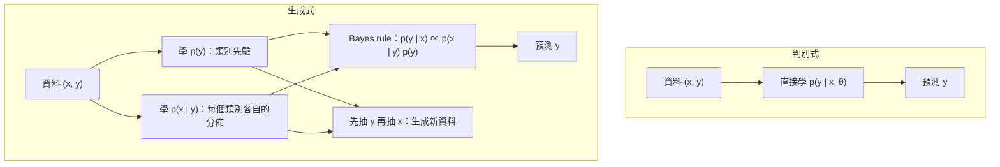

> 🌏 [English version](/en/posts/learning/2026-09-29-cmu-07380-lecture-09-generative-models-en)

**影片狀態：已查核：官方公開頁未列對應錄影。** [影片來源與說明](#課程影片來源)

[CMU 07-380 AI & ML II](https://www.cs.cmu.edu/~07380/) 的第 9 講 **Generative Models** 在 2026 年 9 月 23 日（週三）上課，Schedule 上的副標是「Naive Bayes; Gaussian discriminant analysis」。

到目前為止，07-280 和 07-380 教過的分類器（邏輯迴歸、神經網路）都直接學 `p(y|x)`。這一講換一個方向：先描述「資料是怎麼產生的」，也就是先學 `p(y)` 和 `p(x|y)`，分類時再用 Bayes rule 反推。Schedule 後段的 GMM／EM、VAE、diffusion 也都屬於生成式模型，這一講是它們在本課的起點。

本文依 2026-09-29 的課站狀態寫成，課站標明 schedule `subject to change`。

## 課程影片來源

已核對 Fall 2026 官方課表及作業清單：公開來源列出投影片、預讀、示範與作業，未列對應講次的公開錄影連結。本文因此以官方教材導讀，沒有對應講次播放器；這項結論只限官方公開頁面，不代表校內沒有錄影。

官方來源：

- [CMU 07-380 Fall 2026 官方課表與教材](https://www.cs.cmu.edu/~07380/)

查核日期：2026-10-10。

## 官方材料與讀取範圍

我實際打開並讀過的材料：

- [Lec9-10 Probabilistic Generative Models 投影片 pdf](https://www.cs.cmu.edu/~07380/lectures/07380_F26_Lec9-10_Probabilistic_Generative_Models.pdf)（另有 pptx 與 inked 版），副標是「Discriminant Analysis & Naive Bayes」。
- [Notes_Generative_Models.pdf](https://www.cs.cmu.edu/~07380/notes/07380_F26_Notes_Probabilistic_Generative_Models.pdf)：Iris 單特徵的完整例子與 generative story。
- [Naive Bayes SPAM worksheet](https://www.cs.cmu.edu/~07380/lectures/07380_F26_Lec9-10_Naive_Bayes_handout.pdf)，對應的解答在 [Recitation 5 Solutions](https://www.cs.cmu.edu/~07380/recitations/Recitation5_07380_f26_sol.pdf) 第 7 節。
- 兩份放在 Google Drive 的 notebook：[cat_dog_sampling.ipynb](https://drive.google.com/file/d/17O6w49maTydc_4zmeYW6vUpedW1lS5dF/view?usp=drive_link) 和 [discriminant_analysis.ipynb](https://drive.google.com/file/d/1895ysOVVlDl1IGV2OjN9Ow14szP7hRh6/view?usp=drive_link)，匿名可下載。
- 延伸讀物 [Mitchell, Generative and Discriminative Classifiers](http://www.cs.cmu.edu/~tom/mlbook/NBayesLogReg.pdf)。課站另列 Murphy 3.5、4.2、8.6，但連結走 CMU 圖書館的 EBSCO，校外讀者多半打不開，我沒有讀。

讀取限制：投影片的文字層只有標題、公式和 poll 題目，很多圖（Iris 散佈圖、生成故事示意）和課堂手寫推導沒有文字，我不轉述看不到的內容。這一講沒有 pre-reading checkpoint，也沒有錄影連結。

**檔名的問題**：投影片檔名寫「Lec9-10」，但 Schedule 上的第 10 講（9/28）是 Bayes Nets，而 `07380_F26_Lec10_Bayes_Nets.pdf` 在 2026-09-29 仍回 404。生成式模型實際講了一堂還是兩堂，課站沒有說明，本文不推測。

## 承上問題：Bayes rule 的第二種用法

[Lecture 8 MAP](/posts/learning/2026-09-29-cmu-07380-lecture-08-map)已經把 Bayes rule 並排寫成兩種。上一講用的是「資料與參數」那一種；這一講換成「輸入與輸出」：

```text
p(y|x) = p(x|y) p(y) / p(x)
```

Notes 給這三項新的名字：`p(x|y)` 是 class conditional distribution，`p(y)` 是 class prior，`p(y|x)` 則是我們要的 conditional likelihood。投影片在這裡放了一句「Where did the parameters go?!?」：這條式子裡看不到 θ，但每個分佈背後都有參數要估，只是被省略了。

## 判別式和生成式差在哪

Notes 的定義：

- **判別式模型**直接建模 `p(y|x, θ)`。邏輯迴歸是典型例子；線性迴歸也算，判別式不一定是分類。
- **生成式模型**建模 `p(x, y|θ)`，通常拆成 `p(x|y, θ) p(y|θ)`，再用 Bayes rule 算 `p(y|x)`。



投影片把取捨濃縮成一行：判別式的模型假設弱，需要大量資料；生成式的假設強，需要的資料少。Recitation 5 補了兩點：生成式模型可以用在類別標籤未知的無監督學習，判別式則需要更多標記資料。

Notes 還特別強調一個判別式做不到的能力：**生成新資料**。只有 `p(y|x)` 的話，你必須先有 x 才能抽 y，永遠拿不到一組全新的 `(x, y)`。

## 可重做的例子一：Iris 的單特徵分類

Notes 用 Iris 資料集的兩個品種、一個特徵 x₁ 來示範。步驟是：

1. 只看 Y = 0 的點，估一個高斯 `p(x₁|Y=0)`；只看 Y = 1 的點，另估一個高斯 `p(x₁|Y=1)`。兩個高斯各有 μ 和 σ，一共四個參數。
2. 用 Y = 1 的比例估 Bernoulli 參數 ϕ，得到 `p(y)`。
3. 相乘得到聯合分佈 `p(x₁, y)`，再正規化：

```text
p(Y=1|x₁) = p(x₁|Y=1) P(Y=1) / [ p(x₁|Y=0) P(Y=0) + p(x₁|Y=1) P(Y=1) ]
```

Notes 在這裡設了一個陷阱。看兩條高斯密度曲線，很容易以為決策邊界就是兩條曲線的交點（約 x₁ = 6.5）。**這是錯的**，因為還沒乘上類別先驗。乘上之後，`P(Y=1|x₁) = 0.5` 的邊界出現在 x₁ = 5.8 和 x₁ = 4.2 兩處。第二個邊界的來由是 Y = 1 的高斯比較寬、先驗也比較大，所以在很左邊，Y = 1 的機率又會超過 Y = 0。

同樣的資料用邏輯迴歸，只會得到一個邊界（Notes 說大約在 x₁ = 5.5）。生成式模型多做了假設，換來更有彈性的邊界。

## 可重做的例子二：generative story 與取樣

Notes 第 4 節把「生成」寫成三步：

1. 從 `p(y)` 抽一個類別（丟一枚偏差硬幣）。
2. 依照抽到的 y，從對應的 `p(x|Y=y)` 抽 x。
3. 得到一組新的 `(x, y)`，它不在原始資料集裡。

`cat_dog_sampling.ipynb` 把這個故事寫成程式：Y = 1 是狗，ϕ = 0.8；特徵是身長和體重，貓的平均是 (15, 12)、狗是 (20, 20)。下面是依照 notebook 參數改寫的最小版本：

```python
import numpy as np

phi = 0.8                                  # P(Y=1)，Y=1 是狗
mus = np.array([[15, 12], [20, 20]])       # [貓, 狗] 的 (身長, 體重) 平均
sigmas = np.array([[1.4, 2], [5, 5]])      # 各特徵標準差（對角，等於 Naive Bayes）

rng = np.random.default_rng(0)
samples = []
for _ in range(100):
    y = rng.choice([0, 1], p=[1 - phi, phi])   # 第一步：抽類別
    x = rng.normal(mus[y], sigmas[y])          # 第二步：依類別抽特徵
    samples.append((x, y))
```

notebook 後半「Repeat without Naive Bayes」改用完整的共變異數矩陣（例如狗是 `[[25, 22], [22, 25]]`），用 `np.random.multivariate_normal` 抽樣。兩張散佈圖放在一起，就能看到「身長和體重在給定類別下獨立」這個假設的樣子：前者是軸對齊的橢圓雲，後者是斜的。

## Naive Bayes：用條件獨立換到可估計

特徵一多，`p(x|y)` 的參數會爆炸。投影片用手寫數字舉例，問完整的 `p(X₁, …, X₆₄|Y=3)` 需要幾個參數。我自己算：64 個二元像素的聯合分佈，每個類別要 2⁶⁴ − 1 個參數，根本估不出來。

Naive Bayes 的假設是：給定類別，特徵之間條件獨立。

```text
p(X₁, …, X_M | Y) = Π_m p(X_m | Y)
```

投影片把它叫做「bag of pixels」。這樣每個像素、每個類別只需要一個 Bernoulli 參數。投影片也給了兩個例子的完整設定：SPAM 是 `Y ~ Bern(ϕ)`、`X_m ~ Bern(θ_{m,y})`；數字辨識則把類別換成 Categorical。

訓練的方法（Recitation 5 第 7.1 節）：用類似 MLE 的方法估類別先驗；再對每個類別，只用該類別的資料，**逐一獨立地**估每個特徵的條件分佈。預測時取 `argmax_y P(Y=y) Π_j P(X_j|Y=y)`。

### SPAM worksheet：動手算一次

Worksheet 有 7 封訓練信、10 個字的字彙表，要判斷「Pat teach now」是不是垃圾信。Recitation 5 的解答用 Laplace smoothing（α = 1）：

```text
P(x_i = k | Y=y) = (類別 y 中 x_i = k 的樣本數 + α) / (類別 y 的樣本數 + αK)
```

為什麼一定要平滑？我照 worksheet 的資料驗算不平滑的版本：訓練資料裡三封 spam 都含有 money，所以 `P(money=0|spam) = 0`，任何沒有 money 的信，spam 機率都會直接變成 0。Recitation 5 講的是反方向的同一個問題：某個字在某類別從沒出現過，那個類別的機率就歸零。

解答算出 `P(Y=1|x) ≈ 0.118`。**我驗算時發現一個小筆誤**：解答的表格裡 `P(tomorrow=0|Y=0) = 5/6`，但連乘那一行寫成了 3/6。改用 5/6 重算，`P(Y=0, x) ≈ 0.00567`，spam 機率約 0.074。結論不變：這封信不是垃圾信，而且 spam 機率不再是 0。自己動手算一遍，是檢查你有沒有真的懂 Naive Bayes 最快的方法。

Recitation 5 還點出兩件事：α 越大，條件分佈越接近均勻分佈；對 Bernoulli 而言，Laplace smoothing 等價於一個 Beta 先驗，所以它是「生成式 + MAP」的例子，也就是 [Lecture 8](/posts/learning/2026-09-29-cmu-07380-lecture-08-map) 那張 2×2 表右下角的那一格。

## Gaussian Discriminant Analysis：連續特徵

特徵是連續值時，把 `p(x|y)` 換成多變量高斯：`X | Y=y ~ N(μ_y, Σ_y)`。Recitation 5 特別提醒：名字裡雖然有 discriminant，它建模的是 `p(x|y)p(y)`，所以是生成式模型。

投影片在 Iris 例子最後列了三個問題，讓課堂一起填：Naive Bayes 假設對應什麼、什麼情況是線性邊界、什麼情況是二次邊界。Recitation 5 第 6 題給了答案的骨架：

- 兩個類別的共變異數相同（例如都是 I）時，決策邊界是一條直線。
- 共變異數不同時，邊界是一個二次函數的零點，可能是一個圍著其中一類的橢圓。

至於 Naive Bayes 假設在高斯情況下長什麼樣：條件獨立就代表共變異數矩陣的非對角項是 0。投影片 Poll 2 給了四組 `(μ, Σ)` 讓你判斷哪些符合，值得自己做一次。

`discriminant_analysis.ipynb` 可以直接看到這件事。兩個類別的平均放在 (−3.5, 0) 和 (3.5, 0)，ϕ = 0.5：第一個設定兩邊的共變異數都是 I，第二個把類別 0 縮成 0.2·I。用滑桿移動測試點，`p(y|x)` 的變化會告訴你邊界從直線變成了圍住窄高斯的曲線。

## 延伸對照：Mitchell 怎麼比較 Naive Bayes 與邏輯迴歸

Mitchell 的章節證明了一件很漂亮的事：在一種「變異數不隨類別改變」的 Gaussian Naive Bayes 假設下，推出來的 `P(Y|X)` 形式正好就是邏輯迴歸。如果這些假設成立，資料量趨近無限時兩者會收斂成相同的分類器。

假設不成立時兩者就分道揚鑣。Mitchell 引用 Ng 與 Jordan（2002）的結果：Gaussian Naive Bayes 的參數估計大約需要 log n 量級的樣本就能收斂（n 是特徵維度），邏輯迴歸需要 n 量級；在幾個資料集上，資料少時 Naive Bayes 比較好，資料多時邏輯迴歸比較好。這就是投影片那行「生成式：假設強、需要較少資料」的實證版本。

判別式那一側的前置知識：[07-280 Lecture 9 邏輯迴歸](/posts/ai/2026-08-22-cmu-07280-lecture-09-logistic-regression)。MLE 的推導則在 [07-280 Lecture 16](/posts/ai/2026-08-22-cmu-07280-lecture-16-maximum-likelihood)。

## 下一步：Naive Bayes 其實是一張圖

投影片在講 Naive Bayes 之前，先複習了獨立和條件獨立的定義。這不是順便：Naive Bayes 可以畫成「Y 指向每一個 X」的一張有向圖，也就是一種形狀特定的 Bayes Net。下一篇 [Lecture 10 Bayes Nets](/posts/learning/2026-09-29-cmu-07380-lecture-10-bayes-nets) 會把這個特例一般化。上一篇是 [HW3 導讀](/posts/learning/2026-09-29-cmu-07380-hw3-optimization-pca-map)。

## 今晚可以做的動作

1. 列印 [SPAM worksheet](https://www.cs.cmu.edu/~07380/lectures/07380_F26_Lec9-10_Naive_Bayes_handout.pdf)，先不看解答算一次，再和上面的 0.074 對照。
2. 跑上面的取樣程式，再把 `sigmas` 換成完整的共變異數矩陣，改用 `rng.multivariate_normal`，比較兩張散佈圖。
3. 做投影片 Poll 1：三個類別、兩個特徵、每類各有完整共變異數的 GDA，到底有幾個參數？先數 μ，再數 Σ 裡真正自由的項。

## 更新紀錄

- 2026-10-10：標註影片狀態，核對錄影來源與取得方式。
- 2026-10-10：重查影片狀態。即時回官方課程頁與公開影音來源查證，仍未找到該講公開錄影，狀態維持不變。

## 參考資料

- [CMU 07-380 Fall 2026 課站（Schedule、Recitation）](https://www.cs.cmu.edu/~07380/)
- [07-380 Lec9-10 Probabilistic Generative Models 投影片 pdf](https://www.cs.cmu.edu/~07380/lectures/07380_F26_Lec9-10_Probabilistic_Generative_Models.pdf)
- [07-380 Notes：Probabilistic Generative Models](https://www.cs.cmu.edu/~07380/notes/07380_F26_Notes_Probabilistic_Generative_Models.pdf)
- [07-380 Naive Bayes SPAM worksheet](https://www.cs.cmu.edu/~07380/lectures/07380_F26_Lec9-10_Naive_Bayes_handout.pdf)
- [07-380 Recitation 5 Solutions（GDA、Naive Bayes、Laplace smoothing）](https://www.cs.cmu.edu/~07380/recitations/Recitation5_07380_f26_sol.pdf)
- [cat_dog_sampling.ipynb（Google Drive）](https://drive.google.com/file/d/17O6w49maTydc_4zmeYW6vUpedW1lS5dF/view?usp=drive_link)
- [discriminant_analysis.ipynb（Google Drive）](https://drive.google.com/file/d/1895ysOVVlDl1IGV2OjN9Ow14szP7hRh6/view?usp=drive_link)
- [Tom Mitchell, Generative and Discriminative Classifiers: Naive Bayes and Logistic Regression](http://www.cs.cmu.edu/~tom/mlbook/NBayesLogReg.pdf)
- [CMU 07-380 Fall 2026 總覽](/posts/learning/2026-08-22-cmu-07380-fall-2026-overview)
