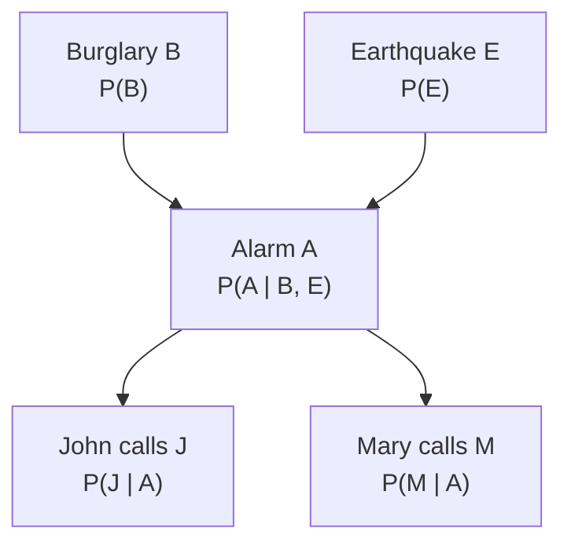

> 🌏 [中文版](/posts/learning/2026-09-29-cmu-07380-lecture-10-bayes-nets)

This is Lecture 10 of [CMU 07-380 AI & ML II](https://www.cs.cmu.edu/~07380/), Fall 2026: **Graphical Models: Bayes Nets** (9/28). The [previous post on Lec9 generative models](/en/posts/learning/2026-09-29-cmu-07380-lecture-09-generative-models-en) built `p(x|y)` with Naive Bayes and GDA, then used Bayes' theorem to recover the class. That approach rests on a strong conditional-independence assumption. This lecture asks the general question: once there are many variables and the joint distribution is too big to store, how do you draw a picture of which variables are related, and split the distribution into small tables?

The short answer: **a Bayes net is a directed acyclic graph with one "given its parents" conditional probability table per node, and the joint distribution is the product of those tables. Every edge left out of the graph is an independence assumption.**

Based on the [course site as of 2026-09-29](https://www.cs.cmu.edu/~07380/#schedule); the site notes that the schedule is subject to change.

## Course video sources

This article follows official notes, slides, or assignments. This check of the official public pages did not verify a public recording for the material covered here; it does not establish that no recording exists.

Course and recording entries:

- [cmu-07-380 — official course materials and recording index](https://www.cs.cmu.edu/~07380/)

## The gap first: this is the pre-reading edition

When I rechecked the course site on 2026-09-29, the Lec10 row of the schedule had **no slide link**. It lists only the Bayes Net Demo, the PR6 notes, a Canvas checkpoint and optional readings. Guessing the filename from earlier lectures, `lectures/07380_F26_Lec10_Bayes_Nets.pdf` returns 404. The Lec9 slides are named `Lec9-10_Probabilistic_Generative_Models`, but their text has no Bayes net or graphical model section, so they cannot stand in for Lec10 either.

So this post **does not describe what happened in lecture**. It only guides the published pre-reading. The schedule marks Lec10 "No d-separation", and this post stays away from d-separation too. It will be updated once the slides appear.

Access level: the course as a whole is A2 (in progress). Lec10 currently has pre-reading notes plus an interactive demo, with no slides, recitation or homework, which is thin even for A2. The checkpoint (due 9/27) lives on Canvas and is CMU-only. The levels are defined in the [global AI/CS course map](/en/posts/learning/2026-08-21-global-ai-cs-course-map-en).

## Official materials and scope

- [PR6 Bayes Nets pre-reading](https://www.cs.cmu.edu/~07380/notes/07380_F26_Notes_Bayes_Nets.pdf) (20 pages, v1.0): the main source; all nine sections read
- [15-281 Bayes Net Demo](https://www.cs.cmu.edu/~15281-f25/demos/bayesNetDemo) (plus a [highres version](https://www.cs.cmu.edu/~15281-f25/demos/bayesNetDemo_highres)): a four-node Cloudy / Sprinkler / Rainy / Wet Grass network
- Optional readings on the schedule: AIMA Ch. 12.1-5, 13.1-2, and [Jordan Ch. 2.1](http://people.eecs.berkeley.edu/~jordan/prelims/chapter2.pdf). This post does not cite their content
- The notes assume the probability rules from the [07-280 Probability Background](https://www.cs.cmu.edu/~07280-s26/notes/07280_S26_Notes_Probability_Background.pdf) notes

## The question: a joint distribution answers everything, but you never get one

PR6's storyline fits in one line: **joint distributions are the best, but they have two problems.**

Why the best? With the joint over every variable, you can compute any marginal and any conditional using two tools: the definition of conditional probability and marginalization.

The two problems, as the notes list them:

1. **Nobody hands you the joint.** A hospital does not collect the probability of "patient is a kid, has high blood pressure and has cardiac disease" for every combination. What people collect are conditional probability tables, such as the probability of high blood pressure given cardiac disease.
2. **The joint is huge.** N variables with d values each give a table of d<sup>N</sup> entries. The notes' example: 30 binary variables means over a billion numbers.

A Bayes net answers both at once: build the table you cannot get out of small tables you can.

## Concept 1: capital letters mean whole tables

The notes spend a full section on notation because every later step depends on it:

- `P(a1)` is one number; `P(A)` is a table with one entry per value
- With A taking 3 values and B, C taking 2 each, `P(A, B | C)` has 3×2×2 = 12 entries
- A table's size is the product of the number of values of each capital letter in it

Which tables sum to 1? The rule in the notes: **no capital letters on the right of the bar, no lowercase letters on the left.** `P(A, B | C)` is really two distributions stacked, one for `+c` and one for `−c`, so it sums to 2. That kind of table is a **conditional probability table (CPT)**, and Bayes nets are built from them.

The notes also warn against a common mistake: `Σb P(a1 | b)` adds numbers from two different worlds and means nothing. You may sum over a variable on the left of the bar, never on the right.

## Worked example 1: Omega Pizzeria

The signature example is a 20-slice pizza where each slice may have mushrooms M, spinach S and pepperoni R (P is taken by probability, so pepperoni gets R). Pick a slice uniformly at random, probability 1/20 each. The whole pizza is the probability space Ω, hence Omega Pizzeria.

Counting slices fills three kinds of tables:

| Table | Example | How to count |
|---|---|---|
| Marginal `P(M)` | `P(m1)=12/20`, `P(m2)=8/20` | 12 slices without mushrooms, 8 with |
| Joint `P(M,S,R)` | `P(m1,s1,r1)=5/20` | 5 slices have no toppings |
| Conditional `P(M,S | r2)` | `P(m1,s1 | r2)=1/6` | look only at the 6 pepperoni slices |

The last row is the same slice as the joint entry `P(m1,s1,r2)=1/20`; only the denominator changed, from the whole pizza to the 6 pepperoni slices. Conditioning means the world got smaller.

The same pizza tests independence (Section 7): every entry of the mushroom-spinach joint equals the product of the marginals, so M⊥⊥S. Mushrooms and pepperoni fail on the first entry (`P(m2)P(r2)=2.4/20` but `P(m2,r2)=4/20`), so they are not independent. Ruling independence in takes every entry; ruling it out takes one.

## Worked example 2: answering any query from a joint

Section 4 uses an 8-entry joint over three binary variables: season S, temperature T, weather W. A query is written `P(Q | e)`: Q is what you ask about, e is the observed evidence, and any variable in the table but not in the question is a hidden variable H that must be summed out.

The general recipe has three steps:

```text
1. Definition of conditional probability:  P(Q | e) = P(Q, e) / P(e)
2. Un-marginalize:  P(Q, e) = Σh P(h, Q, e)
                    P(e)    = Σq Σh P(h, q, e)
3. Look up and add; or compute only the numerator table P(Q, e) and normalize
```

With the notes' numbers: for `P(sun | winter)`, the numerator is the two winter-and-sun entries, 0.10 + 0.15 = 0.25, and the denominator is the four winter entries, 0.50, so the answer is 0.5. For `P(W | winter, hot)`, only two entries match (0.10 and 0.05); dividing each by their sum gives sun 2/3, rain 1/3. That is the normalization trick: the denominator is just the sum of the numerator entries, so you never compute it separately.

The notes stress that intuition may get you these numbers, but you must also be able to follow the rules step by step, because in the end a computer has to do it.

## Concept 2: the chain rule builds the joint but saves nothing

If what you have are conditional tables, how do you get back to the joint? The chain rule:

```text
P(X1, …, XN) = Π P(Xi | X1, …, Xi−1)
```

It holds for any ordering with no assumptions, so three variables can be written 3! = 6 ways. The notes' advice: **pick the ordering whose factors are the tables you actually have.**

The "multiplication" here is neither ordinary multiplication nor matrix multiplication. Section 5.3 explains that a product of tables is an entry-by-entry recipe: to get `P(+a,+b,+c)`, find the matching entry in each factor and multiply the numbers.

The problem is that the full chain rule saves nothing. Five binary variables in order give tables of 2, 4, 8, 16 and 32 entries, and the last is as big as the joint. Nobody hands you a table like `P(E | A,B,C,D)` either.

## Concept 3: a Bayes net is nodes given parents

The definition has three parts (Section 6.1):

- one node per random variable
- directed edges forming a **DAG** (directed acyclic graph): following the arrows you never get back to where you started
- one CPT per node: `P(node | Parents(node))`

The joint is the product of all the tables:

```text
P(X1, …, XN) = Π P(Xi | Parents(Xi))
```

The notes point out that the full chain rule is itself a Bayes net, with an edge from every earlier variable to every later one. So what matters in a Bayes net is not the edges you draw but **the edges you leave out**.

Removing an edge is making an assumption. In the four-node example, dropping A→D and B→D shrinks `P(D | A,B,C)` from 16 entries to `P(D | C)` with 4, at the cost of assuming that once you know C, A and B tell you nothing more about D. The other direction matters too: **a present edge does not assume dependence; it only declines to assume independence.**

## Worked example 3: the alarm network

The notes call this the classic example they will keep coming back to. Your house alarm is triggered by a burglary B and can also be shaken off by an earthquake E. Neighbors John (J) and Mary (M) may call you when they hear the alarm A.



Every missing edge is an assumption: burglaries and earthquakes are independent; John and Mary neither see the burglar nor feel the earthquake, only hear the alarm; and they do not talk to each other before calling.

Reading the joint off the net, nodes given parents:

```text
P(B,E,A,J,M) = P(B) P(E) P(A | B,E) P(J | A) P(M | A)
```

The five tables hold 2 + 2 + 8 + 4 + 4 = 20 entries, versus 62 for the full chain rule in the same order and 32 for the joint itself. The notes stress that the gap grows fast: the joint doubles with each binary variable, while a node with two parents always needs 8 entries.

One entry, using the notes' CPTs:

```text
P(+b,+e,+a,+j,+m) = 0.001 × 0.002 × 0.95 × 0.9 × 0.7 ≈ 1.2 × 10⁻⁶
```

The notes then say that with all 32 entries you can answer a query like `P(B | +j, +m)` with the Section 4 recipe, but they do not compute it. I ran the three steps on the same CPTs (hidden variables E and A): the numerator `P(+b,+j,+m)` is about 0.000592, `P(−b,+j,+m)` about 0.001492, and after normalizing, `P(+b | +j,+m)` is about 0.284. With both neighbors calling, the burglary probability rises from a prior of 0.001 to roughly 30%. This number is my own calculation, not the course's, so recompute it with the method below.

## The three triples: one missing edge, three different assumptions

The last section takes three-node nets with one missing edge, compares each against the chain rule, and finds which factor changed:

| Shape | Notes' example | Assumes | Does not assume |
|---|---|---|---|
| Causal chain A→B→C | fire → smoke → alarm | C⊥⊥A \| B | A and C independent unconditionally |
| Common cause B←A→C | rain → traffic, rain → umbrellas | C⊥⊥B \| A | B and C independent unconditionally |
| Common effect A→C←B | rain → traffic ← hockey game | B⊥⊥A | A and B independent given C |

In the first two, observing the middle node blocks the connection. The third is backwards: the two causes start out independent, but once you observe their common effect (traffic), learning it is not raining makes a hockey game more likely. The causes compete to explain the effect.

The notes also caution about causality: a causal story is a reliable way to build a Bayes net, but R→T and T→R represent the same joint, so **you cannot read causal conclusions off a Bayes net's arrows.**

This table only says what each shape assumes. Using it to decide whether two arbitrary nodes in a big net are independent is d-separation, which the schedule says this course skips.

## Connecting back to Naive Bayes

The [Lec9 slides](https://www.cs.cmu.edu/~07380/lectures/07380_F26_Lec9-10_Probabilistic_Generative_Models.pdf) state the Naive Bayes assumption as "X<sub>i</sub> conditionally independent of X<sub>j</sub> given Y for all i ≠ j". In PR6's language, that is a net where Y points to every X<sub>i</sub> and the X<sub>i</sub> have no edges among themselves, so each pair of features is a common-cause triple. This connection is mine, from reading the two documents side by side; the notes do not say it, and whether lecture did will be known only once the slides are up.

## How to use the interactive demo

The [Bayes Net Demo](https://www.cs.cmu.edu/~15281-f25/demos/bayesNetDemo) that the notes recommend uses a four-node net: Cloudy points to Sprinkler and Rainy, and both point to Wet Grass. Pick a value for each variable, press Update, then step through the code on the page. It highlights which entry of each CPT is looked up and multiplied to produce the joint probability of that combination. The demo comes from 15-281 Fall 2025, not 07-380 itself, but it is the official link the 07-380 schedule lists for Lec10.

It only demonstrates computing one joint entry, not queries. For queries, go back to the three steps in Section 4 of the notes.

## Next lecture and further reading

Per the schedule, the next lecture, Lec11 (9/30), is **Approximate Inference: likelihood weighted sampling and Gibbs**. The site currently lists only the 15-281 [Likelihood Sampling Demo](https://www.cs.cmu.edu/~15281-f25/demos/likelihoodSamplingDemo) and [Gibbs Demo](https://www.cs.cmu.edu/~15281-f25/demos/gibbsDemo), with no 07-380 slides or notes yet. The three-step recipe here is exact inference: build the whole joint, then look things up. With many variables that stops being feasible, which is the problem the next lecture tackles with sampling.

This is the last lecture covered by the [stage 1 recap](/en/posts/learning/2026-09-29-cmu-07380-stage-1-certainty-optimization-en), which ties the first ten lectures together from logic and planning through optimization to probability.

Further reading: MLE foundations are in [07-280 Lecture 16](/en/posts/ai/2026-08-22-cmu-07280-lecture-16-maximum-likelihood-en); the course's overall positioning is in the [07-380 overview](/en/posts/learning/2026-08-22-cmu-07380-fall-2026-overview-en).

## Things to do tonight

1. Open the pizza figure in Section 3 of the [PR6 notes](https://www.cs.cmu.edu/~07380/notes/07380_F26_Notes_Bayes_Nets.pdf), count slices to fill the 8 entries of `P(M,S,R)`, and check against the notes' table.
2. Using the season table in Section 4, compute `P(T | sun)`: first write the full un-marginalized expression, then redo it with the normalization trick and confirm they match.
3. Write the alarm network's five CPTs as Python dicts, write a `joint(b,e,a,j,m)` function that looks up one entry per table and multiplies, then use it to compute `P(B | +j,+m)` and see whether you get about 0.284.
4. In the [Bayes Net Demo](https://www.cs.cmu.edu/~15281-f25/demos/bayesNetDemo), select `+c, −s, +r, +w`, step through, and note which entry each step looks up.

## Update Log

- 2026-10-10: Added course video sources and recording access notes.

## References

- [CMU 07-380 AI & ML II Fall 2026 course site and schedule](https://www.cs.cmu.edu/~07380/#schedule)
- [07-380 PR6: Pre-reading: Bayes Nets](https://www.cs.cmu.edu/~07380/notes/07380_F26_Notes_Bayes_Nets.pdf)
- [15-281 Fall 2025 Bayes Net Demo](https://www.cs.cmu.edu/~15281-f25/demos/bayesNetDemo) ([highres](https://www.cs.cmu.edu/~15281-f25/demos/bayesNetDemo_highres))
- [07-380 Lec9-10 Probabilistic Generative Models slides](https://www.cs.cmu.edu/~07380/lectures/07380_F26_Lec9-10_Probabilistic_Generative_Models.pdf)
- [07-280 Probability Background notes](https://www.cs.cmu.edu/~07280-s26/notes/07280_S26_Notes_Probability_Background.pdf)
- [Jordan, An Introduction to Probabilistic Graphical Models, Ch. 2](http://people.eecs.berkeley.edu/~jordan/prelims/chapter2.pdf) (optional reading on the schedule; content not cited here)
- [15-281 Likelihood Sampling Demo](https://www.cs.cmu.edu/~15281-f25/demos/likelihoodSamplingDemo), [Gibbs Demo](https://www.cs.cmu.edu/~15281-f25/demos/gibbsDemo) (links listed for Lec11)
