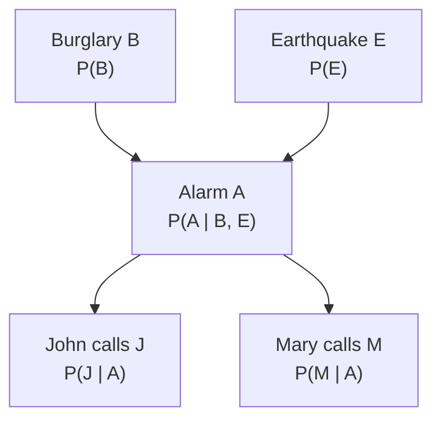

> 🌏 [English version](/en/posts/learning/2026-09-29-cmu-07380-lecture-10-bayes-nets-en)

**影片狀態：已查核：官方公開頁未列對應錄影。** [影片來源與說明](#課程影片來源)

這是 [CMU 07-380 AI & ML II](https://www.cs.cmu.edu/~07380/) Fall 2026 的 Lecture 10：**Graphical Models: Bayes Nets**（9/28）。[上一篇 Lec9 生成模型](/posts/learning/2026-09-29-cmu-07380-lecture-09-generative-models)用 Naive Bayes 和 GDA 先建 `p(x|y)`，再用貝氏定理反推類別。那套做法靠的是一個很強的條件獨立假設。這一講要問的是更一般的版本：變數一多，聯合分佈大到存不下，要怎麼用一張圖說清楚「哪些變數彼此有關」，再把分佈拆成一小塊一小塊的表？

先講結論：**Bayes net 是一張有向無環圖，每個節點配一張「給定父節點」的條件機率表，整個聯合分佈就是這些表的乘積。圖上少畫的每一條邊，都是一個獨立性假設。**

依 [2026-09-29 課站](https://www.cs.cmu.edu/~07380/#schedule)狀態整理；課站註明 schedule 可能變動。

## 課程影片來源

已核對 Fall 2026 官方課表及作業清單：公開來源列出投影片、預讀、示範與作業，未列對應講次的公開錄影連結。本文因此以官方教材導讀，沒有對應講次播放器；這項結論只限官方公開頁面，不代表校內沒有錄影。

官方來源：

- [CMU 07-380 Fall 2026 官方課表與教材](https://www.cs.cmu.edu/~07380/)

查核日期：2026-10-10。

## 先講缺口：這是 pre-reading 版，不是課堂版

2026-09-29 重新檢查課站時，Schedule 裡 Lec10 這一列**沒有投影片連結**，只列了 Bayes Net Demo、PR6 筆記、Canvas checkpoint 和選讀。依前幾講的檔名規則去猜的 `lectures/07380_F26_Lec10_Bayes_Nets.pdf` 回 404。另外，Lec9 的投影片檔名叫 `Lec9-10_Probabilistic_Generative_Models`，但它的文字內容沒有出現 Bayes net 或 graphical model 的段落，所以這份也不能當 Lec10 的課堂材料用。

因此本文**不描述課堂上講了什麼**，只導讀已公開的預讀筆記。Schedule 在 Lec10 旁標了「No d-separation」，本文同樣不碰 d-separation。投影片上線後會用 post-update 補。

公開程度：整門課是 A2（進行中）；Lec10 這一講目前是「預讀筆記＋互動 demo」，沒有投影片、recitation 或作業，連 A2 內部都算偏薄。Checkpoint（截止 9/27）在 Canvas，只限校內。等級定義見[全球 AI／CS 課程地圖](/posts/learning/2026-08-21-global-ai-cs-course-map)。

## 官方材料與讀取範圍

- [PR6 Bayes Nets 預讀筆記](https://www.cs.cmu.edu/~07380/notes/07380_F26_Notes_Bayes_Nets.pdf)（20 頁，v1.0）：本文主要來源，九節全讀
- [15-281 Bayes Net Demo](https://www.cs.cmu.edu/~15281-f25/demos/bayesNetDemo)（另有 [highres 版](https://www.cs.cmu.edu/~15281-f25/demos/bayesNetDemo_highres)）：Cloudy／Sprinkler／Rainy／Wet Grass 四節點網路
- Schedule 列的選讀：AIMA Ch. 12.1-5、13.1-2，以及 [Jordan Ch. 2.1](http://people.eecs.berkeley.edu/~jordan/prelims/chapter2.pdf)。本文沒有引用這些選讀的內容
- 筆記開頭說它假設讀者已經會 [07-280 Probability Background](https://www.cs.cmu.edu/~07280-s26/notes/07280_S26_Notes_Probability_Background.pdf) 裡的機率規則

## 承上問題：聯合分佈什麼都能答，但拿不到

PR6 的主線可以濃縮成一句話：**聯合分佈是最好的東西，可惜有兩個問題**。

好在哪？只要手上有所有變數的聯合分佈，任何 marginal、任何條件機率都能用兩個工具算出來：條件機率的定義，加上 marginalization。

問題在哪？筆記列了兩個：

1. **沒人會給你聯合分佈。** 醫院不會去收集「病人是小孩、高血壓、又有心臟病」每一種組合的機率。大家收集、手上有的，是條件機率表，例如「給定心臟病，高血壓的機率」。
2. **聯合分佈太大。** N 個變數、每個 d 種值，表就有 d<sup>N</sup> 格。筆記舉的例子是 30 個二元變數，超過十億個數字。

Bayes net 就是同時解決這兩個問題的方法：用拿得到的小表，拼出拿不到的大表。

## 概念脈絡一：大寫字母是整張表

筆記花了一整節講記號，因為後面每一步都靠它：

- `P(a1)` 是一個數字；`P(A)` 是一張表，每個值一格
- `P(A, B | C)` 在 A 有 3 種值、B 和 C 各 2 種值時是 3×2×2＝12 格
- 表的大小＝裡面每個大寫字母的值數相乘

哪張表加總會等於 1？筆記給的規則是：**直線右邊沒有大寫字母，直線左邊沒有小寫字母**。`P(A, B | C)` 其實是 `+c` 和 `−c` 兩個世界的分佈疊在一起，所以加總是 2。這種表就叫 **conditional probability table（CPT）**，Bayes net 就是用它組成的。

筆記還提醒一個常見錯誤：`Σb P(a1 | b)` 是把兩個不同世界的數字加起來，沒有意義。可以對直線左邊的變數求和，不能對右邊的。

## 可重做的小例子一：Omega Pizzeria

筆記的招牌例子是一個 20 片的披薩，每片可能有蘑菇 M、菠菜 S、義式臘腸 R（P 已經被機率用掉，所以臘腸叫 R）。隨機挑一片，每片機率 1/20。整個披薩就是機率空間 Ω，所以叫 Omega Pizzeria。

數片數就能填出三種表：

| 表 | 例子 | 怎麼數 |
|---|---|---|
| Marginal `P(M)` | `P(m1)=12/20`、`P(m2)=8/20` | 12 片沒蘑菇、8 片有 |
| Joint `P(M,S,R)` | `P(m1,s1,r1)=5/20` | 5 片什麼都沒加 |
| Conditional `P(M,S | r2)` | `P(m1,s1 | r2)=1/6` | 只看 6 片有臘腸的 |

最後一行跟 joint 的 `P(m1,s1,r2)=1/20` 是同一片披薩，只是分母從整個披薩縮成「有臘腸的那 6 片」。條件機率就是「世界變小了」。

同一個披薩也能用來檢查獨立性（筆記第 7 節）：蘑菇跟菠菜的 joint 每一格都等於 marginal 相乘，所以 M⊥⊥S；蘑菇跟臘腸第一格就對不上（`P(m2)P(r2)=2.4/20`，但 `P(m2,r2)=4/20`），所以不獨立。要證明獨立得每一格都對，要推翻只要一格不對。

## 可重做的小例子二：從聯合分佈回答任何 query

筆記第 4 節用季節 S、溫度 T、天氣 W 三個二元變數的 8 格聯合分佈示範。Query 寫成 `P(Q | e)`：Q 是要問的變數，e 是觀察到的證據，其他出現在表裡、但問題沒問到的叫 hidden variables H，要加總掉。

通用做法只有三步：

```text
1. 條件機率定義：  P(Q | e) = P(Q, e) / P(e)
2. un-marginalize： P(Q, e) = Σh P(h, Q, e)
                    P(e)    = Σq Σh P(h, q, e)
3. 查表、相加；或只算分子那張表 P(Q, e)，再 normalize
```

用筆記的數字實際走一次：`P(sun | winter)` 的分子是冬天、晴天的兩格 0.10＋0.15＝0.25，分母是冬天的四格加總 0.50，答案 0.5。`P(W | winter, hot)` 只有兩格符合（0.10 和 0.05），直接除以兩者的和，得到晴 2/3、雨 1/3。這就是 normalization trick：分母不用另外算，它就是分子那幾格的總和。

筆記特別說，你可能憑直覺就算得出來，但一定也要能照規則一步步寫出來，因為最後要交給電腦算。

## 概念脈絡二：chain rule 能拼出聯合分佈，但不省空間

拿到的是條件機率表，要怎麼變回聯合分佈？用 chain rule：

```text
P(X1, …, XN) = Π P(Xi | X1, …, Xi−1)
```

它對任何順序都成立，不需要任何假設。三個變數就有 3!＝6 種寫法，筆記的建議是：**挑那個因子剛好是你手上那些表的順序**。

這裡的「乘」不是一般乘法，也不是矩陣乘法。筆記第 5.3 節說明，表的乘積其實是一個逐格填表的流程：要算 `P(+a,+b,+c)`，就去每張因子表找對應的那一格，把數字相乘。

問題是完整的 chain rule 沒有省到任何東西。五個二元變數按順序展開，五張表分別是 2、4、8、16、32 格，最後一張跟聯合分佈一樣大。而且 `P(E | A,B,C,D)` 這種「給定其他全部」的表，也不會有人給你。

## 概念脈絡三：Bayes net ＝ nodes given parents

Bayes net 的定義只有三件事（筆記第 6.1 節）：

- 每個隨機變數一個節點
- 有向邊組成 **DAG**（有向無環圖），沿著箭頭走永遠回不到起點
- 每個節點一張 CPT：`P(node | Parents(node))`

聯合分佈就是所有表的乘積：

```text
P(X1, …, XN) = Π P(Xi | Parents(Xi))
```

筆記點出一個觀察：完整的 chain rule 本身就是一個 Bayes net，每個變數都有邊連到它前面的所有變數。所以 Bayes net 的重點不在畫了哪些邊，而在**拿掉了哪些邊**。

拿掉一條邊，就是做一個假設。四節點例子拿掉 A→D 和 B→D 之後，`P(D | A,B,C)` 的 16 格縮成 `P(D | C)` 的 4 格，代價是假設「知道 C 之後，A 和 B 對 D 不再提供資訊」。反方向也要記得：**畫了邊不代表假設兩者相依，只代表沒有假設它們獨立**。

## 可重做的小例子三：alarm network

這是筆記說「會一直回來用」的經典例子：家裡的警報會被竊賊 B 觸發，也可能被地震 E 震響；鄰居 John（J）和 Mary（M）聽到警報 A 可能會打給你。



沒畫的每一條邊都是假設：竊賊和地震彼此獨立；John 和 Mary 自己看不到竊賊、感覺不到地震，只聽得到警報；兩人打電話前不會互相商量。

聯合分佈照 nodes given parents 讀出來：

```text
P(B,E,A,J,M) = P(B) P(E) P(A | B,E) P(J | A) P(M | A)
```

五張表一共 2＋2＋8＋4＋4＝20 格。同樣順序的完整 chain rule 要 62 格，聯合分佈本身 32 格。筆記強調差距會隨變數變多快速拉大：聯合分佈每多一個二元變數就翻倍，但有兩個父節點的節點永遠只要 8 格。

用筆記的 CPT 算一格：

```text
P(+b,+e,+a,+j,+m) = 0.001 × 0.002 × 0.95 × 0.9 × 0.7 ≈ 1.2 × 10⁻⁶
```

筆記接著說，有了這 32 格，就能照第 4 節的三步驟回答像 `P(B | +j, +m)` 這種 query，但沒有把數字算出來。我用同一份 CPT 照三步驟算了一次（hidden variables 是 E 和 A）：分子 `P(+b,+j,+m)` 約 0.000592，`P(−b,+j,+m)` 約 0.001492，normalize 後 `P(+b | +j,+m)` 約 0.284。兩個鄰居都打來，竊賊的機率從先驗的 0.001 升到三成左右。這個數字是我自己算的，不是課程給的，建議你用下面的方法重算一次。

## 三種 triple：少一條邊，假設各不相同

筆記最後一節把三節點、少一條邊的網路分成三種，每種都拿 chain rule 跟 Bayes net 對照，找出哪個因子變了：

| 形狀 | 筆記的例子 | 假設 | 沒有假設的 |
|---|---|---|---|
| Causal chain A→B→C | 火→煙→警報 | C⊥⊥A \| B | A 和 C 無條件獨立 |
| Common cause B←A→C | 雨→塞車、雨→雨傘 | C⊥⊥B \| A | B 和 C 無條件獨立 |
| Common effect A→C←B | 雨→塞車←冰球賽散場 | B⊥⊥A | 給定 C 後 A、B 仍獨立 |

前兩種是「觀察中間節點會切斷關聯」。第三種剛好相反：兩個原因本來獨立，一旦觀察到共同結果（塞車），知道沒下雨就會讓「有冰球賽」變得更可能。兩個原因開始互相競爭解釋。

筆記也提醒因果方向：用因果故事建 Bayes net 很可靠，但 R→T 和 T→R 表示的是同一個聯合分佈，所以**不能從 Bayes net 的箭頭讀出因果結論**。

這張表只講「每種形狀假設了什麼」。拿它去判斷任意兩個節點在大網路裡是否獨立，就是 d-separation，Schedule 明說這門課不講。

## 跟上一講的 Naive Bayes 接起來

[Lec9 投影片](https://www.cs.cmu.edu/~07380/lectures/07380_F26_Lec9-10_Probabilistic_Generative_Models.pdf)寫 Naive Bayes 的假設是「給定 Y，對所有 i≠j，X<sub>i</sub> 與 X<sub>j</sub> 條件獨立」。用 PR6 的語言重看，這就是一個 Y 指向每個 X<sub>i</sub>、X<sub>i</sub> 之間沒有邊的網路，每一對特徵都是一個 common cause triple。這個對照是我把兩份材料並排得到的，筆記本身沒有這樣寫；課堂上是否提到，要等投影片上線才知道。

## 互動 demo 怎麼用

筆記推薦的 [Bayes Net Demo](https://www.cs.cmu.edu/~15281-f25/demos/bayesNetDemo) 用四節點網路：Cloudy 指向 Sprinkler 和 Rainy，兩者再指向 Wet Grass。操作方式是替每個變數選一個值，按 Update，再一步步執行頁面上的程式碼，它會標出每張 CPT 被查到的是哪一格、怎麼乘出那組值的聯合機率。這個 demo 來自 15-281 Fall 2025，不是 07-380 自己的材料，但它是 07-380 課站在 Lec10 列出的官方連結。

它只示範「算一格聯合機率」，不做 query。要練 query，請回到筆記第 4 節的三步驟。

## 下一講與延伸

依 Schedule，下一講 Lec11（9/30）是 **Approximate Inference：Likelihood weighted sampling、Gibbs**。課站目前只列了 15-281 的 [Likelihood Sampling Demo](https://www.cs.cmu.edu/~15281-f25/demos/likelihoodSamplingDemo) 與 [Gibbs Demo](https://www.cs.cmu.edu/~15281-f25/demos/gibbsDemo)，還沒有 07-380 自己的投影片或筆記。本文的三步驟是精確推論：先建出整張聯合分佈再查表，變數一多就做不動，這正是下一講要用取樣處理的問題。

這一段是[第一階段回顧](/posts/learning/2026-09-29-cmu-07380-stage-1-certainty-optimization)的最後一講。回顧會把前十講從邏輯、規劃、優化到機率串成一條線。

延伸閱讀：MLE 的基礎在 [07-280 Lecture 16](/posts/ai/2026-08-22-cmu-07280-lecture-16-maximum-likelihood)；整門課的定位在 [07-380 總覽](/posts/learning/2026-08-22-cmu-07380-fall-2026-overview)。

## 今晚可以做的動作

1. 打開 [PR6 筆記](https://www.cs.cmu.edu/~07380/notes/07380_F26_Notes_Bayes_Nets.pdf)第 3 節的披薩圖，自己數片數填出 `P(M,S,R)` 的 8 格，再對照筆記的表。
2. 用第 4 節的季節表算 `P(T | sun)`，先用 un-marginalize 寫出完整式子，再用 normalization trick 算一次，確認兩者一樣。
3. 把 alarm network 的五張 CPT 寫成 Python dict，照「每張表查一格再相乘」寫一個 `joint(b,e,a,j,m)` 函式，再用它算 `P(B | +j,+m)`，看是否得到約 0.284。
4. 在 [Bayes Net Demo](https://www.cs.cmu.edu/~15281-f25/demos/bayesNetDemo) 選 `+c, −s, +r, +w`，逐步執行，記下每一步查到哪一格。

## 更新紀錄

- 2026-10-10：標註影片狀態，核對錄影來源與取得方式。

## 參考資料

- [CMU 07-380 AI & ML II Fall 2026 課站與 Schedule](https://www.cs.cmu.edu/~07380/#schedule)
- [07-380 PR6：Pre-reading: Bayes Nets](https://www.cs.cmu.edu/~07380/notes/07380_F26_Notes_Bayes_Nets.pdf)
- [15-281 Fall 2025 Bayes Net Demo](https://www.cs.cmu.edu/~15281-f25/demos/bayesNetDemo)（[highres](https://www.cs.cmu.edu/~15281-f25/demos/bayesNetDemo_highres)）
- [07-380 Lec9-10 Probabilistic Generative Models 投影片](https://www.cs.cmu.edu/~07380/lectures/07380_F26_Lec9-10_Probabilistic_Generative_Models.pdf)
- [07-280 Probability Background 筆記](https://www.cs.cmu.edu/~07280-s26/notes/07280_S26_Notes_Probability_Background.pdf)
- [Jordan, An Introduction to Probabilistic Graphical Models, Ch. 2](http://people.eecs.berkeley.edu/~jordan/prelims/chapter2.pdf)（課站列的選讀，本文未引用內容）
- [15-281 Likelihood Sampling Demo](https://www.cs.cmu.edu/~15281-f25/demos/likelihoodSamplingDemo)、[Gibbs Demo](https://www.cs.cmu.edu/~15281-f25/demos/gibbsDemo)（Lec11 列出的連結）
