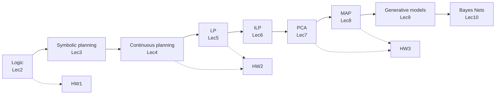

> 🌏 [中文版](/posts/learning/2026-09-29-cmu-07380-stage-1-certainty-optimization)

**Video status: Checked: no corresponding recording link listed on the public official page.** [Source details](#course-video-sources)

By 9/28, [CMU 07-380 AI & ML II](https://www.cs.cmu.edu/~07380/) Fall 2026 has covered ten lectures and collected two homeworks, with the third due 10/1. This post is not a guide to a new lecture. It looks back: what abilities did those ten lectures build? Why does an AI & ML course spend its first half on logic, planning and linear programming before turning to probability?

The short answer: **the first ten lectures run from "provable and enumerable" to "can only be estimated".** Logic tells an agent what is certain; planning turns certain knowledge into action; optimization writes "best" as a constrained objective; and at MAP, when the data is not enough to be certain, a prior goes into the objective, which is where probabilistic models take over.

This post synthesizes only the official materials already cited in orders 1–13 of this series, plus the module split on the [course schedule](https://www.cs.cmu.edu/~07380/#schedule). It adds no new facts. Based on the course site as of 2026-09-29; the site notes that the schedule is subject to change.

## Course video sources

The official Fall 2026 schedule and assignment list have been checked: public resources include slides, pre-readings, demonstrations and assignments, but no public recording link for the corresponding lectures. This article is therefore a materials-based guide with no corresponding lecture player. This observation concerns the public official page and does not establish whether internal recordings exist.

Official sources:

- [CMU 07-380 Fall 2026 官方課表與教材](https://www.cs.cmu.edu/~07380/)

Checked on 2026-10-10.

## How the course site splits it

The schedule's "Module" column splits the first ten lectures into four blocks. This is the course's own split, not this series' interpretation:

| Module | Lecture | Date | Guide in this series |
|---|---|---|---|
| Introduction | Lec1 Introduction | 8/24 | [Lec1](/en/posts/learning/2026-09-29-cmu-07380-lecture-01-introduction-en) |
| Reasoning Under Certainty | Lec2 Logical Agents | 8/26 | [Lec2](/en/posts/learning/2026-09-29-cmu-07380-lecture-02-logical-agents-en), [HW1](/en/posts/learning/2026-09-29-cmu-07380-hw1-logic-hybrid-wumpus-en) |
| | Lec3 Planning: PDDL, Relaxations | 8/31 | [Lec3](/en/posts/learning/2026-09-29-cmu-07380-lecture-03-classical-planning-en) |
| | Lec4 Motion Planning: RRT | 9/2 | [Lec4](/en/posts/learning/2026-09-29-cmu-07380-lecture-04-motion-planning-rrt-en), [HW2](/en/posts/learning/2026-09-29-cmu-07380-hw2-planning-lp-en) |
| Optimization | Lec5 Continuous Optimization: LP | 9/9 | [Lec5](/en/posts/learning/2026-09-29-cmu-07380-lecture-05-linear-programming-en) |
| | Lec6 Discrete Optimization: ILP | 9/14 | [Lec6](/en/posts/learning/2026-09-29-cmu-07380-lecture-06-integer-programming-en) |
| | Lec7 Low Rank Optimization: PCA (LoRA) | 9/16 | [Lec7](/en/posts/learning/2026-09-29-cmu-07380-lecture-07-pca-low-rank-en) |
| Reasoning Under Uncertainty | Lec8 MAP | 9/21 | [Lec8](/en/posts/learning/2026-09-29-cmu-07380-lecture-08-map-en), [HW3](/en/posts/learning/2026-09-29-cmu-07380-hw3-optimization-pca-map-en) |
| | Lec9 Generative Models: Naive Bayes, GDA | 9/23 | [Lec9](/en/posts/learning/2026-09-29-cmu-07380-lecture-09-generative-models-en) |
| | Lec10 Graphical Models: Bayes Nets | 9/28 | [Lec10](/en/posts/learning/2026-09-29-cmu-07380-lecture-10-bayes-nets-en) (pre-reading edition) |

On the schedule, the Reasoning Under Uncertainty module runs on through Lec13 (Approximate Inference, HMM / Particle Filtering, GMM / EM), followed by Acting Under Uncertainty (Lec14, Policy Gradient → RLHF) and Generative AI. So this "stage" does not end on a module boundary but at Lec10: the certainty and optimization modules are done, the uncertainty module has finished its first leg, and HW3 wraps up the first half.

## One line through ten lectures

### Reasoning under certainty: prove, then act

Lec2 has an agent "prove" that a square is safe using propositional logic, with model checking, DPLL and forward chaining as tools. HW1 then turns proof into action: after proving which squares are safe, plan a route with search.

Lec3 makes "how to change the world" something to reason about too. The [Lec3 guide](/en/posts/learning/2026-09-29-cmu-07380-lecture-03-classical-planning-en) concludes that planning is not a new problem but the same search problem with a different state representation; once PDDL writes down an action's preconditions and effects, relaxation can compute heuristics automatically.

Lec4 hits the first wall: a robot arm's state is continuous and cannot be enumerated, so RRT grows a tree by sampling. This is the first place "list everything, then pick" stops working.

### Optimization: write "best" as an objective

Lec5 switches tracks to optimization. LP writes a problem as a linear objective with linear constraints, and the optimum lies at a vertex of the feasible region. Lec6 adds integer constraints, vertices stop being the answer, and so you relax to an LP and branch (branch and bound). Lec7's PCA is another kind of optimization: find the best projection under a low-rank constraint. The same schedule row lists the LoRA paper, connecting low rank to fine-tuning large models.

What these three lectures share: the problem is fully specified, and the difficulty is finding the optimum efficiently.

### The door to uncertainty: the prior comes in

Lec8 MAP is the turning point. With limited data, the likelihood alone is not enough, so a prior enters the estimate; written into the objective, that prior is regularization. This step makes optimization and probability two ways of writing the same thing, and it is why the site puts MAP first in Reasoning Under Uncertainty.

Lec9 uses generative models (Naive Bayes, GDA) to build `p(x|y)` and recover the class with Bayes' theorem; Naive Bayes relies on features being conditionally independent given the class. Lec10's Bayes nets generalize that kind of assumption: a graph says which variables have no edge between them, splitting a too-large joint into small conditional probability tables.

## What HW1–3 each test

All three homeworks have Gradescope online questions (CMU-only); below covers only the public programming and written parts. The homework posts in this series describe problem structure only and include no solutions.

| Homework | Due | Programming | Written | Ability tested |
|---|---|---|---|---|
| [HW1](/en/posts/learning/2026-09-29-cmu-07380-hw1-logic-hybrid-wumpus-en) | 9/3 | [Logic and the Hybrid Wumpus Agent](https://www.cs.cmu.edu/~07380/assignments/logic_plan/), Q1–Q7 | none | Encode world rules as a knowledge base, check entailment with SAT, feed inference into search |
| [HW2](/en/posts/learning/2026-09-29-cmu-07380-hw2-planning-lp-en) | 9/18 | [Classical and Motion Planning](https://www.cs.cmu.edu/~07380/assignments/planning/): Q1 PDDL, Q2–Q7 RRT / RRT\* | [hw2.pdf](https://www.cs.cmu.edu/~07380/assignments/hw2_blank.pdf): GraphPlan, LP formulation, graphing LPs, feasible regions | Represent one problem two ways (symbolic / continuous); turn a word problem into an LP and plot it |
| [HW3](/en/posts/learning/2026-09-29-cmu-07380-hw3-optimization-pca-map-en) | 10/1 | [Linear and Integer Programming](https://www.cs.cmu.edu/~07380/assignments/optimization/): vertex-enumeration LP, branch and bound, formulation problems | [hw3.pdf](https://www.cs.cmu.edu/~07380/assignments/hw3_blank.pdf): integer programming, ethics of delivery routes, PCA, MAP priors and regularization | Write the solvers yourself; compute PCA via SVD; prove a Laplace prior equals L1 regularization |

Side by side, the abilities stack up layer by layer:

1. **HW1: representation plus inference.** You write the game's rules as logical sentences, let a SAT solver decide which squares are safe, then hand off to search.
2. **HW2: two representations of one thing.** The same robot cook is planned once in PDDL as a discrete problem and once with RRT in continuous space. The first written question covers GraphPlan; the other three are already LP.
3. **HW3: from using tools to writing them, then over to probability.** The programming part has you implement LP and IP solving yourself; the last written question asks you to prove that adding a Laplace prior to probabilistic linear regression is the same as adding L1 regularization to MSE. That question is exactly the seam between the first half and the second.

HW4 is tentatively due 10/22 and has not been released; this series does not guess its content.

## How much is public right now

As of the 2026-09-29 site, the course as a whole is **A2 (in progress)**; the released Lec1–9 stretch is already at A3 level: every lecture has slides (including inked versions), most have pre-reading notes, Recitations 1–5 come with solutions, and HW1–3 have problem PDFs, LaTeX templates, starter code and local autograders. The levels are defined in the [global AI/CS course map](/en/posts/learning/2026-08-21-global-ai-cs-course-map-en).

Not available yet:

- Lec10 slides (no link on the schedule; only the PR6 notes and demo)
- Slides after Lec11, PR7–PR13, handouts from Recitation 6 on
- HW4–HW7 and Final Project details
- Quiz 1–6 questions, Canvas checkpoints, Gradescope online questions (CMU-only)
- Recordings (no link on the site)

Outside readers can fully redo the slides, pre-readings, recitations and programming assignments. What they cannot get are the quizzes and online questions, so there is no way to confirm you have reached the level the course expects.

## What to watch next

The next lecture on the schedule, Lec11 (9/30), is Approximate Inference: likelihood weighted sampling and Gibbs. Lec10's three-step recipe is exact inference and needs the whole joint first; with many variables that becomes infeasible, and sampling exists to handle exactly that.

If you are self-studying along with this series, the math behind Lec2–Lec8 can be backfilled from 07-280: [search and A\*](/en/posts/ai/2026-08-22-cmu-07280-lecture-02-heuristic-search-en), [CSP and backtracking](/en/posts/ai/2026-08-22-cmu-07280-lecture-04-constraint-satisfaction-en), [gradient descent](/en/posts/ai/2026-08-22-cmu-07280-lecture-08-optimization-en), [regularization](/en/posts/ai/2026-08-22-cmu-07280-lecture-10-feature-engineering-regularization-en), [MLE](/en/posts/ai/2026-08-22-cmu-07280-lecture-16-maximum-likelihood-en). The course's overall positioning is in the [07-380 overview](/en/posts/learning/2026-08-22-cmu-07380-fall-2026-overview-en).

## Things to do tonight

1. On a sheet of paper, write one sentence for each of Lec2–Lec10: "what problem from the previous lecture does this one solve?" Wherever you get stuck, go back to that lecture's pre-reading.
2. Pick a programming assignment from HW1–HW3 you have not run yet, download the starter, and run `autograder.py` once to see everything fail, confirming your environment works.
3. Read question 4 of [hw3.pdf](https://www.cs.cmu.edu/~07380/assignments/hw3_blank.pdf) (MAP: priors and regularization) and try to write only the form of the log-posterior, without rushing to finish. This checks whether you have really crossed from optimization to probability.

## Update Log

- 2026-10-10: Added explicit video status and checked recording sources and access notes.

## References

- [CMU 07-380 AI & ML II Fall 2026 course site and schedule](https://www.cs.cmu.edu/~07380/#schedule)
- [HW1 programming: Logic and the Hybrid Wumpus Agent](https://www.cs.cmu.edu/~07380/assignments/logic_plan/)
- [HW2 programming: Classical and Motion Planning](https://www.cs.cmu.edu/~07380/assignments/planning/)
- [HW2 written PDF](https://www.cs.cmu.edu/~07380/assignments/hw2_blank.pdf)
- [HW3 programming: Optimization](https://www.cs.cmu.edu/~07380/assignments/optimization/)
- [HW3 written PDF](https://www.cs.cmu.edu/~07380/assignments/hw3_blank.pdf)
- [07-380 PR6: Pre-reading: Bayes Nets](https://www.cs.cmu.edu/~07380/notes/07380_F26_Notes_Bayes_Nets.pdf)
- [07-380 Lec9-10 Probabilistic Generative Models slides](https://www.cs.cmu.edu/~07380/lectures/07380_F26_Lec9-10_Probabilistic_Generative_Models.pdf)
- [LoRA: Low-Rank Adaptation of Large Language Models (Hu et al., 2021)](https://arxiv.org/abs/2106.09685) (optional reading listed for Lec7)
