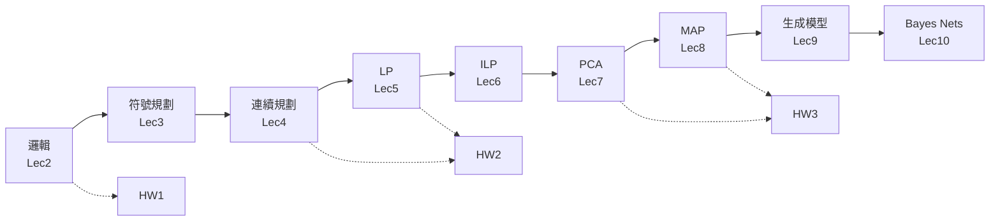

> 🌏 [English version](/en/posts/learning/2026-09-29-cmu-07380-stage-1-certainty-optimization-en)

**影片狀態：已查核：官方公開頁未列對應錄影。** [影片來源與說明](#課程影片來源)

[CMU 07-380 AI & ML II](https://www.cs.cmu.edu/~07380/) Fall 2026 到 9/28 已經上完十講、交了兩份作業，第三份 10/1 截止。這篇不是新一講的導讀，而是回頭看：這十講到底在教什麼能力？為什麼一門 AI & ML 的課，前半段花這麼多時間在邏輯、規劃和線性規劃，然後才轉到機率？

先講結論：**前十講是一條從「可以證明、可以枚舉」走到「只能估計」的路。** 邏輯告訴 agent 什麼是確定的；規劃把確定的知識變成行動；優化把「最好」寫成有限制的目標函數；到了 MAP，資料不夠確定，只好把先驗放進目標函數，這一步就接上了機率模型。

本文只綜合本系列 order 1–13 已經引用過的官方材料，加上[課站 Schedule](https://www.cs.cmu.edu/~07380/#schedule) 的模組分段，不引入新事實。依 2026-09-29 課站狀態；課站註明 schedule 可能變動。

## 課程影片來源

已核對 Fall 2026 官方課表及作業清單：公開來源列出投影片、預讀、示範與作業，未列對應講次的公開錄影連結。本文因此以官方教材導讀，沒有對應講次播放器；這項結論只限官方公開頁面，不代表校內沒有錄影。

官方來源：

- [CMU 07-380 Fall 2026 官方課表與教材](https://www.cs.cmu.edu/~07380/)

查核日期：2026-10-10。

## 課站自己怎麼分段

Schedule 的「Module」欄把前十講分成四段。這是課程官方的分法，不是本系列的詮釋：

| Module | 講次 | 日期 | 本系列導讀 |
|---|---|---|---|
| Introduction | Lec1 Introduction | 8/24 | [Lec1](/posts/learning/2026-09-29-cmu-07380-lecture-01-introduction) |
| Reasoning Under Certainty | Lec2 Logical Agents | 8/26 | [Lec2](/posts/learning/2026-09-29-cmu-07380-lecture-02-logical-agents)、[HW1](/posts/learning/2026-09-29-cmu-07380-hw1-logic-hybrid-wumpus) |
| | Lec3 Planning：PDDL、Relaxations | 8/31 | [Lec3](/posts/learning/2026-09-29-cmu-07380-lecture-03-classical-planning) |
| | Lec4 Motion Planning：RRT | 9/2 | [Lec4](/posts/learning/2026-09-29-cmu-07380-lecture-04-motion-planning-rrt)、[HW2](/posts/learning/2026-09-29-cmu-07380-hw2-planning-lp) |
| Optimization | Lec5 Continuous Optimization：LP | 9/9 | [Lec5](/posts/learning/2026-09-29-cmu-07380-lecture-05-linear-programming) |
| | Lec6 Discrete Optimization：ILP | 9/14 | [Lec6](/posts/learning/2026-09-29-cmu-07380-lecture-06-integer-programming) |
| | Lec7 Low Rank Optimization：PCA（LoRA） | 9/16 | [Lec7](/posts/learning/2026-09-29-cmu-07380-lecture-07-pca-low-rank) |
| Reasoning Under Uncertainty | Lec8 MAP | 9/21 | [Lec8](/posts/learning/2026-09-29-cmu-07380-lecture-08-map)、[HW3](/posts/learning/2026-09-29-cmu-07380-hw3-optimization-pca-map) |
| | Lec9 Generative Models：Naive Bayes、GDA | 9/23 | [Lec9](/posts/learning/2026-09-29-cmu-07380-lecture-09-generative-models) |
| | Lec10 Graphical Models：Bayes Nets | 9/28 | [Lec10](/posts/learning/2026-09-29-cmu-07380-lecture-10-bayes-nets)（pre-reading 版） |

Reasoning Under Uncertainty 這個模組在 Schedule 上一路延伸到 Lec13（Approximate Inference、HMM／Particle Filtering、GMM／EM），之後才是 Acting Under Uncertainty（Lec14 Policy Gradient→RLHF）和 Generative AI。所以「階段」的切點不在模組邊界上，而在 Lec10：確定性和優化的兩個模組都已經結束，不確定性模組剛走完第一段，HW3 也把前半段收尾了。

## 一條線串起十講

### 確定性推理：證明，然後行動

Lec2 讓 agent 用命題邏輯「證明」某一格安全，工具是 model checking、DPLL、forward chaining。HW1 接著把證明變成行動：證明哪些格子安全之後，再用搜尋規劃路線。

Lec3 把「怎麼改變世界」也拿來推理。[Lec3 導讀](/posts/learning/2026-09-29-cmu-07380-lecture-03-classical-planning)的結論是：規劃不是新問題，是同一個搜尋問題換了狀態表示；PDDL 寫下動作的前置條件與效果之後，relaxation 可以自動算出 heuristic。

Lec4 遇到第一道牆：機械手臂的狀態是連續的，沒辦法枚舉，RRT 只能靠取樣長出一棵樹。到這裡，「全部列出來再挑」的做法第一次失效。

### 優化：把「最好」寫成目標函數

Lec5 換軌到優化。LP 把問題寫成線性目標加線性限制，最優解落在可行域的頂點上。Lec6 加上整數限制，頂點不再是答案，於是先鬆弛成 LP、再分支（branch and bound）。Lec7 的 PCA 是另一種優化：在低秩限制下找最好的投影，課站在同一列放了 LoRA 論文，把低秩接到大型模型的微調。

這三講的共同點是：問題定義是確定的，難處在於怎麼有效率地找到最優解。

### 不確定性的入口：先驗進場

Lec8 MAP 是轉折點。資料有限時，只看 likelihood 不夠，得把先驗放進估計；而先驗寫進目標函數，就是正則化。這一步讓「優化」和「機率」變成同一件事的兩種寫法，也是為什麼課站把 MAP 放在 Reasoning Under Uncertainty 的第一講。

Lec9 用生成模型（Naive Bayes、GDA）先建 `p(x|y)` 再用貝氏定理反推，Naive Bayes 靠的是「給定類別，特徵彼此條件獨立」。Lec10 的 Bayes nets 把這種假設一般化：用一張圖說哪些變數之間沒有邊，把太大的聯合分佈拆成小的條件機率表。

## HW1–3 各自檢查什麼能力

三份作業都有 Gradescope 線上題（只限校內），以下只談公開的程式與書面部分。本系列的作業篇都只講題目結構，不附解答。

| 作業 | 截止 | 程式作業 | 書面作業 | 檢查的能力 |
|---|---|---|---|---|
| [HW1](/posts/learning/2026-09-29-cmu-07380-hw1-logic-hybrid-wumpus) | 9/3 | [Logic and the Hybrid Wumpus Agent](https://www.cs.cmu.edu/~07380/assignments/logic_plan/)，Q1–Q7 | 無 | 把世界規則寫成知識庫、用 SAT 檢查蘊含、把推論結果接到搜尋 |
| [HW2](/posts/learning/2026-09-29-cmu-07380-hw2-planning-lp) | 9/18 | [Classical and Motion Planning](https://www.cs.cmu.edu/~07380/assignments/planning/)：Q1 PDDL、Q2–Q7 RRT／RRT\* | [hw2.pdf](https://www.cs.cmu.edu/~07380/assignments/hw2_blank.pdf)：GraphPlan、LP 建模、LP 圖解、可行域 | 同一個問題換兩種表示（符號／連續）；把文字題寫成 LP 並畫出來 |
| [HW3](/posts/learning/2026-09-29-cmu-07380-hw3-optimization-pca-map) | 10/1 | [Linear and Integer Programming](https://www.cs.cmu.edu/~07380/assignments/optimization/)：頂點枚舉 LP、branch and bound、建模題 | [hw3.pdf](https://www.cs.cmu.edu/~07380/assignments/hw3_blank.pdf)：整數規劃、送貨路線的倫理考量、PCA、MAP 先驗與正則化 | 自己寫出求解器；用 SVD 算 PCA；證明 Laplace 先驗等價 L1 正則化 |

把三份作業放在一起看，能力是一層一層疊上去的：

1. **HW1：表示＋推論。** 你要把遊戲規則寫成邏輯句子，讓 SAT solver 替你判斷安全格，再交給搜尋。
2. **HW2：同一件事的兩種表示。** 同一個機器人廚師，一次用 PDDL 寫成離散規劃，一次用 RRT 在連續空間找路。書面第一題考 GraphPlan，其餘三題已經是 LP。
3. **HW3：從用工具到寫工具，再跨到機率。** 程式部分要自己實作 LP 與 IP 的求解流程；書面最後一題要求證明在機率線性迴歸加上 Laplace 先驗，跟在 MSE 加上 L1 正則化是同一件事。這一題剛好就是前半段跟後半段的接縫。

HW4 暫定 10/22 截止，題目還沒釋出，本系列不推測它的內容。

## 目前公開到什麼程度

依 2026-09-29 課站，整門課是 **A2（進行中）**；已釋出的 Lec1–9 段落已經到 A3 的水準：每講都有投影片（含 inked 版）、多數有預讀筆記，Recitation 1–5 附解答，HW1–3 有題目 PDF、LaTeX 範本、starter code 與本機 autograder。等級定義見[全球 AI／CS 課程地圖](/posts/learning/2026-08-21-global-ai-cs-course-map)。

還拿不到的：

- Lec10 投影片（Schedule 上沒有連結，只有 PR6 筆記與 demo）
- Lec11 之後的投影片、PR7–PR13、Recitation 6 以後的講義
- HW4–HW7、Final Project 細節
- Quiz 1–6 題目、Canvas checkpoint、Gradescope 線上題（只限校內）
- 錄影（課站沒有連結）

校外讀者能完整重做的是講義、預讀、recitation 和程式作業；拿不到的是測驗和線上題，也就沒辦法確認自己是否達到課程要求的程度。

## 接下來要注意什麼

Schedule 上的下一講 Lec11（9/30）是 Approximate Inference：Likelihood weighted sampling 和 Gibbs。Lec10 的三步驟是精確推論，要先建出整張聯合分佈；變數一多就算不動，取樣就是為了處理這個問題。

如果你是跟著本系列自學，Lec2–Lec8 用到的數學可以回頭補 07-280：[搜尋與 A\*](/posts/ai/2026-08-22-cmu-07280-lecture-02-heuristic-search)、[CSP 與回溯](/posts/ai/2026-08-22-cmu-07280-lecture-04-constraint-satisfaction)、[梯度下降](/posts/ai/2026-08-22-cmu-07280-lecture-08-optimization)、[正則化](/posts/ai/2026-08-22-cmu-07280-lecture-10-feature-engineering-regularization)、[MLE](/posts/ai/2026-08-22-cmu-07280-lecture-16-maximum-likelihood)。整門課的定位在 [07-380 總覽](/posts/learning/2026-08-22-cmu-07380-fall-2026-overview)。

## 今晚可以做的動作

1. 拿一張紙，替 Lec2–Lec10 每一講各寫一句「這一講在解決上一講的什麼問題」，寫不出來的那一講就回去讀它的預讀筆記。
2. 挑 HW1–HW3 中你還沒跑過的一份程式作業，下載 starter，先跑一次 `autograder.py` 看全部失敗的樣子，確認環境可用。
3. 把 [hw3.pdf](https://www.cs.cmu.edu/~07380/assignments/hw3_blank.pdf) 第 4 題（MAP：先驗與正則化）的題目讀完，試著只寫出 log-posterior 的形式，不急著解完。這一步能檢查你是否真的從優化跨到了機率。

## 更新紀錄

- 2026-10-10：標註影片狀態，核對錄影來源與取得方式。

## 參考資料

- [CMU 07-380 AI & ML II Fall 2026 課站與 Schedule](https://www.cs.cmu.edu/~07380/#schedule)
- [HW1 程式作業：Logic and the Hybrid Wumpus Agent](https://www.cs.cmu.edu/~07380/assignments/logic_plan/)
- [HW2 程式作業：Classical and Motion Planning](https://www.cs.cmu.edu/~07380/assignments/planning/)
- [HW2 書面作業 PDF](https://www.cs.cmu.edu/~07380/assignments/hw2_blank.pdf)
- [HW3 程式作業：Optimization](https://www.cs.cmu.edu/~07380/assignments/optimization/)
- [HW3 書面作業 PDF](https://www.cs.cmu.edu/~07380/assignments/hw3_blank.pdf)
- [07-380 PR6：Pre-reading: Bayes Nets](https://www.cs.cmu.edu/~07380/notes/07380_F26_Notes_Bayes_Nets.pdf)
- [07-380 Lec9-10 Probabilistic Generative Models 投影片](https://www.cs.cmu.edu/~07380/lectures/07380_F26_Lec9-10_Probabilistic_Generative_Models.pdf)
- [LoRA: Low-Rank Adaptation of Large Language Models（Hu et al., 2021）](https://arxiv.org/abs/2106.09685)（Lec7 列出的選讀）
