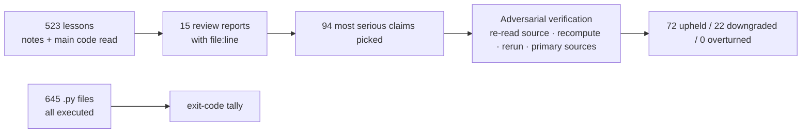

> 🌏 [中文版](/posts/learning/2026-10-03-ai-engineering-from-scratch-review)

[AI Engineering from Scratch](https://github.com/rohitg00/ai-engineering-from-scratch) is a free, MIT-licensed AI engineering course on GitHub: 20 phases and 523 lessons running from linear algebra to multi-agent systems, with about 62,000 stars as of early October 2026. Its pitch is "build every algorithm from raw math before handing it to a framework," and it installs into Claude Code or Codex via `npx skills add` so a coding agent can act as your tutor.

I read the notes and main code of all 523 lessons, executed all 645 Python programs, and then adversarially verified the 94 most serious errors. The verdict is blunt: **use it as a map of terms and a source of practice problems, not as a textbook to follow.** The biggest risk hides inside the fact that the code runs.

## What the course is

Each lesson is a folder with notes in `docs/en.md`, code in `code/`, artifacts in `outputs/`, and usually a `quiz.json`. The notes follow six fixed beats: Motto, Problem, Concept, Build It, Use It, Ship It. The core promise is the Build It / Use It pairing: write a small version in NumPy or the standard library, then run the same thing through PyTorch so the framework stops being a black box. Ship It hands you a reusable prompt, skill, or MCP server.

By size: about 920,000 English words of notes and 170,000 lines of code. It claims four languages; the actual file counts are Python 515, TypeScript 39, Julia 20, Rust 10, and the last two appear only in a handful of lessons in the first ten phases.

The author, Rohit Ghumare, comes from developer relations; his site lists titles such as [Docker Captain, CNCF Ambassador, and Google Developer Expert](https://rohitghumare.com/). The repo's first commit is dated 2026-03-18, and nearly all of its content was committed by the author.

## How the audit worked



The review was done by groups of AI agents, each covering one to three phases and scoring against the same rubric: technical correctness, whether Build It is really from scratch, whether notes and code agree, and signs of mass AI generation. For each phase, the errors that would hurt a learner most if true went to a second set of agents, which had to assume the claim was wrong and look for counter-evidence first.

## Verdict 1: running is not the same as correct

624 of 645 programs exited cleanly, or 96.7%. Most of the rest were CPU training runs past 15 minutes, missing packages not listed in `requirements.txt`, or blocked dataset downloads. On that number alone, the course looks very reliable.

The problem is what the code computes once it runs. The worst case is Phase 10. The [SFT lesson](https://github.com/rohitg00/ai-engineering-from-scratch/blob/3be078b/phases/10-llms-from-scratch/06-instruction-tuning-sft/code/main.py#L157-L160), [RLHF lesson](https://github.com/rohitg00/ai-engineering-from-scratch/blob/3be078b/phases/10-llms-from-scratch/07-rlhf/code/main.py#L261-L266), and [DPO lesson](https://github.com/rohitg00/ai-engineering-from-scratch/blob/3be078b/phases/10-llms-from-scratch/08-dpo/code/main.py#L195-L201) all compute a loss or gradient, throw it away, and then do this to the weights:

```python
block.ffn.W1 -= lr * np.random.randn(*block.ffn.W1.shape) * 0.01
```

The notes describe it as a gradient update. A student following along would learn that adding noise to weights is training.

The same pattern shows up elsewhere, confirmed by rerunning during verification:

- The [OCR lesson](https://github.com/rohitg00/ai-engineering-from-scratch/blob/3be078b/phases/04-computer-vision/19-ocr-document-understanding/code/main.py#L52-L59) draws every alphanumeric character as the same black block, so the model cannot read anything; all three test strings are predicted as `'xc6'`.
- The [audio watermark lesson](https://github.com/rohitg00/ai-engineering-from-scratch/blob/3be078b/phases/06-speech-and-audio/16-anti-spoofing-audio-watermarking/code/main.py#L57-L74) adds ±0.0005 at 16 samples, but detection reads the sign of the host signal. Detection output is identical with or without the watermark.
- Capstone [lesson 38](https://github.com/rohitg00/ai-engineering-from-scratch/blob/3be078b/phases/19-capstone-projects/38-classifier-finetuning/code/main.py#L69-L81) pre-trains without a causal mask, so every position sees the next token. Byte-level loss drops to 0.076, exactly what copying the answer would produce.

None of these crash, and none show up in an exit code.

## Verdict 2: strong early phases, thin later ones

Putting the per-lesson scores from the 15 reports side by side, quality roughly declines as the phases go on:

| Section | State | Lessons worth using directly |
|---|---|---|
| Phase 1 math | Strongest; mostly real from-scratch code | [autodiff](https://github.com/rohitg00/ai-engineering-from-scratch/tree/3be078b/phases/01-math-foundations/05-chain-rule-and-autodiff), [statistics](https://github.com/rohitg00/ai-engineering-from-scratch/tree/3be078b/phases/01-math-foundations/15-statistics-for-ml), [linear systems](https://github.com/rohitg00/ai-engineering-from-scratch/tree/3be078b/phases/01-math-foundations/17-linear-systems) |
| Phases 2–9 | Hand-built early, stubs later | Core algorithm lessons: convolution, VAE, n-gram LM, DQN |
| Phases 10–12 | Training lessons are mostly fake | Use only as a concept tour |
| Phase 13, 23 rewritten lessons | Rebuilt against MCP 2026-07-28, 11–51 tests per lesson | [Streamable HTTP](https://github.com/rohitg00/ai-engineering-from-scratch/tree/3be078b/phases/13-tools-and-protocols/09-mcp-transports), [cancellation and flow control](https://github.com/rohitg00/ai-engineering-from-scratch/tree/3be078b/phases/13-tools-and-protocols/29-mcp-reliability-cancellation-and-flow-control) |
| Phase 14 | None of 54 lessons calls a real LLM; scripts stand in | [runtime feedback](https://github.com/rohitg00/ai-engineering-from-scratch/tree/3be078b/phases/14-agent-engineering/37-runtime-feedback-loops), [verification gates](https://github.com/rohitg00/ai-engineering-from-scratch/tree/3be078b/phases/14-agent-engineering/38-verification-gates) |
| Phases 15–18 | Frontier-news summaries plus probability simulators; many factual errors | Use only as a topic list |
| Phase 19 capstones | Rarely import code from earlier phases | Lessons 75 and 87 are the rare real integrations |

Quality tracks closely with whether a lesson was rewritten. The rewritten Phase 13 lessons have tests and follow the official spec, and are clearly better than the untouched older lessons in the same phase. [MCP 2026-07-28](https://blog.modelcontextprotocol.io/posts/2026-07-28) is a real, released spec, and the new lessons' `server/discover` and Multi Round-Trip Requests match it.

## Verdict 3: check numbers and facts yourself

Examples that were verified and upheld:

- The [KV cache lesson](https://github.com/rohitg00/ai-engineering-from-scratch/blob/3be078b/phases/07-transformers-deep-dive/12-kv-cache-flash-attention/docs/en.md?plain=1#L41) drops the factor of 32 heads for a 7B model: it says 16 KB per token, and the real figure is 512 KB.
- The [ensemble lesson](https://github.com/rohitg00/ai-engineering-from-scratch/blob/3be078b/phases/02-ml-fundamentals/11-ensemble-methods/docs/en.md?plain=1#L33) says a majority vote of 21 classifiers at 60% accuracy reaches about 74%; the lesson's own formula gives 82.6%.
- The [loss functions lesson](https://github.com/rohitg00/ai-engineering-from-scratch/blob/3be078b/phases/03-deep-learning-core/05-loss-functions/docs/en.md?plain=1#L19) is built on the premise that MSE classification makes the model predict 0.5 for everything; the same lesson's code trains with MSE to 99% accuracy.
- The [music generation lesson](https://github.com/rohitg00/ai-engineering-from-scratch/blob/3be078b/phases/06-speech-and-audio/09-music-generation/docs/en.md?plain=1#L24) labels MusicGen as MIT and recommends commercial use. The [Hugging Face model card](https://huggingface.co/facebook/musicgen-large) says the code is MIT and the weights are CC-BY-NC 4.0.
- The [watermarking lesson](https://github.com/rohitg00/ai-engineering-from-scratch/blob/3be078b/phases/18-ethics-safety-alignment/23-watermarking-synthid-stable-signature-c2pa/docs/en.md?plain=1#L23-L25) calls SynthID-Text a productionized Kirchenbauer green/red list. The [original Nature 2024 paper](https://www.nature.com/articles/s41586-024-08025-4) uses Tournament sampling.
- The [AI governance lesson](https://github.com/rohitg00/ai-engineering-from-scratch/blob/3be078b/phases/15-autonomous-systems/22-cais-caisi-societal-risk/docs/en.md?plain=1#L3) still says "California SB-53, if signed." The [Governor's Office](https://www.gov.ca.gov/2025/09/29/governor-newsom-signs-sb-53-advancing-californias-world-leading-artificial-intelligence-industry) announced the signing on 2025-09-29.

Security claims deserve even less trust. [Lesson 49](https://github.com/rohitg00/ai-engineering-from-scratch/blob/3be078b/phases/19-capstone-projects/49-lm-eval-harness/code/main.py#L209-L223) replaces `__builtins__` and claims model output cannot reach the filesystem. During verification, `().__class__.__base__.__subclasses__()` led to the `os` module and listed the root directory.

## Claims versus reality

| Claim | Reality |
|---|---|
| The author wrote on [dev.to](https://dev.to/rohitg00/build-it-then-use-it-how-i-wrote-435-ai-engineering-lessons-from-scratch-5d2d) that the work spanned eighteen months | Posted 2026-05-24, about two months after the repo's first commit; the busiest day had 247 commits |
| The first transformer lesson checks hand-built attention against `nn.MultiheadAttention` to numerical precision | The [Use It section](https://github.com/rohitg00/ai-engineering-from-scratch/blob/3be078b/phases/07-transformers-deep-dive/02-self-attention-from-scratch/docs/en.md?plain=1#L280-L300) prints shapes from random input; `code/` contains no torch |
| Every lesson has a quiz | 373 of 523 do; Phases 06, 08, and 15 have none |
| Every lesson ships a Ship It artifact | 57 of 85 Phase 19 lessons have no `outputs/` |

Community reaction is split. The [Hacker News thread](https://news.ycombinator.com/item?id=48219853) reached 58 points before being flagged, mostly over AI-generated, verbose, repetitive content. Blog posts and videos that pass it along tend to praise it as "like a full degree"; I found none that checked it lesson by lesson.

## How to use it

- **You want a map of AI engineering terms**: read each phase's table of contents and Concept sections, and never cite its numbers.
- **You want to practice building algorithms by hand**: use Phase 1 and the early lessons of Phases 2–9 as exercises. Write your own version first, then compare; when they disagree, don't assume you are the one who is wrong.
- **You want to learn LLM training**: skip the Phase 10 SFT, RLHF, and DPO lessons and watch [Karpathy's Neural Networks: Zero to Hero](https://karpathy.ai/zero-to-hero.html) instead.
- **You want to learn agent frameworks**: the [Hugging Face Agents Course](https://huggingface.co/learn/agents-course/en/unit0/introduction) or [Microsoft's ai-agents-for-beginners](https://github.com/microsoft/ai-agents-for-beginners) actually call LLMs.
- **You want to learn MCP**: Phase 13 lessons 06–18 and 22–31 are the rewritten ones and are usable alongside the [official spec](https://modelcontextprotocol.io/specification/2026-07-28); lessons 01–05 and 19–21 use the old template, so skip them.

## Limits of this audit

- **Reviewers and verifiers were both AI agents.** Of the 94 verified claims, 72 were upheld, 22 needed downgrading, and none were overturned. The downgrades share a pattern: the reviewer missed a toy or simulated label already present in the lesson, got a secondary sub-point wrong, or overstated severity.
- **Verification targeted the most harmful, directly checkable claims.** Secondary dates, attributions, and benchmark numbers were not verified, so the false-positive rate does not generalize to them.
- **Execution tests only looked at exit codes.** Two programs using gloo multiprocessing failed in the container; I attributed this to the environment without proving it.
- **Scoring scales differed across groups.** Scores are only good for relative comparison.
- **The comparison courses were judged from public descriptions.** Karpathy's, Hugging Face's, and Microsoft's courses were not audited lesson by lesson.

Overall, the course's design idea is sound, and its coverage is the widest among free resources of this kind. The price is that every lesson needs the reader to check it, and the places most likely to be wrong are exactly the two that look most trustworthy: code that runs to completion, and numbers written with precision.

## References

- [rohitg00/ai-engineering-from-scratch (audited revision 3be078b)](https://github.com/rohitg00/ai-engineering-from-scratch/tree/3be078b)
- [AI Engineering from Scratch website](https://aiengineeringfromscratch.com/)
- [Rohit Ghumare: Build It, Then Use It: How I wrote 435 AI engineering lessons from scratch (dev.to)](https://dev.to/rohitg00/build-it-then-use-it-how-i-wrote-435-ai-engineering-lessons-from-scratch-5d2d)
- [Rohit Ghumare's personal site](https://rohitghumare.com/)
- [Hacker News: AI Engineering from Scratch](https://news.ycombinator.com/item?id=48219853)
- [Model Context Protocol: The 2026-07-28 Specification](https://blog.modelcontextprotocol.io/posts/2026-07-28)
- [MCP 2026-07-28 specification](https://modelcontextprotocol.io/specification/2026-07-28)
- [facebook/musicgen-large model card (Hugging Face)](https://huggingface.co/facebook/musicgen-large)
- [Dathathri et al., Scalable watermarking for identifying large language model outputs (Nature 2024)](https://www.nature.com/articles/s41586-024-08025-4)
- [Governor Newsom signs SB 53 (California Governor's Office, 2025-09-29)](https://www.gov.ca.gov/2025/09/29/governor-newsom-signs-sb-53-advancing-californias-world-leading-artificial-intelligence-industry)
- [Andrej Karpathy: Neural Networks: Zero to Hero](https://karpathy.ai/zero-to-hero.html)
- [Hugging Face AI Agents Course](https://huggingface.co/learn/agents-course/en/unit0/introduction)
- [microsoft/ai-agents-for-beginners](https://github.com/microsoft/ai-agents-for-beginners)
